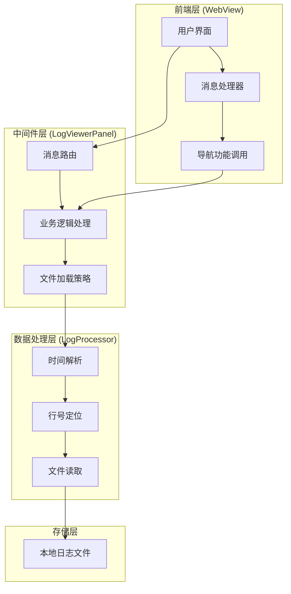
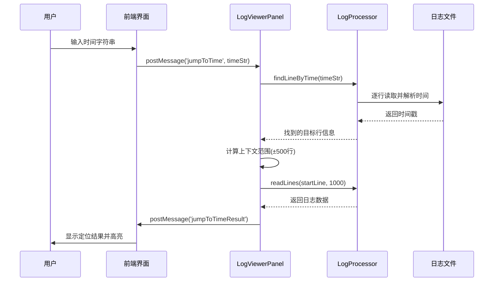
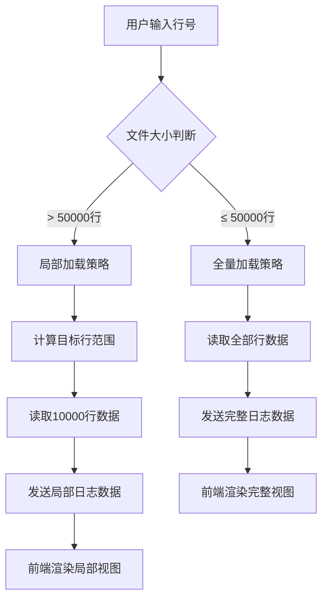
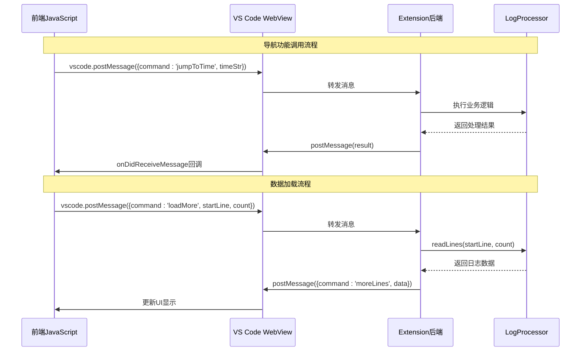
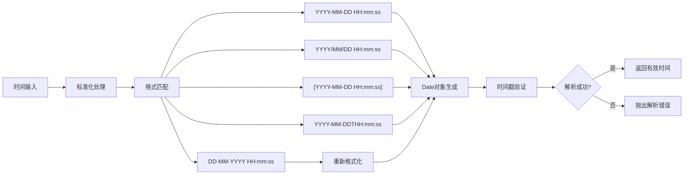
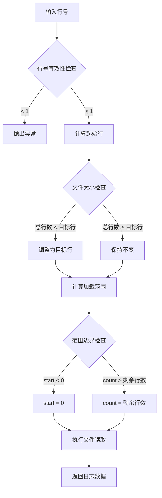
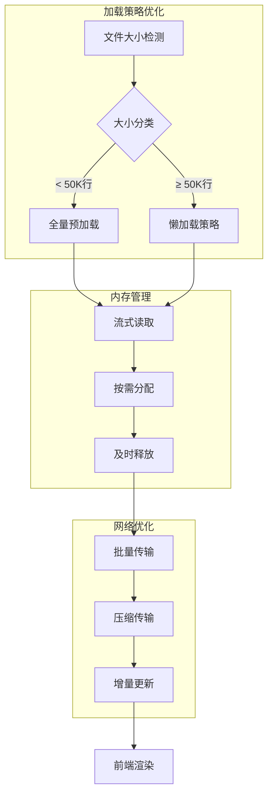
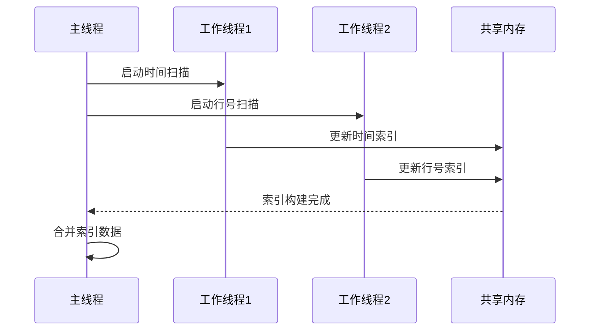
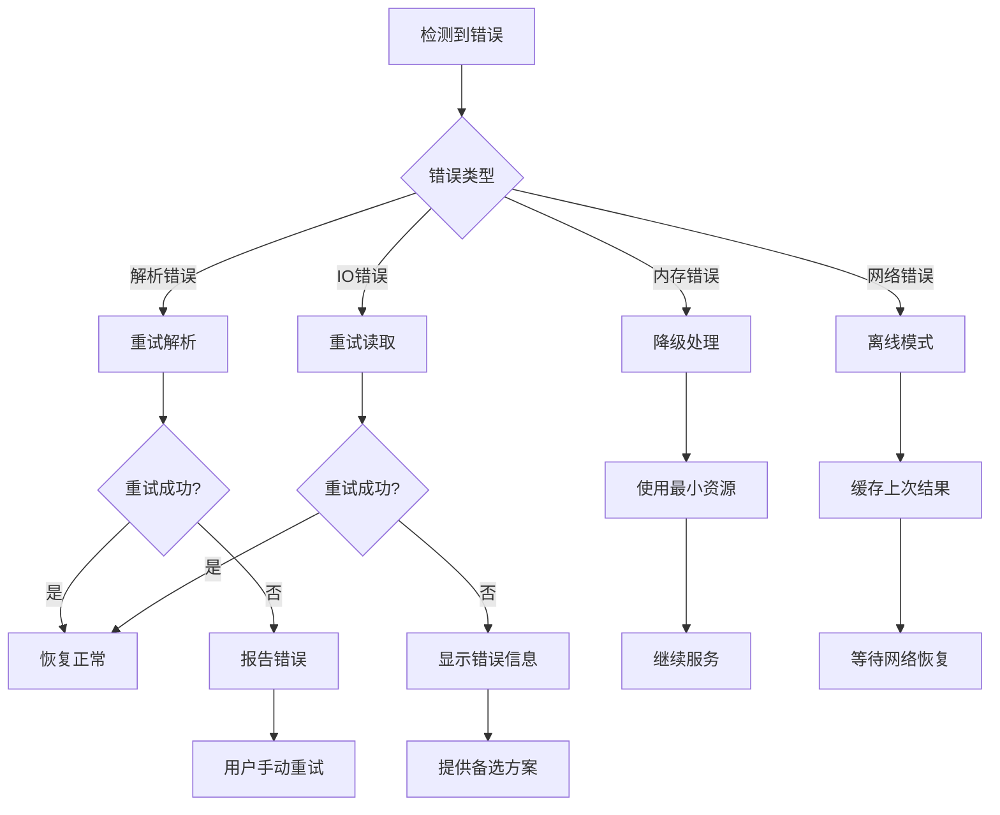

# 日志导航与跳转功能

<cite>
**本文档引用的文件**
- [extension.ts](file://src/extension.ts)
- [logViewerPanel.ts](file://src/logViewerPanel.ts)
- [logProcessor.ts](file://src/logProcessor.ts)
- [webview.html](file://src/webview.html)
- [package.json](file://package.json)
</cite>

## 目录
1. [简介](#简介)
2. [系统架构概览](#系统架构概览)
3. [jumpToTime功能详解](#jumptotime功能详解)
4. [jumpToLineInFullLog功能详解](#jumptonelineinfulllog功能详解)
5. [前后端通信机制](#前后端通信机制)
6. [时间解析与精度要求](#时间解析与精度要求)
7. [行号定位与边界处理](#行号定位与边界处理)
8. [性能优化策略](#性能优化策略)
9. [故障排除指南](#故障排除指南)
10. [总结](#总结)

## 简介

大日志文件查看器是一个专为处理大型日志文件设计的VS Code扩展，提供了强大的导航与跳转功能。该系统的核心功能包括基于时间的快速定位（jumpToTime）和基于行号的精确跳转（jumpToLineInFullLog），这些功能通过智能的文件加载策略和高效的前后端通信机制，实现了对超大日志文件的流畅浏览体验。

## 系统架构概览

该系统采用分层架构设计，主要由以下组件构成：



**图表来源**
- [logViewerPanel.ts](file://src/logViewerPanel.ts#L54-L101)
- [webview.html](file://src/webview.html#L3097-L3114)

**章节来源**
- [logViewerPanel.ts](file://src/logViewerPanel.ts#L1-L510)
- [logProcessor.ts](file://src/logProcessor.ts#L1-L807)

## jumpToTime功能详解

### 功能概述

`jumpToTime`功能允许用户通过输入时间戳快速定位到日志中的特定时间点。该功能的核心实现流程如下：



**图表来源**
- [logViewerPanel.ts](file://src/logViewerPanel.ts#L320-L361)
- [logProcessor.ts](file://src/logProcessor.ts#L237-L285)

### findLineByTime实现原理

`findLineByTime`方法是整个定位功能的核心，其实现特点包括：

1. **时间解析与验证**：首先调用`parseTimeString`方法解析用户输入的时间字符串
2. **流式读取**：使用Node.js的`readline`模块进行流式读取，避免内存占用过高
3. **早期终止**：一旦找到符合条件的行立即停止读取，提高效率
4. **时间比较**：精确比较时间戳，确保定位的准确性

### 上下文加载策略

当找到目标时间点后，系统会加载目标行及其周围的1000行日志（500行前+500行后）作为上下文，这种设计考虑了：

- **用户体验**：提供足够的上下文信息帮助理解日志内容
- **性能平衡**：1000行的窗口大小在性能和信息量之间取得平衡
- **内存控制**：避免加载过多数据导致内存溢出

**章节来源**
- [logViewerPanel.ts](file://src/logViewerPanel.ts#L320-L361)
- [logProcessor.ts](file://src/logProcessor.ts#L237-L285)

## jumpToLineInFullLog功能详解

### 功能概述

`jumpToLineInFullLog`功能提供基于行号的精确跳转，支持两种不同的加载策略：



**图表来源**
- [logViewerPanel.ts](file://src/logViewerPanel.ts#L363-L406)

### 文件大小决策算法

系统根据文件总行数决定加载策略：

| 文件行数范围 | 加载策略 | 加载行数 | 性能特点 |
|-------------|----------|----------|----------|
| ≤ 50,000行 | 全量加载 | 全部行 | 快速响应，完整上下文 |
| > 50,000行 | 局部加载 | 目标行±5000行 | 内存友好，快速加载 |

### 局部加载优化

对于大文件，系统采用以下优化策略：

1. **范围计算**：`Math.max(0, lineNumber - 5000)`确保不越界
2. **批量读取**：每次读取10000行，平衡性能和内存使用
3. **增量更新**：只加载必要的数据块，避免重复加载

**章节来源**
- [logViewerPanel.ts](file://src/logViewerPanel.ts#L363-L406)

## 前后端通信机制

### 消息传递架构

系统采用双向消息传递机制，通过`postMessage`实现前后端通信：



**图表来源**
- [logViewerPanel.ts](file://src/logViewerPanel.ts#L54-L101)
- [webview.html](file://src/webview.html#L3097-L3114)

### 消息类型定义

系统支持多种消息类型，每种对应不同的功能：

| 消息类型 | 前端触发 | 后端响应 | 主要用途 |
|----------|----------|----------|----------|
| jumpToTime | 用户输入时间 | jumpToTimeResult | 基于时间的快速定位 |
| jumpToLineInFullLog | 用户输入行号 | jumpToLineInFullLogResult | 基于行号的精确跳转 |
| loadMore | 页面滚动触发 | moreLines | 懒加载更多日志数据 |
| search | 用户搜索 | searchResults | 日志内容搜索 |
| filterByLevel | 级别过滤 | filterResults | 日志级别过滤 |

**章节来源**
- [logViewerPanel.ts](file://src/logViewerPanel.ts#L54-L101)
- [webview.html](file://src/webview.html#L3097-L3114)

## 时间解析与精度要求

### 时间格式支持

系统支持多种常见的时间格式，确保广泛的兼容性：



**图表来源**
- [logProcessor.ts](file://src/logProcessor.ts#L35-L46)
- [logProcessor.ts](file://src/logProcessor.ts#L775-L806)

### 精度要求与验证

时间解析过程包含严格的精度验证：

1. **格式标准化**：统一替换斜杠为连字符，处理T分隔符
2. **多重解析**：尝试多种日期格式，提高兼容性
3. **有效性检查**：使用`isNaN(date.getTime())`验证解析结果
4. **边界处理**：支持不完整的时间格式（仅日期或仅时间）

### 时间比较算法

在`findLineByTime`中，时间比较采用严格的大于等于关系：

```javascript
if (timestamp && timestamp >= targetTime) {
    // 找到目标行
}
```

这种设计确保：
- 找到第一个大于等于目标时间的行
- 避免错过紧邻目标时间的记录
- 提供最准确的定位结果

**章节来源**
- [logProcessor.ts](file://src/logProcessor.ts#L775-L806)
- [logProcessor.ts](file://src/logProcessor.ts#L237-L285)

## 行号定位与边界处理

### 边界条件处理

系统在处理行号定位时考虑了多种边界情况：



**图表来源**
- [logViewerPanel.ts](file://src/logViewerPanel.ts#L363-L406)

### 错误处理机制

系统实现了完善的错误处理机制：

1. **输入验证**：确保行号为正整数
2. **范围检查**：防止访问不存在的行号
3. **文件完整性**：处理文件截断或损坏的情况
4. **资源限制**：防止内存溢出和性能问题

### 性能边界优化

针对不同场景的性能优化：

| 场景 | 优化策略 | 实现细节 |
|------|----------|----------|
| 小文件 | 全量缓存 | 一次性加载所有行，建立索引 |
| 中等文件 | 分段缓存 | 按需加载，LRU缓存管理 |
| 大文件 | 流式处理 | 只加载当前视图所需数据 |
| 超大文件 | 懒加载 | 滚动时动态加载新数据 |

**章节来源**
- [logViewerPanel.ts](file://src/logViewerPanel.ts#L363-L406)

## 性能优化策略

### 文件加载优化

系统采用多层次的性能优化策略：



**图表来源**
- [logViewerPanel.ts](file://src/logViewerPanel.ts#L107-L148)

### 索引构建建议

为了进一步提升性能，可以考虑以下索引优化方案：

1. **时间索引**：为每个时间戳建立行号映射
2. **行号索引**：维护行号到文件偏移量的映射
3. **分块索引**：按固定大小分块建立索引表
4. **压缩索引**：使用压缩算法减少索引内存占用

### 缓存策略

推荐的缓存层次结构：

| 缓存层级 | 存储内容 | 生命周期 | 访问频率 |
|----------|----------|----------|----------|
| L1缓存 | 当前视图数据 | 页面会话 | 最高 |
| L2缓存 | 最近访问行 | 用户会话 | 高 |
| L3缓存 | 时间索引 | 文件生命周期 | 中 |
| 持久化 | 完整索引文件 | 版本控制 | 低 |

### 并发处理优化

对于大文件处理，可以考虑并发优化：



**章节来源**
- [logViewerPanel.ts](file://src/logViewerPanel.ts#L107-L148)
- [logProcessor.ts](file://src/logProcessor.ts#L60-L85)

## 故障排除指南

### 常见问题诊断

| 问题症状 | 可能原因 | 解决方案 |
|----------|----------|----------|
| 定位失败 | 时间格式错误 | 检查时间格式是否符合YYYY-MM-DD HH:mm:ss |
| 跳转无响应 | 文件过大 | 系统自动切换到局部加载模式 |
| 内存不足 | 加载过多数据 | 减少同时打开的文件数量 |
| 性能缓慢 | 网络延迟 | 检查网络连接稳定性 |

### 调试技巧

1. **日志分析**：启用详细日志记录，跟踪消息传递过程
2. **性能监控**：使用浏览器开发者工具监控内存使用
3. **网络检查**：验证消息传递的延迟和成功率
4. **文件验证**：确保日志文件格式正确且完整

### 错误恢复机制

系统实现了多层次的错误恢复：



**章节来源**
- [logViewerPanel.ts](file://src/logViewerPanel.ts#L320-L361)
- [logViewerPanel.ts](file://src/logViewerPanel.ts#L363-L406)

## 总结

大日志文件查看器的导航与跳转功能通过精心设计的架构和优化策略，实现了对超大日志文件的高效处理。主要技术亮点包括：

1. **智能加载策略**：根据文件大小动态调整加载策略，平衡性能和用户体验
2. **高效时间解析**：支持多种时间格式，提供精确的时间定位能力
3. **健壮的边界处理**：完善的错误处理和边界条件检查
4. **优化的前后端通信**：基于消息传递的解耦架构，确保系统的可维护性
5. **可扩展的性能优化**：预留索引和缓存机制，支持未来的性能提升

该系统为处理大型日志文件提供了可靠的技术解决方案，特别适用于开发调试、系统运维和故障排查等场景。通过持续的优化和改进，该功能将继续为用户提供更好的日志分析体验。