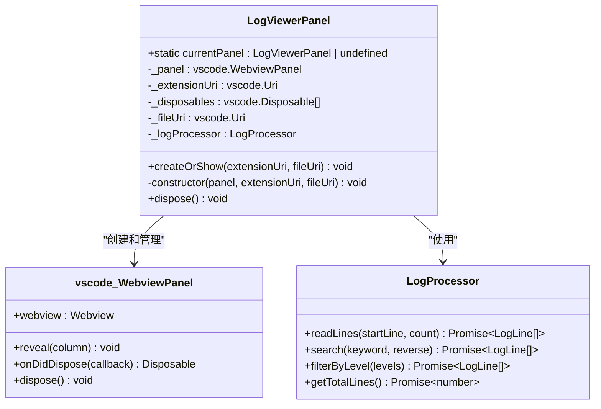
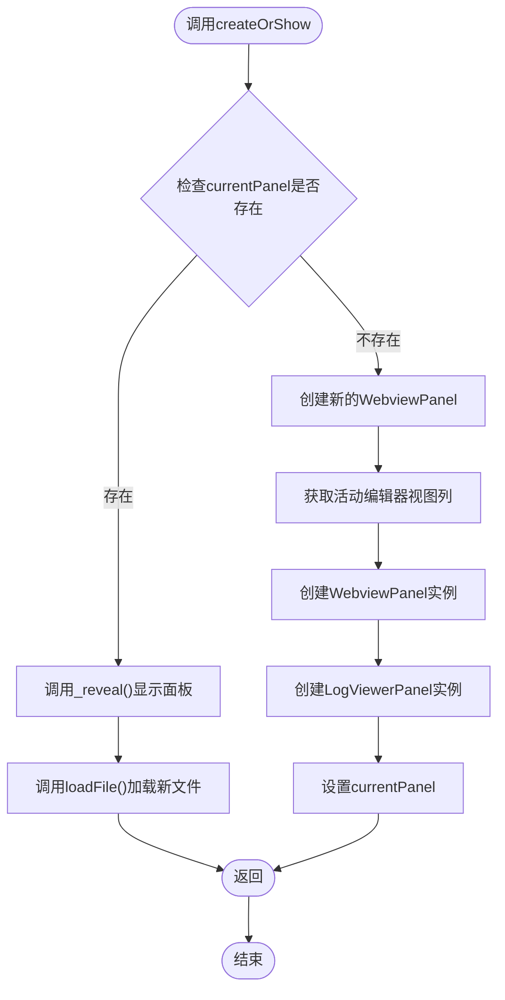
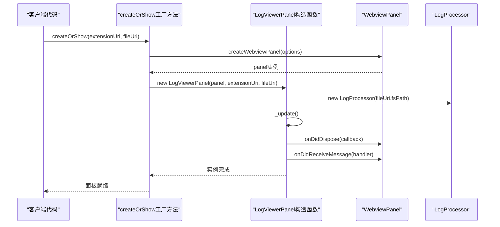
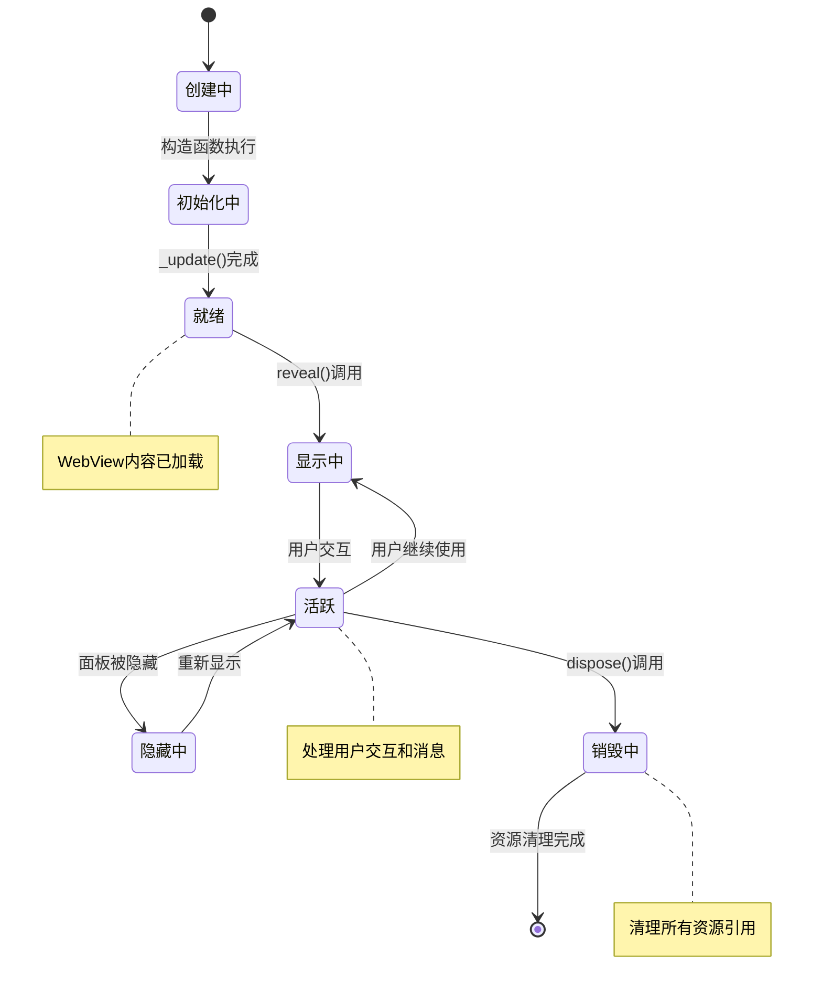
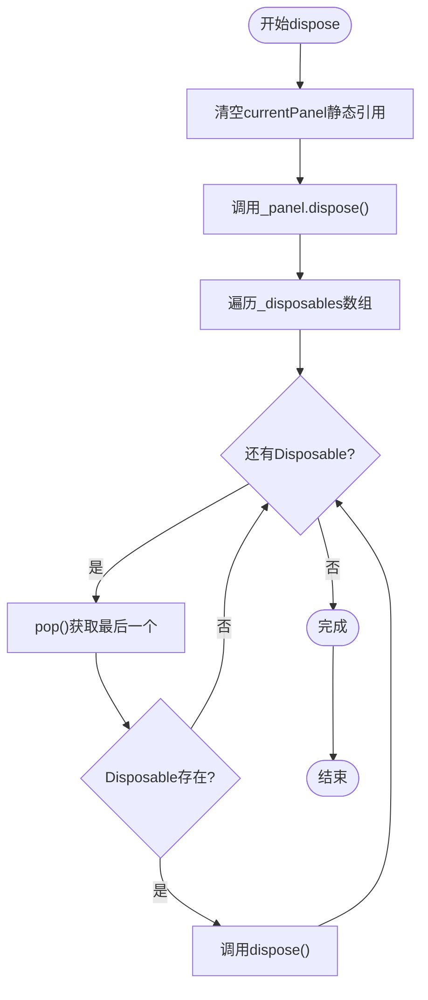
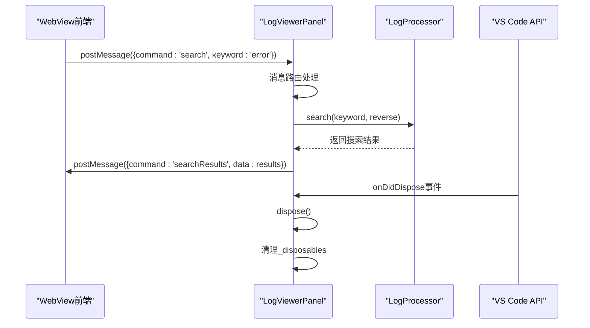
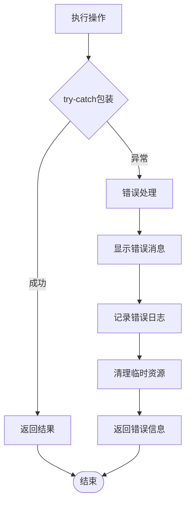

# 面板生命周期管理

<cite>
**本文档引用的文件**
- [logViewerPanel.ts](file://src/logViewerPanel.ts)
- [extension.ts](file://src/extension.ts)
- [webview.html](file://src/webview.html)
- [logProcessor.ts](file://src/logProcessor.ts)
</cite>

## 目录
1. [简介](#简介)
2. [单例模式实现](#单例模式实现)
3. [面板创建与显示](#面板创建与显示)
4. [WebView配置与安全性](#webview配置与安全性)
5. [面板生命周期管理](#面板生命周期管理)
6. [消息通信机制](#消息通信机制)
7. [资源管理最佳实践](#资源管理最佳实践)
8. [扩展开发指南](#扩展开发指南)
9. [总结](#总结)

## 简介

LogViewerPanel类是VS Code扩展中的核心组件，负责管理日志文件的可视化展示。该类通过精心设计的单例模式、WebView技术栈和完善的资源管理机制，为用户提供了一个功能强大且性能优化的日志查看体验。

本文档将深入分析LogViewerPanel类如何通过静态属性实现单例模式，探讨面板从创建到销毁的完整生命周期，并提供开发者在扩展此类功能时应遵循的最佳实践。

## 单例模式实现

### 静态属性设计

LogViewerPanel类采用经典的静态属性单例模式，通过`currentPanel`静态属性确保系统中始终只有一个面板实例存在。



**图表来源**
- [logViewerPanel.ts](file://src/logViewerPanel.ts#L7-L12)

### createOrShow静态方法逻辑

`createOrShow`方法实现了智能的面板复用机制：



**图表来源**
- [logViewerPanel.ts](file://src/logViewerPanel.ts#L14-L38)

**章节来源**
- [logViewerPanel.ts](file://src/logViewerPanel.ts#L14-L38)

## 面板创建与显示

### WebViewPanel创建过程

当需要创建新面板时，系统会执行以下关键步骤：

#### 视图列定位逻辑

```typescript
const column = vscode.window.activeTextEditor
    ? vscode.window.activeTextEditor.viewColumn
    : undefined;
```

这段代码确保新面板会出现在当前活动编辑器所在的视图列，如果没有活动编辑器，则默认使用第一个视图列。

#### WebView选项配置

```typescript
{
    enableScripts: true,
    retainContextWhenHidden: true,
    localResourceRoots: [extensionUri]
}
```

这些配置参数对面板的功能和性能有重要影响：

- **enableScripts**: 允许WebView执行JavaScript，这是前端交互功能的基础
- **retainContextWhenHidden**: 当面板被隐藏时保持上下文状态，避免重新加载导致的性能损失
- **localResourceRoots**: 定义允许访问的本地资源根目录，确保安全性和性能

**章节来源**
- [logViewerPanel.ts](file://src/logViewerPanel.ts#L27-L35)

### 构造函数初始化

构造函数执行以下关键初始化步骤：



**图表来源**
- [logViewerPanel.ts](file://src/logViewerPanel.ts#L41-L104)

**章节来源**
- [logViewerPanel.ts](file://src/logViewerPanel.ts#L41-L104)

## WebView配置与安全性

### 安全性考虑

WebView配置中的安全性措施：

1. **脚本执行控制**: `enableScripts: true`允许必要的JavaScript执行，但限制在受控环境中
2. **上下文保持**: `retainContextWhenHidden: true`避免频繁重建导致的安全风险
3. **资源根目录限制**: `localResourceRoots`严格限制了可访问的文件系统范围

### 性能影响分析

这些配置对性能的影响：

- **内存使用**: 上下文保持增加了内存占用，但提升了用户体验
- **启动速度**: 预加载HTML模板减少了首次显示的延迟
- **网络请求**: 本地资源访问避免了网络延迟和安全检查

**章节来源**
- [logViewerPanel.ts](file://src/logViewerPanel.ts#L32-L34)

## 面板生命周期管理

### 生命周期阶段

LogViewerPanel的完整生命周期包括以下阶段：



### dispose方法实现

dispose方法是资源管理的关键，确保不会发生内存泄漏：



**图表来源**
- [logViewerPanel.ts](file://src/logViewerPanel.ts#L497-L508)

**章节来源**
- [logViewerPanel.ts](file://src/logViewerPanel.ts#L497-L508)

## 消息通信机制

### 双向通信架构

LogViewerPanel实现了完整的双向消息通信机制：



**图表来源**
- [logViewerPanel.ts](file://src/logViewerPanel.ts#L54-L98)

### 支持的消息类型

系统支持多种消息类型，每种都有特定的处理逻辑：

| 消息命令 | 功能描述 | 参数 | 处理方式 |
|---------|---------|------|---------|
| loadMore | 加载更多日志行 | startLine, count | 异步读取文件内容 |
| search | 关键词搜索 | keyword, reverse | 文件流式搜索 |
| refresh | 刷新当前文件 | 无 | 重新加载文件 |
| filterByLevel | 按日志级别过滤 | levels数组 | 内存过滤处理 |
| getStatistics | 获取统计信息 | 无 | 计算统计数据 |
| regexSearch | 正则表达式搜索 | pattern, flags, reverse | 正则匹配 |
| exportLogs | 导出日志 | lines数组 | 文件写入操作 |
| deleteByTime | 按时间删除 | timeStr, mode | 文件修改操作 |
| jumpToTime | 定位到指定时间 | timeStr | 时间戳解析 |

**章节来源**
- [logViewerPanel.ts](file://src/logViewerPanel.ts#L56-L98)

## 资源管理最佳实践

### 内存泄漏防护

LogViewerPanel采用了多层次的资源管理策略：

1. **静态引用管理**: 通过`currentPanel`静态属性精确控制实例生命周期
2. **Disposable模式**: 使用VS Code的Disposable接口管理事件监听器
3. **自动清理**: 在dispose方法中确保所有资源都被正确释放

### 性能优化策略

1. **懒加载**: 大文件采用分页加载策略
2. **缓存机制**: LogProcessor内部实现行缓存
3. **上下文保持**: 避免频繁重建WebView上下文

### 错误处理机制



**章节来源**
- [logViewerPanel.ts](file://src/logViewerPanel.ts#L115-L147)
- [logViewerPanel.ts](file://src/logViewerPanel.ts#L150-L162)

## 扩展开发指南

### 开发者应遵循的原则

1. **单例模式维护**: 确保扩展功能仍然符合单例模式要求
2. **资源管理**: 所有新增的事件监听器都应添加到_disposables数组
3. **错误处理**: 实现完善的错误处理和用户反馈机制
4. **性能考虑**: 对大数据量操作实现适当的分页和缓存策略

### 新功能集成示例

假设要添加一个新的日志分析功能：

```typescript
// 1. 在消息处理器中添加新命令
case 'analyzePattern':
    await this.analyzeLogPattern(message.pattern);
    break;

// 2. 实现处理方法
private async analyzeLogPattern(pattern: string) {
    try {
        const results = await this._logProcessor.analyzePattern(pattern);
        this._panel.webview.postMessage({
            command: 'patternAnalysis',
            data: results
        });
    } catch (error) {
        vscode.window.showErrorMessage(`分析失败: ${error}`);
    }
}

// 3. 在前端添加相应的UI元素和事件处理
```

### 测试建议

1. **单元测试**: 测试各个方法的独立功能
2. **集成测试**: 验证消息通信机制
3. **性能测试**: 大文件加载和搜索的性能表现
4. **内存测试**: 验证dispose方法的资源清理效果

## 总结

LogViewerPanel类通过精心设计的架构实现了高效、安全、可扩展的日志查看功能。其核心特点包括：

1. **单例模式**: 通过静态属性确保唯一实例，简化状态管理
2. **WebView技术**: 利用现代Web技术提供丰富的用户界面
3. **资源管理**: 完善的生命周期管理防止内存泄漏
4. **消息通信**: 双向通信机制支持复杂的用户交互
5. **性能优化**: 智能的加载策略和缓存机制

这种设计模式为VS Code扩展开发提供了优秀的参考范例，特别是在处理复杂UI组件和大量数据时的架构设计思路值得学习和借鉴。