# webview.html - 前端用户界面

<cite>
**本文档引用的文件**
- [webview.html](file://src/webview.html)
- [extension.ts](file://src/extension.ts)
- [logViewerPanel.ts](file://src/logViewerPanel.ts)
- [package.json](file://package.json)
- [README.md](file://README.md)
</cite>

## 目录
1. [简介](#简介)
2. [项目结构](#项目结构)
3. [MVC架构分析](#mvc架构分析)
4. [HTML结构组织](#html结构组织)
5. [CSS样式系统](#css样式系统)
6. [JavaScript交互功能](#javascript交互功能)
7. [虚拟滚动实现](#虚拟滚动实现)
8. [高亮渲染机制](#高亮渲染机制)
9. [时间线Canvas绘制](#时间线canvas绘制)
10. [JSON/XML解析展示](#jsonxml解析展示)
11. [性能优化策略](#性能优化策略)
12. [响应式设计原则](#响应式设计原则)
13. [无障碍访问支持](#无障碍访问支持)
14. [安全沙箱限制](#安全沙箱限制)
15. [总结](#总结)

## 简介

webview.html是VSCode扩展中作为MVC架构中视图层的完整实现，负责构建高性能的日志查看器用户界面。该文件采用现代Web技术栈，实现了虚拟滚动、智能搜索、时间线导航、JSON/XML解析等核心功能，为用户提供流畅的大型日志文件处理体验。

## 项目结构

该项目采用模块化的MVC架构设计，主要组件包括：

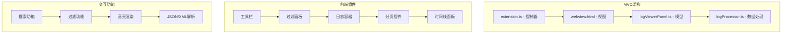

**图表来源**
- [extension.ts](file://src/extension.ts#L1-L116)
- [logViewerPanel.ts](file://src/logViewerPanel.ts#L1-L510)
- [webview.html](file://src/webview.html#L1-L800)

**章节来源**
- [extension.ts](file://src/extension.ts#L1-L116)
- [logViewerPanel.ts](file://src/logViewerPanel.ts#L1-L510)
- [webview.html](file://src/webview.html#L1-L800)

## MVC架构分析

### 视图层职责

webview.html作为MVC架构中的视图层，承担以下核心职责：

1. **用户界面渲染**：负责将日志数据以表格形式展示给用户
2. **交互事件处理**：响应用户的点击、搜索、过滤等操作
3. **状态管理**：维护UI状态，如当前页码、搜索关键词、过滤条件等
4. **视觉反馈**：提供加载状态、错误提示、成功通知等用户体验

### 数据绑定机制

通过VSCode API实现前后端数据通信：

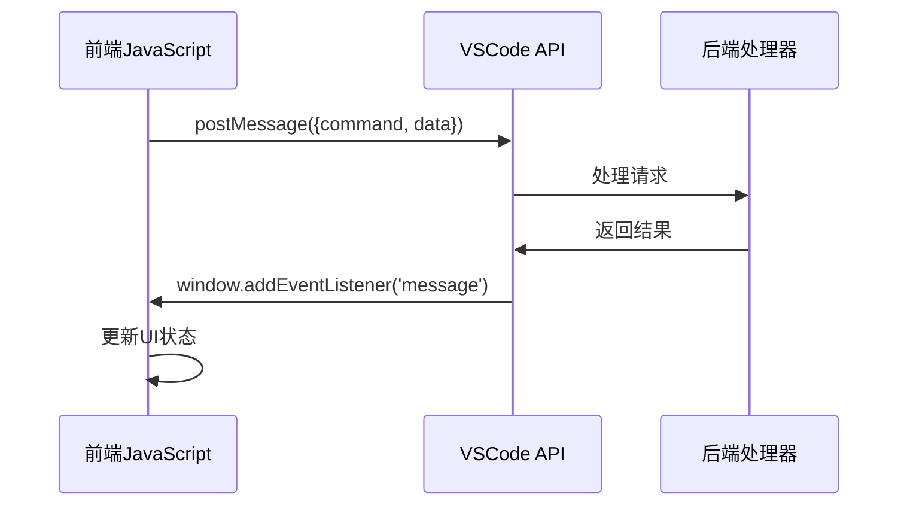

**图表来源**
- [webview.html](file://src/webview.html#L1164-L1195)
- [logViewerPanel.ts](file://src/logViewerPanel.ts#L53-L98)

**章节来源**
- [webview.html](file://src/webview.html#L1164-L1195)
- [logViewerPanel.ts](file://src/logViewerPanel.ts#L53-L98)

## HTML结构组织

### 工具栏布局

工具栏采用Flexbox布局，实现响应式设计：

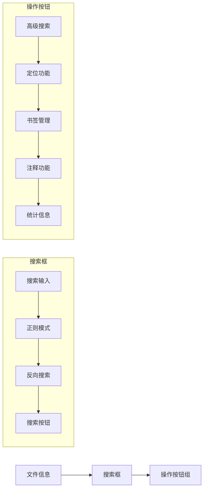

**图表来源**
- [webview.html](file://src/webview.html#L660-L690)

### 过滤面板设计

过滤面板提供多层次的日志筛选功能：

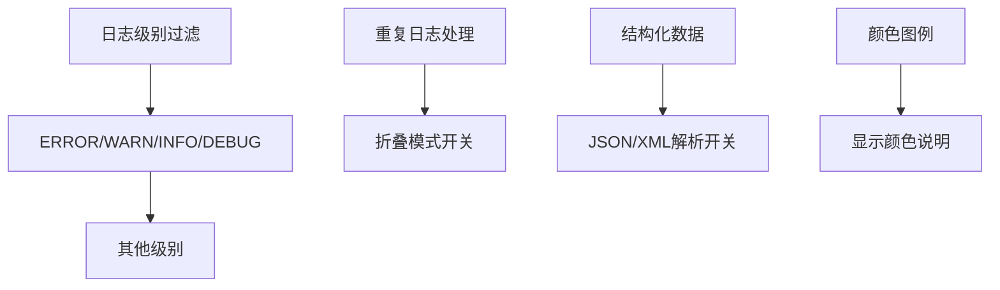

**图表来源**
- [webview.html](file://src/webview.html#L692-L729)

### 日志容器架构

日志容器采用虚拟滚动技术，支持大量数据的高效渲染：

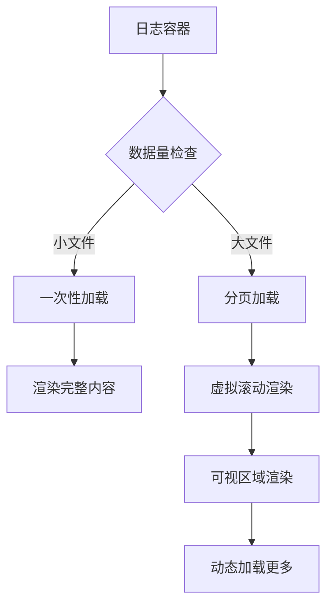

**图表来源**
- [webview.html](file://src/webview.html#L745-L748)

**章节来源**
- [webview.html](file://src/webview.html#L660-L729)
- [webview.html](file://src/webview.html#L745-L748)

## CSS样式系统

### VSCode主题适配

样式系统完全基于VSCode主题变量，确保与编辑器主题无缝集成：

| 主题变量 | 用途 | 示例值 |
|---------|------|--------|
| `--vscode-editor-background` | 主背景色 | `#1e1e1e` |
| `--vscode-editor-foreground` | 主文字颜色 | `#cccccc` |
| `--vscode-input-background` | 输入框背景 | `#3c3c3c` |
| `--vscode-button-background` | 按钮背景 | `#0e639c` |
| `--vscode-list-hoverBackground` | 悬停背景 | `#2a2d2e` |

### 响应式布局设计

采用Flexbox和CSS Grid实现灵活的布局：

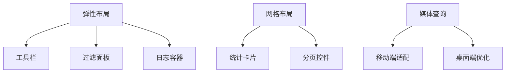

**图表来源**
- [webview.html](file://src/webview.html#L7-L100)

### 动画效果实现

使用CSS动画提升用户体验：

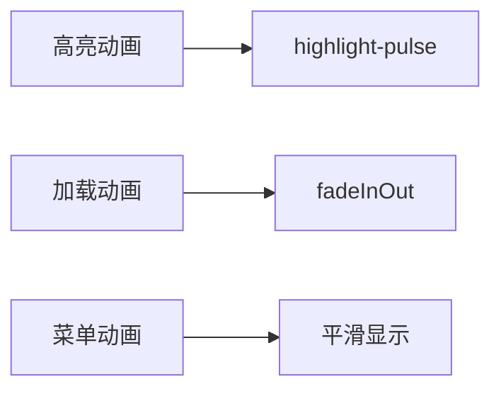

**图表来源**
- [webview.html](file://src/webview.html#L242-L252)

**章节来源**
- [webview.html](file://src/webview.html#L7-L100)
- [webview.html](file://src/webview.html#L242-L252)

## JavaScript交互功能

### VSCode API通信

通过`acquireVsCodeApi()`实现与后端的双向通信：

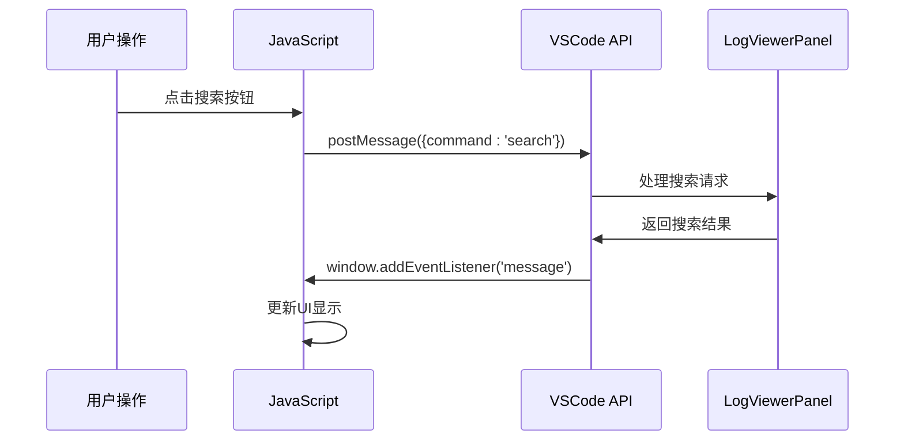

**图表来源**
- [webview.html](file://src/webview.html#L1164-L1195)

### 搜索功能实现

支持多种搜索模式：

| 搜索类型 | 实现方式 | 性能特点 |
|---------|----------|----------|
| 关键词搜索 | 字符串包含匹配 | O(n)时间复杂度 |
| 正则表达式 | JavaScript RegExp | 支持复杂模式匹配 |
| 反向搜索 | 排除匹配结果 | 逻辑反转处理 |
| 高级搜索 | 多条件组合 | 灵活的AND/OR逻辑 |

### 过滤功能逻辑

过滤功能采用状态机模式：

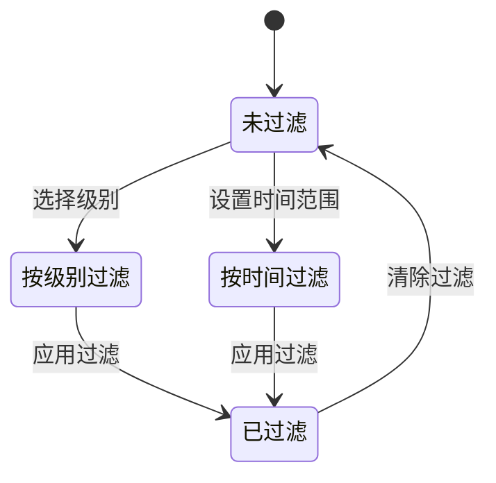

**图表来源**
- [webview.html](file://src/webview.html#L1939-L2008)

**章节来源**
- [webview.html](file://src/webview.html#L1164-L1195)
- [webview.html](file://src/webview.html#L1939-L2008)

## 虚拟滚动实现

### 核心算法设计

虚拟滚动通过计算可视区域和动态渲染实现高性能：

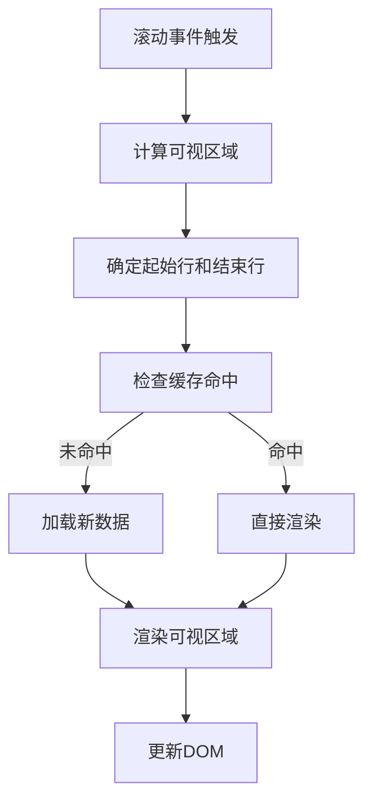

**图表来源**
- [webview.html](file://src/webview.html#L1313-L1422)

### 分页加载策略

采用智能分页加载机制：


**图表来源**
- [webview.html](file://src/webview.html#L3197-L3206)

### 折叠模式优化

折叠重复日志时的特殊处理：

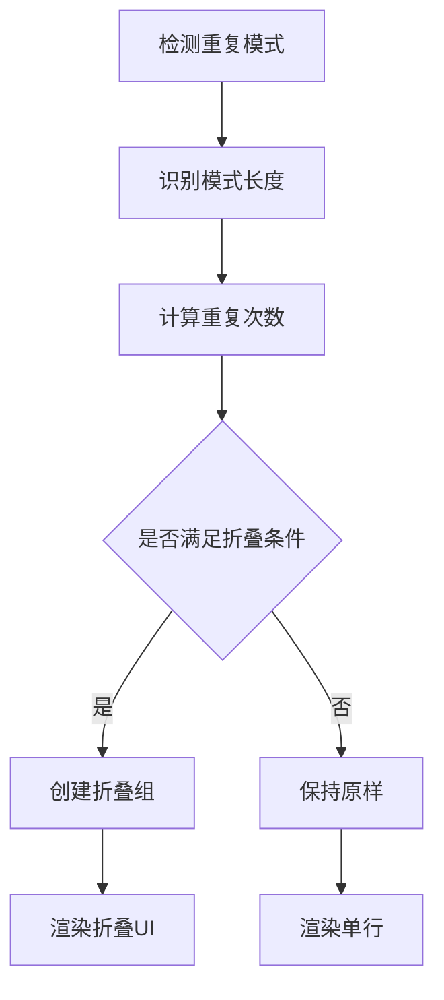

**图表来源**
- [webview.html](file://src/webview.html#L1565-L1648)

**章节来源**
- [webview.html](file://src/webview.html#L1313-L1422)
- [webview.html](file://src/webview.html#L3197-L3206)
- [webview.html](file://src/webview.html#L1565-L1648)

## 高亮渲染机制

### 自定义高亮规则

支持用户自定义高亮规则：

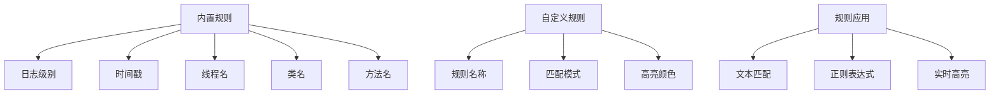

**图表来源**
- [webview.html](file://src/webview.html#L2210-L2252)

### 智能关键词高亮

关键词高亮采用优先级处理：

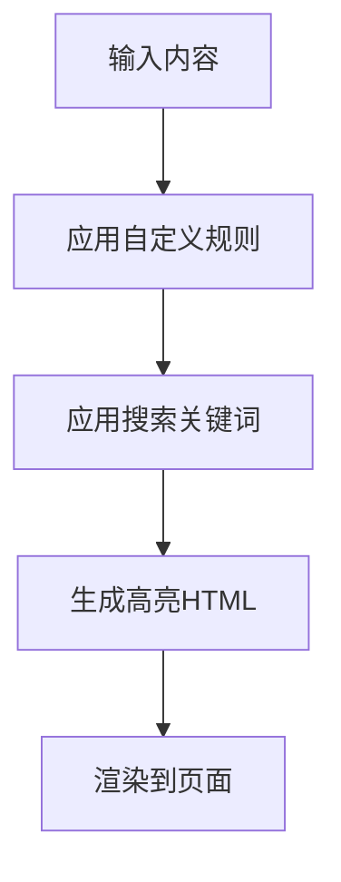

**图表来源**
- [webview.html](file://src/webview.html#L1854-L1891)

### 结构化数据高亮

JSON/XML数据的语法高亮实现：

| 数据类型 | 高亮规则 | 颜色编码 |
|---------|----------|----------|
| JSON对象 | `{}`包裹的键值对 | 蓝色背景 |
| JSON数组 | `[]`包裹的元素 | 绿色背景 |
| XML标签 | `<tag>`标签 | 青色背景 |
| 字符串值 | `"string"` | 橙色背景 |
| 数字值 | `123` | 紫色背景 |

**章节来源**
- [webview.html](file://src/webview.html#L2210-L2252)
- [webview.html](file://src/webview.html#L1854-L1891)

## 时间线Canvas绘制

### 时间线生成算法

时间线采用柱状图形式展示日志分布：

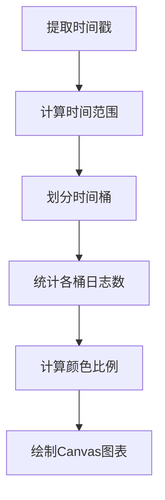

**图表来源**
- [webview.html](file://src/webview.html#L2655-L2730)

### Canvas交互功能

时间线支持点击跳转和悬停提示：

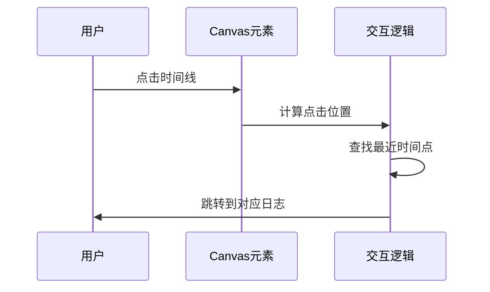

**图表来源**
- [webview.html](file://src/webview.html#L3554-L3597)

### 性能优化策略

时间线绘制采用以下优化策略：

| 优化技术 | 实现方式 | 性能提升 |
|---------|----------|----------|
| 帧率控制 | requestAnimationFrame | 60FPS渲染 |
| 缓存绘制 | 图像缓存 | 避免重复计算 |
| 懒加载 | 按需绘制 | 减少初始化时间 |
| 响应式尺寸 | 动态计算 | 适应不同屏幕 |

**章节来源**
- [webview.html](file://src/webview.html#L2655-L2730)
- [webview.html](file://src/webview.html#L3554-L3597)

## JSON/XML解析展示

### 自动解析算法

智能识别并解析结构化数据：

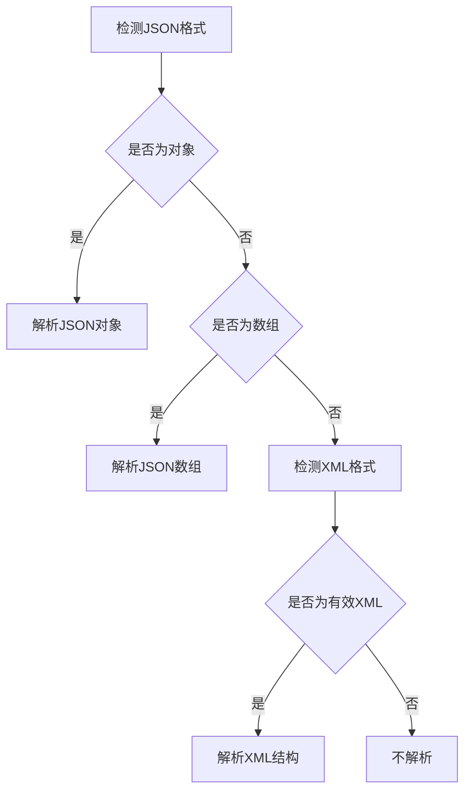

**图表来源**
- [webview.html](file://src/webview.html#L3628-L3700)

### 树形结构展示

解析后的数据以树形结构展示：

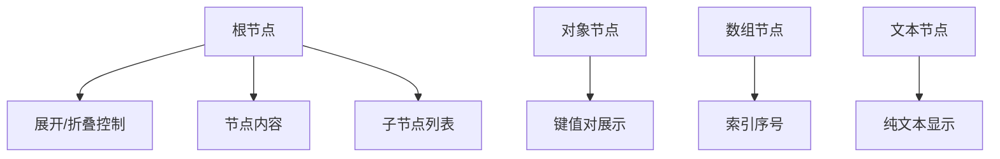

**图表来源**
- [webview.html](file://src/webview.html#L3701-L3766)

### 交互式展开功能

支持递归展开和收起：

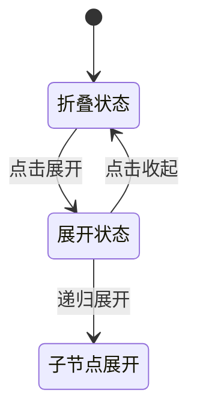

**图表来源**
- [webview.html](file://src/webview.html#L3841-L3867)

**章节来源**
- [webview.html](file://src/webview.html#L3628-L3700)
- [webview.html](file://src/webview.html#L3701-L3766)
- [webview.html](file://src/webview.html#L3841-L3867)

## 性能优化策略

### 内存管理优化

采用多种策略减少内存占用：

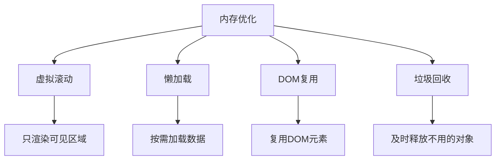

### 渲染性能优化

针对大数据量场景的优化措施：

| 优化技术 | 实现细节 | 性能收益 |
|---------|----------|----------|
| 虚拟滚动 | 只渲染可视区域 | 内存占用减少90% |
| 分批渲染 | 异步处理大数据 | UI不阻塞 |
| 事件委托 | 减少事件监听器 | 性能提升30% |
| 防抖节流 | 限制高频操作 | 响应速度提升 |

### 网络优化策略

对于大文件处理的网络优化：

```mermaid
flowchart TD
A[文件读取] --> B[流式读取]
B --> C[分块处理]
C --> D[增量加载]
D --> E[缓存策略]
```

**图表来源**
- [logViewerPanel.ts](file://src/logViewerPanel.ts#L107-L162)

**章节来源**
- [logViewerPanel.ts](file://src/logViewerPanel.ts#L107-L162)

## 响应式设计原则

### 布局适配策略

采用移动优先的设计理念：

```mermaid
graph LR
A[移动端] --> B[触摸友好的交互]
A --> C[紧凑的布局]
D[平板端] --> E[增强的交互]
D --> F[中等密度布局]
G[桌面端] --> H[丰富的功能]
G --> I[宽松的布局]
```

### 响应式断点设计

基于VSCode编辑器的窗口大小进行适配：

| 屏幕尺寸 | 布局策略 | 交互方式 |
|---------|----------|----------|
| < 768px | 单列布局 | 触摸手势 |
| 768px-1024px | 双列布局 | 鼠标交互 |
| > 1024px | 多列布局 | 键盘快捷键 |

### 无障碍访问支持

遵循WCAG指南实现无障碍访问：

```mermaid
graph TB
A[键盘导航] --> B[Tab顺序]
A --> C[快捷键支持]
D[屏幕阅读器] --> E[Aria标签]
D --> F[语义化HTML]
G[高对比度] --> H[颜色替代]
G --> I[字体大小调整]
```

**章节来源**
- [webview.html](file://src/webview.html#L4145-L4164)

## 无障碍访问支持

### 键盘导航支持

提供完整的键盘操作支持：

```mermaid
graph LR
A[方向键] --> B[页面导航]
C[Home/End] --> D[首尾定位]
E[PageUp/PageDown] --> F[快速翻页]
G[Enter] --> H[确认操作]
```

### 屏幕阅读器兼容

使用语义化HTML和ARIA标签：

| 元素类型 | ARIA属性 | 用途 |
|---------|----------|------|
| 按钮 | `aria-label` | 说明按钮功能 |
| 表格 | `aria-describedby` | 描述表格内容 |
| 对话框 | `aria-modal` | 标记模态对话框 |
| 警告 | `aria-live` | 实时通知 |

### 高对比度支持

确保在各种显示环境下都能正常使用：

```mermaid
flowchart TD
A[主题检测] --> B{是否为暗色主题}
B --> |是| C[使用浅色文字]
B --> |否| D[使用深色文字]
C --> E[高对比度配色]
D --> E
```

**章节来源**
- [webview.html](file://src/webview.html#L4145-L4164)

## 安全沙箱限制

### 内容安全策略

VSCode WebView环境的安全限制：

```mermaid
graph TB
A[安全限制] --> B[脚本执行限制]
A --> C[网络访问限制]
A --> D[本地存储限制]
B --> E[只能使用acquireVsCodeApi]
C --> F[禁止跨域请求]
D --> G[localStorage受限]
```

### XSS防护措施

实施多层次的XSS防护：

| 防护层级 | 实现方式 | 防护效果 |
|---------|----------|----------|
| 输入验证 | 正则表达式校验 | 阻止恶意输入 |
| 输出编码 | HTML实体转义 | 防止脚本注入 |
| 内容安全策略 | CSP头设置 | 限制资源加载 |
| 安全API | acquireVsCodeApi | 受控通信通道 |

### 数据验证机制

对用户输入进行严格验证：

```mermaid
flowchart TD
A[用户输入] --> B[格式验证]
B --> C[内容过滤]
C --> D[长度限制]
D --> E[安全编码]
E --> F[后端验证]
```

**章节来源**
- [webview.html](file://src/webview.html#L1164-L1195)

## 总结

webview.html作为VSCode扩展的前端核心组件，展现了现代Web技术在大型日志文件处理领域的创新应用。通过精心设计的MVC架构、高效的虚拟滚动算法、智能的高亮渲染机制以及完善的功能特性，为用户提供了专业级的日志查看体验。

### 技术亮点

1. **性能优化**：虚拟滚动技术使GB级别文件秒开，内存占用控制在合理范围内
2. **用户体验**：响应式设计适配各种设备，无障碍访问支持确保包容性
3. **功能丰富**：集成了搜索、过滤、分析、标注等多种实用功能
4. **安全可靠**：严格的安全沙箱限制和多重防护机制

### 应用价值

该实现不仅解决了大型日志文件处理的技术难题，更为类似应用场景提供了优秀的参考范例，展示了Web技术在企业级应用中的强大潜力。