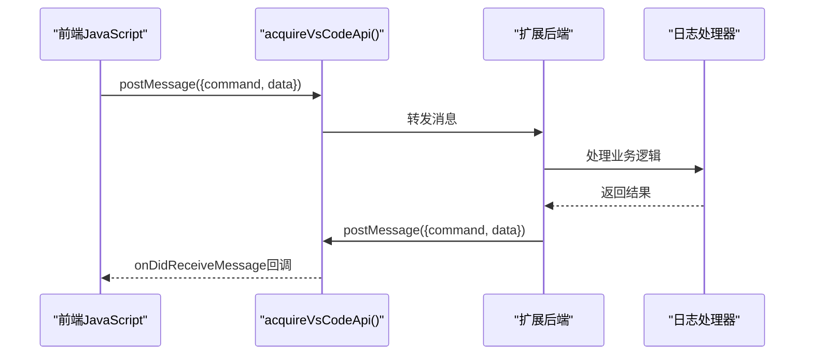
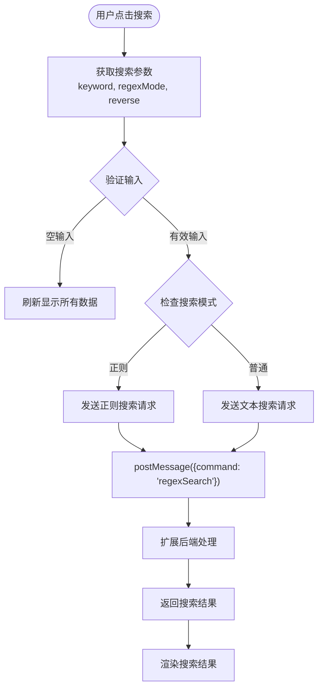
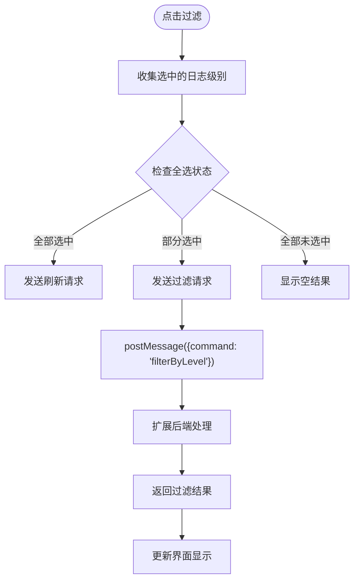
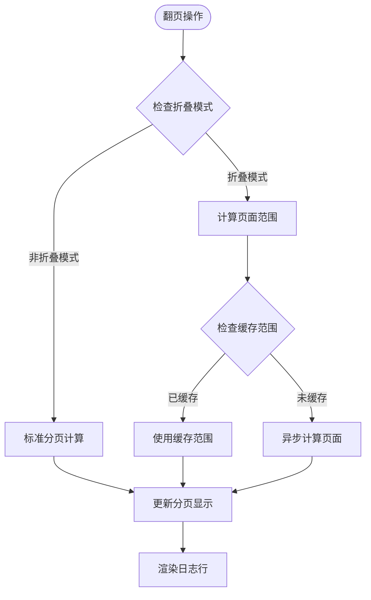
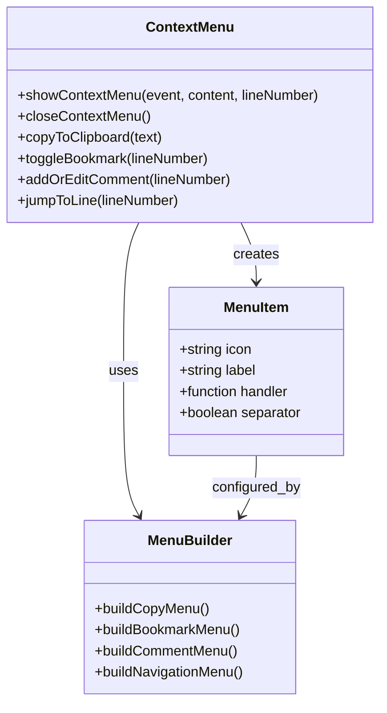
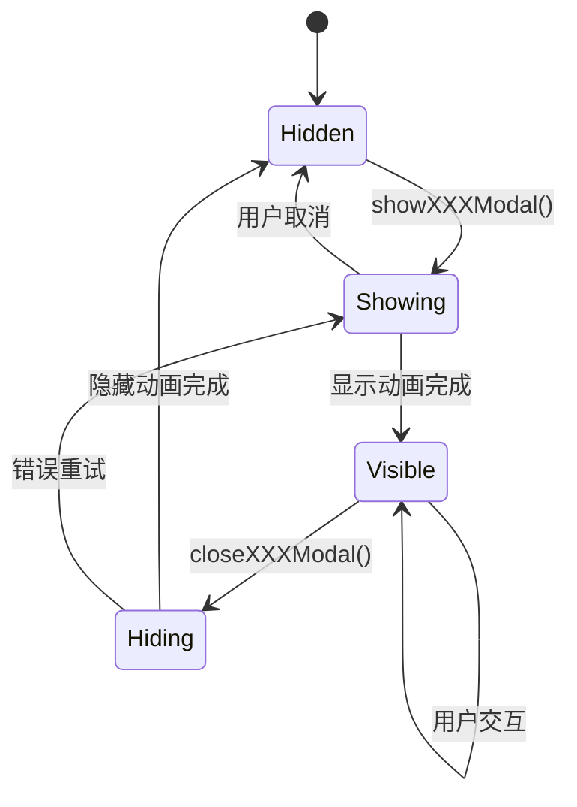
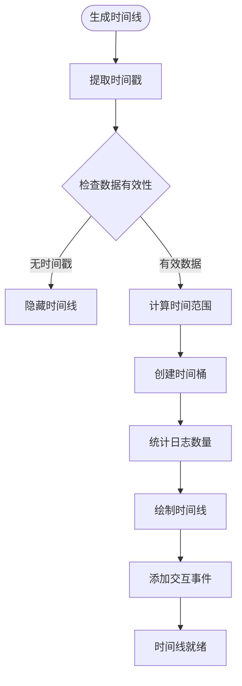
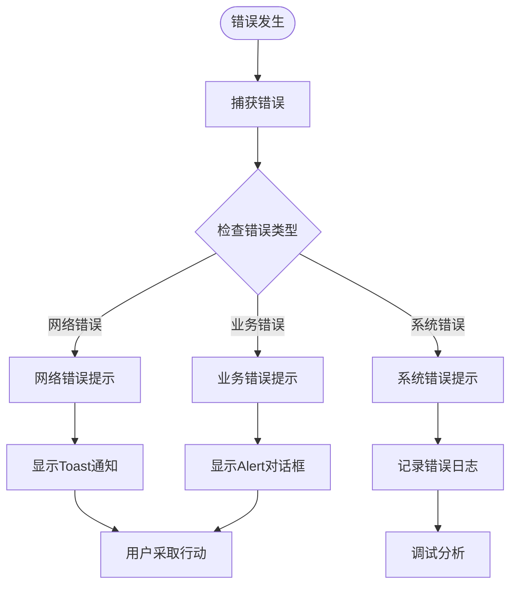
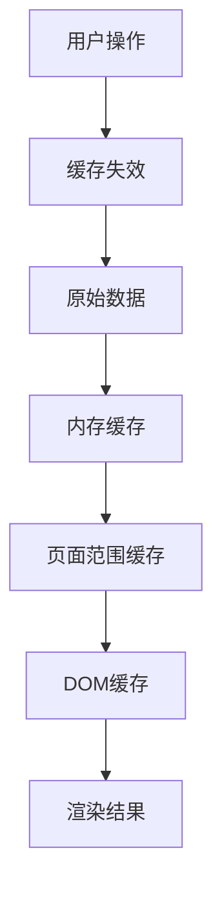

# 交互逻辑与事件处理

<cite>
**本文档引用的文件**
- [src/webview.html](file://src/webview.html)
- [src/extension.ts](file://src/extension.ts)
- [src/logViewerPanel.ts](file://src/logViewerPanel.ts)
- [package.json](file://package.json)
</cite>

## 目录
1. [概述](#概述)
2. [VSCode扩展通信机制](#vscode扩展通信机制)
3. [核心事件处理函数](#核心事件处理函数)
4. [右键菜单系统](#右键菜单系统)
5. [模态框交互](#模态框交互)
6. [时间线画布交互](#时间线画布交互)
7. [事件委托与防抖处理](#事件委托与防抖处理)
8. [错误反馈机制](#错误反馈机制)
9. [性能优化实践](#性能优化实践)

## 概述

该日志查看器扩展通过WebView技术实现了丰富的交互功能，前端JavaScript通过`acquireVsCodeApi()`与VSCode扩展后端建立双向通信通道。系统采用事件驱动架构，支持搜索、过滤、分页、删除等核心操作，同时提供了完善的用户界面反馈和错误处理机制。

## VSCode扩展通信机制

### 通信架构

系统采用消息传递模式实现前端与后端的通信：



**图表来源**
- [src/webview.html](file://src/webview.html#L1212-L1262)
- [src/logViewerPanel.ts](file://src/logViewerPanel.ts#L53-L98)

### 关键通信流程

前端通过`acquireVsCodeApi()`获取通信接口，后端监听消息并执行相应操作：

**章节来源**
- [src/webview.html](file://src/webview.html#L1212-L1214)
- [src/logViewerPanel.ts](file://src/logViewerPanel.ts#L53-L98)

## 核心事件处理函数

### 搜索功能 (`search()`)

搜索功能支持关键词搜索和正则表达式搜索：



**图表来源**
- [src/webview.html](file://src/webview.html#L1951-L1985)

**章节来源**
- [src/webview.html](file://src/webview.html#L1951-L1985)

### 过滤功能 (`applyFilter()`)

过滤功能支持按日志级别进行多选过滤：



**图表来源**
- [src/webview.html](file://src/webview.html#L1987-L2043)

**章节来源**
- [src/webview.html](file://src/webview.html#L1987-L2043)

### 分页控制 (`goToPage()`)

分页功能支持智能计算和动态加载：



**图表来源**
- [src/webview.html](file://src/webview.html#L3476-L3528)

**章节来源**
- [src/webview.html](file://src/webview.html#L3476-L3528)

## 右键菜单系统

### 菜单架构

右键菜单采用事件委托模式，支持多种操作：



**图表来源**
- [src/webview.html](file://src/webview.html#L2526-L2657)

### 菜单项功能

右键菜单提供以下功能：
- 复制选中内容/整行
- 添加/移除书签
- 添加/编辑/删除注释
- 定位到指定行
- 搜索相关日志

**章节来源**
- [src/webview.html](file://src/webview.html#L2526-L2657)

## 模态框交互

### 模态框管理系统

系统采用统一的模态框管理机制：



**图表来源**
- [src/webview.html](file://src/webview.html#L823-L1210)

### 主要模态框功能

| 模态框类型 | 功能描述 | 关键操作 |
|-----------|----------|----------|
| 统计信息 | 显示日志统计和分析结果 | 查看各类统计数据、按类别筛选 |
| 删除操作 | 按时间和行数删除日志 | 选择删除方式、确认删除操作 |
| 快速定位 | 按行号或时间跳转 | 输入目标位置、执行跳转 |
| 书签管理 | 管理书签列表 | 添加/删除书签、批量操作 |
| 注释管理 | 管理日志注释 | 添加/编辑/删除注释 |
| 高亮规则 | 自定义高亮规则 | 添加/编辑/删除高亮规则 |

**章节来源**
- [src/webview.html](file://src/webview.html#L823-L1210)

## 时间线画布交互

### 时间线功能架构

时间线画布提供可视化的时间分布分析：



**图表来源**
- [src/webview.html](file://src/webview.html#L2769-L2934)

### 交互功能

时间线画布支持以下交互：
- 点击跳转到对应时间段
- 鼠标悬停显示详细信息
- 时间范围缩放
- 级别颜色区分

**章节来源**
- [src/webview.html](file://src/webview.html#L2769-L2934)

## 事件委托与防抖处理

### 事件委托模式

系统广泛使用事件委托减少内存占用：

```javascript
// 事件委托示例
document.getElementById('logContainer').addEventListener('click', function(e) {
    if (e.target.classList.contains('log-line')) {
        handleLineClick(e);
    }
});
```

### 防抖处理机制

对于频繁触发的操作，系统实现了防抖处理：

```javascript
// 搜索防抖
let searchTimeout;
function debouncedSearch() {
    clearTimeout(searchTimeout);
    searchTimeout = setTimeout(() => {
        search();
    }, 300);
}
```

**章节来源**
- [src/webview.html](file://src/webview.html#L3775-L3780)

## 错误反馈机制

### 多层次错误处理

系统实现了多层次的错误反馈机制：



**图表来源**
- [src/webview.html](file://src/webview.html#L2499-L2521)

### 错误类型处理

| 错误类型 | 处理方式 | 用户反馈 |
|---------|----------|----------|
| 网络连接失败 | 重试机制 | Toast提示"网络连接失败" |
| 文件加载超时 | 超时重试 | Alert提示"加载超时，请重试" |
| 搜索语法错误 | 实时验证 | 即时反馈"正则表达式错误" |
| 删除操作确认 | 确认对话框 | Modal确认窗口 |
| 数据解析错误 | 优雅降级 | 显示原始数据 |

**章节来源**
- [src/webview.html](file://src/webview.html#L2499-L2521)

## 性能优化实践

### 虚拟滚动优化

对于大量日志数据，系统实现了虚拟滚动：

```javascript
// 虚拟滚动核心逻辑
function renderLines() {
    const startIndex = (currentPage - 1) * pageSize;
    const endIndex = Math.min(startIndex + pageSize, allLines.length);
    const visibleLines = allLines.slice(startIndex, endIndex);
    
    // 只渲染可见区域的行
    visibleLines.forEach(renderSingleLine);
}
```

### 数据缓存策略

系统采用多级缓存策略提升性能：



**图表来源**
- [src/webview.html](file://src/webview.html#L1224-L1226)

### 异步处理优化

对于耗时操作，系统采用异步处理：

```javascript
// 异步计算页面范围
async function calculateAllPagesAsync() {
    // 分批处理，避免阻塞主线程
    for (let i = 0; i < batchCount; i++) {
        await processBatch();
        updateProgress();
    }
}
```

**章节来源**
- [src/webview.html](file://src/webview.html#L1534-L1588)

## 总结

该日志查看器扩展通过精心设计的交互逻辑和事件处理机制，实现了流畅的用户体验。系统采用了现代Web开发的最佳实践，包括事件委托、防抖处理、异步操作、错误处理等技术，确保了良好的性能和稳定性。通过VSCode扩展通信机制，实现了前后端的无缝协作，为用户提供了强大的日志分析工具。