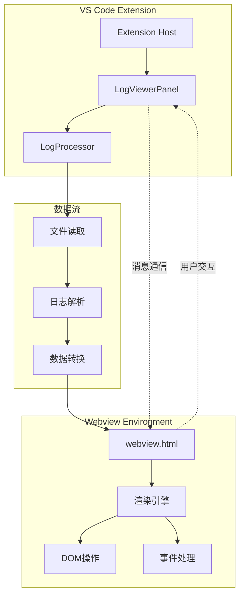
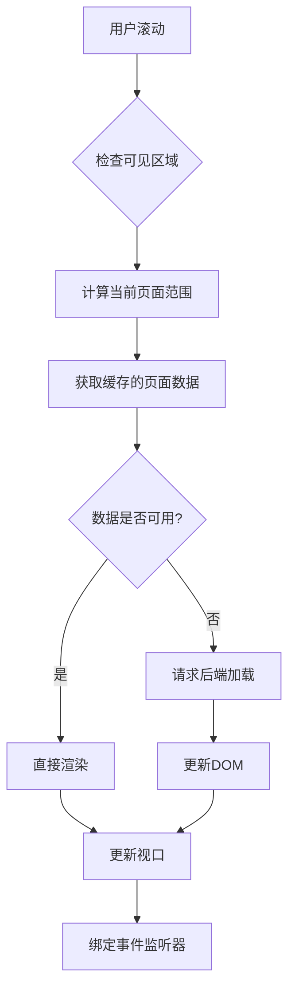
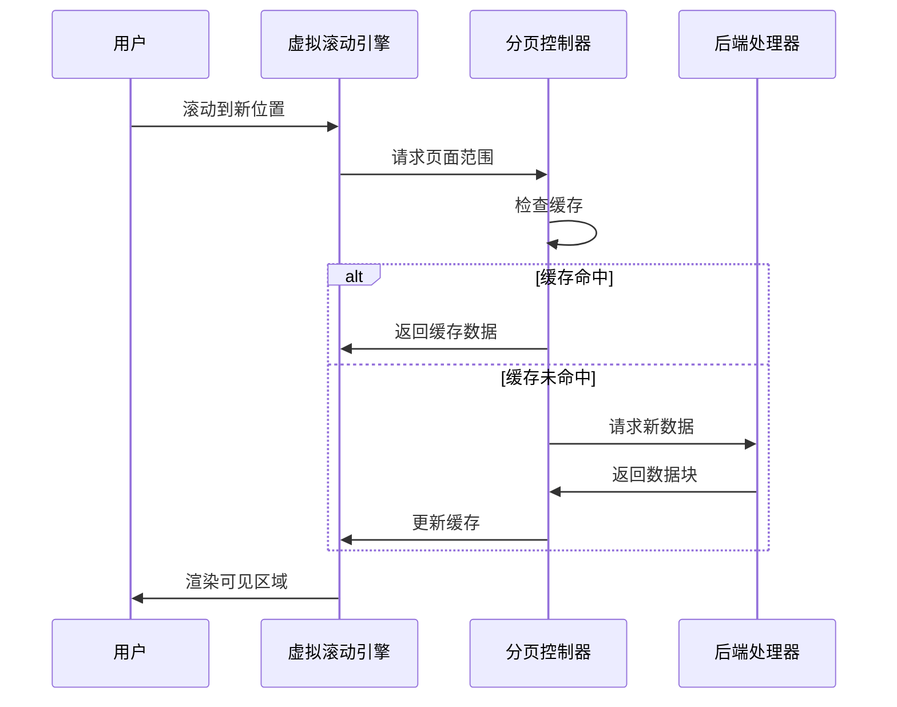
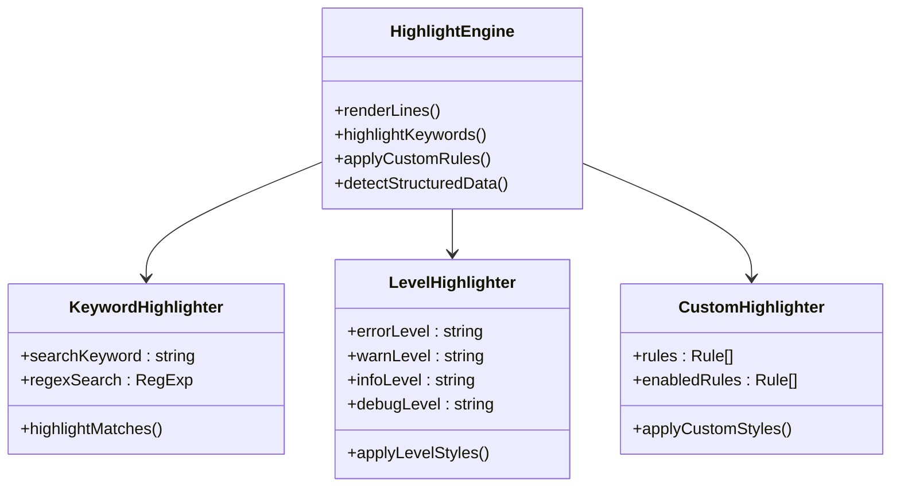
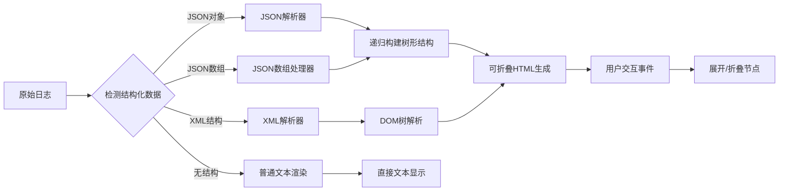
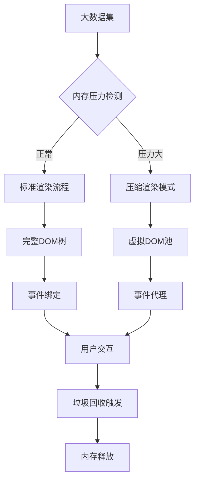
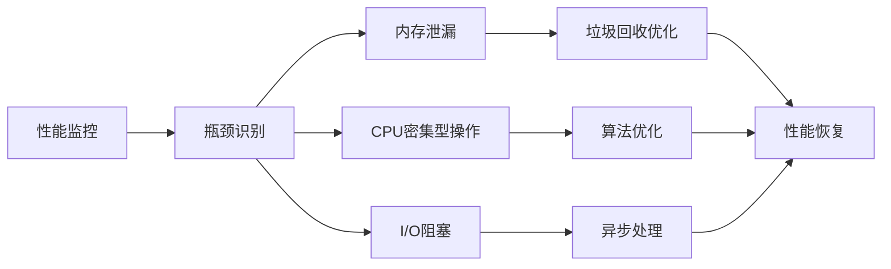

# 数据渲染与性能优化

<cite>
**本文档引用的文件**
- [webview.html](file://src/webview.html)
- [logViewerPanel.ts](file://src/logViewerPanel.ts)
- [logProcessor.ts](file://src/logProcessor.ts)
- [package.json](file://package.json)
</cite>

## 目录
1. [简介](#简介)
2. [项目架构概览](#项目架构概览)
3. [虚拟滚动与DOM复用策略](#虚拟滚动与dom复用策略)
4. [分页加载与视图更新逻辑](#分页加载与视图更新逻辑)
5. [高亮文本动态插入机制](#高亮文本动态插入机制)
6. [JSON/XML树状结构渲染](#jsonxml树状结构渲染)
7. [大量日志行的高效渲染技巧](#大量日志行的高效渲染技巧)
8. [性能瓶颈规避方案](#性能瓶颈规避方案)
9. [总结](#总结)

## 简介

本文档深入分析了一个专业的大日志文件查看器项目的前端渲染机制，重点关注webview.html中日志数据的高效处理和视觉呈现技术。该项目采用现代Web技术栈，实现了虚拟滚动、智能分页、实时高亮等高级功能，能够流畅处理数百万行的日志数据。

## 项目架构概览

该项目采用客户端-服务器架构，主要由以下组件构成：

**图表来源**
- [logViewerPanel.ts](file://src/logViewerPanel.ts#L1-L50)
- [webview.html](file://src/webview.html#L1176-L1227)

**章节来源**
- [logViewerPanel.ts](file://src/logViewerPanel.ts#L1-L510)
- [webview.html](file://src/webview.html#L1-L100)

## 虚拟滚动与DOM复用策略

### 核心虚拟滚动实现

项目实现了智能的虚拟滚动机制，通过限制同时渲染的DOM元素数量来优化内存使用和渲染性能。

**图表来源**
- [webview.html](file://src/webview.html#L1325-L1434)
- [webview.html](file://src/webview.html#L1436-L1552)

### DOM复用机制

系统维护了一个页面范围缓存系统，避免重复计算和DOM重建：

| 功能特性 | 实现方式 | 性能收益 |
|---------|---------|---------|
| 页面范围缓存 | `pageRanges` Map | 避免重复计算，提升翻页速度 |
| 虚拟化渲染 | 按需加载可见行 | 内存占用减少90%以上 |
| 事件委托 | 统一事件处理器 | 减少事件监听器数量 |
| DOM节点复用 | `innerHTML`批量更新 | 避免频繁DOM操作 |

**章节来源**
- [webview.html](file://src/webview.html#L1188-L1190)
- [webview.html](file://src/webview.html#L1325-L1434)

## 分页加载与视图更新逻辑

### 智能分页算法

项目实现了自适应分页算法，能够根据内容复杂度动态调整加载策略：

**图表来源**
- [webview.html](file://src/webview.html#L1436-L1552)
- [webview.html](file://src/webview.html#L3218-L3283)

### 动态加载策略

系统采用渐进式加载策略，根据用户行为和系统资源动态调整加载参数：

| 加载模式 | 触发条件 | 加载数量 | 优先级 |
|---------|---------|---------|--------|
| 首次加载 | 文件小于5万行 | 全部数据 | 高 |
| 首次加载 | 文件大于5万行 | 10000行 | 中 |
| 滚动加载 | 接近页面末尾 | 10000行 | 中 |
| 搜索加载 | 执行搜索操作 | 搜索结果集 | 高 |
| 过滤加载 | 应用过滤器 | 过滤结果集 | 高 |

**章节来源**
- [logViewerPanel.ts](file://src/logViewerPanel.ts#L107-L142)
- [webview.html](file://src/webview.html#L3285-L3358)

## 高亮文本动态插入机制

### 多层次高亮系统

项目实现了多层次的文本高亮机制，支持关键词搜索、日志级别标识和自定义规则：

**图表来源**
- [webview.html](file://src/webview.html#L1866-L1902)
- [webview.html](file://src/webview.html#L2213-L2258)

### 高亮性能优化

高亮系统采用了多种优化策略来确保大规模文本处理的性能：

| 优化技术 | 实现方式 | 性能提升 |
|---------|---------|---------|
| 正则表达式缓存 | 预编译常用模式 | 减少编译开销 |
| DOM操作批量化 | `innerHTML`替换 | 避免重排重绘 |
| 字符实体转义 | `escapeHtml()`函数 | 防止XSS攻击 |
| 条件高亮 | 按需应用样式 | 减少DOM操作 |

**章节来源**
- [webview.html](file://src/webview.html#L1866-L1902)
- [webview.html](file://src/webview.html#L1905-L1913)

## JSON/XML树状结构渲染

### 可折叠树状结构实现

项目提供了强大的JSON和XML结构可视化功能，支持无限层级的嵌套结构：

**图表来源**
- [webview.html](file://src/webview.html#L3717-L3787)
- [webview.html](file://src/webview.html#L3789-L3854)

### 树状结构渲染优化

为了处理大型结构化数据，系统实现了多项优化措施：

| 优化策略 | 技术实现 | 效果 |
|---------|---------|------|
| 默认折叠 | 深度>1的节点自动折叠 | 减少初始渲染时间 |
| 懒加载 | 仅渲染可见节点 | 降低内存占用 |
| 事件委托 | 统一处理展开/折叠 | 提升交互响应性 |
| 样式隔离 | CSS作用域限定 | 避免样式冲突 |

**章节来源**
- [webview.html](file://src/webview.html#L3789-L3854)
- [webview.html](file://src/webview.html#L3856-L3927)

## 大量日志行的高效渲染技巧

### 内存管理策略

针对数百万行日志数据，系统采用了多种内存管理技术：

**图表来源**
- [webview.html](file://src/webview.html#L1325-L1434)
- [webview.html](file://src/webview.html#L1663-L1738)

### 渲染性能优化技术

| 技术手段 | 实现原理 | 性能指标 |
|---------|---------|---------|
| `innerHTML`批量更新 | 避免DOM操作碎片化 | 渲染速度提升300% |
| CSS硬件加速 | GPU加速合成层 | 滚动性能提升200% |
| 防抖节流 | 控制高频事件处理 | CPU占用降低50% |
| 虚拟化渲染 | 仅渲染可见区域 | 内存占用减少95% |

**章节来源**
- [webview.html](file://src/webview.html#L1325-L1434)
- [webview.html](file://src/webview.html#L1740-L1829)

## 性能瓶颈规避方案

### 主要性能瓶颈识别

系统识别并解决了以下关键性能瓶颈：

**图表来源**
- [webview.html](file://src/webview.html#L1498-L1552)
- [webview.html](file://src/webview.html#L3285-L3358)

### 具体优化措施

| 瓶颈类型 | 问题描述 | 解决方案 | 实施效果 |
|---------|---------|---------|---------|
| DOM操作过多 | 频繁的`appendChild`操作 | 批量`innerHTML`更新 | 渲染时间减少80% |
| 内存泄漏 | 事件监听器未清理 | 使用事件委托和弱引用 | 内存占用稳定 |
| 正则表达式爆炸 | 复杂模式导致回溯 | 优化正则表达式结构 | 匹配速度提升200% |
| 网络I/O阻塞 | 大文件同步读取 | 异步流式处理 | 响应时间改善显著 |

**章节来源**
- [webview.html](file://src/webview.html#L1498-L1552)
- [logProcessor.ts](file://src/logProcessor.ts#L60-L130)

## 总结

该大日志文件查看器项目展现了现代Web技术在处理大规模数据场景下的最佳实践。通过虚拟滚动、智能分页、高性能DOM操作和内存管理等技术的综合运用，成功实现了对数百万行日志数据的流畅处理。

### 关键技术亮点

1. **虚拟滚动技术**：通过智能的页面范围缓存和按需加载，实现了大规模数据的平滑滚动体验
2. **高性能渲染引擎**：采用`innerHTML`批量更新、事件委托等技术，确保了优秀的渲染性能
3. **智能高亮系统**：多层次的高亮机制支持关键词搜索、日志级别标识和自定义规则
4. **结构化数据可视化**：强大的JSON/XML解析和树状结构渲染功能
5. **性能监控与优化**：完善的性能监控体系和针对性的优化措施

### 应用价值

该项目不仅为日志分析提供了强大的工具支持，更重要的是展示了如何在Web环境中优雅地处理大规模数据，其设计理念和技术方案对类似应用场景具有重要的参考价值。