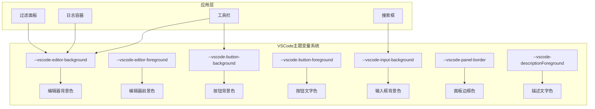
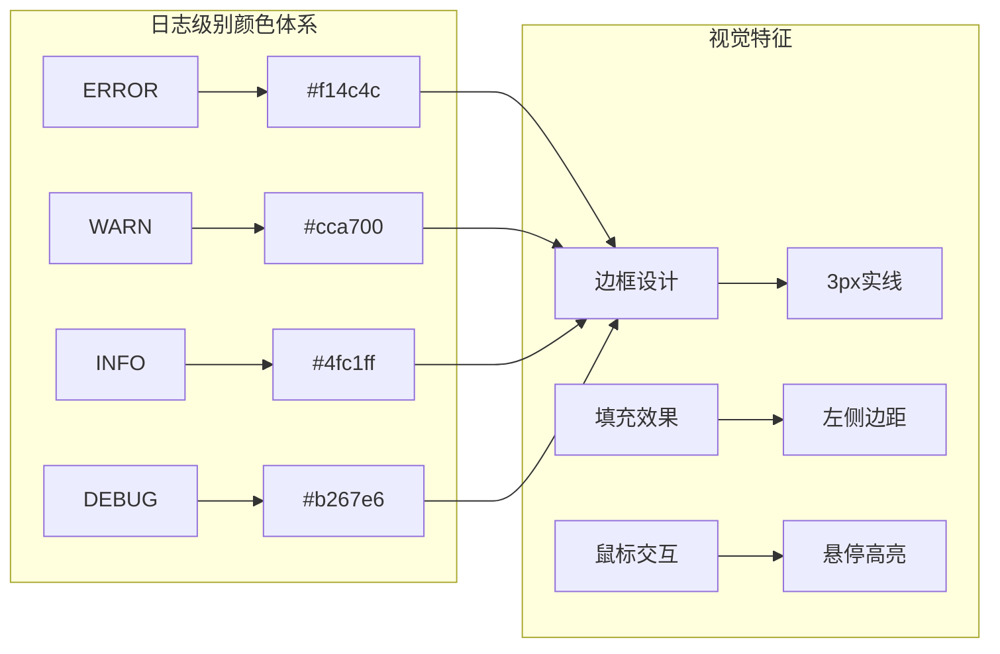
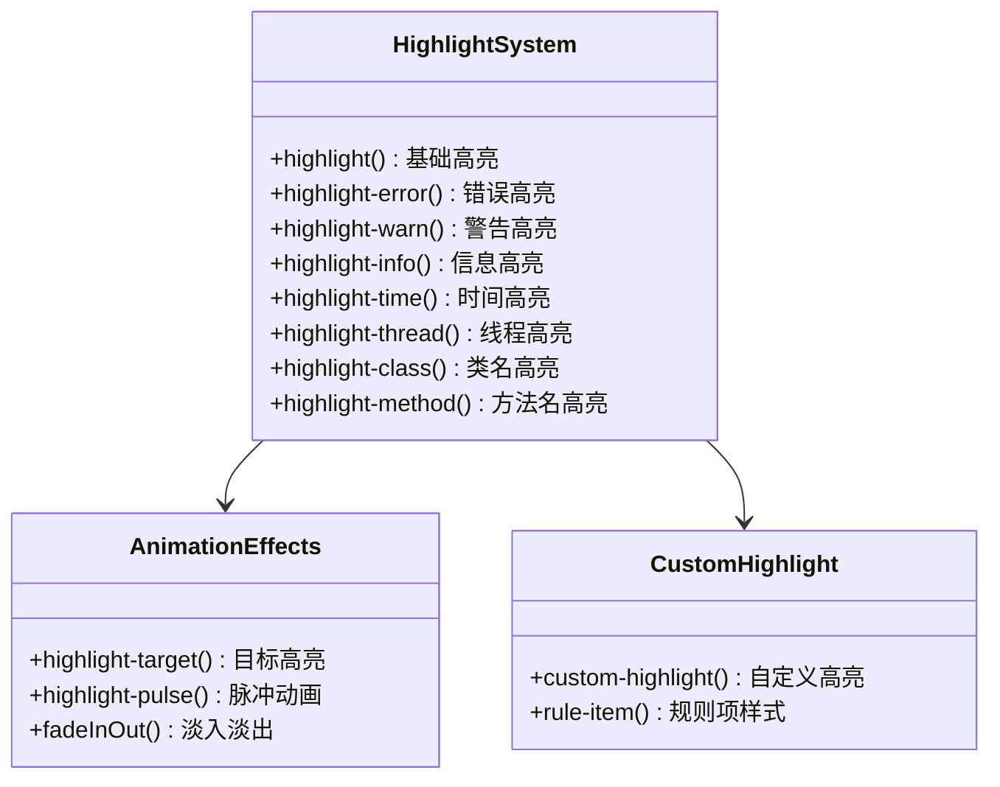
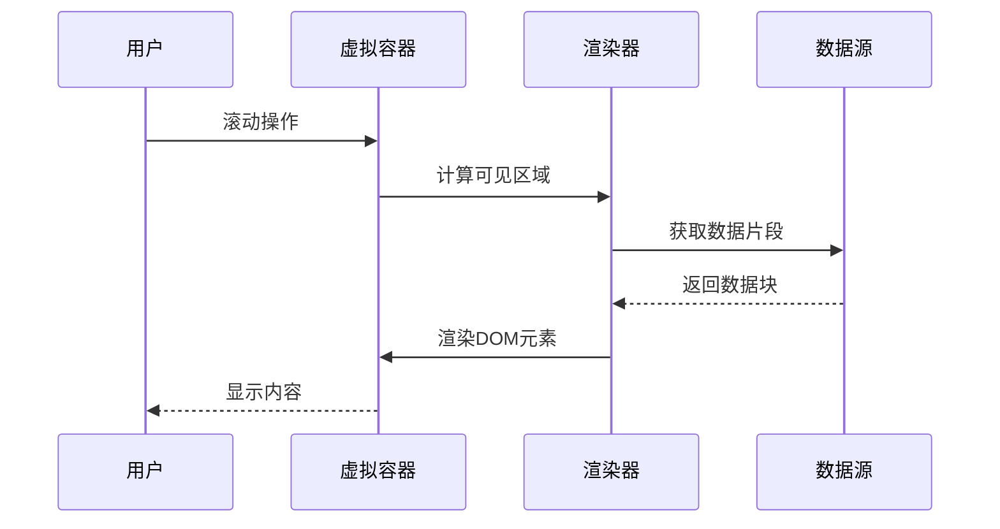
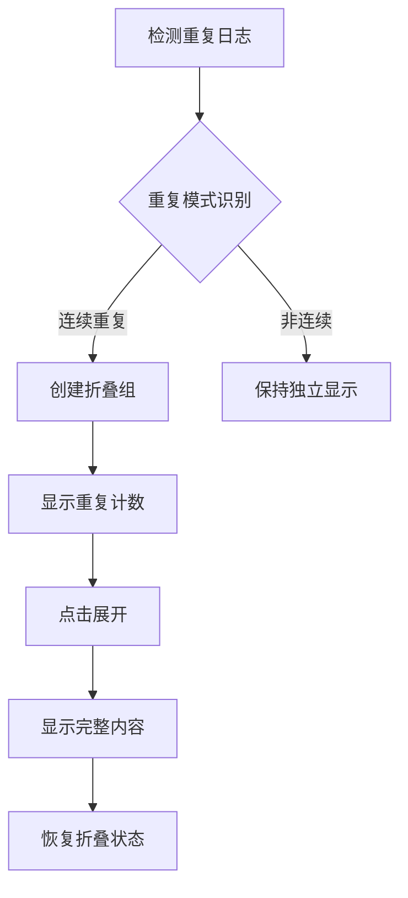
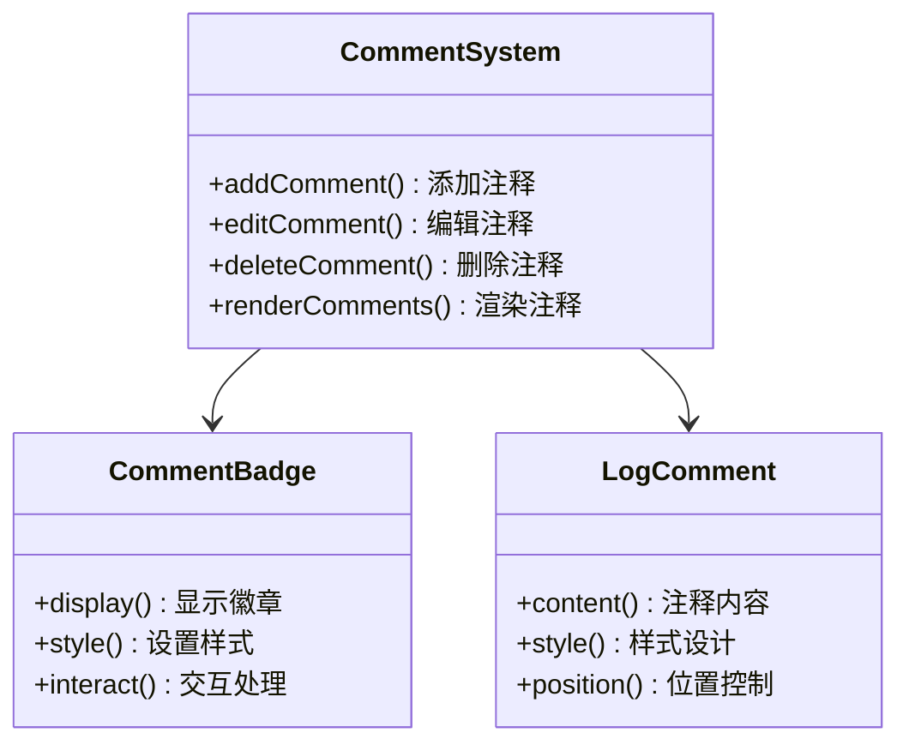
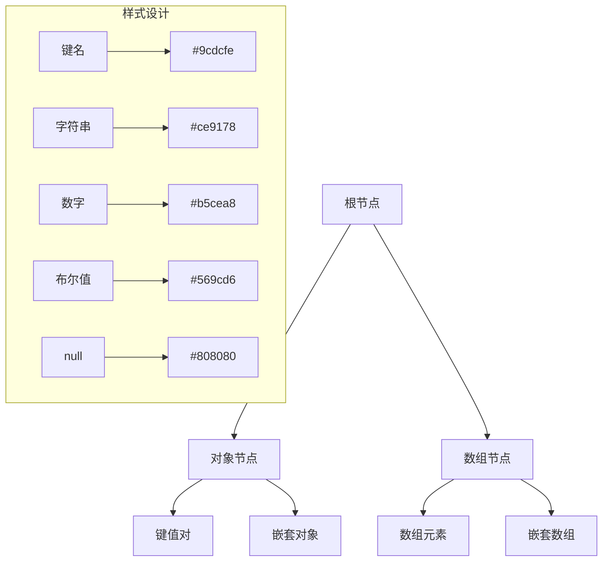

# 样式设计与主题适配

<cite>
**本文档引用的文件**
- [webview.html](file://src/webview.html)
- [package.json](file://package.json)
- [README.md](file://README.md)
</cite>

## 目录
1. [概述](#概述)
2. [VSCode主题变量系统](#vscode主题变量系统)
3. [日志级别颜色标记设计](#日志级别颜色标记设计)
4. [高亮样式与动画效果](#高亮样式与动画效果)
5. [虚拟滚动容器架构](#虚拟滚动容器架构)
6. [折叠日志与注释系统](#折叠日志与注释系统)
7. [JSON/XML树状展示](#jsonxml树状展示)
8. [自定义主题适配最佳实践](#自定义主题适配最佳实践)
9. [调试技巧与故障排除](#调试技巧与故障排除)
10. [总结](#总结)

## 概述

该日志查看器扩展通过精心设计的CSS样式系统实现了与VSCode编辑器主题的无缝集成。项目采用基于CSS自定义属性的现代化主题适配方案，支持深色和浅色主题，并提供了丰富的视觉反馈和交互效果。

### 核心设计理念

- **统一性**：所有组件严格遵循VSCode的设计语言
- **一致性**：使用标准化的颜色变量和间距规范
- **可访问性**：确保良好的对比度和视觉层次
- **性能**：优化的CSS结构支持大规模数据渲染

## VSCode主题变量系统

### 主题变量映射机制

项目广泛使用VSCode提供的CSS自定义属性来实现主题适配：



**图表来源**
- [webview.html](file://src/webview.html#L14-L89)

### 关键变量使用表

| 变量名称 | 用途 | 默认值 | 主题影响 |
|---------|------|--------|----------|
| `--vscode-editor-background` | 主背景色 | #1E1E1E | 深色/浅色模式切换 |
| `--vscode-editor-foreground` | 主文字色 | #CCCCCC | 文字清晰度保证 |
| `--vscode-button-background` | 按钮背景 | #0E639C | 操作元素突出 |
| `--vscode-button-foreground` | 按钮文字 | #FFFFFF | 对比度优化 |
| `--vscode-input-background` | 输入框背景 | #3C3C3C | 输入区域区分 |
| `--vscode-panel-border` | 面板边框 | #444444 | 区域边界标识 |
| `--vscode-descriptionForeground` | 描述文字 | #CCCCCC | 辅助信息显示 |

**章节来源**
- [webview.html](file://src/webview.html#L14-L89)

### 动态主题适配策略

系统通过以下机制实现动态主题适配：

1. **CSS变量继承**：所有组件继承根级主题变量
2. **渐变色支持**：使用`rgba()`函数实现半透明效果
3. **悬停状态**：通过`:hover`伪类实现交互反馈
4. **过渡动画**：平滑的主题切换效果

## 日志级别颜色标记设计

### 颜色体系架构

项目为四种主要日志级别设计了专门的颜色标记系统：



**图表来源**
- [webview.html](file://src/webview.html#L193-L209)

### 边框设计原理

每种日志级别采用独特的边框设计：

- **ERROR级别**：红色边框 (#f14c4c)，醒目警示
- **WARN级别**：黄色边框 (#cca700)，警告提醒  
- **INFO级别**：蓝色边框 (#4fc1ff)，信息标识
- **DEBUG级别**：紫色边框 (#b267e6)，调试标记

### 边框样式实现

```css
/* ERROR级别边框 */
.log-line.error {
    border-left: 3px solid #f14c4c;
    padding-left: 5px;
}

/* WARN级别边框 */
.log-line.warn {
    border-left: 3px solid #cca700;
    padding-left: 5px;
}

/* INFO级别边框 */
.log-line.info {
    border-left: 3px solid #4fc1ff;
    padding-left: 5px;
}

/* DEBUG级别边框 */
.log-line.debug {
    border-left: 3px solid #b267e6;
    padding-left: 5px;
}
```

**章节来源**
- [webview.html](file://src/webview.html#L193-L209)

## 高亮样式与动画效果

### 高亮类系统

项目实现了多层次的高亮样式系统：



**图表来源**
- [webview.html](file://src/webview.html#L420-L485)

### highlight类设计

基础高亮样式采用统一的设计原则：

- **背景色**：鲜艳但不刺眼的颜色
- **文字色**：对比度高的文字颜色
- **圆角**：2px圆角提升视觉舒适度
- **字体**：加粗强调重要性

### 动画效果系统

#### highlight-pulse脉冲动画

```css
@keyframes highlight-pulse {
    0%, 100% { background-color: rgba(255, 193, 7, 0.3); }
    50% { background-color: rgba(255, 193, 7, 0.6); }
}
```

该动画为目标高亮提供视觉焦点：
- **持续时间**：0.5秒
- **缓动函数**：ease-in-out
- **透明度变化**：从30%到60%
- **应用场景**：搜索结果定位、书签标记

#### fadeInOut淡入淡出效果

用于临时提示和状态变化：
- **起始状态**：完全透明，向上偏移10px
- **中间状态**：完全可见，居中显示
- **结束状态**：完全透明，向上偏移10px

**章节来源**
- [webview.html](file://src/webview.html#L236-L252)

## 虚拟滚动容器架构

### 虚拟滚动实现原理



**图表来源**
- [webview.html](file://src/webview.html#L1728-L1760)

### 容器设计原则

虚拟滚动容器采用以下设计原则：

1. **内存效率**：只渲染可见区域的内容
2. **性能优化**：避免大量DOM节点创建
3. **用户体验**：保持流畅的滚动体验
4. **响应式布局**：适应不同屏幕尺寸

### 分页加载机制

系统支持灵活的分页配置：

- **默认页大小**：100行
- **可选页大小**：50、100、200、500、1000行
- **智能加载**：滚动时动态加载内容
- **缓存策略**：已加载内容保持在内存中

**章节来源**
- [webview.html](file://src/webview.html#L367-L417)

## 折叠日志与注释系统

### 折叠日志设计

折叠日志系统提供重复内容的智能压缩：



**图表来源**
- [webview.html](file://src/webview.html#L214-L234)

### 折叠样式设计

折叠日志采用特殊的视觉标识：

- **背景色**：半透明紫色 (#8b5cf6)
- **边框**：紫色实线
- **悬停效果**：背景色加深
- **计数器**：圆形徽章显示重复次数

### 注释系统架构

注释系统提供日志行的附加说明功能：



**图表来源**
- [webview.html](file://src/webview.html#L502-L528)

**章节来源**
- [webview.html](file://src/webview.html#L214-L234)
- [webview.html](file://src/webview.html#L502-L528)

## JSON/XML树状展示

### 树状结构设计原则

JSON/XML解析功能采用递归树状结构展示：



**图表来源**
- [webview.html](file://src/webview.html#L3735-L3866)

### 语法高亮系统

不同数据类型采用不同的高亮颜色：

| 数据类型 | 高亮颜色 | 字体样式 | 用途 |
|---------|----------|----------|------|
| 键名 | #9cdcfe | 加粗 | JSON键标识 |
| 字符串 | #ce9178 | 常规 | 文本内容 |
| 数字 | #b5cea8 | 常规 | 数值数据 |
| 布尔值 | #569cd6 | 加粗 | 布尔标志 |
| null | #808080 | 斜体 | 空值标识 |

### 折叠控制机制

树状结构支持层级折叠：

- **默认折叠**：深度>1的节点默认折叠
- **展开按钮**：点击箭头图标展开/折叠
- **视觉反馈**：悬停时显示背景色
- **状态持久化**：记住用户的展开状态

**章节来源**
- [webview.html](file://src/webview.html#L3735-L3866)

## 自定义主题适配最佳实践

### 主题变量使用指南

1. **优先使用VSCode变量**
   ```css
   /* 推荐：使用VSCode主题变量 */
   background-color: var(--vscode-editor-background);
   
   /* 避免：硬编码颜色值 */
   background-color: #1E1E1E;
   ```

2. **合理使用透明度**
   ```css
   /* 推荐：半透明效果 */
   background-color: rgba(139, 92, 246, 0.1);
   
   /* 避免：过度使用透明度 */
   background-color: rgba(0, 0, 0, 0.9);
   ```

3. **保持对比度**
   - 文字与背景对比度至少4.5:1
   - 重要元素使用高对比度色彩
   - 背景色与文字色形成明显区分

### 响应式设计原则

1. **弹性布局**：使用Flexbox和Grid布局
2. **相对单位**：优先使用em、rem、百分比
3. **断点设计**：针对不同屏幕尺寸优化布局
4. **触摸友好**：确保交互元素适合触摸操作

### 性能优化策略

1. **CSS压缩**：移除不必要的空白和注释
2. **选择器优化**：避免过于复杂的选择器
3. **动画性能**：使用transform和opacity动画
4. **资源加载**：合理组织CSS文件结构

## 调试技巧与故障排除

### 主题适配调试

1. **开发者工具检查**
   - 使用VSCode内置的Webview开发工具
   - 检查CSS变量的实际值
   - 验证主题切换效果

2. **颜色对比度验证**
   - 使用在线对比度检查工具
   - 确保符合WCAG 2.1 AA标准
   - 测试不同主题下的可读性

3. **响应式测试**
   - 使用VSCode的Webview调试功能
   - 模拟不同屏幕尺寸
   - 验证布局适应性

### 常见问题解决

1. **主题变量不生效**
   - 检查CSS变量拼写
   - 确认变量作用域
   - 验证VSCode版本兼容性

2. **动画效果异常**
   - 检查浏览器兼容性
   - 验证CSS动画语法
   - 测试硬件加速支持

3. **性能问题**
   - 使用Chrome DevTools分析
   - 检查DOM节点数量
   - 优化CSS选择器复杂度

### 开发环境配置

推荐的开发环境设置：

- **VSCode版本**：1.75.0+
- **扩展开发**：启用Webview开发模式
- **调试工具**：使用内置的Webview调试功能
- **热重载**：配置自动刷新机制

## 总结

该日志查看器扩展通过精心设计的样式系统实现了与VSCode编辑器主题的完美融合。项目的核心优势包括：

### 技术亮点

1. **主题系统完整性**：全面覆盖VSCode主题变量
2. **视觉设计一致性**：统一的色彩体系和交互模式
3. **性能优化**：虚拟滚动和智能渲染
4. **用户体验**：丰富的动画效果和直观的操作反馈

### 设计哲学

- **以用户为中心**：注重可读性和易用性
- **以性能为导向**：优化大数据量场景下的表现
- **以扩展性为前提**：支持自定义高亮规则
- **以兼容性为基础**：确保跨平台稳定性

### 应用价值

该项目为VSCode扩展开发提供了优秀的样式设计参考，展示了如何在Webview环境中实现高质量的主题适配和视觉交互效果。其设计理念和实现方案对于类似项目的开发具有重要的借鉴意义。

通过深入理解和应用这些设计原则，开发者可以创建出既美观又实用的VSCode扩展，为用户提供卓越的开发体验。