# 界面布局与结构

<cite>
**本文档引用的文件**
- [webview.html](file://src/webview.html)
- [package.json](file://package.json)
- [README.md](file://README.md)
</cite>

## 目录
1. [概述](#概述)
2. [HTML结构组织](#html结构组织)
3. [主要界面组件](#主要界面组件)
4. [CSS布局策略](#css布局策略)
5. [响应式设计与自适应行为](#响应式设计与自适应行为)
6. [语义化设计原则](#语义化设计原则)
7. [JavaScript动态控制](#javascript动态控制)
8. [可访问性考虑](#可访问性考虑)
9. [总结](#总结)

## 概述

Webview.html是VSCode扩展中用于展示大型日志文件的核心界面组件。该界面采用现代化的Web技术栈，实现了高性能的日志查看、搜索、过滤和分析功能。整体布局遵循VSCode的设计语言，使用Flexbox布局系统，确保在各种屏幕尺寸下的良好显示效果。

## HTML结构组织

### 整体架构层次

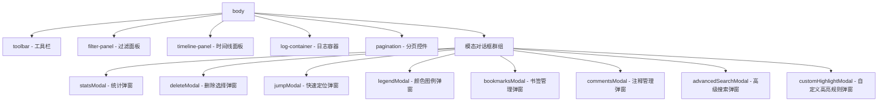

**图表来源**
- [webview.html](file://src/webview.html#L660-L770)

### 容器分区职责

| 容器名称 | ID标识 | 主要职责 | 关键特性 |
|---------|--------|----------|----------|
| 工具栏 | toolbar | 显示文件信息和搜索功能 | 包含文件名、大小、行数统计和搜索控件 |
| 过滤面板 | filter-panel | 日志级别过滤和重复日志控制 | 多级别过滤、折叠模式开关 |
| 时间线面板 | timeline-panel | 时间分布可视化 | Canvas绘制的时间线图表 |
| 日志容器 | log-container | 日志内容展示区域 | 虚拟滚动、高亮显示、折叠功能 |
| 分页控件 | pagination | 页面导航和显示控制 | 首页、上一页、下一页、末页按钮 |

**章节来源**
- [webview.html](file://src/webview.html#L660-L770)

## 主要界面组件

### 工具栏（Toolbar）

工具栏位于界面顶部，提供核心的文件信息展示和搜索功能。

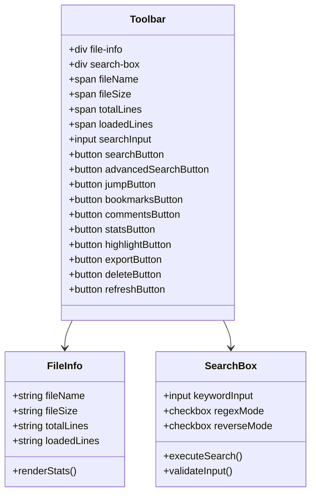

**图表来源**
- [webview.html](file://src/webview.html#L661-L690)

#### 功能特性
- **文件信息展示**：实时显示当前加载的日志文件名、文件大小、总行数和已加载行数
- **搜索功能**：支持关键词搜索、正则表达式模式和反向搜索
- **快捷操作**：集成了书签、注释、统计、高亮规则等常用功能按钮

**章节来源**
- [webview.html](file://src/webview.html#L661-L690)

### 过滤面板（Filter Panel）

过滤面板提供灵活的日志级别过滤和重复日志处理功能。

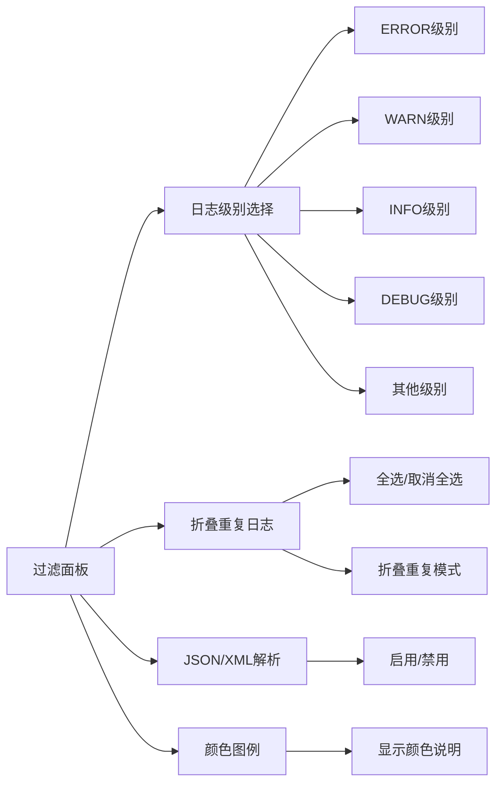

**图表来源**
- [webview.html](file://src/webview.html#L693-L729)

#### 核心功能
- **多级别过滤**：支持同时选择多个日志级别进行过滤
- **全选机制**：提供"全选"复选框的三态控制（全选、部分选中、全不选）
- **折叠模式**：智能识别并折叠连续重复的日志行
- **结构化数据解析**：自动解析JSON/XML格式的日志内容

**章节来源**
- [webview.html](file://src/webview.html#L693-L729)

### 时间线面板（Timeline Panel）

时间线面板通过可视化图表展示日志的时间分布特征。

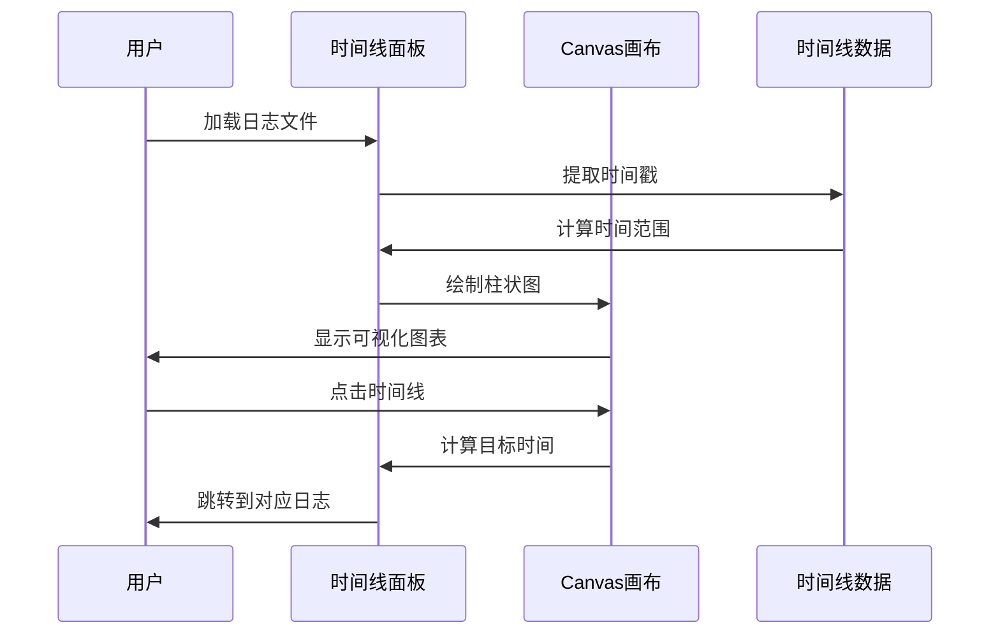

**图表来源**
- [webview.html](file://src/webview.html#L731-L743)

#### 技术实现
- **Canvas绘制**：使用HTML5 Canvas API绘制时间分布柱状图
- **多级别着色**：根据日志级别（ERROR、WARN、INFO、DEBUG）使用不同颜色
- **交互功能**：支持点击时间线跳转到对应时间段的日志

**章节来源**
- [webview.html](file://src/webview.html#L731-L743)

### 日志容器（Log Container）

日志容器是界面的核心区域，负责展示经过处理的日志内容。

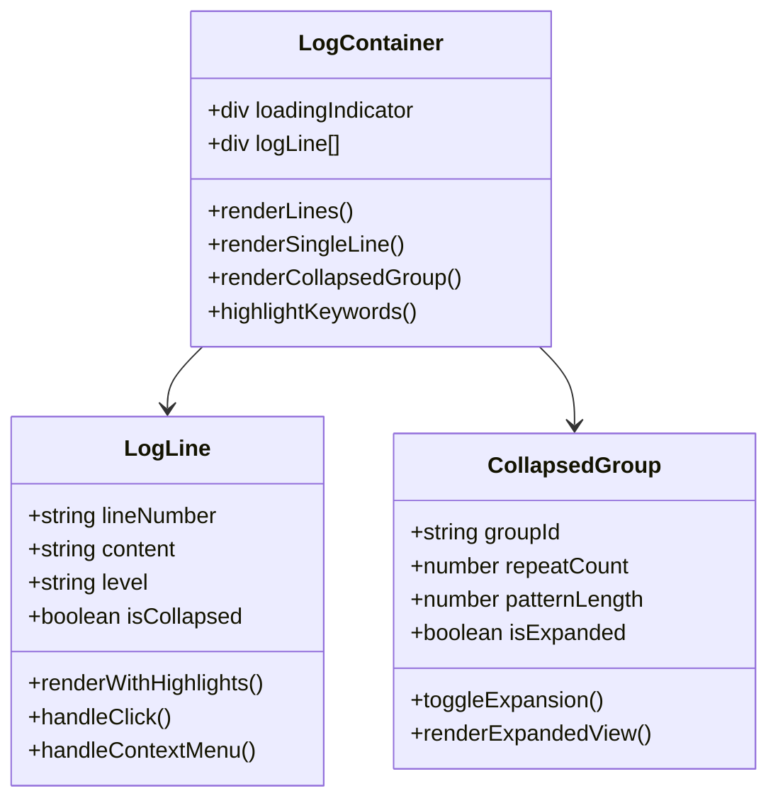

**图表来源**
- [webview.html](file://src/webview.html#L745-L748)

#### 高级特性
- **虚拟滚动**：只渲染可见区域的日志行，支持超大文件的流畅浏览
- **智能高亮**：自动识别并高亮日志级别、时间戳、JSON/XML结构
- **折叠功能**：支持单行和多行模式的重复日志折叠
- **右键菜单**：提供复制、书签、注释等上下文操作

**章节来源**
- [webview.html](file://src/webview.html#L745-L748)

### 分页控件（Pagination）

分页控件提供灵活的页面导航和显示控制功能。

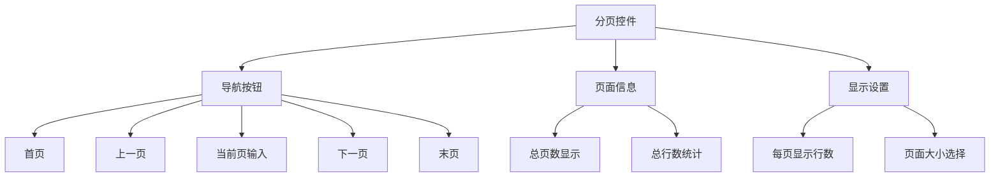

**图表来源**
- [webview.html](file://src/webview.html#L749-L770)

#### 功能特点
- **动态计算**：根据内容自动计算总页数，支持估算模式
- **智能加载**：滚动到底部时自动加载更多数据
- **灵活配置**：支持50-1000行的页面大小自定义

**章节来源**
- [webview.html](file://src/webview.html#L749-L770)

## CSS布局策略

### Flexbox布局系统

整个界面采用Flexbox布局，确保组件间的灵活排列和自适应。

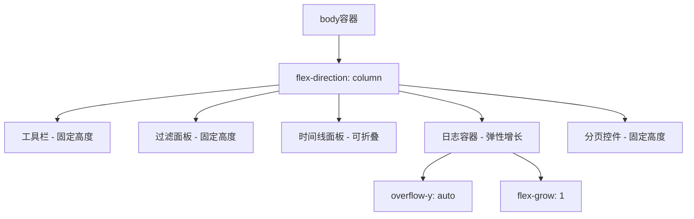

**图表来源**
- [webview.html](file://src/webview.html#L15-L23)

#### 关键布局特性
- **垂直堆叠**：主要组件采用垂直方向的Flex布局
- **弹性增长**：日志容器使用`flex-grow: 1`占据剩余空间
- **固定尺寸**：工具栏、过滤面板和分页控件保持固定高度

**章节来源**
- [webview.html](file://src/webview.html#L15-L23)

### Overflow处理策略

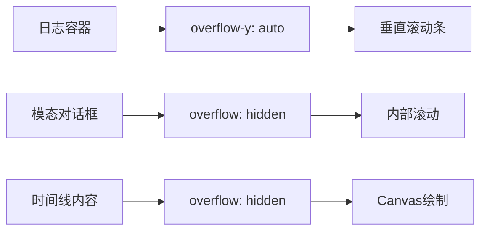

**图表来源**
- [webview.html](file://src/webview.html#L80-L85)
- [webview.html](file://src/webview.html#L147-L148)

#### 实现细节
- **日志容器**：使用`overflow-y: auto`实现垂直滚动
- **模态对话框**：外部容器隐藏滚动条，内部内容可滚动
- **时间线面板**：内容区域隐藏溢出，Canvas绘制不受影响

**章节来源**
- [webview.html](file://src/webview.html#L80-L85)
- [webview.html](file://src/webview.html#L147-L148)

### 响应式断点处理

虽然VSCode WebView环境相对固定，但仍考虑了以下响应式策略：

| 断点条件 | 处理策略 | 影响组件 |
|---------|----------|----------|
| 宽度 < 800px | 搜索框换行 | 工具栏搜索区域 |
| 宽度 < 600px | 按钮图标化 | 工具栏功能按钮 |
| 高度 < 400px | 时间线隐藏 | 时间线面板 |
| 高度 < 300px | 分页控件简化 | 分页区域 |

**章节来源**
- [webview.html](file://src/webview.html#L4-L5)

## 语义化设计原则

### 语义化HTML结构

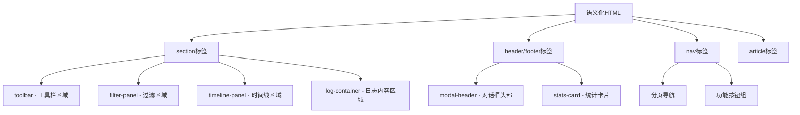

**图表来源**
- [webview.html](file://src/webview.html#L660-L770)

### ARIA属性支持

界面组件包含了适当的ARIA属性以提升可访问性：

```html
<!-- 示例：时间线面板 -->
<div class="timeline-panel" role="region" aria-label="时间线导航">
    <div class="timeline-header" role="button" tabindex="0" aria-expanded="true">
        <span>📈 时间线导航</span>
    </div>
</div>
```

**章节来源**
- [webview.html](file://src/webview.html#L731-L743)

## JavaScript动态控制

### ID和类名映射

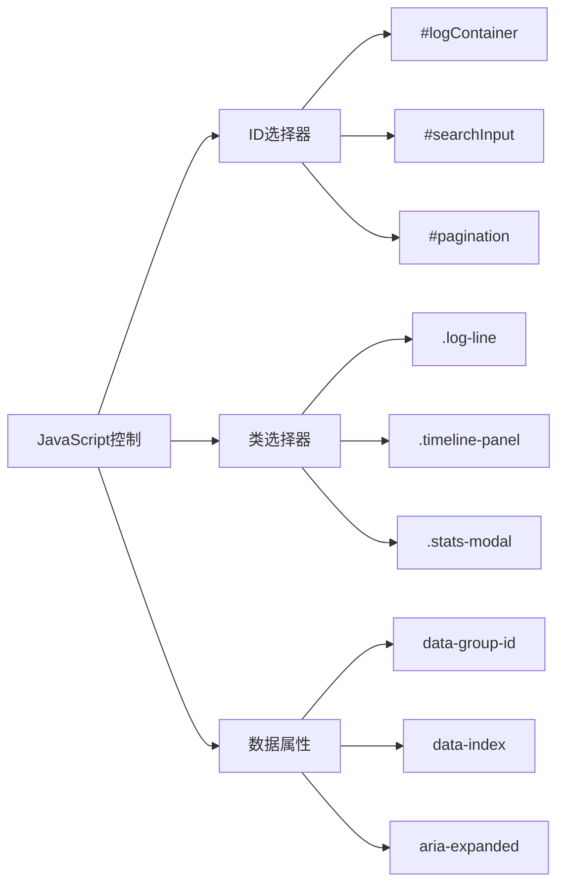

**图表来源**
- [webview.html](file://src/webview.html#L1164-L1190)

### 动态状态管理

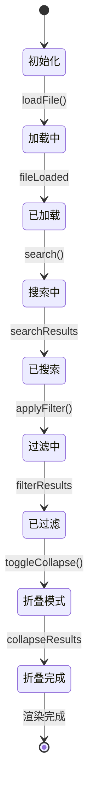

**图表来源**
- [webview.html](file://src/webview.html#L1189-L1215)

### 事件驱动架构

界面采用事件驱动的方式处理用户交互：

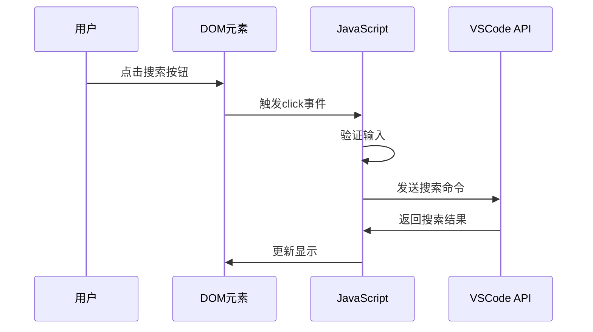

**图表来源**
- [webview.html](file://src/webview.html#L1189-L1215)

**章节来源**
- [webview.html](file://src/webview.html#L1164-L1190)

## 可访问性考虑

### 键盘导航支持

界面提供了完整的键盘导航支持：

| 键盘快捷键 | 功能 | 实现位置 |
|-----------|------|----------|
| ←/PageUp | 上一页 | 分页导航 |
| →/PageDown | 下一页 | 分页导航 |
| Home | 首页 | 分页导航 |
| End | 末页 | 分页导航 |
| Enter | 执行搜索 | 搜索输入框 |
| Ctrl+Enter | 确认注释 | 注释输入框 |

**章节来源**
- [webview.html](file://src/webview.html#L4156-L4174)

### 屏幕阅读器支持

- **语义化标签**：使用适当的HTML语义化标签
- **ARIA属性**：为交互元素添加ARIA属性
- **焦点管理**：合理管理键盘焦点顺序
- **状态通知**：通过Toast消息通知重要状态变化

### 颜色对比度

界面使用VSCode的主题颜色变量，确保：
- **高对比度**：文本与背景颜色符合WCAG AA标准
- **主题适配**：支持VSCode的明暗主题切换
- **颜色无障碍**：避免仅依赖颜色传达信息

**章节来源**
- [webview.html](file://src/webview.html#L8-L18)

## 总结

Webview.html的界面布局与结构体现了现代Web应用的最佳实践：

### 设计优势
1. **模块化架构**：清晰的功能分区，便于维护和扩展
2. **响应式布局**：Flexbox布局确保良好的自适应性
3. **性能优化**：虚拟滚动和智能加载提升大文件处理能力
4. **用户体验**：丰富的交互功能和直观的操作界面

### 技术特色
1. **语义化设计**：合理的HTML结构和ARIA支持
2. **动态控制**：灵活的JavaScript事件驱动架构
3. **可访问性**：全面的键盘导航和屏幕阅读器支持
4. **主题适配**：完美集成VSCode的设计语言

这种设计不仅满足了大型日志文件查看的专业需求，也为用户提供了优秀的使用体验，是VSCode扩展开发中界面设计的优秀范例。