# 高级功能实现

<cite>
**本文档引用的文件**
- [webview.html](file://src/webview.html)
- [logViewerPanel.ts](file://src/logViewerPanel.ts)
- [extension.ts](file://src/extension.ts)
- [package.json](file://package.json)
</cite>

## 目录
1. [简介](#简介)
2. [项目架构概览](#项目架构概览)
3. [时间线Canvas绘图逻辑](#时间线canvas绘图逻辑)
4. [书签与注释UI展示](#书签与注释ui展示)
5. [自定义高亮规则配置界面](#自定义高亮规则配置界面)
6. [统计信息模态框](#统计信息模态框)
7. [颜色图例弹窗](#颜色图例弹窗)
8. [模态框管理系统](#模态框管理系统)
9. [性能优化与用户体验](#性能优化与用户体验)
10. [总结](#总结)

## 简介

本文档详细分析了大日志文件查看器扩展中webview.html的高级功能实现。该项目是一个基于VS Code的大型日志文件查看工具，提供了丰富的交互功能，包括时间线可视化、书签管理、注释系统、自定义高亮规则和统计分析等核心特性。

## 项目架构概览

项目采用典型的VS Code扩展架构，主要由以下组件构成：

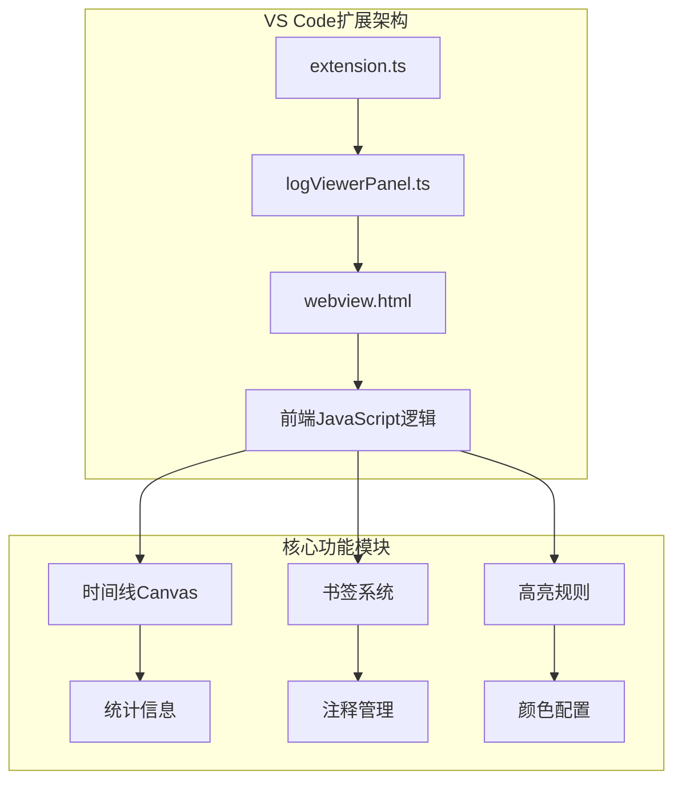

**图表来源**
- [extension.ts](file://src/extension.ts#L1-L116)
- [logViewerPanel.ts](file://src/logViewerPanel.ts#L1-L510)
- [webview.html](file://src/webview.html#L1-L4272)

**章节来源**
- [extension.ts](file://src/extension.ts#L1-L116)
- [logViewerPanel.ts](file://src/logViewerPanel.ts#L1-L510)

## 时间线Canvas绘图逻辑

### 核心实现原理

时间线功能是该项目最具特色的高级功能之一，通过Canvas API实现了直观的日志时间分布可视化。

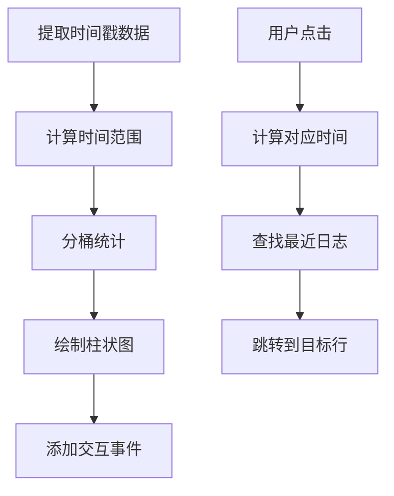

**图表来源**
- [webview.html](file://src/webview.html#L2741-L2906)

### 数据处理与统计

时间线功能的核心算法包括：

1. **时间戳提取**：从日志行中提取时间信息
2. **时间范围计算**：确定最小和最大时间戳
3. **分桶策略**：将时间范围均匀分割为20个时间段
4. **级别统计**：统计每个时间段内各日志级别的分布

### Canvas绘制流程

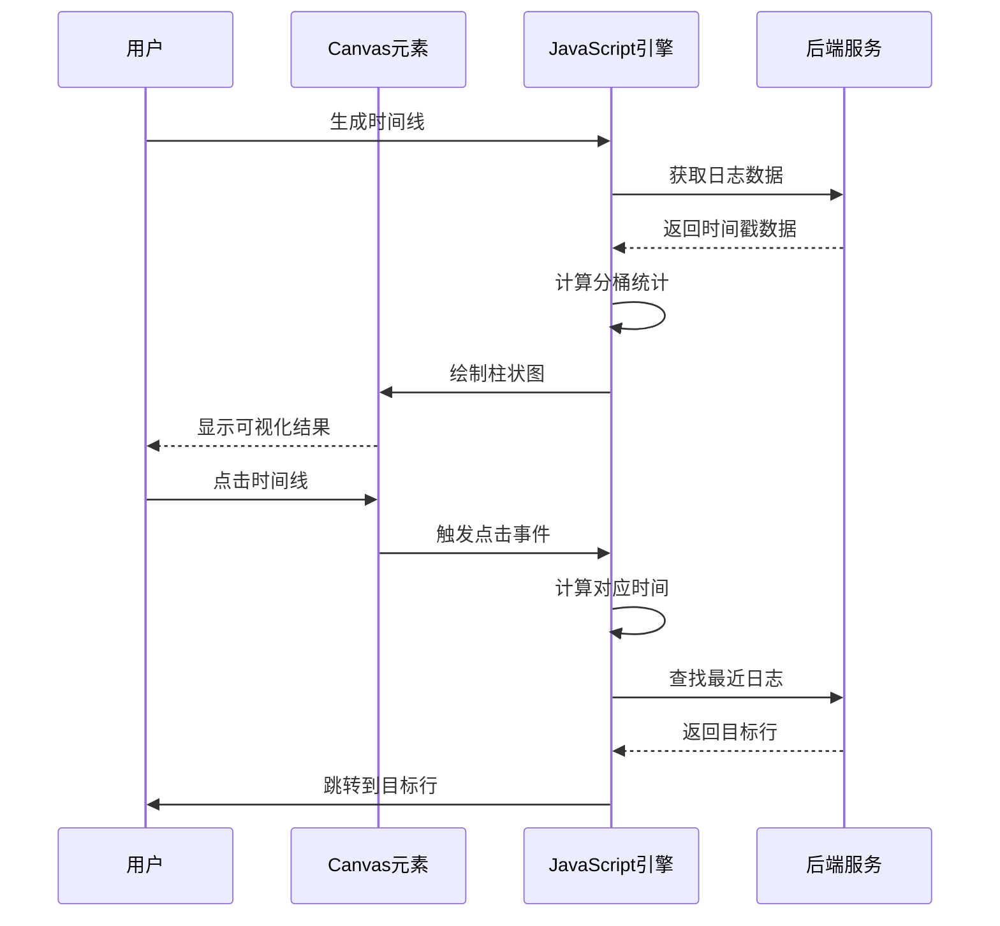

**图表来源**
- [webview.html](file://src/webview.html#L2741-L2906)

### 交互功能实现

时间线提供以下交互功能：
- **点击跳转**：点击时间线任意位置可跳转到对应时间段的日志
- **悬停提示**：鼠标悬停显示详细的时间和日志统计信息
- **动态缩放**：支持不同时间范围的自适应显示

**章节来源**
- [webview.html](file://src/webview.html#L2741-L2906)

## 书签与注释UI展示

### 书签系统架构

书签功能提供了灵活的日志行标记和快速访问机制：

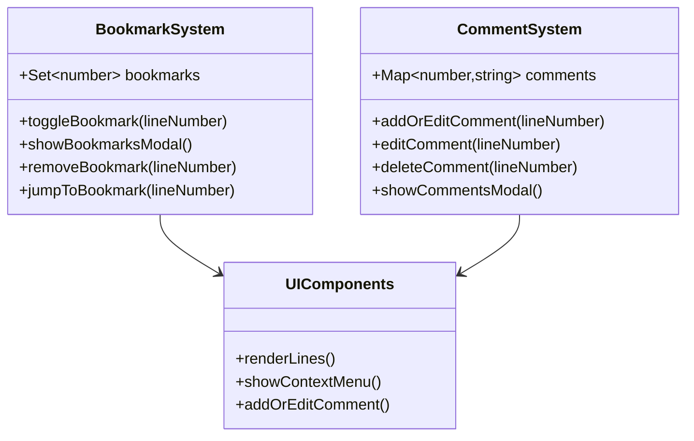

**图表来源**
- [webview.html](file://src/webview.html#L2149-L2207)
- [webview.html](file://src/webview.html#L2209-L2468)

### 注释功能实现

注释系统支持：
- **右键添加**：在日志行上右键即可添加或编辑注释
- **双击书签**：双击日志行可添加或移除书签
- **批量管理**：通过专门的模态框进行注释的批量查看和管理
- **持久化存储**：注释数据保存在浏览器本地存储中

### UI交互设计

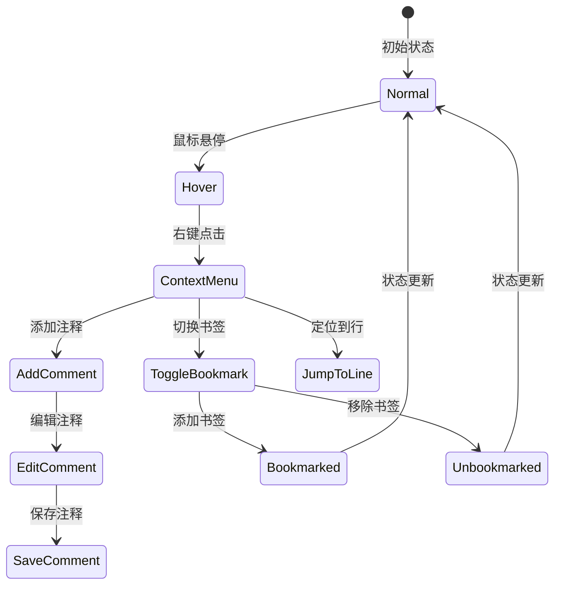

**图表来源**
- [webview.html](file://src/webview.html#L2496-L2628)

**章节来源**
- [webview.html](file://src/webview.html#L2149-L2468)

## 自定义高亮规则配置界面

### 规则系统架构

自定义高亮规则系统提供了强大的日志内容增强功能：

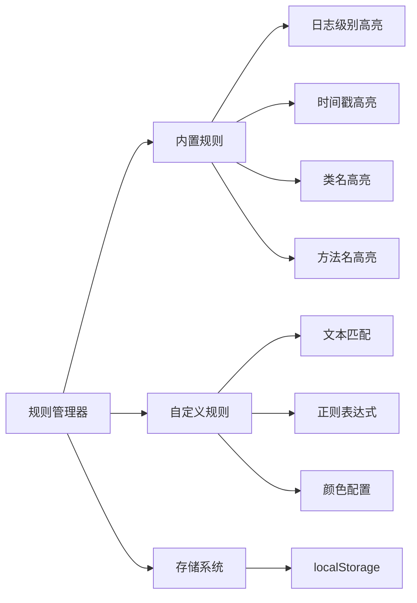

**图表来源**
- [webview.html](file://src/webview.html#L2213-L2258)
- [webview.html](file://src/webview.html#L3964-L4246)

### 规则配置功能

每个高亮规则包含以下属性：
- **名称**：规则的描述性名称
- **类型**：文本匹配或正则表达式
- **模式**：匹配内容或正则表达式
- **颜色**：背景色和文字颜色
- **状态**：启用或禁用
- **标识**：内置规则或自定义规则

### 动态高亮渲染

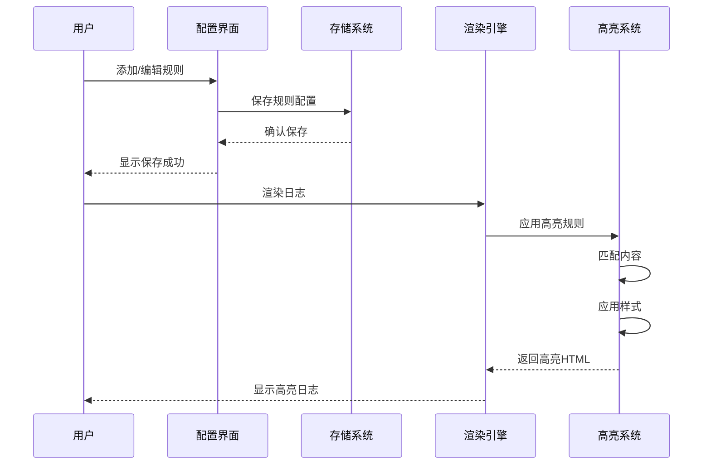

**图表来源**
- [webview.html](file://src/webview.html#L1866-L1902)

### 颜色配置系统

颜色配置功能支持：
- **实时预览**：配置过程中实时显示高亮效果
- **颜色选择器**：提供直观的颜色选择界面
- **对比度检查**：确保文字颜色与背景颜色有足够的对比度

**章节来源**
- [webview.html](file://src/webview.html#L3964-L4246)

## 统计信息模态框

### 数据收集与分析

统计信息模态框提供了全面的日志数据分析功能：

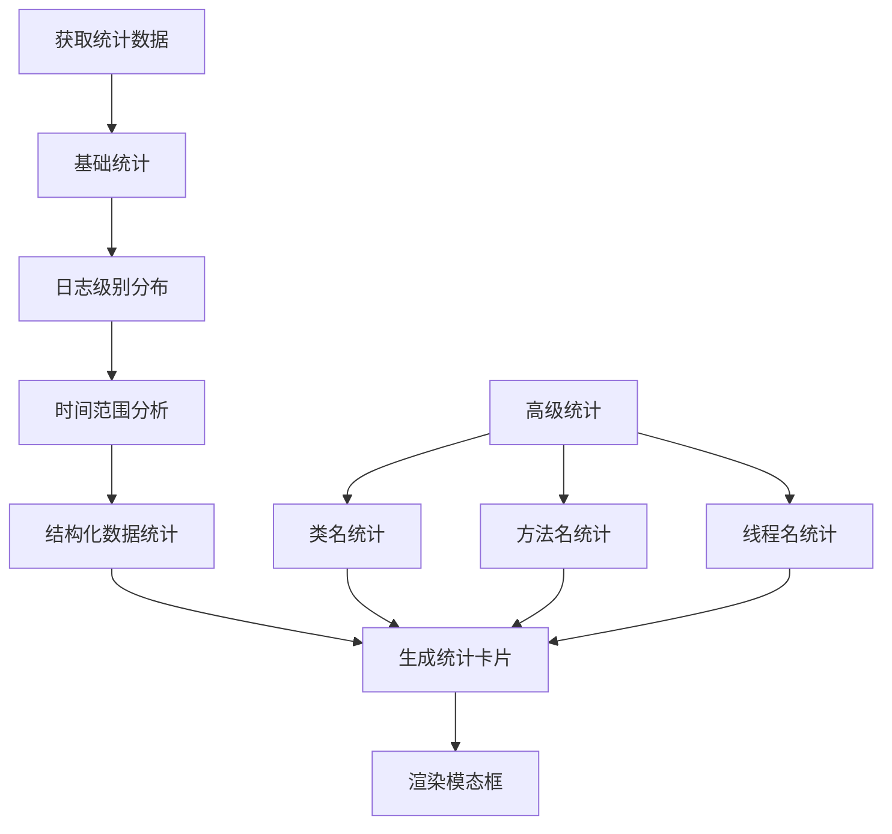

**图表来源**
- [webview.html](file://src/webview.html#L2023-L2142)

### 数据展示结构

统计信息以网格布局展示，包含以下核心指标：

| 统计类别 | 显示内容 | 功能特性 |
|---------|---------|---------|
| 基础统计 | 总行数、ERROR/WARN/INFO/DEBUG数量 | 点击筛选特定级别 |
| 时间范围 | 日志时间跨度 | 显示具体时间范围 |
| 类名统计 | 最活跃的类（Top 10） | 点击筛选相关日志 |
| 方法名统计 | 最常调用的方法（Top 10） | 点击筛选相关日志 |
| 线程统计 | 最活跃的线程（Top 10） | 点击筛选相关日志 |

### 导出功能触发机制

统计信息模态框集成了便捷的导出功能：

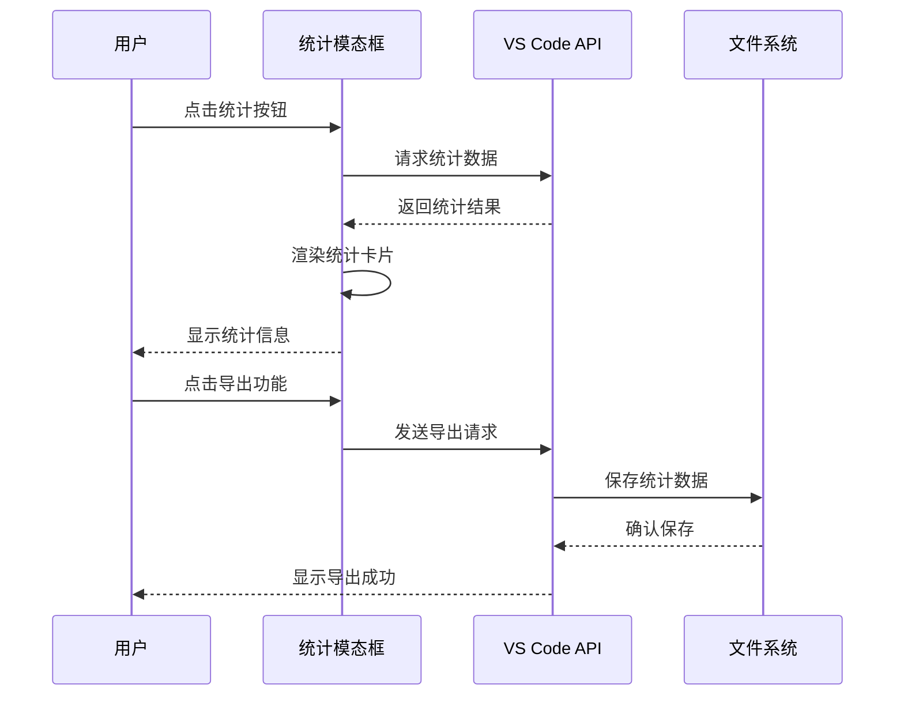

**图表来源**
- [webview.html](file://src/webview.html#L2023-L2142)

**章节来源**
- [webview.html](file://src/webview.html#L2023-L2142)

## 颜色图例弹窗

### 颜色体系设计

颜色图例系统为各种日志级别和高亮规则提供了统一的颜色规范：

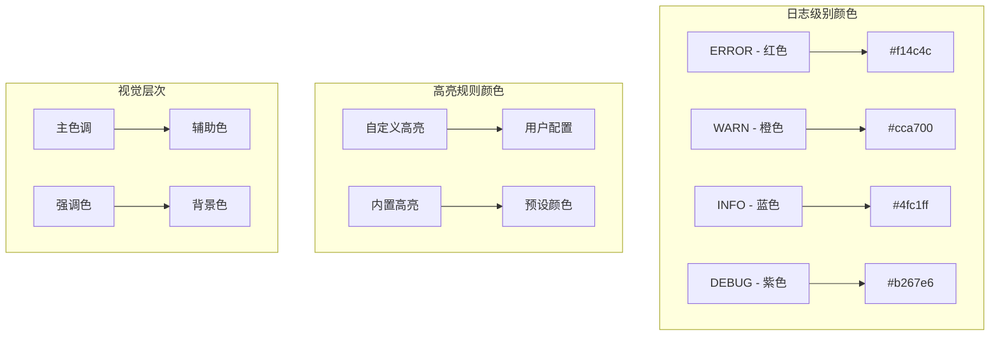

**图表来源**
- [webview.html](file://src/webview.html#L4238-L4246)

### 颜色配置管理

颜色图例弹窗提供了以下功能：
- **颜色预览**：实时显示颜色效果
- **颜色选择**：提供直观的颜色选择器
- **对比度检查**：确保文字可读性
- **主题适配**：自动适配VS Code主题

**章节来源**
- [webview.html](file://src/webview.html#L4238-L4246)

## 模态框管理系统

### 模态框架构设计

项目采用了统一的模态框管理系统，支持多种类型的弹窗：

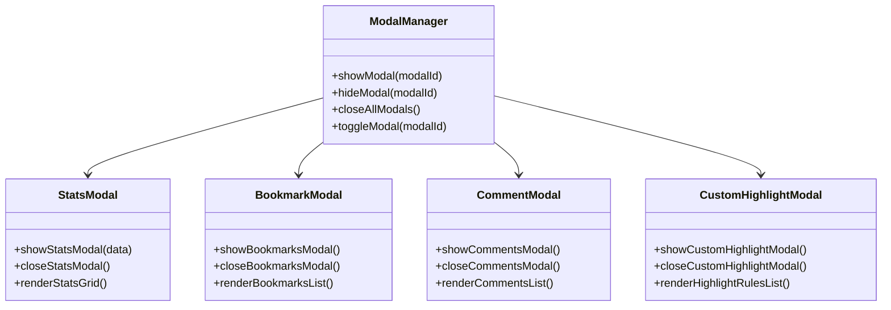

**图表来源**
- [webview.html](file://src/webview.html#L868-L1172)

### 动态内容生成

模态框系统支持动态内容生成，根据数据实时更新界面：

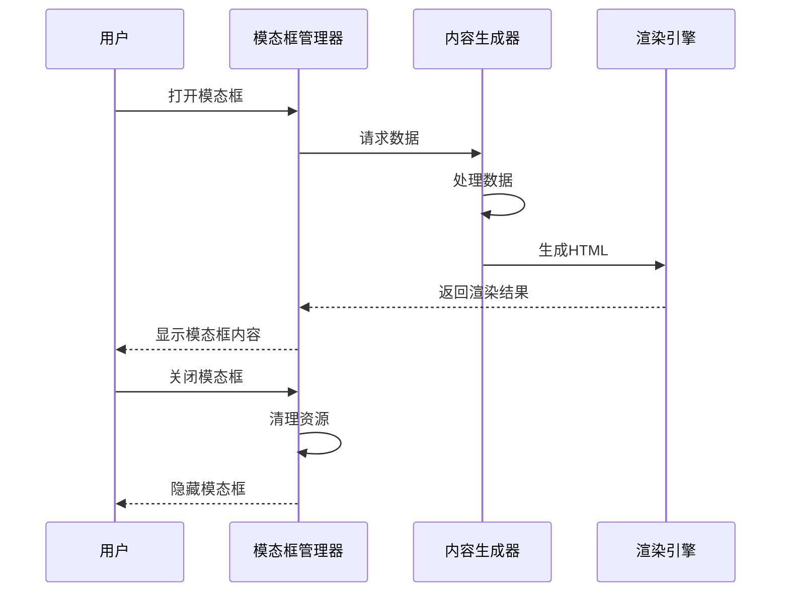

**图表来源**
- [webview.html](file://src/webview.html#L868-L1172)

### 用户输入验证

模态框系统包含了完善的用户输入验证机制：

| 输入类型 | 验证规则 | 错误处理 |
|---------|---------|---------|
| 时间输入 | 格式验证（YYYY-MM-DD HH:mm:ss） | 显示格式错误提示 |
| 行号输入 | 数值范围验证（>0） | 显示范围错误提示 |
| 正则表达式 | 语法验证 | 显示语法错误信息 |
| 颜色值 | HEX格式验证 | 显示无效颜色提示 |

**章节来源**
- [webview.html](file://src/webview.html#L868-L1172)

## 性能优化与用户体验

### 虚拟滚动与分页

为了处理大型日志文件，系统实现了高效的虚拟滚动和分页机制：

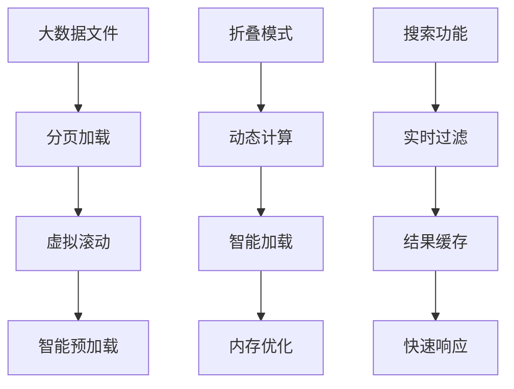

**图表来源**
- [webview.html](file://src/webview.html#L1325-L1433)
- [webview.html](file://src/webview.html#L1436-L1552)

### 用户体验优化

系统在多个方面提升了用户体验：
- **键盘快捷键**：支持Page Up/Down、Home、End等快捷键
- **平滑动画**：高亮跳转使用CSS动画效果
- **即时反馈**：操作结果即时显示提示信息
- **状态保持**：模态框状态在切换时保持不变

**章节来源**
- [webview.html](file://src/webview.html#L1325-L1552)

## 总结

大日志文件查看器扩展通过webview.html实现了丰富的高级功能，包括：

1. **时间线Canvas绘图**：直观展示日志时间分布
2. **书签与注释系统**：提供灵活的日志标记和管理功能
3. **自定义高亮规则**：支持复杂的内容匹配和样式定制
4. **统计信息模态框**：全面的日志数据分析和导出功能
5. **统一模态框管理**：一致的用户界面和交互体验

这些功能的实现展现了现代Web技术在VS Code扩展开发中的强大能力，为用户提供了专业级的日志分析工具。通过合理的架构设计和性能优化，系统能够高效处理大型日志文件，同时保持良好的用户体验。