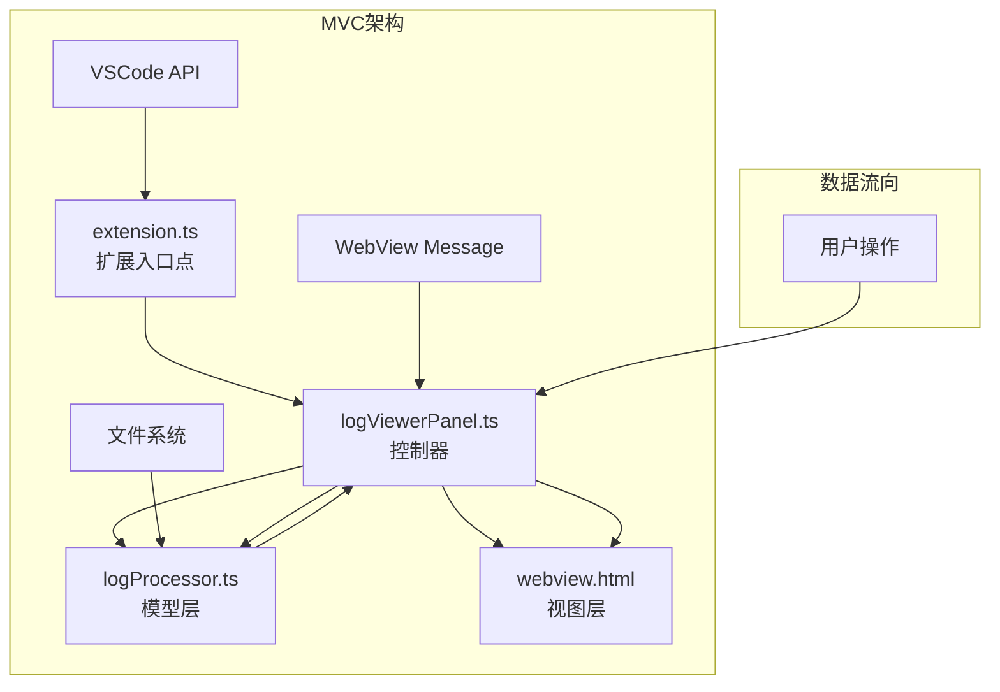
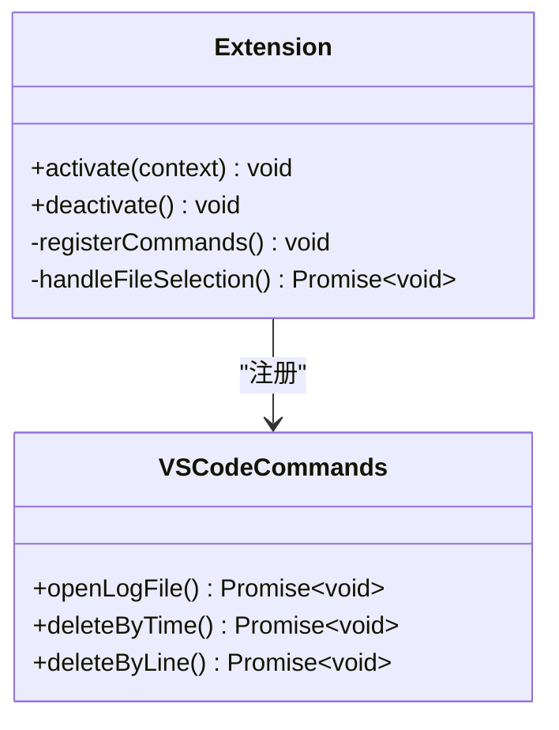
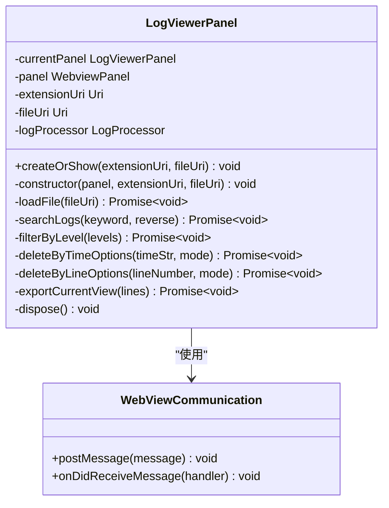
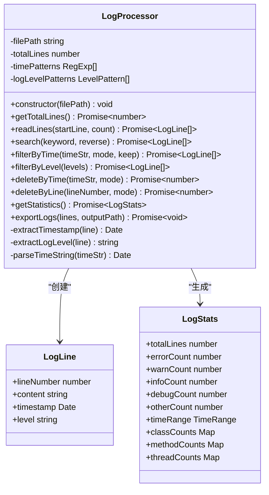
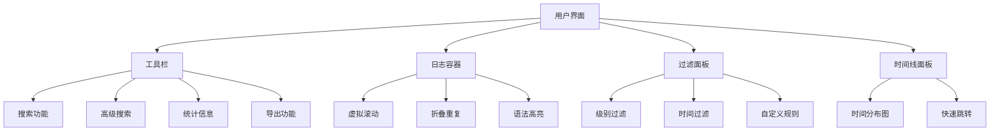
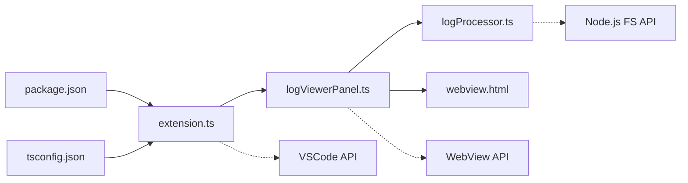
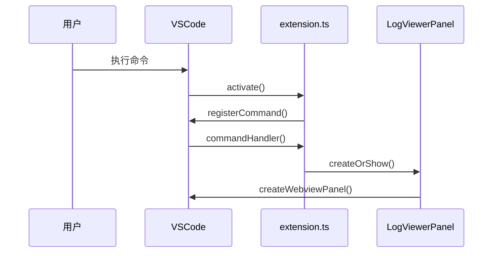
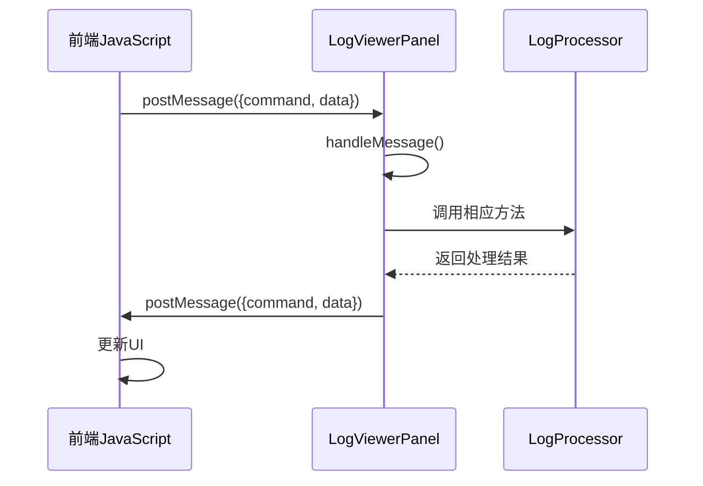
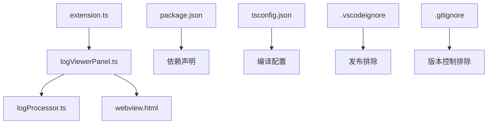

# 项目结构

<cite>
**本文档中引用的文件**
- [src/extension.ts](file://src/extension.ts)
- [src/logViewerPanel.ts](file://src/logViewerPanel.ts)
- [src/logProcessor.ts](file://src/logProcessor.ts)
- [src/webview.html](file://src/webview.html)
- [package.json](file://package.json)
</cite>

## 目录
1. [项目概述](#项目概述)
2. [MVC架构设计](#mvc架构设计)
3. [核心模块分析](#核心模块分析)
4. [组件间依赖关系](#组件间依赖关系)
5. [VSCode API集成](#vscode-api集成)
6. [WebView消息传递机制](#webview消息传递机制)
7. [模块引用关系](#模块引用关系)
8. [开发指南](#开发指南)

## 项目概述

large_log_check是一个基于Visual Studio Code扩展的大型日志文件查看器，采用经典的MVC（Model-View-Controller）架构设计。该项目提供了强大的日志文件处理能力，包括虚拟滚动、智能搜索、时间过滤、级别过滤、折叠重复日志等功能。

### 主要特性
- **虚拟滚动**：支持超大日志文件的高效浏览
- **智能搜索**：支持关键词搜索和正则表达式搜索
- **时间线导航**：可视化的时间分布图表
- **日志级别过滤**：按ERROR、WARN、INFO、DEBUG级别筛选
- **折叠重复日志**：自动识别并折叠连续重复的日志行
- **自定义高亮规则**：支持用户定义的语法高亮规则

## MVC架构设计

### 架构概览



**图表来源**
- [src/extension.ts](file://src/extension.ts#L1-L116)
- [src/logViewerPanel.ts](file://src/logViewerPanel.ts#L1-L510)
- [src/logProcessor.ts](file://src/logProcessor.ts#L1-L807)
- [src/webview.html](file://src/webview.html#L1-L4092)

### MVC各层职责

#### Model层（数据模型）
- **logProcessor.ts**：负责日志文件的读取、解析、搜索、过滤等核心数据处理逻辑
- **数据结构**：LogLine接口、LogStats统计信息、时间戳提取等
- **核心功能**：文件读取、搜索算法、时间过滤、级别过滤、统计分析

#### View层（用户界面）
- **webview.html**：完整的前端UI和交互逻辑
- **功能模块**：
  - 搜索和过滤界面
  - 时间线导航
  - 日志级别控制面板
  - 书签和注释管理
  - 自定义高亮规则配置

#### Controller层（业务逻辑）
- **logViewerPanel.ts**：实现单例模式的控制器，管理WebView面板和前后端通信
- **核心职责**：
  - 管理日志文件的加载和显示
  - 处理用户交互事件
  - 协调Model和View之间的数据流转
  - 实现虚拟滚动和分页功能

## 核心模块分析

### extension.ts - 扩展入口点

extension.ts作为整个扩展的入口点，负责注册VSCode命令和初始化扩展。



**图表来源**
- [src/extension.ts](file://src/extension.ts#L4-L116)

**主要功能**：
1. **命令注册**：注册三个核心命令
   - `big-log-viewer.openLogFile`：打开日志文件
   - `big-log-viewer.deleteByTime`：按时间删除日志
   - `big-log-viewer.deleteByLine`：按行数删除日志
2. **文件选择**：提供文件选择对话框
3. **面板创建**：调用LogViewerPanel创建日志查看器

**节来源**
- [src/extension.ts](file://src/extension.ts#L1-L116)

### logViewerPanel.ts - 控制器

logViewerPanel.ts实现了单例模式的控制器，是MVC架构中的核心协调者。



**图表来源**
- [src/logViewerPanel.ts](file://src/logViewerPanel.ts#L6-L510)

**核心特性**：
1. **单例模式**：确保同时只有一个日志查看器面板
2. **WebView管理**：创建和管理VSCode的Webview面板
3. **消息处理**：处理来自WebView的各种用户操作请求
4. **文件加载**：根据文件大小智能选择加载策略
5. **删除操作**：提供多种删除方式的选择和处理

**节来源**
- [src/logViewerPanel.ts](file://src/logViewerPanel.ts#L1-L510)

### logProcessor.ts - 模型层

logProcessor.ts是数据处理的核心，封装了所有与日志文件相关的操作。



**图表来源**
- [src/logProcessor.ts](file://src/logProcessor.ts#L1-L807)

**核心功能**：
1. **文件读取**：支持大文件的流式读取和分块加载
2. **搜索功能**：关键词搜索和正则表达式搜索
3. **时间处理**：多种时间戳格式的解析和比较
4. **日志级别**：自动识别和分类日志级别
5. **统计分析**：生成详细的日志统计信息
6. **删除操作**：安全地删除指定范围的日志

**节来源**
- [src/logProcessor.ts](file://src/logProcessor.ts#L1-L807)

### webview.html - 视图层

webview.html提供了完整的前端用户界面，包含丰富的交互功能。



**图表来源**
- [src/webview.html](file://src/webview.html#L1-L4092)

**主要功能模块**：
1. **搜索和过滤**：实时搜索、高级搜索、级别过滤
2. **时间线导航**：可视化的时间分布图表
3. **日志显示**：虚拟滚动、折叠重复、语法高亮
4. **书签和注释**：书签管理和注释功能
5. **自定义高亮**：用户定义的语法高亮规则
6. **分页控制**：灵活的分页和页面大小设置

**节来源**
- [src/webview.html](file://src/webview.html#L1-L4092)

## 组件间依赖关系

### 依赖图



**图表来源**
- [src/extension.ts](file://src/extension.ts#L1-L3)
- [src/logViewerPanel.ts](file://src/logViewerPanel.ts#L1-L4)
- [src/logProcessor.ts](file://src/logProcessor.ts#L1-L3)

### 依赖关系详解

1. **extension.ts → logViewerPanel.ts**
   - extension.ts导入并使用LogViewerPanel类
   - 通过静态方法createOrShow创建和显示面板

2. **logViewerPanel.ts → logProcessor.ts**
   - LogViewerPanel实例化LogProcessor进行数据处理
   - 通过LogProcessor提供的API进行文件操作

3. **logViewerPanel.ts → webview.html**
   - LogViewerPanel加载webview.html作为面板内容
   - 通过postMessage与前端JavaScript通信

4. **logProcessor.ts → Node.js FS API**
   - 直接使用Node.js的文件系统API进行文件操作
   - 包括文件读取、写入、统计等

**节来源**
- [src/extension.ts](file://src/extension.ts#L1-L3)
- [src/logViewerPanel.ts](file://src/logViewerPanel.ts#L1-L4)
- [src/logProcessor.ts](file://src/logProcessor.ts#L1-L3)

## VSCode API集成

### 命令注册

扩展通过VSCode的命令系统提供功能入口：



**图表来源**
- [src/extension.ts](file://src/extension.ts#L8-L30)
- [src/extension.ts](file://src/extension.ts#L34-L71)

### 文件系统集成

扩展通过VSCode的文件系统API访问本地文件：

1. **文件选择**：使用`vscode.window.showOpenDialog()`选择日志文件
2. **文件保存**：使用`vscode.window.showSaveDialog()`保存导出的文件
3. **路径处理**：使用`vscode.Uri`处理文件路径

**节来源**
- [src/extension.ts](file://src/extension.ts#L12-L26)
- [src/extension.ts](file://src/extension.ts#L81-L90)

## WebView消息传递机制

### 消息流程



**图表来源**
- [src/logViewerPanel.ts](file://src/logViewerPanel.ts#L54-L98)
- [src/webview.html](file://src/webview.html#L1189-L1215)

### 支持的消息类型

| 命令 | 参数 | 功能描述 |
|------|------|----------|
| `loadMore` | startLine, count | 加载更多日志行 |
| `search` | keyword, reverse | 关键词搜索 |
| `regexSearch` | pattern, flags, reverse | 正则表达式搜索 |
| `filterByLevel` | levels | 按日志级别过滤 |
| `getStatistics` | - | 获取统计信息 |
| `exportLogs` | lines | 导出当前视图 |
| `deleteByTime` | timeStr, mode | 按时间删除日志 |
| `deleteByLine` | lineNumber, mode | 按行数删除日志 |
| `jumpToTime` | timeStr | 跳转到指定时间 |
| `jumpToLineInFullLog` | lineNumber | 跳转到完整日志的指定行 |

**节来源**
- [src/logViewerPanel.ts](file://src/logViewerPanel.ts#L57-L90)

## 模块引用关系

### TypeScript模块系统

项目使用TypeScript的模块系统组织代码：



**图表来源**
- [package.json](file://package.json#L1-L94)

### 编译配置

项目使用TypeScript编译器进行代码转换：

1. **源码目录**：`src/`目录下的TypeScript文件
2. **输出目录**：编译后的JavaScript文件位于`out/`目录
3. **模块解析**：使用相对路径导入模块

**节来源**
- [package.json](file://package.json#L33-L33)

## 开发指南

### 项目结构说明

```
src/
├── extension.ts          # 扩展入口点
├── logViewerPanel.ts     # 控制器，管理WebView面板
├── logProcessor.ts       # 模型层，处理日志数据
└── webview.html          # 视图层，前端UI和交互逻辑
```

### 开发建议

1. **遵循MVC模式**：保持关注点分离
2. **异步处理**：大量日志文件操作使用Promise
3. **内存优化**：使用流式读取处理大文件
4. **错误处理**：完善的异常捕获和用户反馈
5. **性能考虑**：虚拟滚动和智能加载策略

### 调试技巧

1. **VSCode调试**：使用VSCode的调试功能
2. **控制台输出**：在webview.html中使用console.log
3. **消息跟踪**：监控WebView消息传递
4. **性能分析**：使用浏览器开发者工具

### 扩展开发

1. **新增功能**：在logProcessor.ts中添加新的数据处理方法
2. **UI改进**：在webview.html中修改前端界面
3. **命令扩展**：在extension.ts中注册新的VSCode命令
4. **测试**：编写单元测试验证功能正确性

通过这种清晰的MVC架构设计，large_log_check项目实现了功能强大且易于维护的日志查看器扩展，为开发者提供了优秀的用户体验和强大的日志处理能力。