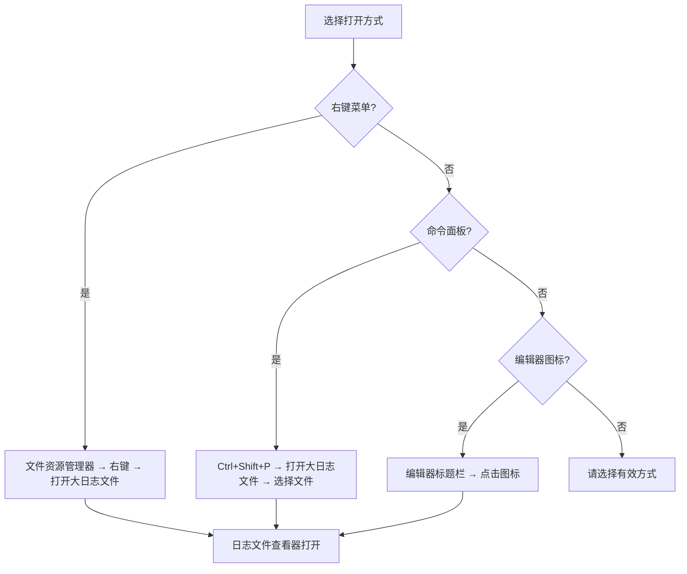
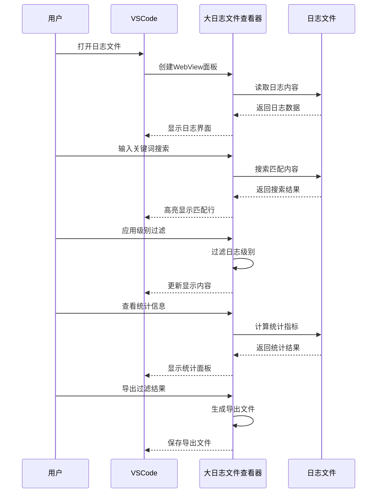
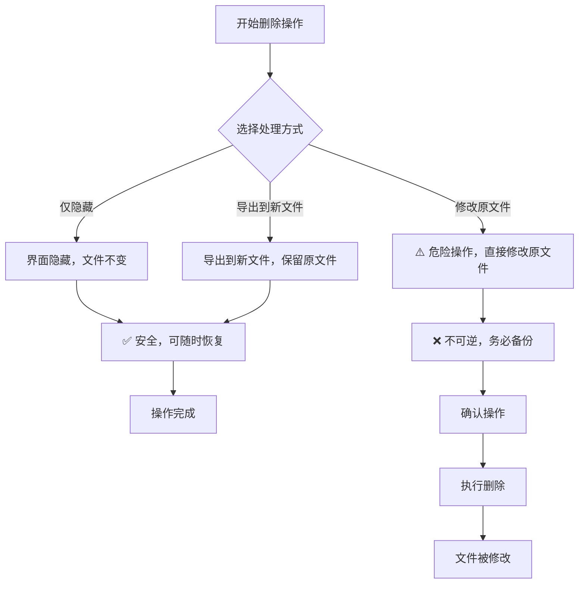

# 快速开始

<cite>
**本文档中引用的文件**
- [README.md](file://README.md)
- [package.json](file://package.json)
- [src/extension.ts](file://src/extension.ts)
- [src/logViewerPanel.ts](file://src/logViewerPanel.ts)
- [src/webview.html](file://src/webview.html)
- [src/logProcessor.ts](file://src/logProcessor.ts)
- [PUBLISH_GUIDE.md](file://PUBLISH_GUIDE.md)
</cite>

## 目录
1. [简介](#简介)
2. [安装方法](#安装方法)
3. [打开日志文件的三种方式](#打开日志文件的三种方式)
4. [典型使用流程](#典型使用流程)
5. [核心功能详解](#核心功能详解)
6. [安全注意事项](#安全注意事项)
7. [故障排除](#故障排除)

## 简介

大日志文件查看器是一个专业的VSCode扩展，专为处理大型日志文件而设计。无论您的日志文件有多大（支持几十MB甚至GB级别的文件），都能实现秒开效果。该扩展提供了强大的搜索、过滤、分析、标注等功能，让日志查看和问题排查变得简单高效。

**章节来源**
- [README.md](file://README.md#L1-L10)

## 安装方法

### 方法一：通过VSCode Marketplace直接安装

1. 打开VSCode
2. 点击左侧活动栏中的扩展图标（或按 `Ctrl+Shift+X`）
3. 在搜索框中输入 "大日志文件查看器" 或 "big-log-viewer"
4. 找到扩展后点击 "安装"
5. 安装完成后，VSCode会自动重启

### 方法二：使用.vsix文件手动安装

1. 下载扩展的 `.vsix` 文件
2. 打开VSCode
3. 按 `Ctrl+Shift+P`（Mac: `Cmd+Shift+P`）
4. 输入并选择 "Extensions: Install from VSIX..."
5. 浏览并选择下载的 `.vsix` 文件
6. 等待安装完成，可能需要重启VSCode

**章节来源**
- [PUBLISH_GUIDE.md](file://PUBLISH_GUIDE.md#L40-L49)
- [package.json](file://package.json#L1-L20)

## 打开日志文件的三种方式

### 方式一：右键菜单

1. 在VSCode的文件资源管理器中找到您的日志文件（`.log` 或 `.txt` 文件）
2. 右键点击文件
3. 在上下文菜单中选择 "打开大日志文件"
4. 扩展会自动在新的编辑器标签页中打开日志文件

### 方式二：命令面板

1. 按 `Ctrl+Shift+P`（Mac: `Cmd+Shift+P`）打开命令面板
2. 在搜索框中输入 "打开大日志文件"
3. 从列表中选择该命令
4. 在弹出的文件选择对话框中，选择要打开的日志文件
5. 扩展将在新的编辑器标签页中打开所选文件

### 方式三：编辑器标题栏图标

1. 打开一个日志文件（`.log` 或 `.txt`）
2. 在编辑器右上角的标题栏中，您会看到一个特殊的图标
3. 点击该图标即可使用大日志文件查看器打开当前文件

**图表来源**
- [src/extension.ts](file://src/extension.ts#L8-L31)
- [package.json](file://package.json#L52-L66)

**章节来源**
- [README.md](file://README.md#L58-L65)
- [src/extension.ts](file://src/extension.ts#L8-L31)

## 典型使用流程

### 步骤1：打开大日志文件

1. 使用上述任意一种方式打开您的日志文件
2. 等待文件加载完成，系统会根据文件大小自动调整加载策略
3. 您可以看到文件的基本信息，包括文件名、大小和总行数

### 步骤2：使用关键词搜索功能查找特定错误

1. 在搜索框中输入您要查找的关键词（如 "ERROR"、"Exception"、"timeout" 等）
2. （可选）勾选 "正则" 复选框以启用正则表达式模式
3. （可选）勾选 "反向搜索" 排除包含关键词的日志
4. 点击 "🔍 搜索" 按钮或按回车键执行搜索
5. 系统会实时高亮显示匹配的结果

### 步骤3：通过日志级别过滤器筛选信息

1. 在过滤面板中，您可以选择要显示的日志级别
2. 勾选 "ERROR"、"WARN"、"INFO"、"DEBUG" 等级别
3. 使用 "✔️ 全选" 按钮快速切换所有级别
4. 系统会立即应用过滤并更新显示内容

### 步骤4：尝试折叠重复日志以简化视图

1. 勾选 "📎 折叠重复日志" 复选框
2. 系统会自动识别并合并连续重复的日志行
3. 折叠时会忽略时间戳差异，只比较日志内容
4. 点击折叠组可以展开查看详细内容

### 步骤5：查看统计信息面板了解日志分布

1. 点击 "📈 统计" 按钮
2. 查看总行数、各级别日志数量、时间范围等统计数据
3. 了解日志文件的整体情况和分布特征

### 步骤6：导出过滤后的结果

1. 使用搜索或过滤功能筛选出需要的日志
2. 点击 "💾 导出" 按钮
3. 在弹出的保存对话框中选择保存位置和文件名
4. 系统会将过滤后的结果导出到新文件

**图表来源**
- [src/logViewerPanel.ts](file://src/logViewerPanel.ts#L54-L98)
- [src/webview.html](file://src/webview.html#L1060-L2612)

**章节来源**
- [README.md](file://README.md#L66-L123)
- [src/logViewerPanel.ts](file://src/logViewerPanel.ts#L107-L148)

## 核心功能详解

### 搜索功能

#### 基础搜索
- **关键词搜索**：实时搜索日志内容，高亮显示匹配结果
- **正则表达式**：支持正则模式，满足复杂搜索需求
- **反向搜索**：支持反向匹配（排除包含关键词的日志）

#### 高级搜索
- **多条件组合**：添加多个搜索条件，支持AND/OR逻辑
- **时间范围过滤**：设置开始时间和结束时间
- **级别过滤**：按ERROR、WARN、INFO、DEBUG等级别过滤

### 过滤功能

#### 日志级别过滤
- 支持按ERROR、WARN、INFO、DEBUG等级别单独或组合过滤
- 提供"全选"功能，一键切换所有级别

#### 时间范围过滤
- 使用高级搜索功能设置时间段筛选

#### 折叠重复日志
- 自动识别并折叠连续重复的日志行
- 支持时间戳忽略，只比较日志内容

### 分析功能

#### 统计信息
- 查看总行数、各级别日志数量
- 了解时间范围分布
- 查看按类名、方法名、线程名的统计信息

#### 时间线导航
- 可视化时间分布图
- 快速跳转到指定时间段

### 管理功能

#### 日志导出
- 导出过滤后的日志到新文件
- 支持多种文件格式

#### 日志删除
- 按时间删除：删除指定时间之前/之后的日志
- 按行数删除：删除指定行之前/之后的日志

**章节来源**
- [README.md](file://README.md#L7-L55)
- [src/logProcessor.ts](file://src/logProcessor.ts#L1-L200)

## 安全注意事项

### 删除操作的危险性

**重要提示**：删除操作会直接修改原文件且不可恢复，请务必先备份重要日志！

在执行删除操作时，系统会提供三种处理方式：

1. **仅隐藏（不修改文件）**：只在界面上隐藏日志，不会修改原文件
2. **导出到新文件**：将过滤结果导出到新文件，保留原始文件不变
3. **修改原文件（危险）**：直接修改原文件，此操作不可逆

### 安全建议

1. **Always备份重要日志**：在执行任何删除操作前，务必备份重要日志文件
2. **谨慎使用原文件修改**：除非确认无误，否则不要选择直接修改原文件
3. **验证操作结果**：删除后检查剩余日志是否符合预期
4. **使用导出功能**：推荐使用导出功能来保存过滤结果

**图表来源**
- [src/logViewerPanel.ts](file://src/logViewerPanel.ts#L180-L228)

**章节来源**
- [README.md](file://README.md#L124-L134)
- [src/logViewerPanel.ts](file://src/logViewerPanel.ts#L180-L228)

## 故障排除

### 常见问题及解决方案

#### 文件加载缓慢
- **原因**：文件过大或系统资源不足
- **解决方案**：等待加载完成，或使用过滤功能减少显示行数

#### 搜索结果不准确
- **原因**：时间戳格式不匹配或正则表达式错误
- **解决方案**：检查时间格式设置，验证正则表达式语法

#### 过滤功能失效
- **原因**：日志级别识别失败
- **解决方案**：检查日志格式，确认级别标识符

#### 导出文件为空
- **原因**：没有符合条件的日志行
- **解决方案**：调整搜索或过滤条件

### 性能优化建议

1. **合理使用过滤**：及时应用过滤条件减少显示行数
2. **避免过度搜索**：使用精确的关键词和正则表达式
3. **定期清理临时文件**：删除不需要的导出文件
4. **监控系统资源**：确保有足够的内存和CPU资源

**章节来源**
- [README.md](file://README.md#L228-L235)
- [src/logViewerPanel.ts](file://src/logViewerPanel.ts#L107-L148)