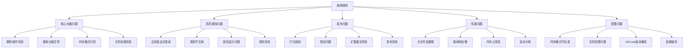
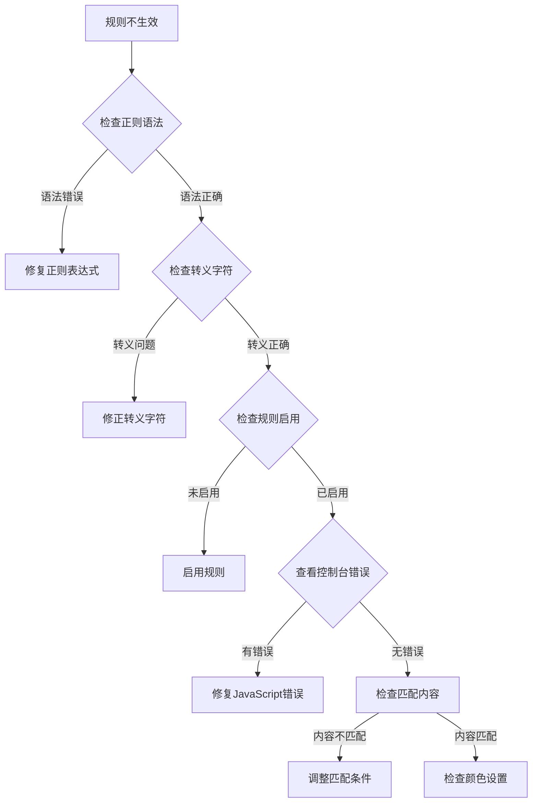
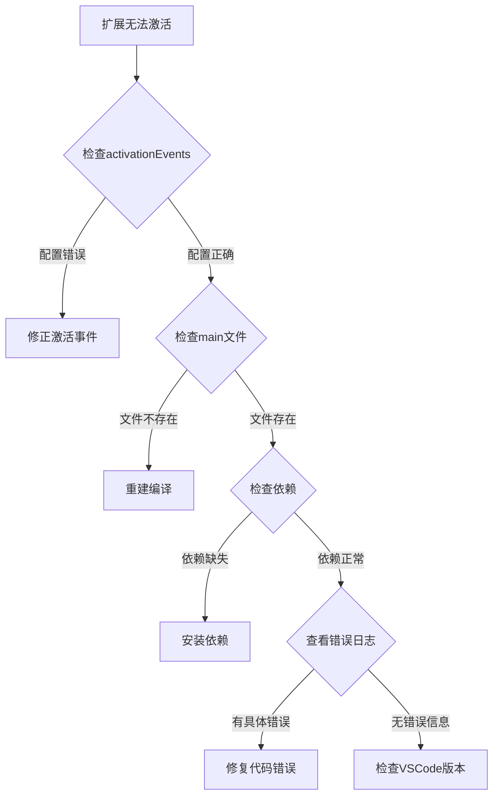

# 故障排除指南

<cite>
**本文档中引用的文件**
- [README.md](file://README.md)
- [HIGHLIGHT_RULES.md](file://HIGHLIGHT_RULES.md)
- [PUBLISH_GUIDE.md](file://PUBLISH_GUIDE.md)
- [package.json](file://package.json)
- [src/extension.ts](file://src/extension.ts)
- [src/logProcessor.ts](file://src/logProcessor.ts)
- [tsconfig.json](file://tsconfig.json)
- [src/webview.html](file://src/webview.html)
</cite>

## 目录
1. [简介](#简介)
2. [常见问题分类](#常见问题分类)
3. [核心功能故障排除](#核心功能故障排除)
4. [自定义高亮规则故障排除](#自定义高亮规则故障排除)
5. [发布相关问题](#发布相关问题)
6. [性能优化建议](#性能优化建议)
7. [调试技巧](#调试技巧)
8. [预防措施](#预防措施)

## 简介

本故障排除指南旨在帮助用户解决在使用大日志文件查看器扩展过程中可能遇到的各种问题。该扩展提供了强大的日志查看和处理功能，但在使用过程中可能会遇到各种技术挑战。本指南将系统地分析常见问题并提供详细的解决方案。

## 常见问题分类

根据用户反馈和代码分析，我们将问题分为以下几个主要类别：



## 核心功能故障排除

### 删除操作不可逆问题

**问题描述：**
删除操作会直接修改原文件且不可恢复，这是设计上的安全机制。

**解决方案：**
1. **数据备份**：在执行删除操作前，务必备份重要日志文件
2. **确认操作**：删除前系统会提供警告提示
3. **谨慎操作**：建议先进行小范围测试，确认删除范围后再执行完整操作

**预防措施：**
- 使用时间范围删除而非行数删除，更容易控制范围
- 在测试环境中验证删除效果

**节来源**
- [README.md](file://README.md#L133-L134)

### 时间格式不标准导致功能异常

**问题描述：**
如果日志文件没有标准时间戳格式，按时间删除和时间线功能可能无法正常工作。

**支持的时间格式：**
- `2024-01-01 12:00:00` / `2024-01-01 12:00:00.123`
- `2024/01/01 12:00:00` / `2024/01/01 12:00:00.123`
- `[2024-01-01 12:00:00]` / `[2024-01-01 12:00:00.123]`
- `01-01-2024 12:00:00`
- `2024-01-01T12:00:00` / `2024-01-01T12:00:00.123Z` (ISO 8601)

**解决方案：**
1. **格式标准化**：在分析前对日志文件进行格式转换
2. **使用正则表达式**：通过自定义高亮规则识别非标准格式
3. **手动处理**：对于特殊格式，考虑使用外部工具预处理

**节来源**
- [README.md](file://README.md#L46-L55)
- [src/logProcessor.ts](file://src/logProcessor.ts#L35-L46)

### 超大文件搜索性能问题

**问题描述：**
搜索功能需要扫描整个文件，超大文件（>1GB）可能需要较长时间。

**性能影响因素：**
- 文件大小
- 搜索复杂度
- 系统内存
- CPU性能

**优化建议：**
1. **使用正则表达式**：比简单文本搜索更快
2. **缩小搜索范围**：使用时间范围或日志级别过滤
3. **分批处理**：对于特别大的文件，考虑分段处理
4. **硬件升级**：增加内存和使用SSD硬盘

**节来源**
- [README.md](file://README.md#L232)

### 日志级别识别问题

**问题描述：**
某些日志文件可能使用非标准的日志级别标识。

**解决方案：**
1. **检查日志格式**：确认日志级别是否使用标准格式
2. **自定义规则**：通过高亮规则功能添加新的级别识别
3. **手动过滤**：使用文本搜索功能手动查找特定级别

**节来源**
- [src/logProcessor.ts](file://src/logProcessor.ts#L49-L54)

## 自定义高亮规则故障排除

### 正则表达式不工作

**问题症状：**
- 规则添加后没有效果
- 浏览器控制台出现错误信息
- 匹配结果不符合预期

**诊断步骤：**



**详细解决方案：**

1. **正则表达式语法检查**
   - 使用在线工具测试：https://regex101.com/
   - 确保语法符合JavaScript正则表达式规范
   - 避免使用不支持的特殊字符

2. **转义字符处理**
   - 在输入框中，反斜杠 `\` 需要写成双反斜杠 `\\`
   - 特殊字符如 `.`、`*`、`+` 等需要正确转义
   - 使用 `\\b` 表示单词边界

3. **规则启用状态**
   - 确认规则前的复选框已勾选
   - 内置规则同样需要启用才能生效
   - 检查规则列表中是否有错误提示

4. **浏览器控制台检查**
   - 打开VSCode开发者工具（Help → Toggle Developer Tools）
   - 查看Console标签页的错误信息
   - 关注JavaScript错误和警告

**节来源**
- [HIGHLIGHT_RULES.md](file://HIGHLIGHT_RULES.md#L195-L200)

### 规则没有应用

**问题症状：**
添加规则后日志内容没有高亮显示

**排查清单：**
1. ✅ 规则已启用（复选框勾选）
2. ✅ 匹配内容正确
3. ✅ 正则表达式语法正确
4. ✅ 浏览器控制台无错误
5. ✅ 日志内容确实包含匹配项

**解决方案：**
1. **验证匹配内容**：确保规则匹配的内容确实存在于日志中
2. **简化测试**：使用简单的匹配模式（如固定关键词）进行测试
3. **检查优先级**：多个规则可能相互覆盖
4. **刷新页面**：有时需要重新加载扩展

**节来源**
- [HIGHLIGHT_RULES.md](file://HIGHLIGHT_RULES.md#L201-L206)

### 颜色不明显

**问题症状：**
高亮颜色与背景色对比度过低，难以辨识

**解决方案：**

1. **调整对比度**
   - 确保背景色和文字色对比度至少为 4.5:1
   - 使用在线工具检查：https://webaim.org/resources/contrastchecker/

2. **推荐配色方案**
   - 错误/危险：背景 `#dc2626`，文字 `#ffffff`
   - 警告：背景 `#f59e0b`，文字 `#ffffff`
   - 成功：背景 `#10b981`，文字 `#ffffff`
   - 信息：背景 `#3b82f6`，文字 `#ffffff`
   - 高亮/重要：背景 `#8b5cf6`，文字 `#ffffff`

3. **可访问性考虑**
   - 避免使用纯红配纯绿（色盲友好）
   - 考虑使用渐变色或边框替代纯色填充

**节来源**
- [HIGHLIGHT_RULES.md](file://HIGHLIGHT_RULES.md#L160-L191)

### 规则丢失

**问题症状：**
添加的自定义规则在重启后消失

**原因分析：**
1. 浏览器localStorage被清理
2. 浏览器缓存问题
3. 扩展配置重置

**解决方案：**
1. **检查localStorage**：在浏览器开发者工具中查看存储的数据
2. **重新添加规则**：内置规则始终存在，可重新创建自定义规则
3. **定期备份**：考虑导出规则配置（未来功能）

**节来源**
- [HIGHLIGHT_RULES.md](file://HIGHLIGHT_RULES.md#L213-L218)

## 发布相关问题

### 打包时报'no README'错误

**问题描述：**
使用vsce打包时出现"no README"错误

**解决方案：**
1. **确认文件存在**：确保项目根目录有README.md文件
2. **检查文件名**：确认文件名为README.md，大小写敏感
3. **验证内容**：README.md文件不能为空，至少包含基本说明

**验证步骤：**
```bash
# 检查README.md是否存在
ls README.md

# 检查文件内容
cat README.md
```

**节来源**
- [PUBLISH_GUIDE.md](file://PUBLISH_GUIDE.md#L162-L163)

### 打包时报'no LICENSE'错误

**问题描述：**
打包时报"no LICENSE"错误

**解决方案：**

1. **在package.json中添加许可证**
```json
{
  "license": "MIT"
}
```

2. **创建LICENSE文件**
   - 创建LICENSE文件
   - 复制MIT许可证内容
   - 或使用其他合适的开源许可证

**推荐许可证：**
- MIT License（最简单，适合大多数项目）
- Apache License 2.0（适合商业用途）
- GPL v3（适合开源社区项目）

**节来源**
- [PUBLISH_GUIDE.md](file://PUBLISH_GUIDE.md#L165-L167)
- [package.json](file://package.json#L6)

### 图标不显示

**问题描述：**
扩展发布后图标不显示或显示异常

**解决方案：**

1. **检查图标路径**
   - 确认package.json中的icon字段正确
   - 图标文件位于项目根目录
   - 文件名为icon.png

2. **图标规格要求**
   - 格式：PNG
   - 最小尺寸：128x128像素
   - 建议尺寸：256x256像素
   - 背景：建议透明

3. **验证图标文件**
```json
{
  "icon": "icon.png"
}
```

**节来源**
- [PUBLISH_GUIDE.md](file://PUBLISH_GUIDE.md#L168-L170)
- [package.json](file://package.json#L8)

### 扩展无法激活

**问题描述：**
扩展安装后无法正常使用

**诊断步骤：**



**解决方案：**

1. **检查激活事件**
   - 确认package.json中的activationEvents配置正确
   - 包含必要的触发条件

2. **检查主入口文件**
   - 确认extension.js文件存在
   - 重新编译TypeScript代码

3. **检查VSCode版本兼容性**
   - 确认VSCode版本 >= 1.75.0
   - 检查engines配置

4. **查看详细错误**
   - 打开VSCode开发者工具
   - 查看Extension Host日志
   - 检查具体的错误信息

**节来源**
- [PUBLISH_GUIDE.md](file://PUBLISH_GUIDE.md#L171-L173)
- [package.json](file://package.json#L21-L31)
- [src/extension.ts](file://src/extension.ts#L1-L116)

## 性能优化建议

### 大文件处理优化

**问题场景：**
- GB级别日志文件
- 数千万行级别的文件
- 内存占用过高

**优化策略：**

1. **虚拟滚动技术**
   - 只渲染可见区域的日志行
   - 支持自定义每页显示行数（50-1000行）
   - 滚动时动态加载内容

2. **智能分页**
   - 按需加载数据
   - 缓存最近访问的页面
   - 避免一次性加载整个文件

3. **内存管理**
   - 及时释放不需要的数据
   - 使用流式读取避免内存溢出
   - 定期清理缓存

**性能指标：**
- GB级别日志文件秒开
- 分页切换响应 < 100ms
- 搜索响应时间 < 3秒
- 内存占用低（仅加载当前页数据）

**节来源**
- [README.md](file://README.md#L218-L227)

### 搜索性能优化

**优化建议：**

1. **使用正则表达式**
   - 比简单文本搜索更快
   - 利用JavaScript正则引擎优化

2. **索引策略**
   - 对于频繁搜索的文件，考虑建立索引
   - 使用前缀树等数据结构加速匹配

3. **异步处理**
   - 搜索操作采用异步方式
   - 避免阻塞用户界面
   - 显示搜索进度指示器

### 折叠功能优化

**问题描述：**
折叠重复日志时首次计算可能需要一些时间

**解决方案：**
1. **异步计算**：总页数计算在后台异步进行
2. **进度提示**：显示计算进度
3. **缓存结果**：缓存折叠结果避免重复计算

**节来源**
- [README.md](file://README.md#L233)

## 调试技巧

### 开发环境调试

**步骤：**
1. **启动开发模式**
```bash
npm run watch
```

2. **打开VSCode开发主机**
   - 按F5启动调试
   - 在新窗口中测试扩展功能

3. **查看控制台输出**
   - 扩展开发主机的开发者工具
   - Console标签页查看日志
   - Network标签页检查网络请求

### 生产环境调试

**常用调试方法：**

1. **浏览器开发者工具**
   - 打开VSCode开发者工具（Help → Toggle Developer Tools）
   - 查看Extension Host日志
   - 检查Webview内容

2. **日志分析**
   - 查看VSCode输出面板
   - 检查日志文件
   - 使用console.log调试

3. **错误监控**
   - 监控JavaScript错误
   - 检查Promise拒绝
   - 分析性能瓶颈

**节来源**
- [README.md](file://README.md#L161-L167)

## 预防措施

### 数据安全

**重要提醒：**
- 删除操作会直接修改原文件且不可恢复
- 请务必先备份重要日志！

**最佳实践：**
1. **定期备份**：重要日志文件定期备份
2. **测试环境**：在测试环境中验证操作
3. **确认操作**：删除前仔细确认范围
4. **版本控制**：对关键日志文件使用版本控制

**节来源**
- [README.md](file://README.md#L133-L134)

### 环境准备

**开发环境要求：**
- Node.js >= 18.0.0
- VSCode >= 1.75.0
- TypeScript >= 5.0.0

**检查步骤：**
```bash
# 检查Node.js版本
node --version

# 检查VSCode版本
code --version

# 检查TypeScript版本
tsc --version
```

**节来源**
- [README.md](file://README.md#L137-L141)
- [tsconfig.json](file://tsconfig.json#L2-L15)

### 依赖管理

**定期维护：**
1. **更新依赖**：定期检查和更新npm包
2. **清理缓存**：定期清理node_modules和缓存
3. **版本锁定**：使用package-lock.json锁定版本

**维护命令：**
```bash
# 清理并重新安装依赖
npm ci

# 更新依赖
npm update

# 清理缓存
npm cache clean --force
```

**节来源**
- [package.json](file://package.json#L70-L81)

## 结论

本故障排除指南涵盖了大日志文件查看器扩展的主要问题类型和解决方案。通过遵循本指南中的建议和最佳实践，用户可以有效地解决大部分常见问题，并获得更好的使用体验。

**关键要点总结：**
1. **数据安全第一**：删除操作不可逆，务必先备份
2. **时间格式标准化**：确保日志时间格式符合支持的标准
3. **正则表达式调试**：使用在线工具测试复杂的正则表达式
4. **性能优化**：合理使用搜索和过滤功能，避免不必要的性能消耗
5. **定期维护**：保持开发环境和扩展的最新状态

如遇到本指南未涵盖的问题，建议：
- 查看VSCode开发者工具的错误信息
- 检查扩展的官方文档和GitHub Issues
- 考虑提交Issue或寻求社区帮助