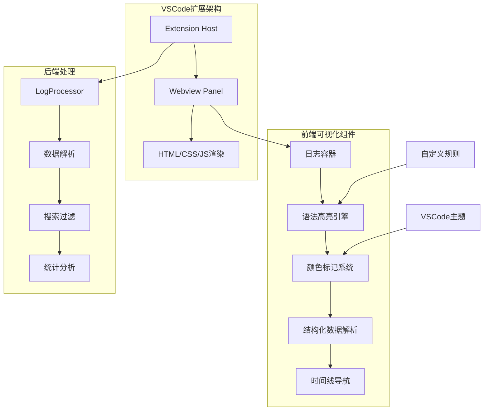
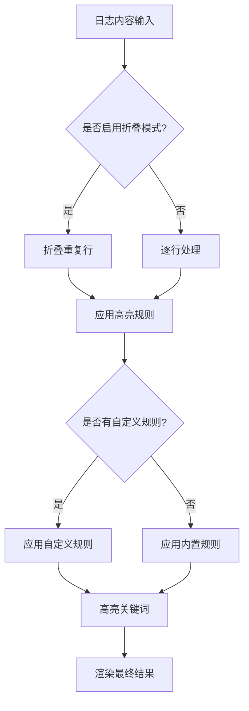
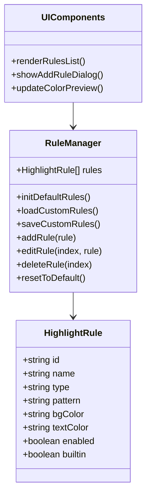
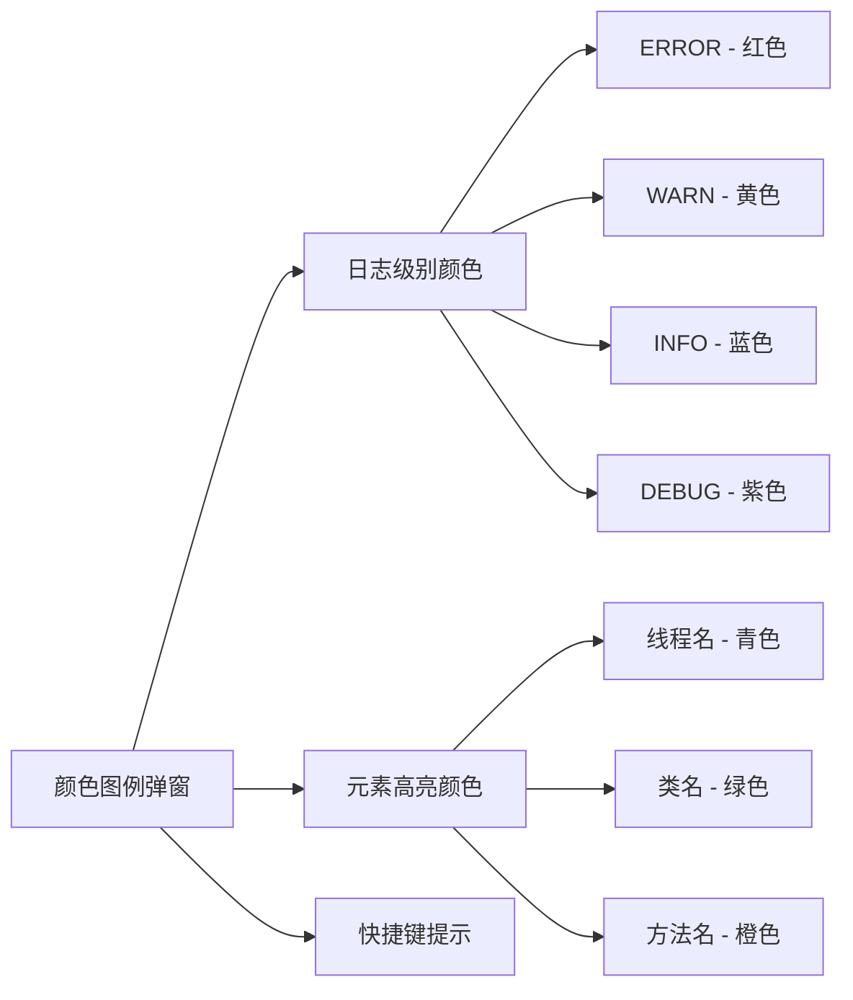

# 可视化增强

<cite>
**本文档引用的文件**
- [src/webview.html](file://src/webview.html)
- [HIGHLIGHT_RULES.md](file://HIGHLIGHT_RULES.md)
- [CUSTOM_HIGHLIGHT_FUNCTIONS.js](file://CUSTOM_HIGHLIGHT_FUNCTIONS.js)
- [src/logViewerPanel.ts](file://src/logViewerPanel.ts)
- [package.json](file://package.json)
</cite>

## 目录
1. [简介](#简介)
2. [项目架构概览](#项目架构概览)
3. [语法高亮系统](#语法高亮系统)
4. [颜色标记机制](#颜色标记机制)
5. [暗色主题适配](#暗色主题适配)
6. [自定义高亮规则](#自定义高亮规则)
7. [结构化数据可视化](#结构化数据可视化)
8. [颜色图例设计](#颜色图例设计)
9. [性能优化策略](#性能优化策略)
10. [故障排除指南](#故障排除指南)

## 简介

large_log_check是一个专为VSCode设计的大日志文件查看器扩展，提供了强大的可视化增强功能。该扩展通过智能语法高亮、颜色标记、暗色主题适配和自定义高亮规则等特性，显著提升了大日志文件的可读性和分析效率。

核心可视化增强功能包括：
- 多层级日志级别颜色标记
- 实时语法高亮和自定义规则支持
- 暗色主题无缝适配
- JSON/XML结构化数据可视化
- 时间线导航和统计图表
- 折叠重复日志行功能

## 项目架构概览



**图表来源**
- [src/logViewerPanel.ts](file://src/logViewerPanel.ts#L1-L50)
- [src/webview.html](file://src/webview.html#L1-L100)

**章节来源**
- [src/logViewerPanel.ts](file://src/logViewerPanel.ts#L1-L100)
- [package.json](file://package.json#L1-L50)

## 语法高亮系统

### 内置语法高亮规则

扩展内置了8个预设的语法高亮规则，涵盖最常见的日志元素：

| 规则名称 | 匹配模式 | 颜色 | 说明 |
|---------|---------|------|------|
| 日志级别 - ERROR | `\b(ERROR\|FATAL\|SEVERE)\b` | 红色 (#f14c4c) | 错误级别日志 |
| 日志级别 - WARN | `\b(WARN\|WARNING)\b` | 黄色 (#cca700) | 警告级别日志 |
| 日志级别 - INFO | `\b(INFO)\b` | 蓝色 (#4fc1ff) | 信息级别日志 |
| 日志级别 - DEBUG | `\b(DEBUG\|TRACE\|VERBOSE)\b` | 紫色 (#b267e6) | 调试级别日志 |
| 时间戳 | `\d{4}[-/]\d{2}[-/]\d{2}[T\s]\d{2}:\d{2}:\d{2}(\.\d+)?` | 紫色 (#b267e6) | 时间戳格式 |
| 线程名 | `\[([a-zA-Z][a-zA-Z0-9-_]*)\]` | 青色 (#06b6d4) | 线程名称 |
| 类名 | `\b([a-z][a-z0-9_]*(?:\.[a-z][a-z0-9_]*)*\.[A-Z][a-zA-Z0-9_]*)\b` | 绿色 (#10b981) | Java类全限定名 |
| 方法名 | `\b([a-z][a-zA-Z0-9_]+):(\d+)\b` | 橙色 (#f59e0b) | 方法名:行号格式 |

### 高亮算法实现



**图表来源**
- [src/webview.html](file://src/webview.html#L1854-L1890)

**章节来源**
- [src/webview.html](file://src/webview.html#L1854-L1890)
- [HIGHLIGHT_RULES.md](file://HIGHLIGHT_RULES.md#L9-L27)

## 颜色标记机制

### 日志级别颜色映射

扩展为不同日志级别定义了专门的颜色标记：

```css
/* ERROR级别 - 红色边框 */
.log-line.error {
    border-left: 3px solid #f14c4c;
    padding-left: 5px;
}

/* WARN级别 - 黄色边框 */
.log-line.warn {
    border-left: 3px solid #cca700;
    padding-left: 5px;
}

/* INFO级别 - 蓝色边框 */
.log-line.info {
    border-left: 3px solid #4fc1ff;
    padding-left: 5px;
}

/* DEBUG级别 - 紫色边框 */
.log-line.debug {
    border-left: 3px solid #b267e6;
    padding-left: 5px;
}
```

### 高亮效果样式

扩展提供了多种高亮效果，包括搜索关键词高亮和自定义高亮：

```css
/* 搜索关键词高亮 */
.highlight {
    background-color: var(--vscode-editor-findMatchHighlightBackground);
    color: var(--vscode-editor-findMatchHighlightForeground);
}

/* 自定义高亮规则 */
.custom-highlight {
    padding: 2px 4px;
    border-radius: 2px;
    font-weight: 500;
}

/* 高亮目标行 */
.log-line.highlight-target {
    background-color: rgba(255, 193, 7, 0.3);
    border-left: 3px solid #ffc107;
    animation: highlight-pulse 0.5s ease-in-out;
}
```

**章节来源**
- [src/webview.html](file://src/webview.html#L193-L240)

## 暗色主题适配

### VSCode主题变量集成

扩展完全兼容VSCode的主题系统，通过CSS变量实现暗色主题适配：

```css
/* 基础背景和文字颜色 */
body {
    background-color: var(--vscode-editor-background);
    color: var(--vscode-editor-foreground);
}

/* 输入框样式 */
input[type="text"],
select {
    background-color: var(--vscode-input-background);
    color: var(--vscode-input-foreground);
    border: 1px solid var(--vscode-input-border);
}

/* 按钮样式 */
button {
    background-color: var(--vscode-button-background);
    color: var(--vscode-button-foreground);
}

/* 高亮颜色 */
.highlight {
    background-color: var(--vscode-editor-findMatchHighlightBackground);
    color: var(--vscode-editor-findMatchHighlightForeground);
}
```

### 主题变量对照表

| CSS变量 | 浅色主题值 | 暗色主题值 | 用途 |
|---------|------------|------------|------|
| --vscode-editor-background | #ffffff | #1e1e1e | 主背景色 |
| --vscode-editor-foreground | #000000 | #cccccc | 主文字色 |
| --vscode-input-background | #f3f3f3 | #2d2d2d | 输入框背景 |
| --vscode-button-background | #007acc | #0e639c | 按钮背景 |
| --vscode-panel-border | #808080 | #444444 | 边框颜色 |

**章节来源**
- [src/webview.html](file://src/webview.html#L14-L18)
- [src/webview.html](file://src/webview.html#L52-L72)

## 自定义高亮规则

### 规则管理系统

扩展提供了完整的自定义高亮规则管理功能：



**图表来源**
- [CUSTOM_HIGHLIGHT_FUNCTIONS.js](file://CUSTOM_HIGHLIGHT_FUNCTIONS.js#L1-L50)
- [src/webview.html](file://src/webview.html#L2210-L2252)

### 规则配置选项

自定义高亮规则支持以下配置：

| 配置项 | 类型 | 说明 | 示例 |
|--------|------|------|------|
| 规则名称 | 字符串 | 规则的描述性名称 | "API调用" |
| 匹配模式 | 枚举 | 文本匹配或正则表达式 | "text" / "regex" |
| 匹配内容 | 字符串 | 要匹配的文本或正则表达式 | "API" / "\\bERROR\\b" |
| 背景色 | 颜色 | 高亮的背景颜色 | "#10b981" |
| 文字色 | 颜色 | 高亮的文字颜色 | "#ffffff" |
| 启用状态 | 布尔值 | 是否启用该规则 | true/false |

### 规则应用顺序

高亮规则按以下优先级顺序应用：

1. **内置规则**（预设的8个规则）
2. **自定义规则**（用户添加的规则，按添加顺序）
3. **搜索关键词**（最后应用，优先级最高）

**章节来源**
- [HIGHLIGHT_RULES.md](file://HIGHLIGHT_RULES.md#L28-L47)
- [CUSTOM_HIGHLIGHT_FUNCTIONS.js](file://CUSTOM_HIGHLIGHT_FUNCTIONS.js#L1-L100)

## 结构化数据可视化

### JSON树状结构解析

扩展能够自动检测和解析JSON数据，并以树状结构展示：

```javascript
function detectAndParseStructuredData(content) {
    // 检测JSON对象
    let jsonMatch = content.match(/\{[^{}]*(?:\{[^{}]*\}[^{}]*)*\}/);
    
    if (jsonMatch) {
        try {
            const jsonObj = JSON.parse(jsonMatch[0]);
            if (typeof jsonObj === 'object' && jsonObj !== null) {
                return renderJSONTree(jsonObj);
            }
        } catch (e) {
            // 解析失败，继续尝试其他格式
        }
    }
    
    // 检测JSON数组
    let arrayMatch = content.match(/\[[\s\S]*?\]/);
    if (arrayMatch) {
        try {
            const jsonObj = JSON.parse(arrayMatch[0]);
            if (Array.isArray(jsonObj) && jsonObj.length > 0) {
                return renderJSONTree(jsonObj);
            }
        } catch (e) {}
    }
    
    return null;
}
```

### XML树状结构解析

对于XML格式的数据，扩展同样提供树状结构展示：

```javascript
function renderXMLTree(xmlStr) {
    const parser = new DOMParser();
    const xmlDoc = parser.parseFromString(xmlStr, 'text/xml');
    
    if (xmlDoc.getElementsByTagName('parsererror').length > 0) {
        return null;
    }
    
    return renderXMLNode(xmlDoc.documentElement, 0);
}
```

### 树状结构样式

```css
/* JSON/XML树状结构容器 */
.json-tree, .xml-tree {
    font-family: 'Consolas', 'Monaco', monospace;
    font-size: 12px;
    line-height: 1.6;
    margin: 5px 0;
    padding: 8px;
    background-color: rgba(107, 114, 128, 0.05);
    border-radius: 4px;
    border-left: 3px solid #8b5cf6;
}

/* 树状结构节点 */
.json-tree-item, .xml-tree-item {
    margin-left: 15px;
    position: relative;
}

/* 折叠/展开按钮 */
.json-tree-toggle, .xml-tree-toggle {
    display: inline-block;
    width: 14px;
    height: 14px;
    cursor: pointer;
    user-select: none;
    margin-right: 4px;
    color: var(--vscode-textLink-foreground);
    font-weight: bold;
    vertical-align: middle;
}
```

**章节来源**
- [src/webview.html](file://src/webview.html#L3628-L3700)
- [src/webview.html](file://src/webview.html#L530-L620)

## 颜色图例设计

### 图例界面布局

扩展提供了专门的颜色图例界面，帮助用户理解各种颜色编码的含义：



**图表来源**
- [src/webview.html](file://src/webview.html#L912-L991)

### 颜色编码说明

| 颜色 | 编码类型 | 用途 | 示例 |
|------|----------|------|------|
| 红色 (#f14c4c) | ERROR级别 | 系统严重错误 | ERROR、FATAL、SEVERE |
| 黄色 (#cca700) | WARN级别 | 潜在问题警告 | WARN、WARNING |
| 蓝色 (#4fc1ff) | INFO级别 | 正常业务流程 | INFO |
| 紫色 (#b267e6) | DEBUG级别 | 详细调试信息 | DEBUG、TRACE、VERBOSE |
| 青色 (#06b6d4) | 线程名 | 线程标识 | [http-nio-8080] |
| 绿色 (#10b981) | 类名 | Java类全限定名 | com.example.Service |
| 橙色 (#f59e0b) | 方法名 | 方法调用标识 | method:123 |

**章节来源**
- [src/webview.html](file://src/webview.html#L912-L991)
- [HIGHLIGHT_RULES.md](file://HIGHLIGHT_RULES.md#L160-L191)

## 性能优化策略

### 折叠重复日志行

为了提升大文件的浏览性能，扩展实现了智能的重复日志行折叠功能：

```javascript
function collapseRepeatedLines(lines, startIndex) {
    const result = [];
    let i = 0;
    
    while (i < lines.length) {
        // 尝试不同的模式长度（1-10行）
        let bestPatternLength = 0;
        let bestRepeatCount = 0;
        
        for (let patternLength = 1; patternLength <= Math.min(10, Math.floor((lines.length - i) / 2)); patternLength++) {
            // 检测模式重复次数
            let repeatCount = 1;
            let j = i + patternLength;
            
            while (j + patternLength <= lines.length) {
                let matches = true;
                for (let k = 0; k < patternLength; k++) {
                    if (extractLogContent(lines[j + k]) !== pattern) {
                        matches = false;
                        break;
                    }
                }
                
                if (matches) {
                    repeatCount++;
                    j += patternLength;
                } else {
                    break;
                }
            }
            
            if (repeatCount >= 2 && repeatCount > bestRepeatCount) {
                bestPatternLength = patternLength;
                bestRepeatCount = repeatCount;
            }
        }
        
        if (bestPatternLength > 0 && bestRepeatCount >= 2) {
            // 找到重复模式，添加折叠组
            result.push({
                isCollapsed: true,
                groupId: `group_${firstLineNumber}`,
                patternLength: bestPatternLength,
                repeatCount: bestRepeatCount,
                lines: lines.slice(i, i + totalLines),
                firstLine: lines[i],
                isExpanded: expandedGroups.has(groupId)
            });
            i += totalLines;
        } else {
            result.push(lines[i]);
            i++;
        }
    }
    
    return result;
}
```

### 分页加载优化

对于大文件，扩展采用分页加载策略：

```javascript
function renderLines() {
    let startIndex, endIndex;
    
    if (isCollapseMode && pageRanges.has(currentPage)) {
        // 折叠模式且已记录过该页范围，直接使用
        const range = pageRanges.get(currentPage);
        startIndex = range.start;
        endIndex = range.end;
    } else {
        // 标准分页计算
        startIndex = (currentPage - 1) * pageSize;
        endIndex = Math.min(startIndex + pageSize, allLines.length);
    }
    
    // 动态调整加载数量以填满页面
    if (isCollapseMode) {
        const targetDisplayLines = pageSize;
        let displayCount = 0;
        let tempEndIndex = endIndex;
        
        while (displayCount < targetDisplayLines && tempEndIndex < allLines.length) {
            const testLines = allLines.slice(startIndex, tempEndIndex);
            const collapsed = collapseRepeatedLines(testLines, startIndex);
            displayCount = collapsed.length;
            
            if (displayCount < targetDisplayLines) {
                // 增加加载量
                const increment = Math.ceil((targetDisplayLines - displayCount) * 0.5);
                tempEndIndex = Math.min(tempEndIndex + increment, allLines.length);
            } else {
                break;
            }
        }
        
        endIndex = tempEndIndex;
    }
}
```

**章节来源**
- [src/webview.html](file://src/webview.html#L1565-L1648)
- [src/webview.html](file://src/webview.html#L1313-L1421)

## 故障排除指南

### 常见问题及解决方案

#### 1. 正则表达式不工作

**问题症状**：自定义高亮规则中的正则表达式无法正确匹配

**解决方案**：
- 检查正则语法是否正确
- 注意转义字符（在输入框中 `\` 需要写成 `\\`）
- 使用在线工具测试：https://regex101.com/

#### 2. 颜色显示不明显

**问题症状**：高亮颜色与背景色对比度过低

**解决方案**：
- 调整背景色和文字色对比度
- 使用更鲜艳的颜色
- 参考推荐配色方案

#### 3. 规则应用不生效

**问题症状**：添加的高亮规则没有应用到日志显示中

**解决方案**：
- 确认规则已启用（复选框勾选）
- 检查匹配内容是否正确
- 查看浏览器控制台是否有错误信息

#### 4. 性能问题

**问题症状**：大文件加载缓慢或卡顿

**解决方案**：
- 启用折叠重复日志行功能
- 调整页面大小（减少每页显示行数）
- 禁用不必要的自定义规则

### 调试技巧

1. **浏览器开发工具**：使用VSCode的Webview开发工具进行调试
2. **控制台日志**：查看JavaScript控制台中的错误信息
3. **规则验证**：在添加规则前先用正则表达式测试工具验证
4. **性能监控**：观察内存使用情况和渲染性能

**章节来源**
- [HIGHLIGHT_RULES.md](file://HIGHLIGHT_RULES.md#L193-L217)

## 结论

large_log_check通过其强大的可视化增强功能，为大日志文件的分析提供了卓越的用户体验。从智能语法高亮到暗色主题适配，从结构化数据可视化到自定义高亮规则，每一项功能都经过精心设计，旨在帮助开发者更高效地处理和分析日志数据。

扩展的模块化架构和性能优化策略确保了在处理超大文件时仍能保持流畅的用户体验。完善的错误处理和故障排除指南为用户提供了可靠的技术支持。

随着功能的不断完善和优化，large_log_check将继续为开发者提供更加强大和便捷的日志分析工具。