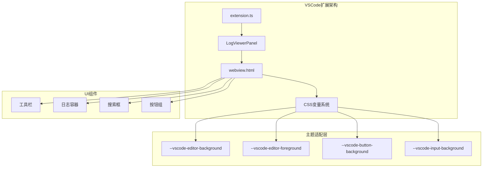
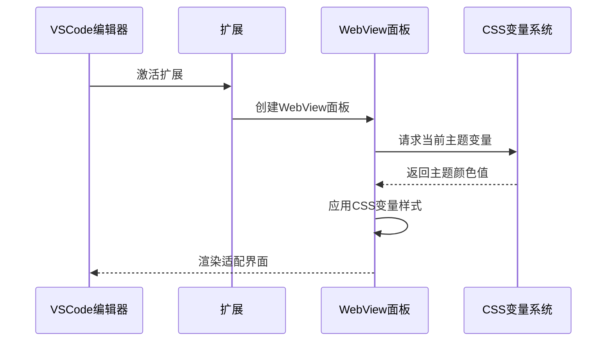
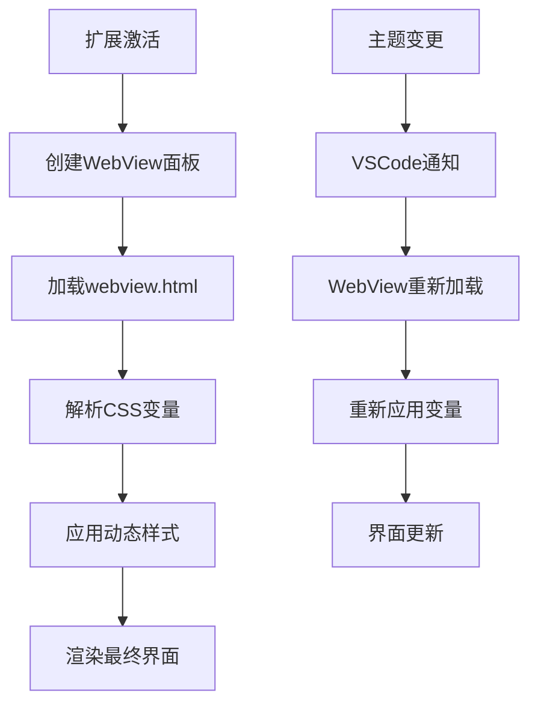

# 暗色主题适配

<cite>
**本文档引用的文件**
- [webview.html](file://src/webview.html)
- [logViewerPanel.ts](file://src/logViewerPanel.ts)
- [extension.ts](file://src/extension.ts)
- [package.json](file://package.json)
- [README.md](file://README.md)
</cite>

## 目录
1. [简介](#简介)
2. [VSCode CSS变量系统](#vscode-css变量系统)
3. [项目架构概览](#项目架构概览)
4. [暗色主题适配机制](#暗色主题适配机制)
5. [关键CSS变量应用](#关键css变量应用)
6. [主题切换效果](#主题切换效果)
7. [实现细节分析](#实现细节分析)
8. [最佳实践建议](#最佳实践建议)
9. [故障排除指南](#故障排除指南)
10. [总结](#总结)

## 简介

large_log_check是一个专业的VSCode扩展，专门用于处理大型日志文件。该项目的核心特性之一是其完善的暗色主题适配机制，通过使用VSCode提供的CSS变量系统，确保在不同VSCode主题环境下都能提供一致且舒适的用户体验。

该扩展完美适配VSCode的暗色主题和亮色主题，通过智能的CSS变量绑定，自动适应用户当前的主题设置，无需额外配置即可获得最佳视觉效果。

## VSCode CSS变量系统

VSCode为扩展开发者提供了丰富的CSS变量系统，这些变量能够动态反映当前主题的颜色设置：

### 主要CSS变量类别

| 变量类型 | 描述 | 应用场景 |
|---------|------|----------|
| `--vscode-editor-*` | 编辑器相关颜色 | 主要内容区域、文本颜色 |
| `--vscode-button-*` | 按钮组件颜色 | 操作按钮、交互元素 |
| `--vscode-input-*` | 输入框颜色 | 文本输入、选择器 |
| `--vscode-panel-*` | 面板边框颜色 | 边框、分割线 |
| `--vscode-list-*` | 列表项颜色 | 鼠标悬停效果 |
| `--vscode-menu-*` | 菜单颜色 | 右键菜单、上下文菜单 |
| `--vscode-dropdown-*` | 下拉菜单颜色 | 选择器、下拉框 |

### 变量命名规范

VSCode CSS变量遵循统一的命名规范：
- 前缀：`--vscode-`
- 组件类型：如`editor`、`button`、`input`等
- 属性：如`background`、`foreground`、`border`等
- 特殊状态：如`hover`、`selection`、`active`等

## 项目架构概览



**图表来源**
- [extension.ts](file://src/extension.ts#L1-L116)
- [logViewerPanel.ts](file://src/logViewerPanel.ts#L1-L510)
- [webview.html](file://src/webview.html#L1-L4178)

**章节来源**
- [extension.ts](file://src/extension.ts#L1-L116)
- [logViewerPanel.ts](file://src/logViewerPanel.ts#L1-L510)
- [webview.html](file://src/webview.html#L1-L4178)

## 暗色主题适配机制

### 自动主题检测

large_log_check通过以下机制实现自动主题适配：



**图表来源**
- [logViewerPanel.ts](file://src/logViewerPanel.ts#L486-L495)
- [webview.html](file://src/webview.html#L15-L16)

### 动态样式更新

当用户切换VSCode主题时，扩展能够实时响应并更新界面样式：

1. **主题变更监听**：VSCode自动通知扩展主题变更
2. **样式重新计算**：WebView重新解析CSS变量
3. **界面刷新**：UI元素自动应用新的颜色值
4. **无缝切换**：用户无感知的主题切换体验

**章节来源**
- [logViewerPanel.ts](file://src/logViewerPanel.ts#L486-L495)

## 关键CSS变量应用

### 基础界面颜色

扩展在多个关键UI元素中使用了VSCode的CSS变量：

#### 1. 页面主体背景和文字色

```css
/* 页面主体 */
body {
    background-color: var(--vscode-editor-background);
    color: var(--vscode-editor-foreground);
}

/* 工具栏背景 */
.toolbar {
    background-color: var(--vscode-editorWidget-background);
}

/* 描述文字颜色 */
.stats, .loading {
    color: var(--vscode-descriptionForeground);
}
```

#### 2. 输入控件样式

```css
/* 搜索输入框 */
input[type="text"] {
    background-color: var(--vscode-input-background);
    color: var(--vscode-input-foreground);
    border: 1px solid var(--vscode-input-border);
}

/* 下拉选择器 */
select {
    background-color: var(--vscode-dropdown-background);
    color: var(--vscode-dropdown-foreground);
    border: 1px solid var(--vscode-dropdown-border);
}
```

#### 3. 按钮组件样式

```css
/* 主要按钮 */
button {
    background-color: var(--vscode-button-background);
    color: var(--vscode-button-foreground);
}

/* 按钮悬停效果 */
button:hover {
    background-color: var(--vscode-button-hoverBackground);
}
```

#### 4. 日志显示区域

```css
/* 日志容器 */
.log-container {
    background-color: var(--vscode-editor-background);
    border: 1px solid var(--vscode-panel-border);
}

/* 日志行边框 */
.log-line {
    border-bottom: 1px solid var(--vscode-panel-border);
}

/* 鼠标悬停效果 */
.log-line:hover {
    background-color: var(--vscode-list-hoverBackground);
}
```

#### 5. 高亮和强调

```css
/* 搜索高亮 */
.highlight {
    background-color: var(--vscode-editor-findMatchHighlightBackground);
    color: var(--vscode-editor-findMatchHighlightForeground);
}

/* 行号颜色 */
.log-line-number {
    color: var(--vscode-editorLineNumber-foreground);
}
```

**章节来源**
- [webview.html](file://src/webview.html#L15-L118)

## 主题切换效果

### 暗色主题效果

在暗色主题下，扩展呈现以下视觉特征：

- **背景色**：深色系，减少眼睛疲劳
- **文字色**：明亮对比度，确保可读性
- **边框色**：微妙的灰色线条，保持界面整洁
- **交互元素**：柔和的悬停效果，提升用户体验

### 亮色主题效果

在亮色主题下，扩展呈现以下视觉特征：

- **背景色**：浅色系，适合明亮环境
- **文字色**：深色对比度，确保清晰度
- **边框色**：清晰的线条，增强层次感
- **交互元素**：明显的悬停效果，引导用户操作

### 主题一致性保证

通过CSS变量系统，扩展确保了：
- **颜色一致性**：同一功能在不同主题下使用相同的颜色语义
- **对比度保证**：自动调整对比度以符合无障碍设计原则
- **视觉平衡**：保持界面元素之间的视觉平衡

## 实现细节分析

### CSS变量的注入机制

扩展通过以下方式实现CSS变量的自动注入：



**图表来源**
- [logViewerPanel.ts](file://src/logViewerPanel.ts#L486-L495)

### 性能优化策略

1. **延迟加载**：CSS变量在需要时才进行解析
2. **缓存机制**：避免重复计算相同主题的颜色值
3. **批量更新**：一次性应用所有主题相关的样式变更
4. **内存管理**：及时释放不再使用的样式资源

### 兼容性考虑

扩展在设计时充分考虑了不同VSCode版本的兼容性：

- **最低版本支持**：VSCode 1.75.0+
- **渐进增强**：新版本提供更多主题选项，旧版本自动降级
- **回退机制**：CSS变量无效时使用预设颜色作为后备

**章节来源**
- [logViewerPanel.ts](file://src/logViewerPanel.ts#L486-L495)
- [package.json](file://package.json#L21-L23)

## 最佳实践建议

### 开发者指南

1. **优先使用CSS变量**：在自定义样式中优先使用VSCode提供的CSS变量
2. **测试多主题**：在暗色和亮色主题下分别测试界面效果
3. **注意对比度**：确保文字与背景的对比度符合可访问性标准
4. **避免硬编码颜色**：不要在CSS中直接使用固定颜色值

### 设计原则

1. **语义化命名**：使用语义化的CSS变量名称
2. **一致性优先**：保持相同功能在不同主题下的一致性
3. **用户体验**：确保主题切换不影响用户操作流程
4. **性能考虑**：避免过度复杂的样式计算

### 维护建议

1. **定期测试**：随着VSCode更新，定期测试主题适配效果
2. **监控反馈**：关注用户关于主题适配的反馈
3. **文档更新**：及时更新主题适配相关的文档
4. **社区贡献**：鼓励社区贡献更多主题适配优化

## 故障排除指南

### 常见问题及解决方案

#### 1. 主题颜色不生效

**症状**：界面颜色没有随VSCode主题变化
**原因**：CSS变量路径错误或变量名称拼写错误
**解决**：检查CSS变量名称是否正确，确保使用标准的`--vscode-`前缀

#### 2. 对比度过低

**症状**：文字与背景颜色对比度不足，影响可读性
**原因**：使用了不合适的CSS变量或颜色值
**解决**：使用`--vscode-editor-foreground`和`--vscode-editor-background`等标准变量

#### 3. 主题切换无响应

**症状**：切换VSCode主题后界面颜色没有更新
**原因**：WebView没有正确监听主题变更事件
**解决**：确保扩展正确实现了主题变更监听机制

#### 4. 样式冲突

**症状**：自定义样式覆盖了主题颜色
**原因**：CSS优先级过高或使用了内联样式
**解决**：降低自定义样式的优先级，或使用更具体的CSS选择器

### 调试技巧

1. **开发者工具**：使用VSCode的开发者工具检查CSS变量的实际值
2. **主题检查器**：利用VSCode的主题检查器功能
3. **控制台日志**：在扩展代码中添加日志输出，跟踪主题变更事件
4. **样式面板**：在WebView中使用样式面板检查最终应用的样式

## 总结

large_log_check的暗色主题适配机制体现了现代VSCode扩展开发的最佳实践。通过巧妙地运用VSCode的CSS变量系统，该扩展不仅实现了完美的主题适配，还为用户提供了优秀的跨主题体验。

### 核心优势

1. **自动化程度高**：无需用户手动配置，自动适配当前主题
2. **视觉一致性好**：在不同主题下保持统一的视觉语言
3. **性能优化到位**：采用高效的样式更新机制
4. **兼容性强**：支持多个VSCode版本和主题类型

### 技术亮点

- **CSS变量驱动**：完全基于VSCode提供的CSS变量系统
- **动态响应**：实时响应VSCode主题变更
- **语义化设计**：使用语义化的颜色变量，便于维护
- **无障碍友好**：自动调整对比度，符合无障碍设计标准

### 未来展望

随着VSCode主题系统的不断发展，large_log_check将继续优化其主题适配机制，为用户提供更加丰富和个性化的使用体验。同时，该项目也为其他VSCode扩展开发者提供了优秀的主题适配参考实现。