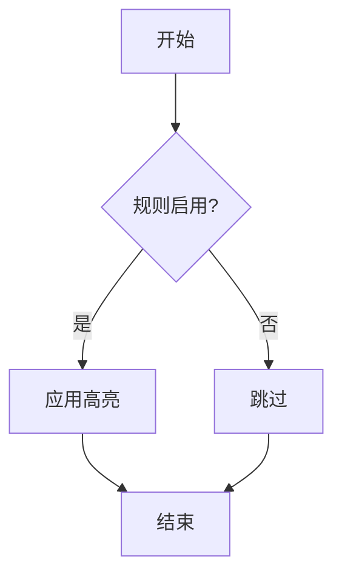

# 内置高亮规则

<cite>
**本文档引用文件**  
- [HIGHLIGHT_RULES.md](file://HIGHLIGHT_RULES.md)
- [src\webview.html](file://src/webview.html)
- [src\logProcessor.ts](file://src/logProcessor.ts)
- [src\extension.ts](file://src/extension.ts)
- [src\logViewerPanel.ts](file://src/logViewerPanel.ts)
</cite>

## 目录
1. [简介](#简介)
2. [内置高亮规则概览](#内置高亮规则概览)
3. [规则匹配模式与实现](#规则匹配模式与实现)
4. [CSS类与颜色配置](#css类与颜色配置)
5. [规则启用与禁用机制](#规则启用与禁用机制)
6. [性能优化设计考量](#性能优化设计考量)
7. [实际日志示例](#实际日志示例)
8. [高亮优先级处理](#高亮优先级处理)
9. [结论](#结论)

## 简介
`large_log_check` 扩展提供了一套强大的日志查看功能，其中内置高亮规则是其核心特性之一。这些规则旨在帮助开发者快速识别和区分日志中的关键信息，如日志级别、时间戳、线程名、类名和方法名等。本文档详细说明了在 `HIGHLIGHT_RULES.md` 中定义的8个预设规则及其在 `webview.html` 中的实现方式，包括匹配模式、颜色配置、CSS类、启用/禁用机制、性能优化设计以及高亮优先级处理。

## 内置高亮规则概览
`large_log_check` 扩展定义了8个内置高亮规则，这些规则在 `webview.html` 的 JavaScript 代码中初始化，并存储在 `customHighlightRules` 数组中。这些规则包括：

1. **ERROR级别**：匹配日志中的错误级别。
2. **WARN级别**：匹配日志中的警告级别。
3. **INFO级别**：匹配日志中的信息级别。
4. **DEBUG级别**：匹配日志中的调试级别。
5. **时间戳**：匹配日志中的时间戳。
6. **线程名**：匹配日志中的线程名。
7. **类名**：匹配日志中的类名。
8. **方法名**：匹配日志中的方法名。

这些规则在 `webview.html` 的 `initHighlightRules` 函数中初始化，并且默认启用。

**Section sources**
- [src\webview.html](file://src/webview.html#L2221-L2224)

## 规则匹配模式与实现
每个内置高亮规则都包含一个正则表达式模式，用于匹配日志中的特定内容。以下是各个规则的匹配模式：

- **ERROR级别**：`/\[(ERROR|FATAL|SEVERE)\]|\b(ERROR|FATAL|SEVERE)\s/i`
- **WARN级别**：`/\[(WARN|WARNING)\]|\b(WARN|WARNING)\s/i`
- **INFO级别**：`/\[(INFO|INFORMATION)\]|\b(INFO|INFORMATION)\s/i`
- **DEBUG级别**：`/\[(DEBUG|TRACE|VERBOSE)\]|\b(DEBUG|TRACE|VERBOSE)\s/i`
- **时间戳**：`/\d{4}[-/]\\d{2}[-/]\\d{2}[T\\s]\\d{2}:\\d{2}:\\d{2}(\\.\\d+)?/`
- **线程名**：`/\[([a-zA-Z][a-zA-Z0-9-_]*)\]/`
- **类名**：`/\b([a-z][a-z0-9_]*(?:\\.[a-z][a-z0-9_]*)*\\.[A-Z][a-zA-Z0-9_]*)\\b/`
- **方法名**：`/\b([a-z][a-zA-Z0-9_]+):(\\d+)\\b/`

这些正则表达式在 `webview.html` 的 `highlightKeywords` 函数中被应用，以高亮匹配的内容。

**Section sources**
- [src\webview.html](file://src/webview.html#L1865-L1878)

## CSS类与颜色配置
每个内置高亮规则都有对应的 CSS 类和颜色配置。这些配置在 `webview.html` 的 `<style>` 标签中定义。以下是各个规则的 CSS 类和颜色配置：

- **ERROR级别**：`.highlight-error`，背景色 `#f14c4c`，文字色 `#fff`
- **WARN级别**：`.highlight-warn`，背景色 `#cca700`，文字色 `#fff`
- **INFO级别**：`.highlight-info`，背景色 `#4fc1ff`，文字色 `#000`
- **DEBUG级别**：`.highlight-debug`，背景色 `#b267e6`，文字色 `#fff`
- **时间戳**：`.highlight-time`，背景色 `#b267e6`，文字色 `#fff`
- **线程名**：`.highlight-thread`，背景色 `#06b6d4`，文字色 `#fff`
- **类名**：`.highlight-class`，背景色 `#10b981`，文字色 `#fff`
- **方法名**：`.highlight-method`，背景色 `#f59e0b`，文字色 `#fff`

这些 CSS 类在 `highlightKeywords` 函数中被动态添加到匹配的内容上。

**Section sources**
- [src\webview.html](file://src/webview.html#L428-L485)

## 规则启用与禁用机制
内置高亮规则默认启用，但用户可以在 `webview.html` 的高亮规则管理界面中禁用它们。禁用规则不会删除规则，只是将其 `enabled` 属性设置为 `false`。在 `highlightKeywords` 函数中，只有 `enabled` 属性为 `true` 的规则才会被应用。



**Diagram sources**
- [src\webview.html](file://src/webview.html#L1863-L1882)

**Section sources**
- [src\webview.html](file://src/webview.html#L1863-L1882)

## 性能优化设计考量
为了优化性能，`large_log_check` 扩展采用了以下设计：

1. **异步计算**：在启用折叠模式时，异步计算所有页面，避免阻塞 UI。
2. **分页加载**：对于大文件，分页加载日志内容，减少内存占用。
3. **正则表达式优化**：使用高效的正则表达式模式，减少匹配时间。
4. **缓存机制**：将自定义高亮规则存储在 `localStorage` 中，避免重复解析。

这些优化措施确保了在处理大日志文件时的流畅体验。

**Section sources**
- [src\webview.html](file://src/webview.html#L1849-L1851)
- [src\logViewerPanel.ts](file://src/logViewerPanel.ts#L119-L128)

## 实际日志示例
以下是一个实际日志片段，展示了不同规则的应用效果：

```
2025-11-14 09:27:02.820  INFO 3262876 [http-nio-16710-exec-8] data.access.filter.DataAccessFilter <objStatusSelect> queryClassObjectsFun接口
```

- **时间戳**：`2025-11-14 09:27:02.820` 被高亮为紫色。
- **日志级别**：`INFO` 被高亮为蓝色。
- **线程名**：`[http-nio-16710-exec-8]` 被高亮为青色。
- **类名**：`data.access.filter.DataAccessFilter` 被高亮为绿色。
- **方法名**：`<objStatusSelect>` 和 `queryClassObjectsFun` 被高亮为橙色。

## 高亮优先级处理
在 `highlightKeywords` 函数中，高亮规则的处理顺序决定了优先级。内置规则先于搜索关键词高亮，确保搜索关键词不会覆盖其他高亮效果。具体顺序如下：

1. 应用所有启用的自定义高亮规则。
2. 高亮搜索关键词。

这种顺序确保了内置规则和自定义规则的高亮效果优先于搜索关键词的高亮。

**Section sources**
- [src\webview.html](file://src/webview.html#L1884-L1888)

## 结论
`large_log_check` 扩展的内置高亮规则为开发者提供了强大的日志分析工具。通过精心设计的正则表达式、CSS 类和颜色配置，这些规则能够高效地高亮日志中的关键信息。同时，通过启用/禁用机制和性能优化设计，确保了用户体验的流畅性和灵活性。