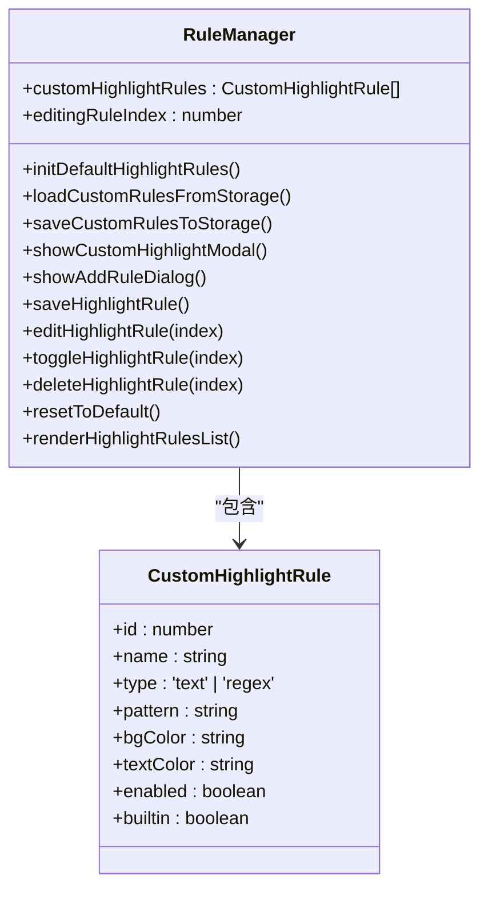
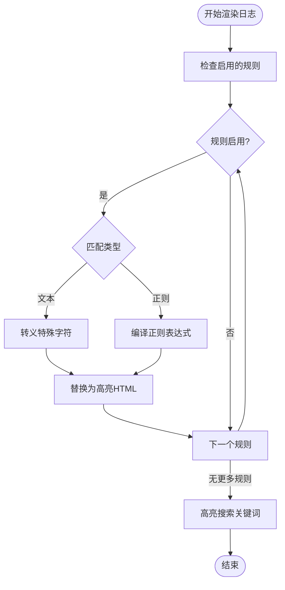
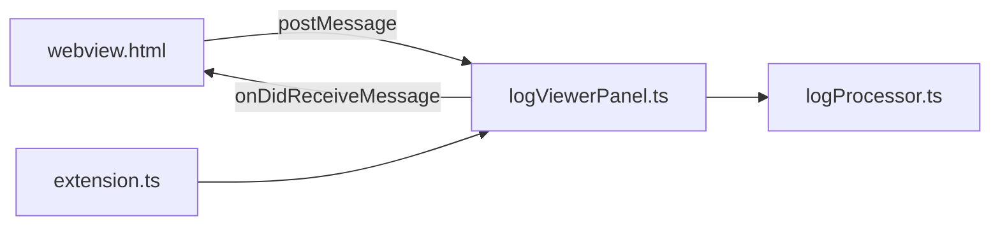

# 自定义高亮规则

<cite>
**本文档引用的文件**   
- [CUSTOM_HIGHLIGHT_FUNCTIONS.js](file://CUSTOM_HIGHLIGHT_FUNCTIONS.js)
- [HIGHLIGHT_RULES.md](file://HIGHLIGHT_RULES.md)
- [webview.html](file://src/webview.html)
- [logViewerPanel.ts](file://src/logViewerPanel.ts)
- [extension.ts](file://src/extension.ts)
</cite>

## 目录
1. [简介](#简介)
2. [项目结构](#项目结构)
3. [核心组件](#核心组件)
4. [架构概述](#架构概述)
5. [详细组件分析](#详细组件分析)
6. [依赖分析](#依赖分析)
7. [性能考虑](#性能考虑)
8. [故障排除指南](#故障排除指南)
9. [结论](#结论)

## 简介
本项目 `large_log_check` 是一个用于查看和分析大型日志文件的 Visual Studio Code 扩展。其核心功能之一是自定义高亮规则，允许用户通过 UI 界面灵活地添加、编辑、删除和启用/禁用高亮规则。这些规则可以基于文本匹配或正则表达式进行定义，并支持背景色与文字色的自定义，提供实时预览机制。所有自定义规则数据通过浏览器的 `localStorage` 实现持久化存储，并在下次打开时自动加载。

## 项目结构
项目结构清晰，主要分为源代码目录 `src` 和根目录下的配置与说明文件。`src` 目录包含扩展的主要逻辑实现，包括 `extension.ts`（扩展入口）、`logProcessor.ts`（日志处理）、`logViewerPanel.ts`（日志查看器面板）和 `webview.html`（Webview UI）。根目录下的 `CUSTOM_HIGHLIGHT_FUNCTIONS.js` 和 `HIGHLIGHT_RULES.md` 文件虽然在当前上下文中未能成功读取，但根据命名推测，它们分别用于定义自定义高亮函数和记录高亮规则的使用方法。

## 核心组件
核心组件包括 `LogViewerPanel` 类，它负责创建和管理 Webview 面板，处理来自 Webview 的消息，并与 `LogProcessor` 交互以执行日志处理任务。`webview.html` 文件定义了用户界面，包括自定义高亮规则的管理界面，允许用户通过按钮和表单进行规则的增删改查操作。

**Section sources**
- [logViewerPanel.ts](file://src/logViewerPanel.ts#L6-L510)
- [webview.html](file://src/webview.html#L1-L4301)

## 架构概述
系统架构采用典型的 VS Code 扩展模式，分为后端（Extension Host）和前端（Webview）两部分。后端由 `extension.ts` 和 `logViewerPanel.ts` 组成，负责与 VS Code API 交互和文件系统操作。前端由 `webview.html` 构成，提供用户交互界面。两者通过 `postMessage` 和 `onDidReceiveMessage` 进行通信。

```mermaid
graph TB
subgraph "后端 (Extension Host)"
A[extension.ts] --> B[logViewerPanel.ts]
B --> C[logProcessor.ts]
end
subgraph "前端 (Webview)"
D[webview.html]
end
D < --> |消息通信| B
```

**Diagram sources **
- [extension.ts](file://src/extension.ts#L1-L116)
- [logViewerPanel.ts](file://src/logViewerPanel.ts#L6-L510)
- [webview.html](file://src/webview.html#L1-L4301)

## 详细组件分析

### 自定义高亮规则管理分析
自定义高亮规则功能在 `webview.html` 中实现，通过 JavaScript 函数 `showCustomHighlightModal` 打开规则管理模态框。用户可以添加新规则，指定规则名称、匹配类型（文本或正则）、匹配模式、背景色、文字色和启用状态。规则数据存储在 `customHighlightRules` 数组中，并通过 `localStorage` 持久化。

#### 对象关系图


**Diagram sources **
- [webview.html](file://src/webview.html#L2258-L4147)

#### 规则应用流程图


**Diagram sources **
- [webview.html](file://src/webview.html#L1908-L1938)

### 操作流程示例
1. 用户点击工具栏上的“🎨 高亮规则”按钮，触发 `showCustomHighlightModal()` 函数。
2. 系统显示规则管理模态框，列出所有内置和自定义规则。
3. 用户点击“➕ 添加高亮规则”按钮，填写规则表单，包括名称、匹配类型、模式、颜色等。
4. 提交后，`saveHighlightRule()` 函数将新规则添加到 `customHighlightRules` 数组，并调用 `saveCustomRulesToStorage()` 将非内置规则保存到 `localStorage`。
5. 系统调用 `renderLines()` 重新渲染日志，应用新的高亮规则。
6. 下次打开日志时，`initDefaultHighlightRules()` 会调用 `loadCustomRulesFromStorage()` 从 `localStorage` 加载自定义规则，实现持久化。

**Section sources**
- [webview.html](file://src/webview.html#L734-L4147)

## 依赖分析
项目依赖于 VS Code 的 API，通过 `vscode` 模块进行交互。前端与后端通过消息传递机制通信，依赖于 `postMessage` 和 `onDidReceiveMessage`。自定义高亮规则功能不依赖外部库，使用原生 JavaScript 实现。



**Diagram sources **
- [logViewerPanel.ts](file://src/logViewerPanel.ts#L54-L101)
- [webview.html](file://src/webview.html#L734-L4147)

## 性能考虑
对于大型日志文件，系统采用分页加载策略，避免一次性加载过多数据导致性能问题。高亮规则在客户端（Webview）应用，利用浏览器的渲染能力，减少后端处理负担。`localStorage` 的使用确保了规则数据的快速读取，不影响日志加载速度。

## 故障排除指南
如果自定义高亮规则未生效，请检查：
1. 规则是否已启用（复选框是否勾选）。
2. 正则表达式格式是否正确，错误的正则会导致规则应用失败。
3. `localStorage` 是否被清除，这将导致自定义规则丢失。
4. 浏览器控制台是否有错误日志，可通过开发者工具查看。

**Section sources**
- [webview.html](file://src/webview.html#L1927-L1929)

## 结论
`large_log_check` 扩展的自定义高亮规则功能设计合理，通过 `webview.html` 中的 JavaScript 实现了完整的规则管理界面，支持灵活的文本和正则匹配，以及颜色自定义。规则数据通过 `localStorage` 实现持久化，提供了良好的用户体验。该功能与 VS Code 的扩展架构紧密结合，通过消息通信在前后端之间传递数据，确保了系统的稳定性和性能。