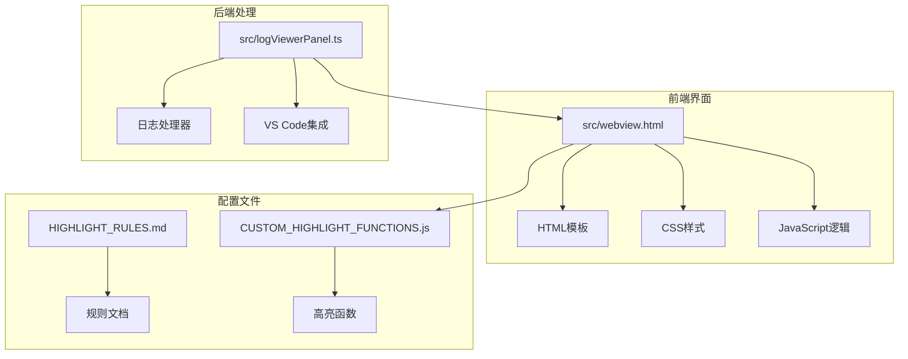
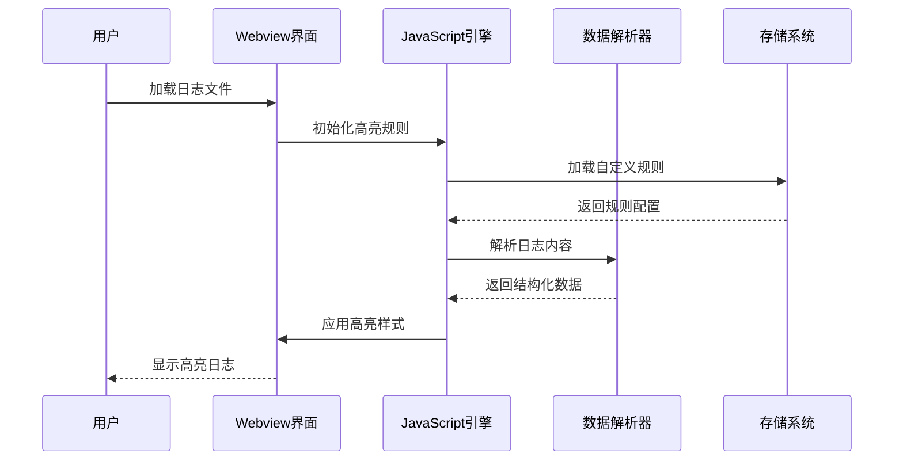
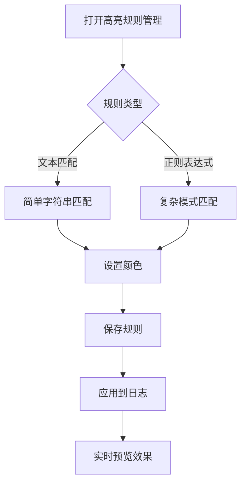
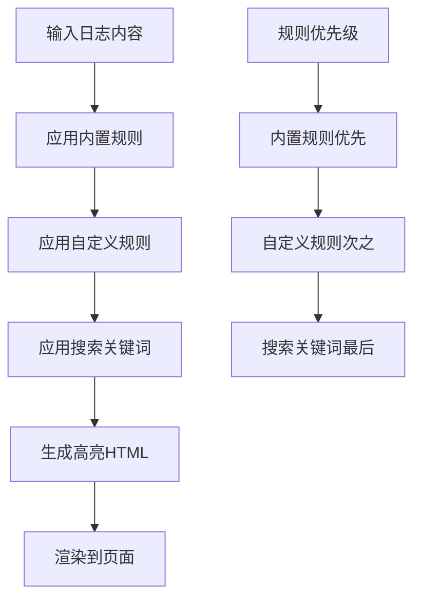
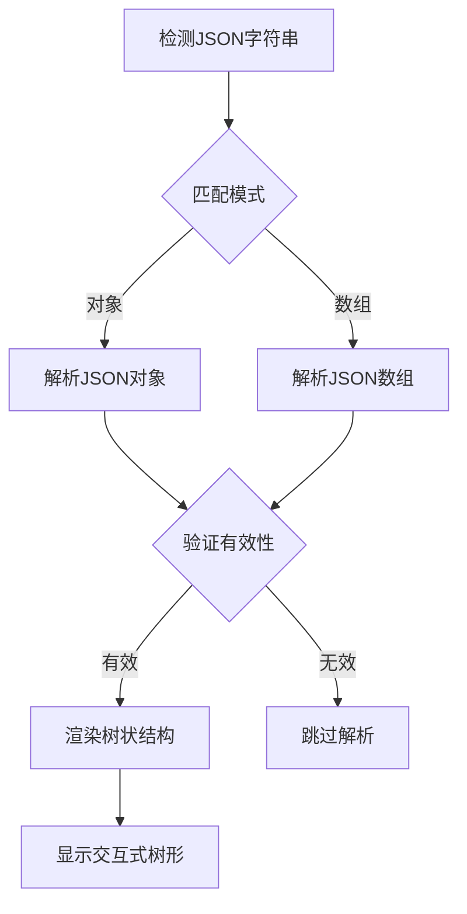
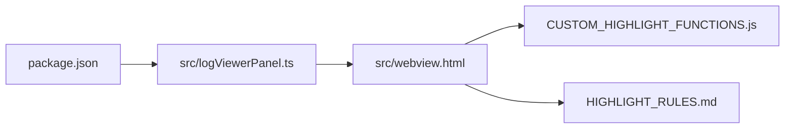

# 语法高亮

<cite>
**本文档引用的文件**
- [src/webview.html](file://src/webview.html)
- [HIGHLIGHT_RULES.md](file://HIGHLIGHT_RULES.md)
- [CUSTOM_HIGHLIGHT_FUNCTIONS.js](file://CUSTOM_HIGHLIGHT_FUNCTIONS.js)
- [src/logViewerPanel.ts](file://src/logProcessor.ts)
</cite>

## 目录
1. [简介](#简介)
2. [项目结构](#项目结构)
3. [核心组件](#核心组件)
4. [架构概览](#架构概览)
5. [详细组件分析](#详细组件分析)
6. [依赖关系分析](#依赖关系分析)
7. [性能考虑](#性能考虑)
8. [故障排除指南](#故障排除指南)
9. [结论](#结论)

## 简介

large_log_check是一个强大的日志查看器扩展，提供了先进的语法高亮功能来增强日志文件的可读性和分析效率。该系统通过CSS类和JavaScript函数实现了多层次的高亮机制，支持内置规则和自定义规则的灵活配置。

## 项目结构

该项目采用模块化架构，主要文件组织如下：

**图表来源**
- [src/webview.html](file://src/webview.html#L1-L50)
- [HIGHLIGHT_RULES.md](file://HIGHLIGHT_RULES.md#L1-L30)
- [CUSTOM_HIGHLIGHT_FUNCTIONS.js](file://CUSTOM_HIGHLIGHT_FUNCTIONS.js#L1-L20)

**章节来源**
- [src/webview.html](file://src/webview.html#L1-L100)
- [HIGHLIGHT_RULES.md](file://HIGHLIGHT_RULES.md#L1-L50)

## 核心组件

### CSS高亮样式系统

系统定义了完整的CSS类体系来实现不同类型的语法高亮：

#### 日志级别高亮
- `.highlight-error` - 错误级别（红色背景）
- `.highlight-warn` - 警告级别（黄色背景）
- `.highlight-info` - 信息级别（蓝色背景）
- `.highlight-debug` - 调试级别（紫色背景）

#### 结构化元素高亮
- `.highlight-time` - 时间戳（紫色）
- `.highlight-thread` - 线程名（青色）
- `.highlight-class` - 类名（绿色）
- `.highlight-method` - 方法名（橙色）

#### 自定义高亮规则
- `.custom-highlight` - 通用自定义高亮容器

**章节来源**
- [src/webview.html](file://src/webview.html#L420-L485)

### JSON/XML树状结构样式

系统提供了专门的样式来渲染结构化数据：

#### JSON树状结构
- `.json-tree` - 根容器
- `.json-key` - 键名（蓝色字体）
- `.json-string` - 字符串值（橙色）
- `.json-number` - 数字值（绿色）
- `.json-boolean` - 布尔值（蓝色粗体）
- `.json-null` - 空值（灰色斜体）

#### XML树状结构
- `.xml-tree` - XML根容器
- `.xml-tag` - 标签（青色）
- `.xml-attr-name` - 属性名（蓝色）
- `.xml-attr-value` - 属性值（橙色）

**章节来源**
- [src/webview.html](file://src/webview.html#L530-L620)

## 架构概览

语法高亮系统采用分层架构设计：

**图表来源**
- [src/webview.html](file://src/webview.html#L1854-L1890)
- [CUSTOM_HIGHLIGHT_FUNCTIONS.js](file://CUSTOM_HIGHLIGHT_FUNCTIONS.js#L2210-L2252)

## 详细组件分析

### 内置高亮规则系统

系统预设了8个内置高亮规则，涵盖最常见的日志元素：

#### 规则定义表

| 规则名称 | 匹配模式 | 颜色 | 说明 |
|---------|---------|------|------|
| 日志级别 - ERROR | `\b(ERROR\|FATAL\|SEVERE)\b` | 红色 (#f14c4c) | 错误级别日志 |
| 日志级别 - WARN | `\b(WARN\|WARNING)\b` | 黄色 (#cca700) | 警告级别日志 |
| 日志级别 - INFO | `\b(INFO)\b` | 蓝色 (#4fc1ff) | 信息级别日志 |
| 日志级别 - DEBUG | `\b(DEBUG\|TRACE\|VERBOSE)\b` | 紫色 (#b267e6) | 调试级别日志 |
| 时间戳 | `\d{4}[-/]\d{2}[-/]\d{2}[T\s]\d{2}:\d{2}:\d{2}(\.\d+)?` | 紫色 (#b267e6) | 时间戳格式 |
| 线程名 | `\[([a-zA-Z][a-zA-Z0-9-_]*)\]` | 青色 (#06b6d4) | 线程名称 |
| 类名 | `\b([a-z][a-z0-9_]*(?:\.[a-z][a-z0-9_]*)*\.[A-Z][a-zA-Z0-9_]*)\b` | 绿色 (#10b981) | Java类全限定名 |
| 方法名 | `\b([a-z][a-zA-Z0-9_]+):(\d+)\b` | 橙色 (#f59e0b) | 方法名:行号格式 |

**章节来源**
- [src/webview.html](file://src/webview.html#L2215-L2225)
- [HIGHLIGHT_RULES.md](file://HIGHLIGHT_RULES.md#L12-L22)

### 自定义高亮规则管理

#### 规则配置界面

用户可以通过图形界面管理自定义高亮规则：

**图表来源**
- [CUSTOM_HIGHLIGHT_FUNCTIONS.js](file://CUSTOM_HIGHLIGHT_FUNCTIONS.js#L15-L85)

#### 规则生命周期管理

1. **创建规则** - 用户输入规则名称、匹配模式和颜色
2. **验证规则** - 检查正则表达式语法和有效性
3. **存储规则** - 保存到localStorage
4. **应用规则** - 在日志渲染时应用高亮
5. **编辑规则** - 修改现有规则配置
6. **删除规则** - 移除不需要的规则

**章节来源**
- [CUSTOM_HIGHLIGHT_FUNCTIONS.js](file://CUSTOM_HIGHLIGHT_FUNCTIONS.js#L34-L125)

### 高亮应用算法

#### 关键词高亮函数

系统实现了高效的关键词高亮算法：

**图表来源**
- [src/webview.html](file://src/webview.html#L1854-L1890)

#### 高亮规则应用顺序

1. **内置规则** - 按预设顺序应用（日志级别 → 时间戳 → 线程名 → 类名 → 方法名）
2. **自定义规则** - 按添加顺序应用
3. **搜索关键词** - 最后应用，具有最高优先级

**章节来源**
- [src/webview.html](file://src/webview.html#L1860-L1888)

### 结构化数据解析

#### JSON解析器

系统能够自动检测和解析JSON数据：

**图表来源**
- [src/webview.html](file://src/webview.html#L3629-L3766)

#### XML解析器

XML解析功能提供类似的树状结构展示：

- 自动检测XML格式
- DOM解析和验证
- 递归渲染树形结构
- 可折叠节点显示

**章节来源**
- [src/webview.html](file://src/webview.html#L3768-L3839)

## 依赖关系分析

### 文件间依赖关系

**图表来源**
- [src/webview.html](file://src/webview.html#L1164-L1166)
- [src/logViewerPanel.ts](file://src/logViewerPanel.ts#L1-L10)

### 外部依赖

- **VS Code API** - 提供Webview通信和文件系统访问
- **DOM Parser** - 用于XML解析
- **localStorage** - 本地存储自定义规则

**章节来源**
- [src/logViewerPanel.ts](file://src/logViewerPanel.ts#L1-L50)

## 性能考虑

### 高亮性能优化

1. **规则优先级** - 内置规则优先应用，减少不必要的匹配
2. **懒加载** - 大文件采用分页加载策略
3. **缓存机制** - 缓存解析后的结构化数据
4. **防抖处理** - 搜索输入采用防抖技术

### 内存管理

- **规则存储** - 使用localStorage避免内存泄漏
- **DOM操作** - 批量更新DOM，减少重绘
- **事件委托** - 使用事件委托减少事件监听器数量

## 故障排除指南

### 常见问题及解决方案

#### 正则表达式不生效
- **原因**：正则语法错误或转义字符问题
- **解决**：使用在线正则表达式测试工具验证

#### 高亮规则丢失
- **原因**：浏览器localStorage被清理
- **解决**：重新添加规则或重置为默认规则

#### JSON/XML解析失败
- **原因**：数据格式不正确或编码问题
- **解决**：检查数据完整性，确保有效格式

**章节来源**
- [HIGHLIGHT_RULES.md](file://HIGHLIGHT_RULES.md#L193-L217)

### 调试技巧

1. **控制台日志** - 查看JavaScript控制台错误信息
2. **规则验证** - 使用内置验证功能检查规则语法
3. **性能监控** - 监控高亮处理时间和内存使用

## 结论

large_log_check的语法高亮系统通过精心设计的架构和算法，提供了强大而灵活的日志分析能力。系统的主要优势包括：

1. **多层次高亮** - 支持内置规则和自定义规则的无缝结合
2. **智能解析** - 自动识别和解析JSON/XML结构化数据
3. **高性能** - 优化的算法和缓存机制确保流畅的用户体验
4. **易用性** - 直观的图形界面和丰富的配置选项

该系统不仅满足了基本的日志查看需求，还为高级用户提供了深度定制的能力，是现代日志分析工具的重要创新。