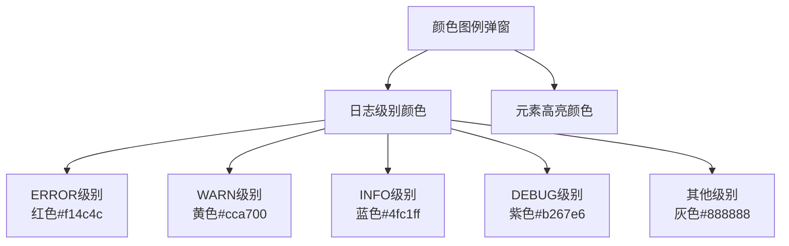
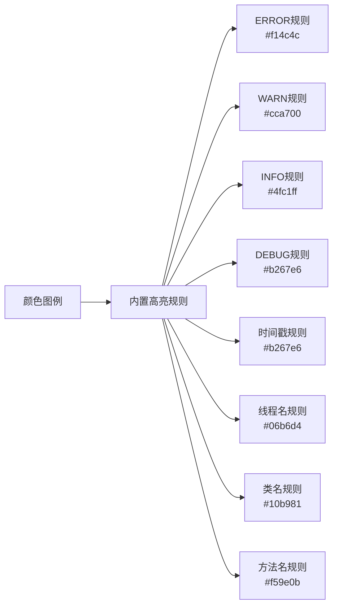

# 颜色图例

<cite>
**本文档引用的文件**
- [README.md](file://README.md)
- [src/webview.html](file://src/webview.html)
- [src/logViewerPanel.ts](file://src/logViewerPanel.ts)
- [package.json](file://package.json)
</cite>

## 目录
1. [简介](#简介)
2. [功能概述](#功能概述)
3. [颜色图例界面结构](#颜色图例界面结构)
4. [日志级别颜色映射](#日志级别颜色映射)
5. [元素高亮颜色方案](#元素高亮颜色方案)
6. [交互逻辑实现](#交互逻辑实现)
7. [与高亮规则的关系](#与高亮规则的关系)
8. [视觉设计原则](#视觉设计原则)
9. [使用场景](#使用场景)
10. [总结](#总结)

## 简介

颜色图例是大日志文件查看器中的一个重要功能组件，它为用户提供了一个直观的颜色对照表，帮助用户理解和记忆日志文件中各种颜色编码的含义。通过点击工具栏中的"🎨 颜色图例"按钮，用户可以打开一个专门的弹窗，查看不同日志级别和元素类型的对应颜色方案。

## 功能概述

颜色图例功能的主要作用包括：

- **提供颜色对照**：展示日志级别和元素类型与颜色的对应关系
- **增强可读性**：帮助用户快速识别日志内容的重要程度
- **统一视觉语言**：确保用户对颜色编码有一致的理解
- **辅助学习**：新用户可以通过颜色图例快速掌握系统的颜色编码规范

## 颜色图例界面结构

颜色图例采用简洁的网格布局，分为两个主要部分：

### 日志级别颜色区



**图表来源**
- [src/webview.html](file://src/webview.html#L913-L991)

### 元素高亮颜色区

颜色图例还展示了系统自动高亮的各种元素类型，包括线程名、类名、方法名等，每种元素都有其特定的颜色标识。

**节来源**
- [src/webview.html](file://src/webview.html#L913-L991)

## 日志级别颜色映射

系统为四种主要的日志级别分配了特定的颜色：

| 日志级别 | 颜色代码 | 对应英文关键字 | 视觉效果 | 使用场景 |
|---------|----------|---------------|----------|----------|
| ERROR | #f14c4c | ERROR, FATAL, SEVERE | 深红色 | 系统严重错误，需要立即关注 |
| WARN | #cca700 | WARN, WARNING | 黄色 | 潜在问题或需要注意的情况 |
| INFO | #4fc1ff | INFO, INFORMATION | 蓝色 | 正常业务流程和状态信息 |
| DEBUG | #b267e6 | DEBUG, TRACE, VERBOSE | 紫色 | 详细的调试信息和开发阶段 |
| 其他 | #888888 | 无法识别级别 | 灰色 | 无法识别日志级别的行 |

### 颜色选择原理

这些颜色的选择遵循以下设计原则：
- **语义化**：红色代表危险和错误，黄色代表警告，蓝色代表信息，紫色代表调试
- **对比度**：确保在不同背景下的可读性
- **一致性**：在整个应用中保持统一的颜色编码

**节来源**
- [src/webview.html](file://src/webview.html#L921-L955)

## 元素高亮颜色方案

除了日志级别颜色外，颜色图例还展示了系统自动高亮的各种编程元素：

### 线程名高亮
- **颜色**：#06b6d4（青色）
- **格式**：`[thread-name]` 形式
- **示例**：`[http-nio-8080-exec-1]`、`[main]`、`[pool-1-thread-2]`

### 类名高亮  
- **颜色**：#10b981（绿色）
- **格式**：Java包名.类名格式
- **示例**：`com.example.service.UserService`、`org.springframework.web.servlet.DispatcherServlet`

### 方法名高亮
- **颜色**：#f59e0b（橙色）
- **支持格式**：
  - `<method>` 形式
  - `method:123` 行号格式
  - `.method(` 方法调用
  - `method接口` 接口方法

**节来源**
- [src/webview.html](file://src/webview.html#L958-L978)

## 交互逻辑实现

颜色图例功能的交互逻辑通过JavaScript函数实现：

### 显示功能
```javascript
function showLegendModal() {
    document.getElementById('legendModal').style.display = 'block';
}
```

### 关闭功能
```javascript
function closeLegendModal() {
    document.getElementById('legendModal').style.display = 'none';
}
```

### 触发机制
颜色图例按钮位于工具栏的过滤面板中，点击后会触发 `showLegendModal()` 函数，显示弹窗。

**节来源**
- [src/webview.html](file://src/webview.html#L2138-L2144)

## 与高亮规则的关系

颜色图例与系统的自定义高亮规则功能密切相关：

### 内置高亮规则
系统预设了8个内置高亮规则，其中4个与颜色图例直接对应：



**图表来源**
- [src/webview.html](file://src/webview.html#L2216-L2225)

### 自定义规则集成
用户创建的自定义高亮规则也会在颜色图例中体现，但会添加"自定义"标签进行区分。

**节来源**
- [src/webview.html](file://src/webview.html#L2216-L2225)

## 视觉设计原则

颜色图例的设计遵循VSCode的视觉设计语言：

### 主题适配
- 使用 `var(--vscode-editorWidget-background)` 等CSS变量确保与VSCode主题一致
- 支持明暗两种主题模式
- 采用扁平化设计风格

### 布局结构
- **头部**：标题和关闭按钮
- **主体**：网格布局展示各种颜色对应关系
- **底部**：快捷键提示和使用说明

### 可访问性
- 高对比度的颜色组合
- 清晰的文字说明
- 适当的间距和字体大小

**节来源**
- [src/webview.html](file://src/webview.html#L913-L991)

## 使用场景

颜色图例功能在以下场景中特别有用：

### 新手用户引导
- 帮助新用户快速理解系统的颜色编码规范
- 减少学习成本，提高使用效率

### 团队协作
- 确保团队成员对颜色含义有一致的理解
- 便于知识传递和经验分享

### 快速参考
- 在分析复杂日志时，随时查阅颜色对应关系
- 提高问题诊断的速度和准确性

### 教育培训
- 作为培训材料的一部分，帮助学员掌握日志分析技巧
- 提供标准化的颜色参考

## 总结

颜色图例功能是大日志文件查看器中一个精心设计的用户体验组件。它不仅提供了直观的颜色对照表，还与系统的其他功能（如高亮规则、过滤功能）紧密集成，形成了完整的日志可视化体系。

### 核心价值
- **提升可读性**：通过颜色编码使日志内容更易于理解
- **增强一致性**：确保用户对颜色含义的一致认知
- **简化学习曲线**：降低新用户的使用门槛
- **支持专业分析**：为高级用户提供精确的颜色参考

### 设计亮点
- 与VSCode主题深度集成
- 语义化的颜色选择
- 清晰的信息层次结构
- 便捷的交互方式

颜色图例功能体现了现代软件工具中"以用户为中心"的设计理念，通过简洁而有效的视觉设计，大大提升了日志分析工作的效率和体验。