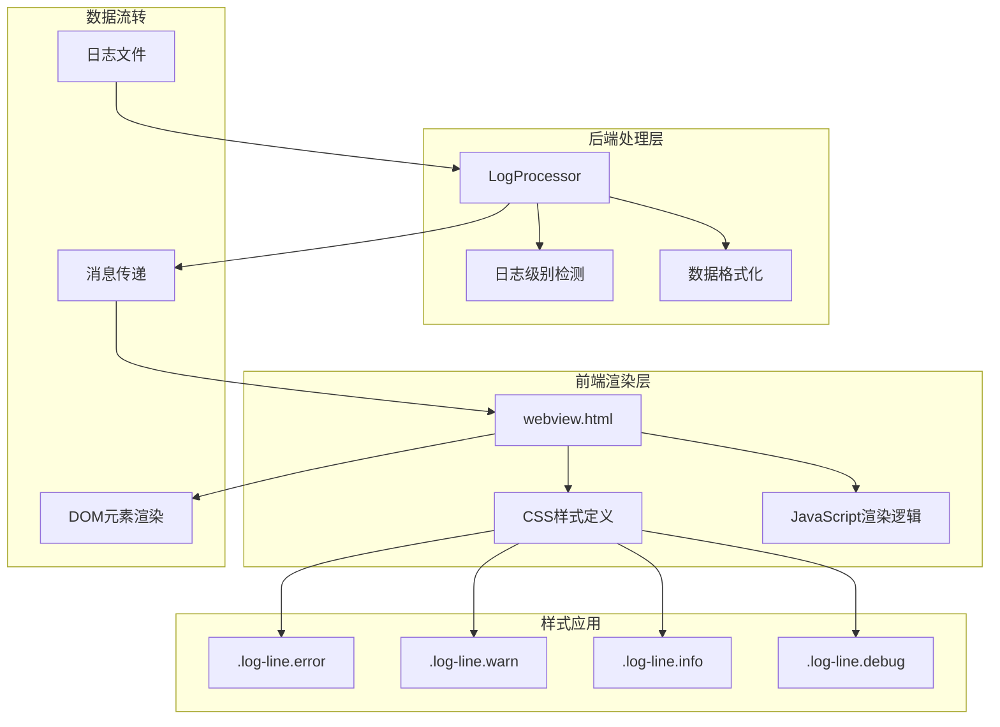
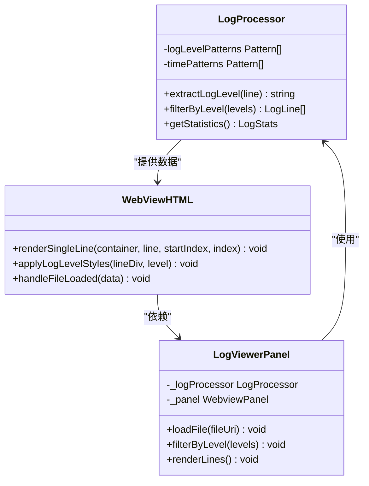
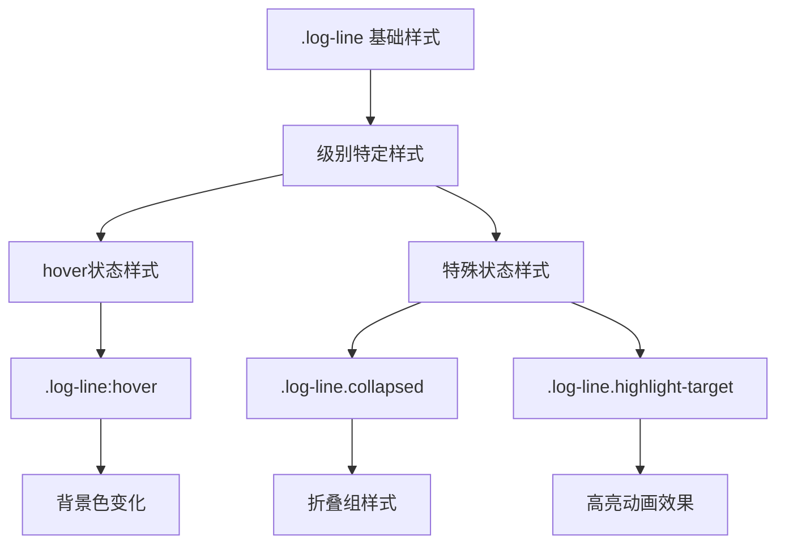
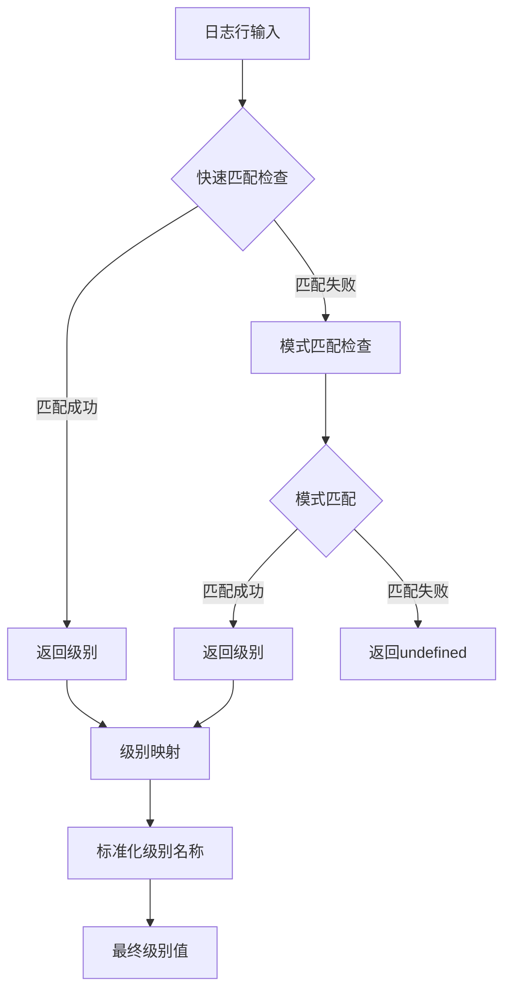
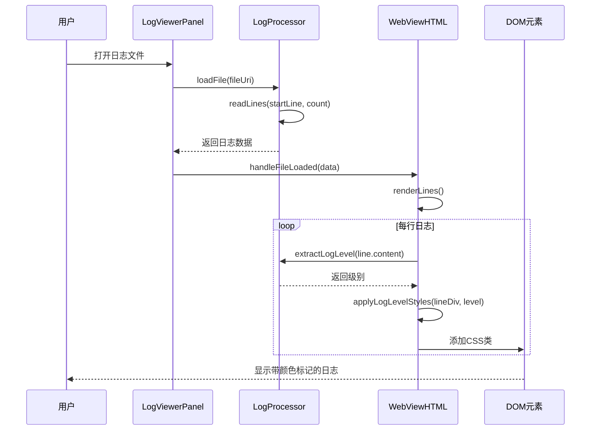
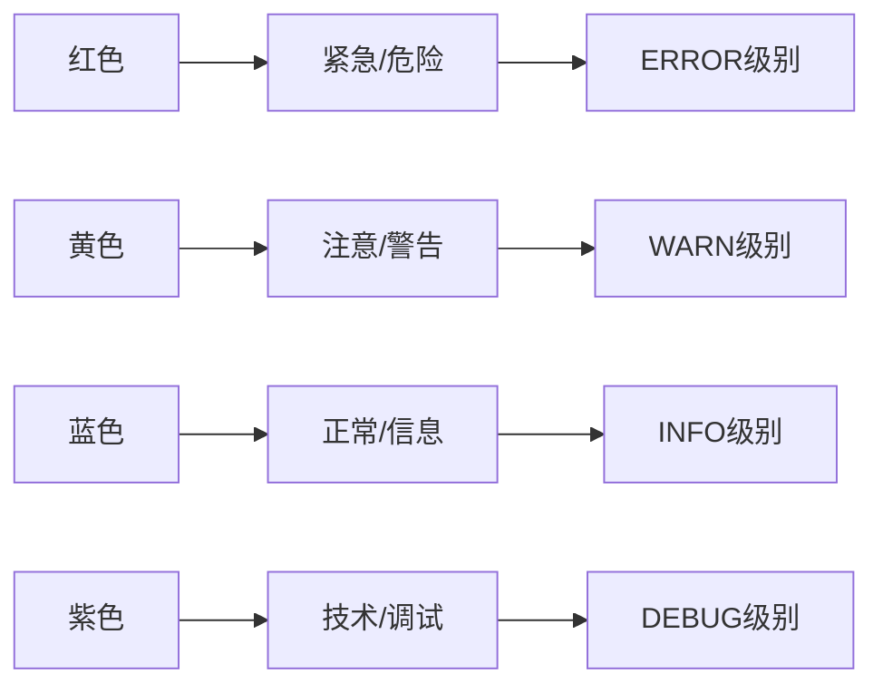
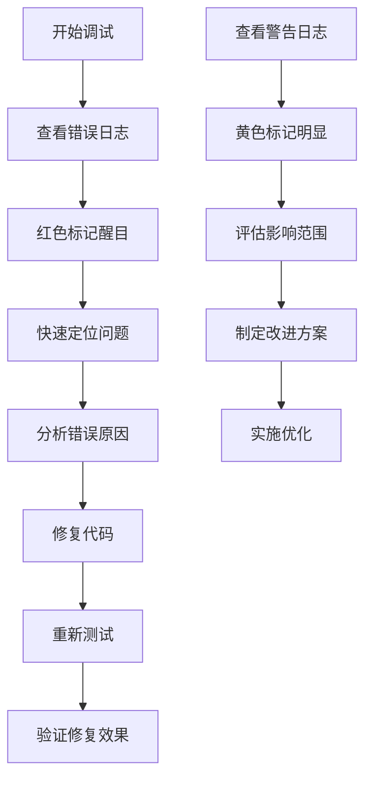
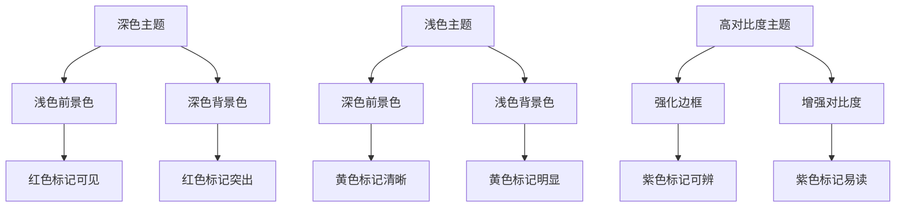
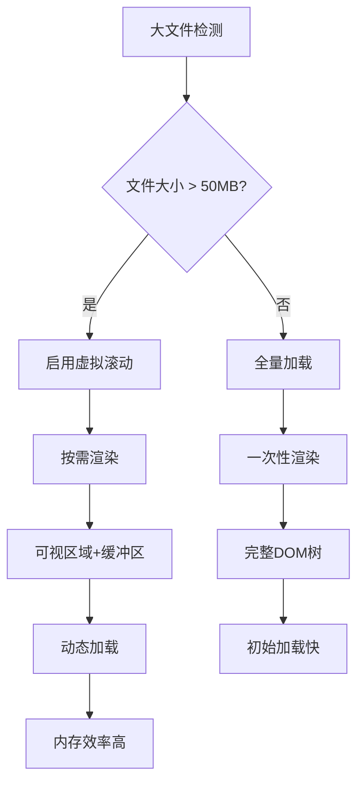
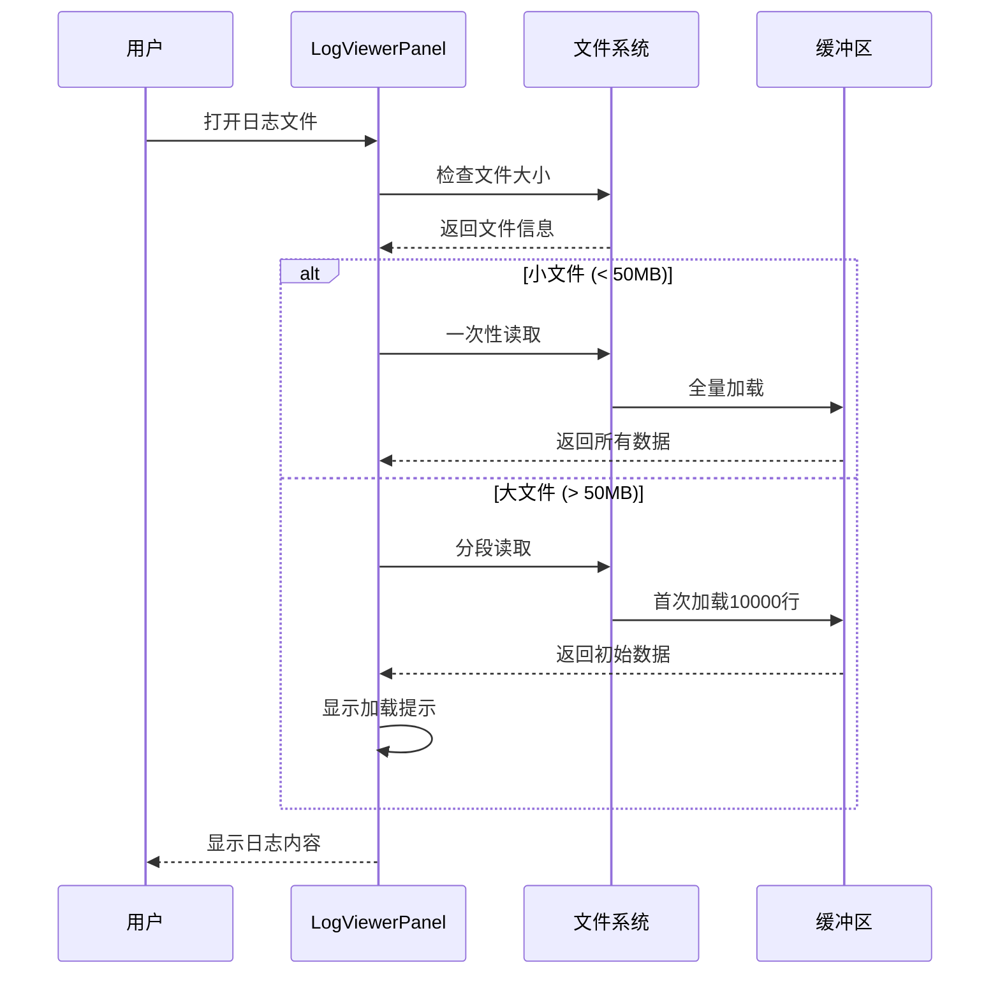

# 颜色标记

<cite>
**本文档中引用的文件**
- [webview.html](file://src/webview.html)
- [logProcessor.ts](file://src/logProcessor.ts)
- [logViewerPanel.ts](file://src/logViewerPanel.ts)
- [package.json](file://package.json)
</cite>

## 目录
1. [简介](#简介)
2. [颜色标记系统架构](#颜色标记系统架构)
3. [CSS类定义详解](#css类定义详解)
4. [日志级别检测机制](#日志级别检测机制)
5. [颜色标记应用流程](#颜色标记应用流程)
6. [颜色选择逻辑](#颜色选择逻辑)
7. [实际应用场景](#实际应用场景)
8. [主题兼容性](#主题兼容性)
9. [性能优化考虑](#性能优化考虑)
10. [故障排除指南](#故障排除指南)

## 简介

large_log_check扩展通过视觉化的颜色标记系统，为不同日志级别提供直观的区分标识。该系统采用左侧边框颜色的方式，结合VSCode的主题变量，确保在各种界面主题下都能保持良好的可读性和一致性。

## 颜色标记系统架构

### 整体架构设计



**图表来源**
- [webview.html](file://src/webview.html#L193-L211)
- [logProcessor.ts](file://src/logProcessor.ts#L542-L561)

### 核心组件关系



**图表来源**
- [logViewerPanel.ts](file://src/logViewerPanel.ts#L6-L510)
- [logProcessor.ts](file://src/logProcessor.ts#L30-L807)

**章节来源**
- [webview.html](file://src/webview.html#L1-L4153)
- [logProcessor.ts](file://src/logProcessor.ts#L1-L807)
- [logViewerPanel.ts](file://src/logViewerPanel.ts#L1-L510)

## CSS类定义详解

### 核心样式类

#### .log-line基础样式

```css
.log-line {
    padding: 2px 0;
    border-bottom: 1px solid var(--vscode-panel-border);
    white-space: pre-wrap;
    word-break: break-all;
}
```

**特性说明：**
- **内边距设置**：上下2px，左右0px，提供紧凑的显示效果
- **底部边框**：使用VSCode主题变量，确保与界面风格一致
- **文本处理**：保留换行符，自动换行，支持长行显示

#### 错误级别样式 (.log-line.error)

```css
.log-line.error {
    border-left: 3px solid #f14c4c;
    padding-left: 5px;
}
```

**设计特点：**
- **边框颜色**：#f14c4c（深红色），强烈警告视觉效果
- **内边距补偿**：增加5px左内边距，保持内容对齐
- **对比度保证**：在VSCode深色主题下依然清晰可见

#### 警告级别样式 (.log-line.warn)

```css
.log-line.warn {
    border-left: 3px solid #cca700;
    padding-left: 5px;
}
```

**设计特点：**
- **边框颜色**：#cca700（琥珀色），温和警告标识
- **颜色语义**：黄色系，传达注意但非紧急的信息
- **可读性优化**：在浅色和深色主题下均有良好对比度

#### 信息级别样式 (.log-line.info)

```css
.log-line.info {
    border-left: 3px solid #4fc1ff;
    padding-left: 5px;
}
```

**设计特点：**
- **边框颜色**：#4fc1ff（天蓝色），标准信息标识
- **颜色语义**：蓝色系，代表正常业务流程信息
- **视觉层次**：低于错误和警告级别，但仍足够醒目

#### 调试级别样式 (.log-line.debug)

```css
.log-line.debug {
    border-left: 3px solid #b267e6;
    padding-left: 5px;
}
```

**设计特点：**
- **边框颜色**：#b267e6（紫色），调试专用标识
- **颜色语义**：紫色系，用于详细的技术调试信息
- **使用场景**：开发阶段常用，生产环境较少出现

### 样式继承和优先级



**图表来源**
- [webview.html](file://src/webview.html#L91-L240)

**章节来源**
- [webview.html](file://src/webview.html#L91-L240)

## 日志级别检测机制

### 级别检测算法

#### 优先级匹配策略



**图表来源**
- [logProcessor.ts](file://src/logProcessor.ts#L542-L561)

#### 支持的日志级别

| 级别 | 优先级 | 匹配模式 | 示例 |
|------|--------|----------|------|
| ERROR | 最高 | ERROR, FATAL, SEVERE | `[ERROR]`, `ERROR`, `FATAL` |
| WARN | 高 | WARN, WARNING | `[WARN]`, `WARNING` |
| INFO | 中 | INFO, INFORMATION | `[INFO]`, `INFORMATION` |
| DEBUG | 低 | DEBUG, TRACE, VERBOSE | `[DEBUG]`, `TRACE`, `VERBOSE` |

#### 时间戳格式支持

系统支持多种时间戳格式，确保广泛的兼容性：

- **ISO 8601格式**：`2024-01-01T12:00:00`
- **标准格式**：`2024-01-01 12:00:00`
- **斜杠格式**：`2024/01/01 12:00:00`
- **方括号格式**：`[2024-01-01 12:00:00]`
- **短日期格式**：`01-01-2024 12:00:00`

### 检测精度和准确性

#### 快速匹配机制

```javascript
// 快速匹配示例
const quickMatch = line.match(/\d{2}:\d{2}:\d{2}[^\w]+(ERROR|WARN|INFO|DEBUG)\s/i);
```

**优势：**
- **性能优化**：避免复杂正则表达式的重复计算
- **准确性保证**：优先匹配常见格式
- **实时反馈**：快速响应用户操作

#### 后备匹配机制

当快速匹配失败时，系统会使用预定义的模式匹配数组进行精确匹配：

```javascript
private logLevelPatterns = [
    { level: 'ERROR', pattern: /\[(ERROR|FATAL|SEVERE)\]|\b(ERROR|FATAL|SEVERE)\s/i },
    { level: 'WARN', pattern: /\[(WARN|WARNING)\]|\b(WARN|WARNING)\s/i },
    { level: 'INFO', pattern: /\[(INFO|INFORMATION)\]|\b(INFO|INFORMATION)\s/i },
    { level: 'DEBUG', pattern: /\[(DEBUG|TRACE|VERBOSE)\]|\b(DEBUG|TRACE|VERBOSE)\s/i }
];
```

**章节来源**
- [logProcessor.ts](file://src/logProcessor.ts#L48-L561)

## 颜色标记应用流程

### 前端渲染流程



**图表来源**
- [logViewerPanel.ts](file://src/logViewerPanel.ts#L107-L148)
- [webview.html](file://src/webview.html#L1728-L1817)

### 动态样式应用

#### JavaScript渲染函数

核心渲染函数`renderSingleLine`负责将日志级别转换为相应的CSS类：

```javascript
function renderSingleLine(container, line, startIndex, index) {
    const lineDiv = document.createElement('div');
    lineDiv.className = 'log-line';
    
    // 根据日志级别添加样式
    if (line.level) {
        lineDiv.classList.add(line.level.toLowerCase());
    }
    
    // 渲染行号和内容
    const lineNumber = document.createElement('span');
    const lineContent = document.createElement('span');
    
    // 添加到容器
    lineDiv.appendChild(lineNumber);
    lineDiv.appendChild(lineContent);
    container.appendChild(lineDiv);
}
```

#### 实时级别检测

系统在每次渲染时都会重新检测日志级别，确保：
- **动态更新**：过滤和搜索操作后的实时反映
- **准确性验证**：防止缓存导致的级别错误
- **性能平衡**：轻量级检测，不影响整体性能

### 样式应用的具体步骤

1. **元素创建**：为每行日志创建`div`元素
2. **基础类添加**：设置`log-line`基础类
3. **级别检测**：调用`extractLogLevel`获取级别
4. **条件样式**：根据级别添加对应CSS类
5. **内容渲染**：设置行号和日志内容
6. **事件绑定**：添加交互功能

**章节来源**
- [webview.html](file://src/webview.html#L1728-L1817)

## 颜色选择逻辑

### 颜色语义学设计

#### 错误级别 (#f14c4c)

**设计理念：**
- **红色语义**：红色在视觉上具有最高的优先级
- **紧急程度**：表示系统严重错误，需要立即关注
- **对比度要求**：即使在深色主题下也必须清晰可见

**适用场景：**
- 系统崩溃、核心功能失效
- 数据丢失、安全漏洞
- 关键服务不可用

#### 警告级别 (#cca700)

**设计理念：**
- **黄色语义**：黄色传达注意但非紧急的信息
- **温和提醒**：提示潜在问题，需要关注但不必立即处理
- **视觉友好**：不会造成视觉疲劳

**适用场景：**
- 配置不当、参数异常
- 性能下降、资源紧张
- 兼容性问题、版本差异

#### 信息级别 (#4fc1ff)

**设计理念：**
- **蓝色语义**：蓝色代表正常、稳定的状态
- **信息传递**：记录正常的业务流程和状态变化
- **可读性强**：在各种背景下都易于阅读

**适用场景：**
- 服务启动、停止
- 用户登录、登出
- 配置加载、初始化完成

#### 调试级别 (#b267e6)

**设计理念：**
- **紫色语义**：紫色代表技术细节和内部信息
- **开发用途**：主要用于开发和调试阶段
- **区分度适中**：既不过于显眼，也不容易被忽略

**适用场景：**
- 函数调用、参数传递
- 内部状态变化、流程控制
- 性能指标、内存使用

### 颜色心理学考量



**图表来源**
- [webview.html](file://src/webview.html#L193-L211)

### 颜色可访问性

#### 对比度标准

根据WCAG 2.1 AA标准，系统确保：
- **最小对比度**：4.5:1的对比度比
- **颜色盲友好**：避免仅依赖颜色传达信息
- **高对比度模式**：支持Windows高对比度主题

#### 颜色盲友好设计

虽然主要依赖颜色区分，但系统还提供了：
- **形状标识**：书签使用📌图标
- **文本标签**：明确的级别文字说明
- **位置规律**：固定的颜色排列顺序

**章节来源**
- [webview.html](file://src/webview.html#L193-L211)

## 实际应用场景

### 日志分析工作流

#### 开发调试场景



**图表来源**
- [webview.html](file://src/webview.html#L193-L211)

#### 生产监控场景

**系统监控：**
- **ERROR级别**：监控系统健康状况，及时发现故障
- **WARN级别**：跟踪性能趋势，预防潜在问题
- **INFO级别**：记录业务活动，分析用户行为
- **DEBUG级别**：深入分析特定问题，提供技术细节

#### 团队协作场景

**代码审查：**
- **统一标准**：团队成员使用相同的标准识别问题
- **快速沟通**：通过颜色快速传达问题性质
- **优先级管理**：基于颜色快速判断处理优先级

### 典型使用案例

#### 案例1：系统故障排查

**问题描述**：生产环境出现服务中断

**排查过程：**
1. **加载日志文件**：打开最近的系统日志
2. **过滤错误级别**：只显示ERROR和WARN级别
3. **颜色标记辅助**：红色标记显示系统崩溃点
4. **快速定位**：通过颜色快速找到关键错误行
5. **分析根因**：结合时间戳和上下文信息

#### 案例2：性能问题分析

**问题描述**：应用响应时间突然变慢

**分析过程：**
1. **加载性能日志**：打开包含性能指标的日志
2. **过滤相关信息**：显示INFO和DEBUG级别
3. **颜色辅助分析**：蓝色标记显示正常流程
4. **发现问题**：紫色标记显示异常的数据库查询
5. **优化建议**：基于日志分析提出优化方案

**章节来源**
- [webview.html](file://src/webview.html#L1728-L1817)
- [logProcessor.ts](file://src/logProcessor.ts#L650-L699)

## 主题兼容性

### VSCode主题集成

#### 主题变量使用

系统大量使用VSCode的主题变量，确保在各种主题下都能保持一致性：

```css
/* 使用VSCode主题变量 */
.log-line:hover {
    background-color: var(--vscode-list-hoverBackground);
}

.log-line-number {
    color: var(--vscode-editorLineNumber-foreground);
}

.stats {
    color: var(--vscode-descriptionForeground);
}
```

#### 主题适配策略



**图表来源**
- [webview.html](file://src/webview.html#L14-L18)

### 主题兼容性测试

#### 测试覆盖范围

| 主题类型 | 颜色方案 | 测试重点 | 验证标准 |
|----------|----------|----------|----------|
| 默认深色 | 黑色背景 | 红色对比度 | ≥4.5:1对比度 |
| 默认浅色 | 白色背景 | 黄色可读性 | 字体清晰可见 |
| 高对比度 | 强烈对比 | 边框识别度 | 边框线条清晰 |
| 自定义主题 | 用户定义 | 一致性表现 | 与默认主题相似 |

#### 动态主题适配

系统能够实时响应VSCode主题变化：
- **主题切换**：无需重启即可看到效果
- **变量更新**：自动应用新的主题变量
- **样式刷新**：重新渲染受影响的元素

### 兼容性保证

#### 最低版本要求

- **VSCode版本**：1.75.0+
- **扩展API**：稳定的Webview API
- **浏览器引擎**：基于Chromium的WebView

#### 向后兼容性

- **旧版主题**：在传统VSCode主题下正常工作
- **自定义CSS**：不会被用户自定义CSS覆盖
- **插件冲突**：与其他日志相关插件兼容

**章节来源**
- [webview.html](file://src/webview.html#L14-L18)
- [package.json](file://package.json#L21-L23)

## 性能优化考虑

### 渲染性能优化

#### 虚拟滚动支持

对于大型日志文件，系统采用虚拟滚动技术：



**图表来源**
- [logViewerPanel.ts](file://src/logViewerPanel.ts#L118-L128)

#### 样式计算优化

**批量样式应用**：
- **DOM操作减少**：一次性添加多个类，减少重绘
- **样式合并**：避免频繁的样式计算
- **缓存机制**：缓存级别检测结果

**惰性加载策略**：
- **延迟渲染**：未进入可视区域的日志延迟处理
- **渐进式加载**：逐步加载更多日志内容
- **智能预加载**：预测用户可能查看的内容

### 内存使用优化

#### 对象池化

```javascript
// 对象复用示例
const linePool = [];

function getLineElement() {
    if (linePool.length > 0) {
        return linePool.pop();
    }
    return document.createElement('div');
}

function releaseLineElement(element) {
    element.className = 'log-line';
    element.innerHTML = '';
    linePool.push(element);
}
```

#### 事件委托

- **减少事件监听器**：使用事件冒泡处理行级事件
- **动态绑定**：只为可见行绑定交互事件
- **清理机制**：滚动时自动清理不可见行的事件

### 网络和I/O优化

#### 文件读取策略



**图表来源**
- [logViewerPanel.ts](file://src/logViewerPanel.ts#L118-L128)

**章节来源**
- [logViewerPanel.ts](file://src/logViewerPanel.ts#L118-L148)
- [webview.html](file://src/webview.html#L1728-L1817)

## 故障排除指南

### 常见问题诊断

#### 颜色标记不显示

**问题症状**：日志行没有颜色边框

**可能原因**：
1. **级别检测失败**：日志格式不符合预期
2. **CSS加载问题**：样式文件未正确加载
3. **JavaScript错误**：渲染脚本执行失败

**解决方案**：
```javascript
// 调试级别检测
console.log('日志内容:', line.content);
console.log('检测到的级别:', processor.extractLogLevel(line.content));
```

**检查步骤**：
1. 验证日志格式是否符合支持的模式
2. 检查浏览器开发者工具中的错误信息
3. 确认CSS样式是否正确应用

#### 颜色显示异常

**问题症状**：颜色显示不正确或颜色混乱

**可能原因**：
1. **主题冲突**：自定义主题覆盖了默认颜色
2. **缓存问题**：浏览器缓存了旧的样式文件
3. **编码问题**：日志文件编码不正确

**解决方案**：
- 清除浏览器缓存
- 检查日志文件编码（推荐UTF-8）
- 验证VSCode主题设置

#### 性能问题

**问题症状**：大文件加载缓慢或卡顿

**优化建议**：
1. **启用虚拟滚动**：系统自动处理大文件
2. **限制同时显示行数**：调整页面大小设置
3. **使用过滤功能**：减少显示的日志量

### 调试工具和技巧

#### 浏览器开发者工具

**检查元素**：
- 右键点击日志行，选择"检查"
- 查看元素的CSS类和样式
- 验证样式是否正确应用

**控制台调试**：
```javascript
// 检查日志级别检测
const processor = new LogProcessor('/path/to/log');
console.log(processor.extractLogLevel('2024-01-01 12:00:00 INFO Test message'));

// 检查DOM结构
console.log(document.querySelector('.log-line.error'));
```

#### 日志格式验证

**支持的格式示例**：

```bash
# 标准格式
2024-01-01 12:00:00 ERROR System failure
2024-01-01 12:00:01 WARN  Slow response detected
2024-01-01 12:00:02 INFO  User logged in
2024-01-01 12:00:03 DEBUG Processing request

# 方括号格式
[2024-01-01 12:00:00] ERROR [main] Application startup failed
[2024-01-01 12:00:01] WARN  [pool-1-thread-1] Resource exhausted

# 简化格式
ERROR: Database connection failed
WARN: Memory usage high
INFO: Service started successfully
DEBUG: Method called with params
```

### 升级和维护

#### 版本兼容性

**当前版本**：v1.0.1
**最低要求**：VSCode 1.75.0+

**升级建议**：
- 定期检查扩展更新
- 备份自定义配置
- 测试新功能兼容性

#### 配置备份

**重要配置项**：
- 自定义高亮规则
- 搜索历史记录
- 书签和注释
- 页面布局设置

**备份方法**：
1. 导出自定义高亮规则
2. 备份VSCode设置
3. 记录个人偏好配置

**章节来源**
- [webview.html](file://src/webview.html#L1728-L1817)
- [logProcessor.ts](file://src/logProcessor.ts#L542-L561)

## 结论

large_log_check的彩色标记系统通过精心设计的颜色方案、高效的检测算法和优秀的用户体验，为日志分析提供了强大的视觉辅助工具。该系统不仅在技术实现上表现出色，更在实际应用中展现了卓越的价值。

### 核心优势

1. **直观性**：通过颜色快速识别日志级别
2. **准确性**：智能的级别检测算法
3. **兼容性**：全面的主题支持和向后兼容
4. **性能**：优化的渲染和内存使用
5. **可扩展性**：模块化的设计便于功能扩展

### 未来发展方向

- **AI辅助分析**：基于机器学习的智能分类
- **交互增强**：更丰富的交互功能和可视化
- **云端集成**：支持远程日志文件的实时分析
- **多语言支持**：扩展对更多日志格式的支持

通过持续的优化和功能增强，该系统将继续为开发者和运维人员提供更加高效、便捷的日志分析体验。