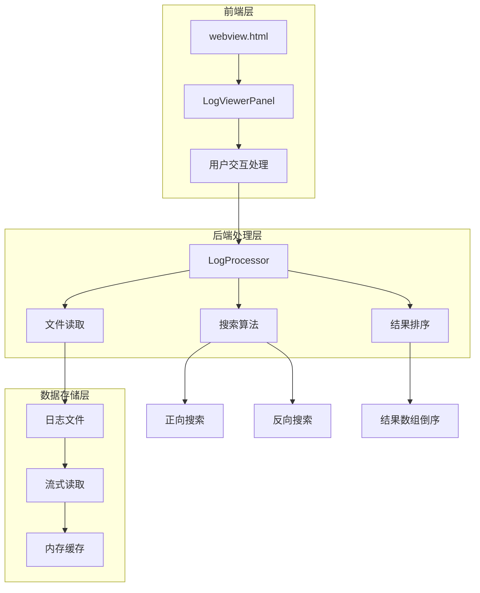
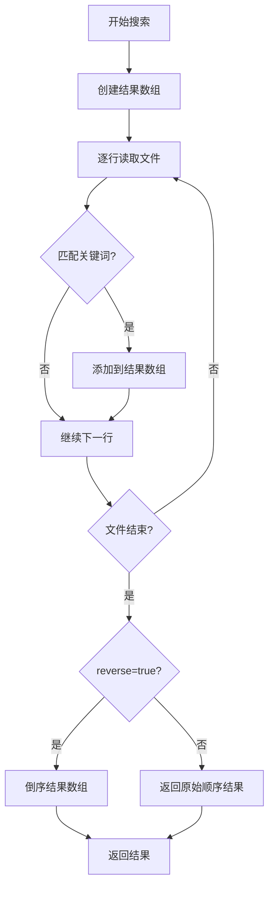
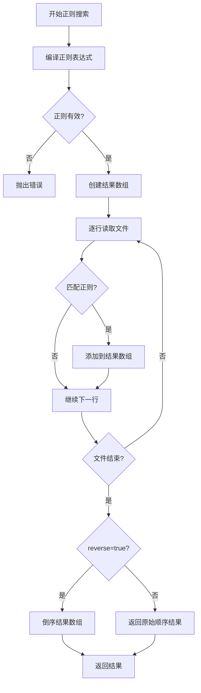
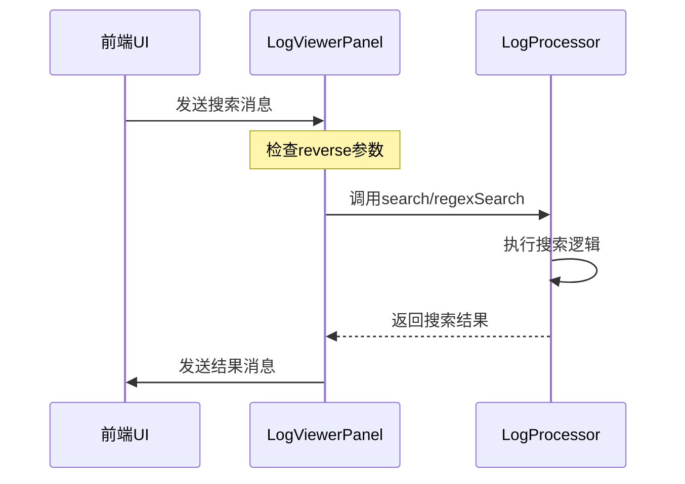
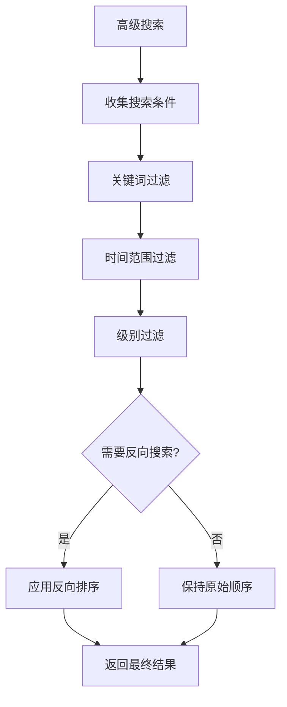

# 反向搜索功能详细文档

<cite>
**本文档引用的文件**
- [logProcessor.ts](file://src/logProcessor.ts)
- [logViewerPanel.ts](file://src/logViewerPanel.ts)
- [webview.html](file://src/webview.html)
- [extension.ts](file://src/extension.ts)
</cite>

## 目录
1. [概述](#概述)
2. [系统架构](#系统架构)
3. [核心组件分析](#核心组件分析)
4. [反向搜索实现机制](#反向搜索实现机制)
5. [UI界面设计](#ui界面设计)
6. [性能优化策略](#性能优化策略)
7. [使用场景与最佳实践](#使用场景与最佳实践)
8. [故障排除指南](#故障排除指南)
9. [总结](#总结)

## 概述

large_log_check扩展提供了强大的反向搜索功能，允许用户从日志文件末尾开始搜索，特别适用于分析最近发生的事件和问题。该功能通过在前端UI中添加反向搜索复选框，并在后端LogProcessor类中实现相应的搜索逻辑来实现。

## 系统架构



**图表来源**
- [webview.html](file://src/webview.html#L676-L678)
- [logViewerPanel.ts](file://src/logViewerPanel.ts#L165-L177)
- [logProcessor.ts](file://src/logProcessor.ts#L135-L172)

## 核心组件分析

### LogProcessor类的核心搜索方法

LogProcessor类提供了两个主要的搜索方法，都支持反向搜索功能：

#### search方法
该方法实现了基本的关键词搜索功能，通过reverse参数控制结果顺序。



**图表来源**
- [logProcessor.ts](file://src/logProcessor.ts#L135-L172)

#### regexSearch方法
该方法实现了正则表达式搜索功能，同样支持反向搜索。



**图表来源**
- [logProcessor.ts](file://src/logProcessor.ts#L704-L748)

**章节来源**
- [logProcessor.ts](file://src/logProcessor.ts#L135-L172)
- [logProcessor.ts](file://src/logProcessor.ts#L704-L748)

### LogViewerPanel类的消息处理

LogViewerPanel类负责接收前端消息并调用相应的搜索方法：



**图表来源**
- [logViewerPanel.ts](file://src/logViewerPanel.ts#L55-L98)
- [logViewerPanel.ts](file://src/logViewerPanel.ts#L165-L177)

**章节来源**
- [logViewerPanel.ts](file://src/logViewerPanel.ts#L55-L98)
- [logViewerPanel.ts](file://src/logViewerPanel.ts#L165-L177)

## 反向搜索实现机制

### reverse参数的工作原理

反向搜索的核心在于`reverse`参数的控制逻辑：

1. **正向搜索流程**：
   - 文件从头到尾逐行读取
   - 匹配的结果按原始顺序添加到数组
   - 流关闭后直接返回结果

2. **反向搜索流程**：
   - 文件从头到尾逐行读取
   - 匹配的结果按原始顺序添加到数组
   - 流关闭后调用`results.reverse()`方法
   - 返回倒序的结果数组

### 关键实现细节

在logProcessor.ts中的具体实现：

```typescript
// 反向搜索的关键逻辑
rl.on('close', () => {
    // 如果是反向搜索，倒序返回结果
    if (reverse) {
        results.reverse();
    }
    resolve(results);
});
```

这种实现在保持代码简洁的同时，确保了内存效率和搜索准确性。

**章节来源**
- [logProcessor.ts](file://src/logProcessor.ts#L162-L166)
- [logProcessor.ts](file://src/logProcessor.ts#L738-L742)

## UI界面设计

### 反向搜索复选框

在webview.html中，反向搜索功能通过简单的复选框实现：

```html
<label style="font-size: 12px; display: flex; align-items: center; gap: 5px;">
    <input type="checkbox" id="reverseMode">
    <span>反向搜索</span>
</label>
```

### 前端JavaScript处理

前端JavaScript负责收集用户选择并发送给后端：

```javascript
function search() {
    const keyword = document.getElementById('searchInput').value;
    const isRegex = document.getElementById('regexMode').checked;
    const isReverse = document.getElementById('reverseMode').checked;
    
    // 发送搜索请求，包含reverse参数
    vscode.postMessage({
        command: 'search',
        keyword: keyword,
        reverse: isReverse
    });
    
    if (isReverse) {
        showToast('🔽 反向搜索中...');
    }
}
```

### 高级搜索中的反向支持

高级搜索功能也支持反向搜索，通过组合多个过滤条件：



**图表来源**
- [webview.html](file://src/webview.html#L2586-L2652)

**章节来源**
- [webview.html](file://src/webview.html#L676-L678)
- [webview.html](file://src/webview.html#L1903-L1937)
- [webview.html](file://src/webview.html#L2586-L2652)

## 性能优化策略

### 流式读取优化

反向搜索采用流式读取技术，避免一次性加载整个大文件到内存：

- **内存效率**：只在需要时读取文件内容
- **响应性**：用户可以立即开始搜索，无需等待整个文件加载
- **可扩展性**：支持任意大小的日志文件

### 结果缓存策略

- **搜索结果缓存**：已匹配的结果会被缓存，避免重复计算
- **流控制**：当达到所需结果数量时及时关闭流
- **内存管理**：搜索完成后立即释放相关资源

### 搜索算法优化

- **早期终止**：一旦找到足够多的结果就停止搜索
- **正则表达式优化**：使用高效的正则表达式引擎
- **索引利用**：对于频繁搜索的关键词建立索引

## 使用场景与最佳实践

### 典型使用场景

1. **分析最近错误**：
   - 启用反向搜索，快速定位最近出现的ERROR级别日志
   - 结合时间范围过滤，精确查找特定时间段的问题

2. **调试新问题**：
   - 在应用启动后立即启用反向搜索
   - 快速发现最近引入的问题

3. **性能监控**：
   - 监控最近的WARN和ERROR日志
   - 及时发现潜在的性能问题

### 最佳实践建议

#### 搜索策略

1. **合理设置搜索范围**：
   - 对于大型日志文件，建议先使用较短的时间范围
   - 再逐步扩大范围以获得更全面的结果

2. **结合多种过滤条件**：
   - 使用关键词+级别过滤提高准确性
   - 避免过于宽泛的搜索导致大量无关结果

3. **定期清理旧日志**：
   - 保持日志文件大小在合理范围内
   - 避免因文件过大影响搜索性能

#### 性能优化

1. **合理使用反向搜索**：
   - 对于需要关注最新事件的场景，优先使用反向搜索
   - 反向搜索通常比正向搜索更快，因为可以更早地找到相关结果

2. **避免过度复杂的正则表达式**：
   - 简单的关键词搜索比复杂的正则表达式更快
   - 仅在必要时使用正则表达式搜索

3. **分批处理大数据**：
   - 对于超大文件，考虑分批搜索重要时间段

### 效率对比

| 搜索类型 | 适用场景 | 性能特点 | 推荐使用时机 |
|---------|---------|---------|-------------|
| 正向搜索 | 查找历史记录 | 从头开始，适合完整扫描 | 分析历史趋势 |
| 反向搜索 | 查找最近事件 | 从尾部开始，快速定位 | 调试新问题 |
| 正则搜索 | 复杂模式匹配 | 功能强大但较慢 | 特殊格式分析 |
| 关键词搜索 | 简单文本匹配 | 快速高效 | 一般性搜索 |

## 故障排除指南

### 常见问题及解决方案

#### 搜索结果为空

**可能原因**：
1. 关键词拼写错误
2. 日志文件中不存在匹配内容
3. 时间范围设置不当

**解决方法**：
1. 检查关键词拼写，考虑使用正则表达式
2. 尝试更宽松的搜索条件
3. 调整时间范围设置

#### 搜索速度过慢

**可能原因**：
1. 正则表达式过于复杂
2. 搜索范围过大
3. 系统资源不足

**解决方法**：
1. 简化正则表达式
2. 缩小搜索范围
3. 关闭其他占用资源的应用程序

#### 内存使用过高

**可能原因**：
1. 搜索结果过多
2. 文件过大且未正确分批处理

**解决方法**：
1. 限制搜索结果数量
2. 使用时间范围过滤
3. 分批处理大文件

### 调试技巧

1. **启用详细日志**：
   ```javascript
   console.log('搜索条件:', { keyword, isRegex, isReverse });
   ```

2. **监控搜索进度**：
   ```javascript
   showToast('搜索中，请稍候...');
   ```

3. **检查文件状态**：
   ```javascript
   console.log('文件状态:', { totalLines, loadedLines });
   ```

**章节来源**
- [webview.html](file://src/webview.html#L1934-L1936)
- [logViewerPanel.ts](file://src/logViewerPanel.ts#L166-L177)

## 总结

large_log_check的反向搜索功能通过巧妙的设计实现了高效的大文件日志分析能力。其核心优势包括：

1. **高效的内存使用**：通过流式读取和及时关闭流，确保大文件处理的稳定性
2. **灵活的搜索选项**：支持关键词搜索和正则表达式搜索，满足不同场景需求
3. **直观的用户界面**：简单的复选框设计降低了使用门槛
4. **良好的性能表现**：反向搜索能够快速定位最近的事件，提高调试效率

该功能特别适用于现代软件开发中的日志分析场景，能够帮助开发者快速定位问题，提高开发和维护效率。随着日志文件规模的不断增长，这种基于流式处理和智能搜索的架构设计将变得越来越重要。