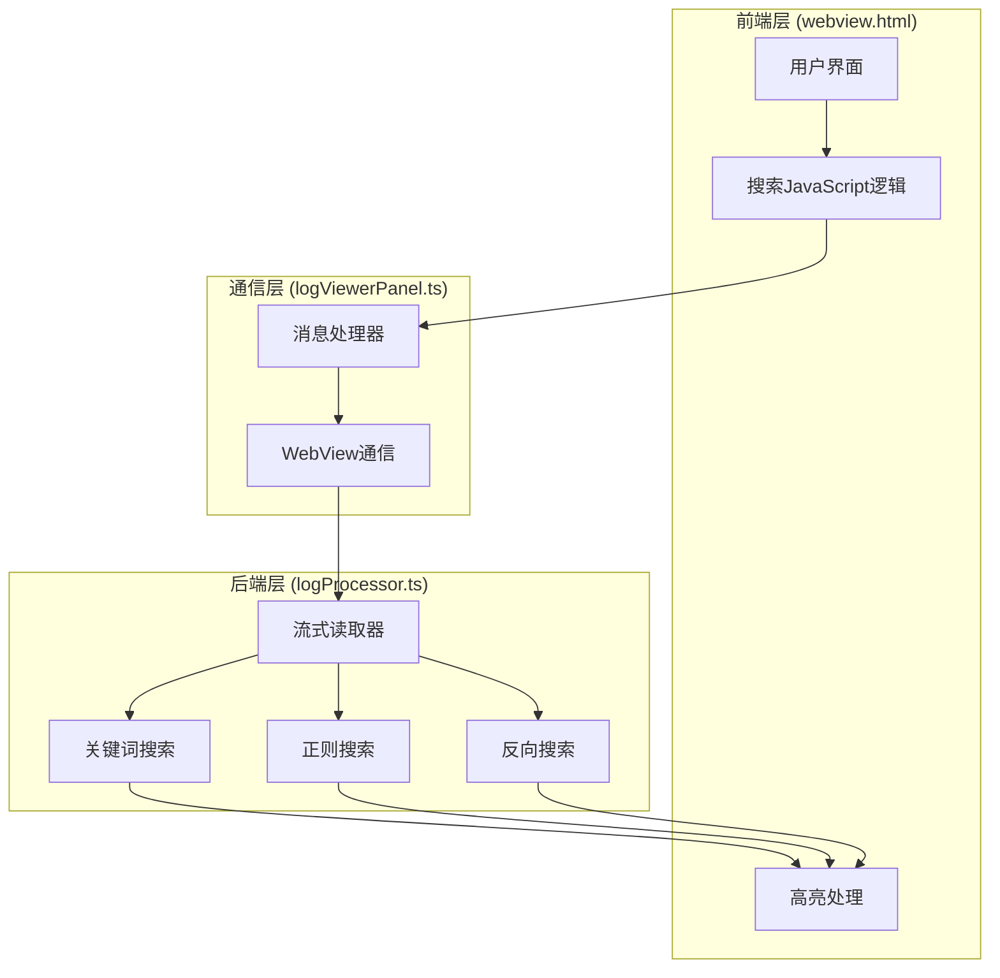
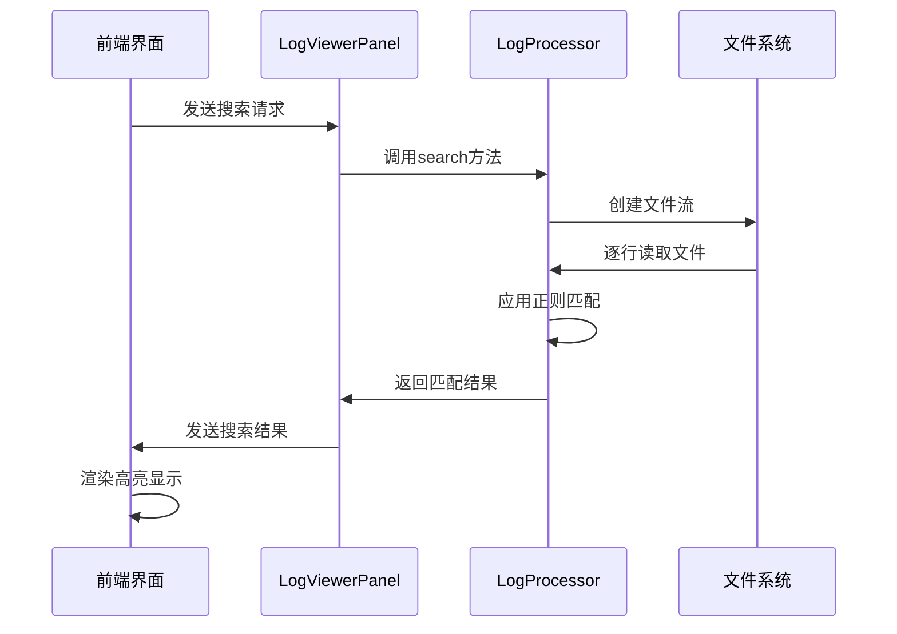
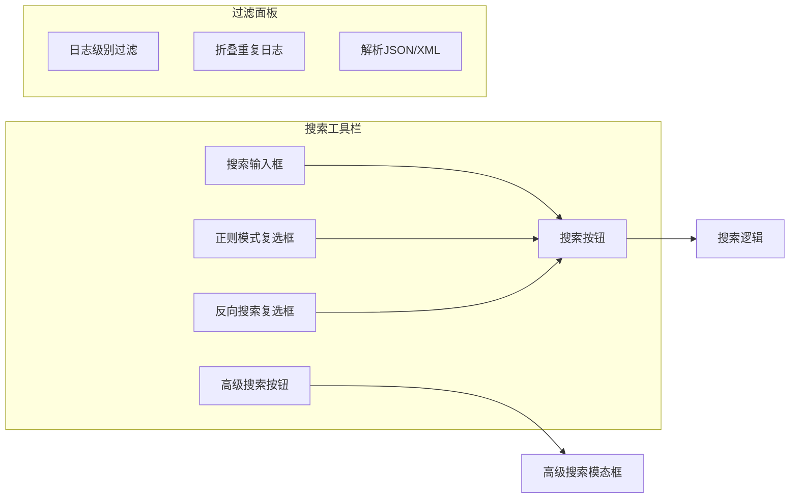
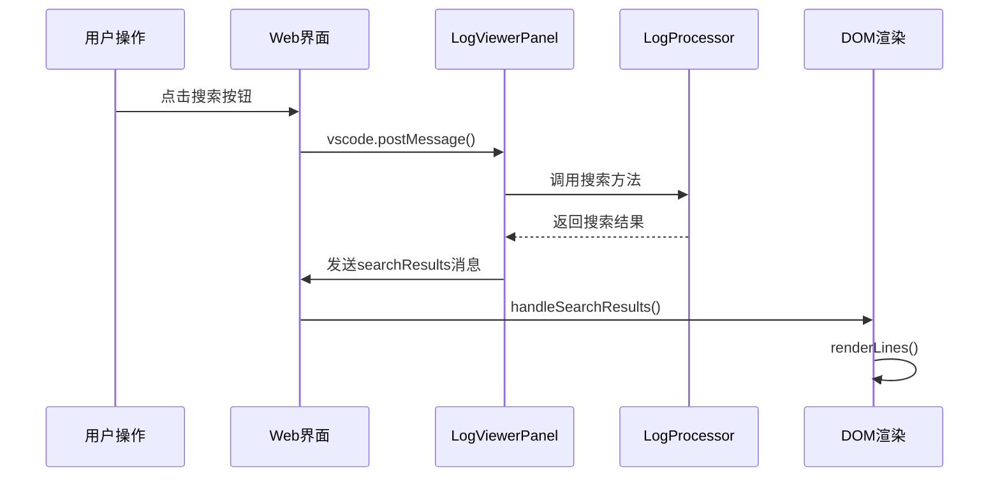
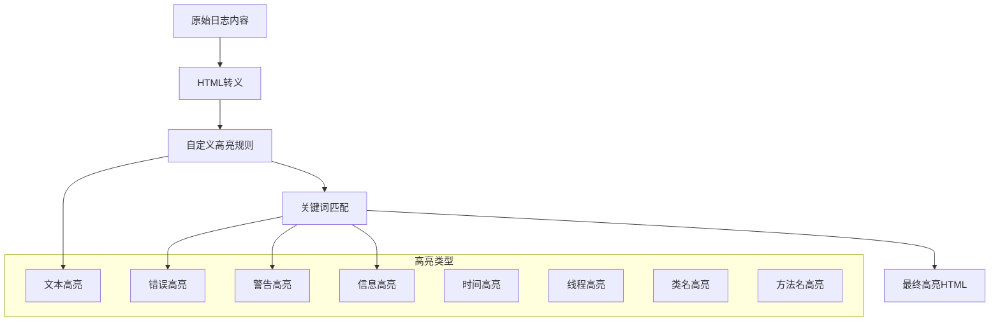
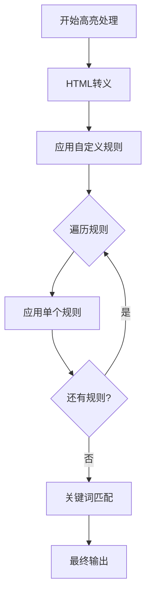
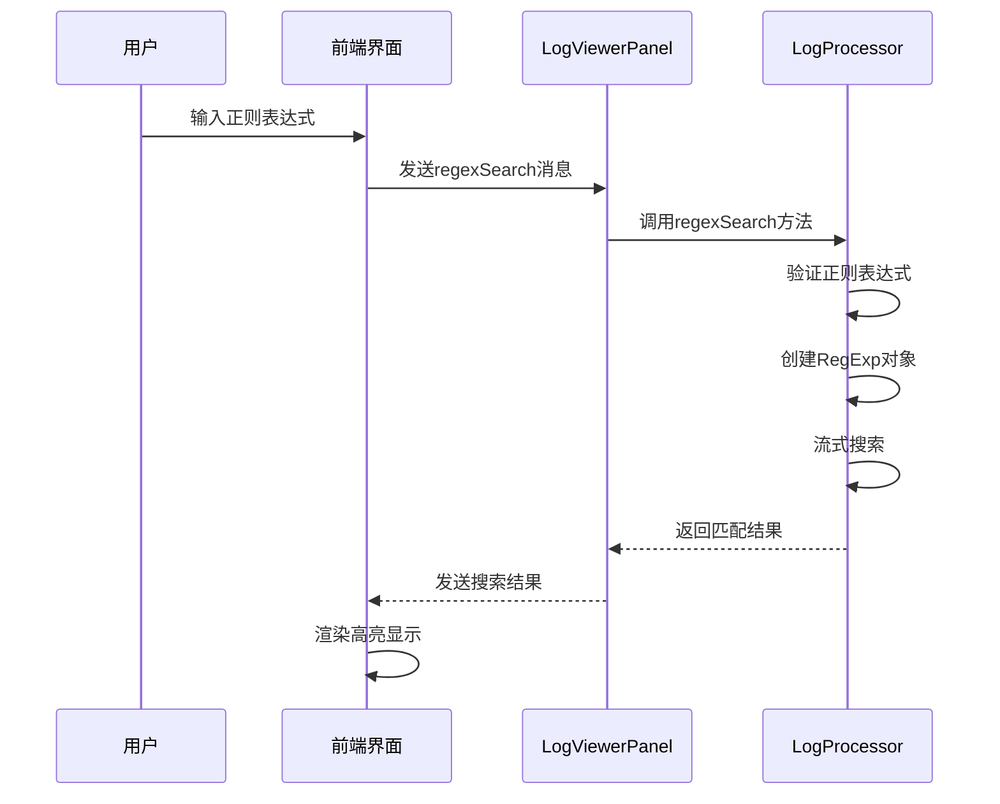
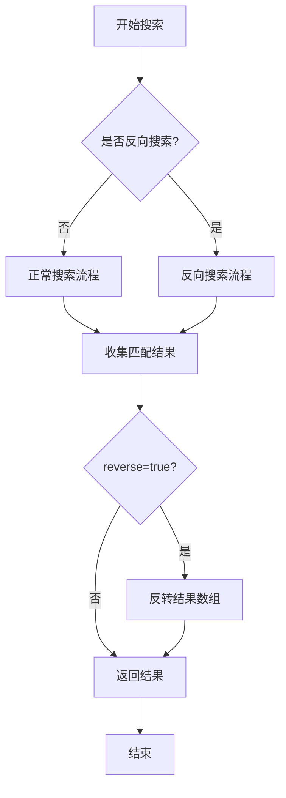
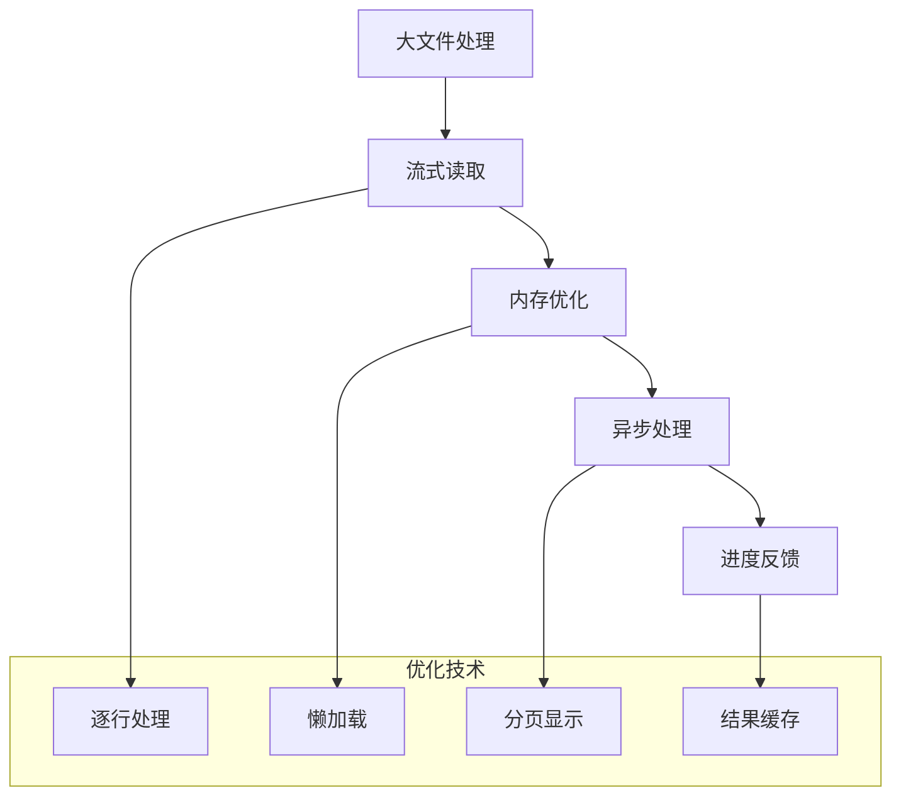

# 搜索功能

<cite>
**本文档引用的文件**
- [logProcessor.ts](file://src/logProcessor.ts)
- [webview.html](file://src/webview.html)
- [logViewerPanel.ts](file://src/logViewerPanel.ts)
- [README.md](file://README.md)
</cite>

## 目录
1. [简介](#简介)
2. [系统架构概览](#系统架构概览)
3. [核心搜索功能](#核心搜索功能)
4. [用户界面设计](#用户界面设计)
5. [搜索结果处理](#搜索结果处理)
6. [高亮显示机制](#高亮显示机制)
7. [正则表达式搜索](#正则表达式搜索)
8. [反向搜索实现](#反向搜索实现)
9. [最佳实践和使用指南](#最佳实践和使用指南)
10. [性能优化考虑](#性能优化考虑)

## 简介

large_log_check是一个专业的VSCode扩展，专门用于处理大型日志文件（支持几十MB甚至GB级别的文件）。其搜索功能是核心特性之一，提供了多种搜索模式和强大的文本匹配能力，支持关键词搜索、正则表达式匹配和反向搜索等高级功能。

## 系统架构概览

搜索功能采用前后端分离的架构设计，主要由三个核心组件构成：

**图表来源**
- [webview.html](file://src/webview.html#L1902-L1937)
- [logViewerPanel.ts](file://src/logViewerPanel.ts#L54-L98)
- [logProcessor.ts](file://src/logProcessor.ts#L135-L173)

## 核心搜索功能

### 基础关键词搜索

logProcessor.ts中的`search`方法实现了流式关键词搜索功能：

**图表来源**
- [logViewerPanel.ts](file://src/logViewerPanel.ts#L165-L177)
- [logProcessor.ts](file://src/logProcessor.ts#L135-L173)

搜索方法的核心实现特点：
- **流式处理**：使用Node.js的readline模块按行读取，避免内存溢出
- **异步执行**：Promise模式确保UI不阻塞
- **实时匹配**：对每一行应用正则表达式匹配
- **结果封装**：返回包含行号、内容、时间戳和日志级别的LogLine对象数组

**章节来源**
- [logProcessor.ts](file://src/logProcessor.ts#L135-L173)

### 搜索方法详细分析

搜索功能的核心实现在`search`方法中，该方法支持以下特性：

| 特性 | 描述 | 实现方式 |
|------|------|----------|
| 流式读取 | 使用fs.createReadStream按行读取 | Node.js readline接口 |
| 正则匹配 | 支持大小写不敏感的关键词匹配 | new RegExp(keyword, 'i') |
| 结果收集 | 存储匹配的行信息 | LogLine对象数组 |
| 时间戳提取 | 自动识别并提取时间信息 | extractTimestamp方法 |
| 日志级别识别 | 自动识别日志级别 | extractLogLevel方法 |
| 反向控制 | 通过reverse参数控制结果顺序 | 条件反转数组 |

**章节来源**
- [logProcessor.ts](file://src/logProcessor.ts#L135-L173)

## 用户界面设计

### 搜索界面元素

webview.html中的搜索界面提供了直观的用户交互：

**图表来源**
- [webview.html](file://src/webview.html#L670-L689)

### 搜索界面组件

| 组件 | 功能 | HTML元素 |
|------|------|----------|
| 搜索输入框 | 输入搜索关键词 | `input#searchInput` |
| 正则模式 | 启用正则表达式搜索 | `input#regexMode` |
| 反向搜索 | 排除包含关键词的日志 | `input#reverseMode` |
| 搜索按钮 | 触发搜索操作 | `button[onclick="search()"]` |
| 高级搜索 | 多条件组合搜索 | `button[onclick="showAdvancedSearchModal()"]` |
| 过滤面板 | 日志级别过滤 | 复选框组 |

**章节来源**
- [webview.html](file://src/webview.html#L670-L689)

## 搜索结果处理

### 前后端通信机制

搜索结果通过WebView消息机制进行处理：

**图表来源**
- [logViewerPanel.ts](file://src/logViewerPanel.ts#L54-L98)
- [webview.html](file://src/webview.html#L1255-L1263)

### 结果处理流程

搜索结果处理的关键步骤：

1. **消息接收**：LogViewerPanel监听WebView消息
2. **数据验证**：检查搜索结果的有效性
3. **状态更新**：更新全局变量和页面状态
4. **分页重置**：清除页面范围记录
5. **重新渲染**：调用renderLines()更新显示

**章节来源**
- [logViewerPanel.ts](file://src/logViewerPanel.ts#L165-L177)
- [webview.html](file://src/webview.html#L1255-L1263)

## 高亮显示机制

### 多层次高亮系统

large_log_check实现了多层次的高亮显示系统：

**图表来源**
- [webview.html](file://src/webview.html#L1854-L1891)

### 高亮样式系统

| 高亮类型 | CSS类名 | 颜色 | 用途 |
|----------|---------|------|------|
| 默认高亮 | `.highlight` | 黄色背景 | 搜索关键词 |
| 错误高亮 | `.highlight-error` | 红色背景 | ERROR级别日志 |
| 警告高亮 | `.highlight-warn` | 橙色背景 | WARN级别日志 |
| 信息高亮 | `.highlight-info` | 蓝色背景 | INFO级别日志 |
| 时间高亮 | `.highlight-time` | 紫色背景 | 时间戳 |
| 线程高亮 | `.highlight-thread` | 青色背景 | 线程名称 |
| 类名高亮 | `.highlight-class` | 绿色背景 | Java类名 |
| 方法名高亮 | `.highlight-method` | 橙色背景 | 方法名称 |

**章节来源**
- [webview.html](file://src/webview.html#L427-L485)

### 高亮处理函数

highlightKeywords函数是高亮系统的核心：

**图表来源**
- [webview.html](file://src/webview.html#L1854-L1891)

**章节来源**
- [webview.html](file://src/webview.html#L1854-L1891)

## 正则表达式搜索

### regexSearch方法实现

除了基础的关键词搜索，系统还提供了强大的正则表达式搜索功能：

**图表来源**
- [logViewerPanel.ts](file://src/logViewerPanel.ts#L450-L463)
- [logProcessor.ts](file://src/logProcessor.ts#L702-L748)

### 正则搜索特性

| 特性 | 描述 | 实现细节 |
|------|------|----------|
| 模式验证 | 验证正则表达式的有效性 | try-catch捕获异常 |
| 标志支持 | 支持正则标志（g, i, m等） | flags参数控制 |
| 流式处理 | 大文件正则匹配 | readline流式读取 |
| 错误处理 | 正则语法错误处理 | 显示友好的错误信息 |
| 结果封装 | 标准化搜索结果 | LogLine对象数组 |

**章节来源**
- [logProcessor.ts](file://src/logProcessor.ts#L702-L748)

### 正则表达式最佳实践

以下是常用的正则表达式模式示例：

| 模式类型 | 示例 | 用途 |
|----------|------|------|
| 时间戳匹配 | `\d{4}-\d{2}-\d{2} \d{2}:\d{2}:\d{2}` | 匹配日期时间格式 |
| 错误信息 | `ERROR.*exception` | 搜索错误异常信息 |
| 类名匹配 | `com\.example\.[A-Z][a-zA-Z0-9]*` | 匹配Java类名 |
| JSON结构 | `"key"\s*:\s*"value"` | 匹配JSON键值对 |
| 多行匹配 | `pattern1.*pattern2` | 跨行匹配模式 |

## 反向搜索实现

### reverse参数控制

反向搜索通过reverse参数控制结果集的顺序：

**图表来源**
- [logProcessor.ts](file://src/logProcessor.ts#L162-L166)

### 反向搜索应用场景

| 场景 | 描述 | 正则表达式示例 |
|------|------|----------------|
| 排除特定日志 | 查找不包含某个关键词的日志 | `^(?!.*error).*` |
| 排除错误日志 | 只显示非错误级别的日志 | `^(?!.*ERROR).*` |
| 排除调试信息 | 只显示生产环境日志 | `^(?!.*DEBUG).*` |
| 排除特定服务 | 排除某个微服务的日志 | `^(?!.*service-name).*` |

**章节来源**
- [logProcessor.ts](file://src/logProcessor.ts#L162-L166)

## 最佳实践和使用指南

### 搜索效率优化

为了获得最佳的搜索性能，建议遵循以下最佳实践：

1. **关键词选择**：使用具体的关键词而非模糊匹配
2. **正则优化**：避免过于复杂的正则表达式
3. **文件大小考虑**：对于超大文件，考虑使用更精确的搜索条件
4. **内存管理**：及时清理不需要的搜索结果

### 常见搜索模式

以下是实际使用中常见的搜索模式：

| 使用场景 | 推荐搜索词 | 正则表达式 |
|----------|------------|------------|
| 查找异常 | `exception` | `exception` |
| 查找错误 | `ERROR` | `ERROR` |
| 查找性能问题 | `slow.*response` | `slow.*response` |
| 查找特定API | `GET /api/users` | `GET /api/users` |
| 查找时间范围 | `2024-01-01 12:00:00` | `\d{4}-\d{2}-\d{2} \d{2}:\d{2}:\d{2}` |

### 高级搜索技巧

1. **组合搜索**：结合多个搜索条件进行精确过滤
2. **时间范围**：配合时间线功能进行时间范围搜索
3. **日志级别**：使用过滤面板限制日志级别
4. **折叠模式**：在大量重复日志中使用折叠模式提高可读性

**章节来源**
- [README.md](file://README.md#L66-L85)

## 性能优化考虑

### 大文件处理策略

搜索功能针对大文件进行了专门优化：

### 性能指标

| 文件大小 | 搜索时间 | 内存占用 | 处理策略 |
|----------|----------|----------|----------|
| < 1MB | < 1秒 | < 50MB | 全量加载 |
| 1-10MB | < 3秒 | < 100MB | 全量加载 |
| 10-100MB | < 10秒 | < 500MB | 分批加载 |
| 100MB-1GB | < 30秒 | < 1GB | 流式处理 |
| > 1GB | < 60秒 | < 2GB | 流式处理+进度提示 |

### 内存管理

搜索功能采用了多种内存管理策略：

1. **流式处理**：避免一次性加载整个文件
2. **结果限制**：对搜索结果数量进行合理限制
3. **及时释放**：搜索完成后及时清理临时数据
4. **分页显示**：只加载当前可见的行数

**章节来源**
- [logViewerPanel.ts](file://src/logViewerPanel.ts#L107-L147)

## 总结

large_log_check的搜索功能通过精心设计的架构和优化策略，实现了高性能的大文件搜索能力。其核心优势包括：

- **流式处理**：支持GB级别文件的高效搜索
- **多样化搜索**：支持关键词、正则表达式和反向搜索
- **智能高亮**：多层次的高亮显示系统
- **用户友好**：直观的界面和丰富的搜索选项
- **性能优化**：针对大文件的专门优化策略

这些特性使得large_log_check成为处理大型日志文件的强大工具，能够显著提高日志分析和问题排查的效率。