# 正则表达式搜索

<cite>
**本文档引用的文件**   
- [logProcessor.ts](file://src/logProcessor.ts)
- [logViewerPanel.ts](file://src/logViewerPanel.ts)
- [webview.html](file://src/webview.html)
</cite>

## 目录
1. [正则表达式搜索功能概述](#正则表达式搜索功能概述)
2. [regexSearch方法实现](#regexsearch方法实现)
3. [UI界面实现](#ui界面实现)
4. [WebView消息机制](#webview消息机制)
5. [搜索结果高亮显示](#搜索结果高亮显示)
6. [常用正则表达式模式示例](#常用正则表达式模式示例)

## 正则表达式搜索功能概述

large_log_check扩展提供了强大的正则表达式搜索功能，允许用户在大型日志文件中进行复杂的模式匹配。该功能通过后端的regexSearch方法和前端的UI界面协同工作，支持各种正则表达式标志和反向搜索选项。用户可以通过勾选"正则"复选框来启用正则表达式搜索模式，从而进行更精确的日志分析。

**Section sources**
- [webview.html](file://src/webview.html#L672-L675)

## regexSearch方法实现

logProcessor.ts中的regexSearch方法是正则表达式搜索功能的核心实现。该方法接受三个参数：pattern（正则表达式模式）、flags（正则表达式标志）和reverse（是否反向搜索）。方法内部使用try-catch块来捕获正则表达式语法错误，确保无效的正则表达式不会导致程序崩溃。当正则表达式创建成功后，方法会逐行读取日志文件并使用test方法进行匹配，将匹配的行存储在结果数组中。

```mermaid
sequenceDiagram
participant UI as 前端界面
participant WebView as WebView
participant LogViewerPanel as LogViewerPanel
participant LogProcessor as LogProcessor
UI->>WebView : 用户输入正则表达式并点击搜索
WebView->>LogViewerPanel : 发送regexSearch消息
LogViewerPanel->>LogProcessor : 调用regexSearch方法
LogProcessor->>LogProcessor : 创建RegExp对象
alt 正则表达式有效
LogProcessor->>LogProcessor : 逐行匹配日志
LogProcessor->>LogViewerPanel : 返回匹配结果
LogViewerPanel->>WebView : 发送搜索结果
WebView->>UI : 显示高亮结果
else 正则表达式无效
LogProcessor->>LogViewerPanel : 返回错误信息
LogViewerPanel->>UI : 显示错误提示
end
```

**Diagram sources**
- [logProcessor.ts](file://src/logProcessor.ts#L704-L749)
- [logViewerPanel.ts](file://src/logViewerPanel.ts#L450-L464)

**Section sources**
- [logProcessor.ts](file://src/logProcessor.ts#L704-L749)

## UI界面实现

webview.html中实现了正则表达式搜索的用户界面，包括一个复选框用于切换正则表达式模式。该复选框位于搜索框旁边，标签为"正则"，当用户勾选时，搜索功能将从普通文本搜索切换到正则表达式搜索。UI还提供了反向搜索选项，允许用户从文件末尾开始搜索。搜索界面设计简洁直观，使用户能够快速访问这些高级搜索功能。

**Diagram sources**
- [webview.html](file://src/webview.html#L672-L675)
- [logProcessor.ts](file://src/logProcessor.ts#L704-L749)

**Section sources**
- [webview.html](file://src/webview.html#L672-L675)

## WebView消息机制

正则表达式搜索功能通过WebView的消息机制在前端和后端之间进行通信。当用户在前端界面执行搜索操作时，JavaScript代码会通过vscode.postMessage方法发送包含搜索命令、模式、标志和反向搜索选项的消息。LogViewerPanel类中的消息处理器接收到此消息后，会调用logProcessor实例的regexSearch方法。搜索完成后，结果通过WebView的postMessage方法返回前端，实现前后端的无缝集成。

**Diagram sources**
- [webview.html](file://src/webview.html#L1902-L1937)
- [logViewerPanel.ts](file://src/logViewerPanel.ts#L72-L74)

**Section sources**
- [webview.html](file://src/webview.html#L1902-L1937)
- [logViewerPanel.ts](file://src/logViewerPanel.ts#L72-L74)

## 搜索结果高亮显示

搜索结果在前端通过高亮机制进行可视化展示。当搜索完成并返回结果后，前端会将匹配的文本用特殊的CSS样式高亮显示。对于正则搜索和普通搜索，系统使用相同的高亮样式，但通过在结果数据中添加isRegex标志来区分。高亮样式包括背景色和文字颜色的变化，使匹配的内容在日志中更加醒目。此外，系统还实现了搜索结果的定位功能，可以自动滚动到第一个匹配项的位置。

**Diagram sources**
- [webview.html](file://src/webview.html#L115-L118)
- [webview.html](file://src/webview.html#L1255-L1263)

**Section sources**
- [webview.html](file://src/webview.html#L115-L118)
- [webview.html](file://src/webview.html#L1255-L1263)

## 常用正则表达式模式示例

以下是一些常用的日志分析正则表达式模式示例：

1. **匹配错误级别日志**：`\\b(ERROR|FATAL|SEVERE)\\b`
2. **匹配时间戳**：`\\d{4}[-/]\\d{2}[-/]\\d{2}[T\\s]\\d{2}:\\d{2}:\\d{2}(\\.\\d+)?`
3. **匹配IP地址**：`\\b(?:[0-9]{1,3}\\.){3}[0-9]{1,3}\\b`
4. **匹配URL**：`https?://(?:[-\\w.])+(?:[:\\d]+)?(?:/(?:[\\w/_.])*(?:\\?(?:[a-zA-Z0-9&=%.])*)?(?:#(?:[a-zA-Z0-9.])*)?)?`
5. **匹配邮箱地址**：`[a-zA-Z0-9._%+-]+@[a-zA-Z0-9.-]+\\.[a-zA-Z]{2,}`
6. **匹配方法调用**：`\\w+\\([^)]*\\)`
7. **匹配数字**：`\\b\\d+\\.?\\d*\\b`

最佳实践包括：使用非捕获组(?:...)来提高性能，避免使用贪婪匹配符，合理使用锚点^和$来限定匹配范围，以及在复杂模式中使用x标志添加注释以提高可读性。

**Section sources**
- [webview.html](file://src/webview.html#L2216-L2220)