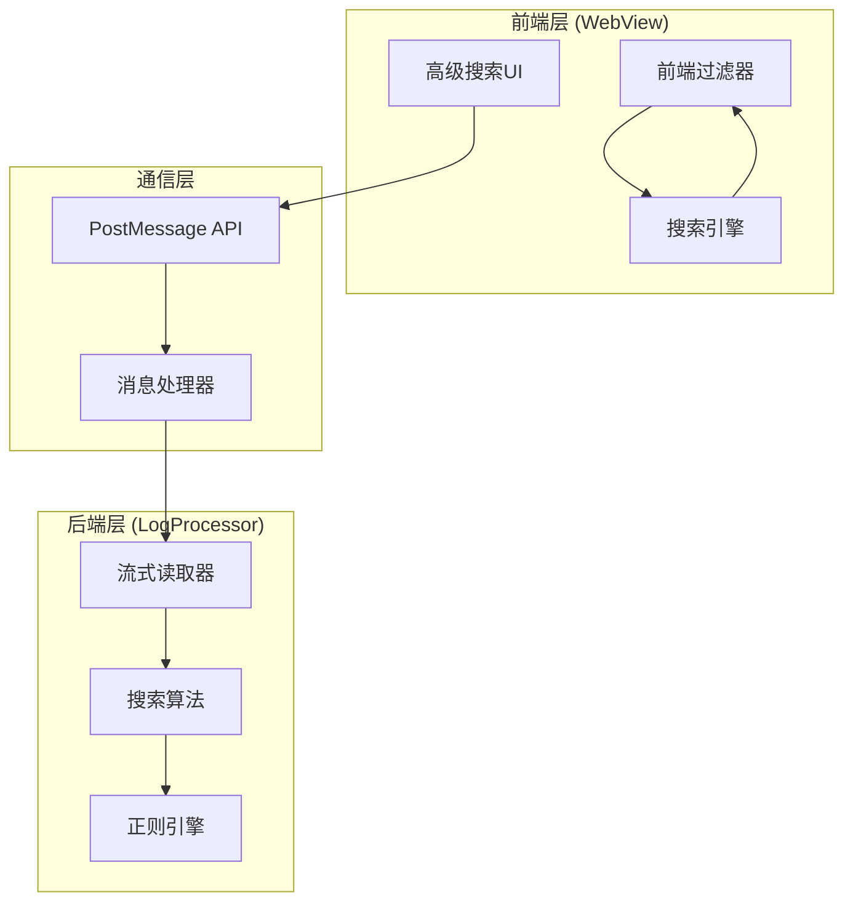
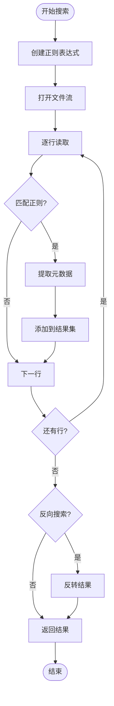
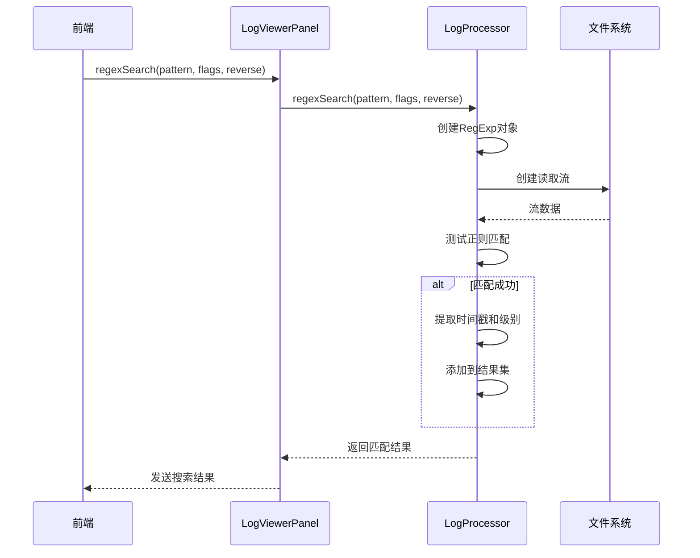
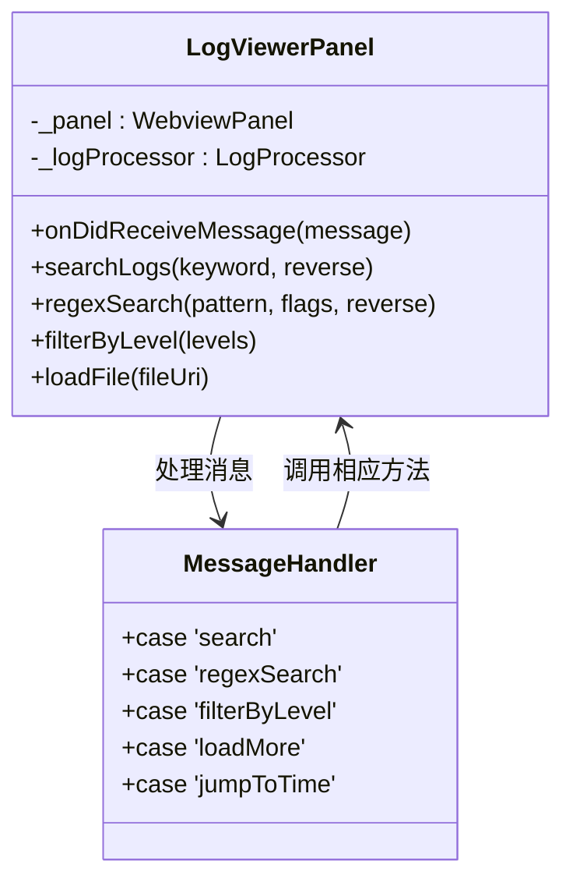
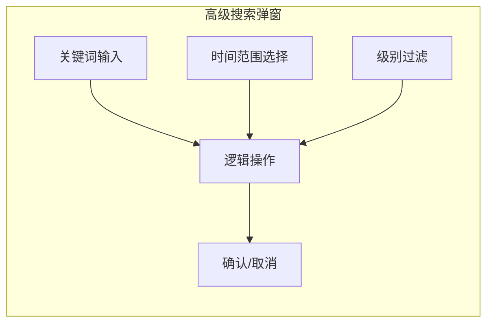
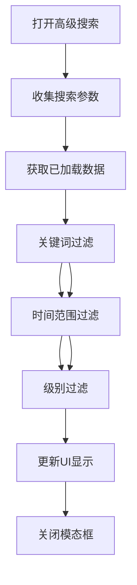
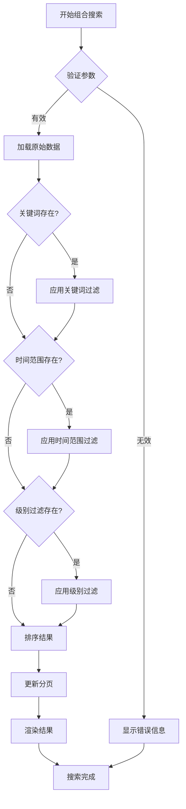
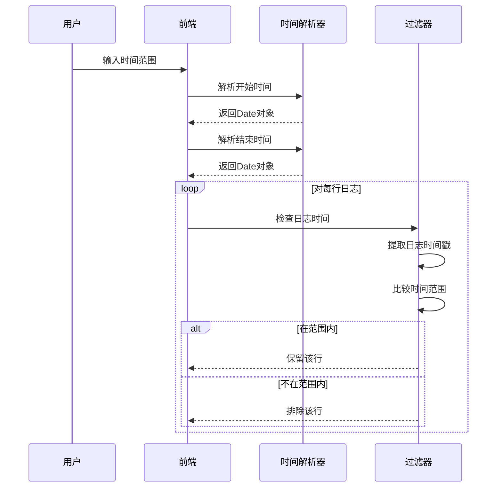
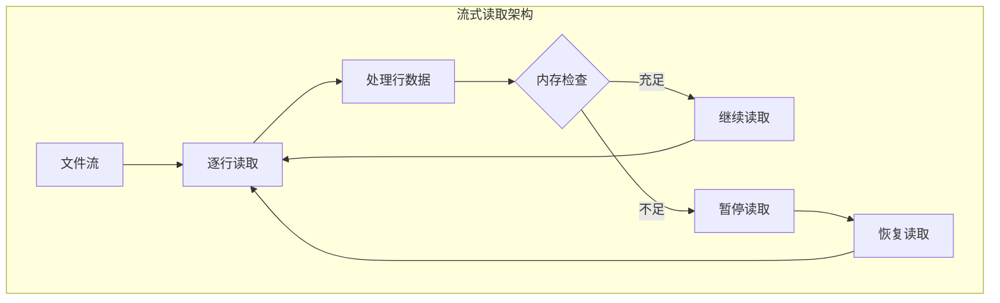
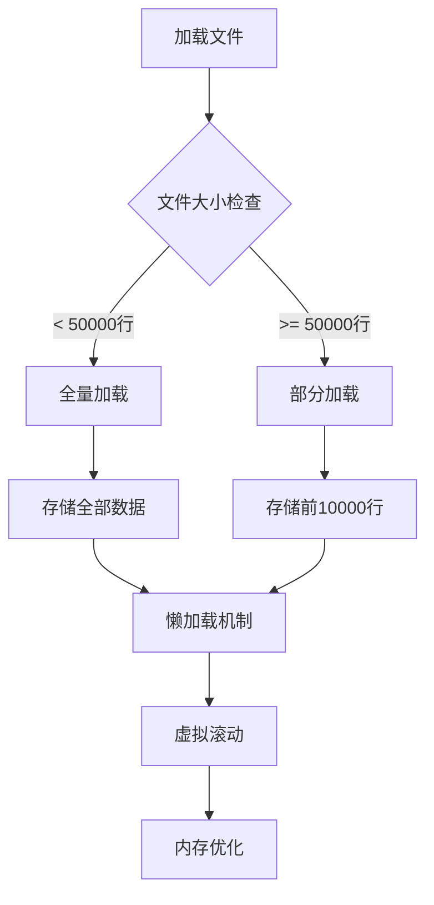

# 高级组合搜索功能详细文档

<cite>
**本文档引用的文件**
- [logProcessor.ts](file://src/logProcessor.ts)
- [logViewerPanel.ts](file://src/logViewerPanel.ts)
- [webview.html](file://src/webview.html)
- [extension.ts](file://src/extension.ts)
- [README.md](file://README.md)
</cite>

## 目录
1. [概述](#概述)
2. [系统架构](#系统架构)
3. [核心组件分析](#核心组件分析)
4. [高级搜索UI实现](#高级搜索ui实现)
5. [组合搜索算法](#组合搜索算法)
6. [性能优化策略](#性能优化策略)
7. [实际应用场景](#实际应用场景)
8. [故障排除指南](#故障排除指南)
9. [总结](#总结)

## 概述

large_log_check扩展提供了强大的高级组合搜索功能，允许用户同时使用基础搜索、正则表达式搜索和反向搜索等多种搜索方式的组合。该功能通过前端UI界面和后端处理逻辑的协同工作，实现了灵活而高效的日志分析体验。

### 主要特性

- **多条件组合搜索**：支持关键词、时间范围、日志级别等多个条件的AND/OR逻辑组合
- **实时搜索预览**：前端即时过滤，无需等待后端处理
- **智能搜索算法**：基于流式读取和增量搜索的高性能实现
- **灵活的搜索模式**：支持基础关键词搜索、正则表达式搜索和反向搜索

## 系统架构

**图表来源**
- [webview.html](file://src/webview.html#L2576-L2652)
- [logViewerPanel.ts](file://src/logViewerPanel.ts#L54-L98)
- [logProcessor.ts](file://src/logProcessor.ts#L132-L749)

## 核心组件分析

### LogProcessor类的核心搜索方法

#### 基础搜索方法 (search)

基础搜索方法提供了关键词匹配功能，支持大小写不敏感的全文搜索。

**图表来源**
- [logProcessor.ts](file://src/logProcessor.ts#L135-L173)

#### 正则表达式搜索方法 (regexSearch)

正则表达式搜索提供了更强大的模式匹配能力，支持复杂的搜索模式。

**图表来源**
- [logProcessor.ts](file://src/logProcessor.ts#L702-L749)
- [logViewerPanel.ts](file://src/logViewerPanel.ts#L450-L464)

**章节来源**
- [logProcessor.ts](file://src/logProcessor.ts#L132-L749)

### LogViewerPanel的消息处理机制

LogViewerPanel负责协调前端UI和后端处理逻辑之间的通信。

**图表来源**
- [logViewerPanel.ts](file://src/logViewerPanel.ts#L54-L98)

**章节来源**
- [logViewerPanel.ts](file://src/logViewerPanel.ts#L54-L98)

## 高级搜索UI实现

### 高级搜索弹窗设计

高级搜索功能通过专门的模态对话框实现，提供直观的多条件配置界面。

**图表来源**
- [webview.html](file://src/webview.html#L1053-L1090)

### 前端搜索逻辑实现

前端搜索逻辑采用增量过滤的方式，在已加载的数据基础上进行实时过滤。

**图表来源**
- [webview.html](file://src/webview.html#L2586-L2648)

**章节来源**
- [webview.html](file://src/webview.html#L2576-L2652)

## 组合搜索算法

### 多条件组合搜索流程

组合搜索算法按照特定的优先级顺序处理不同的搜索条件，确保搜索结果的准确性和效率。

**图表来源**
- [webview.html](file://src/webview.html#L2600-L2647)

### 时间范围过滤算法

时间范围过滤是组合搜索中的重要组成部分，支持精确的时间区间匹配。

**图表来源**
- [webview.html](file://src/webview.html#L2611-L2629)

**章节来源**
- [webview.html](file://src/webview.html#L2600-L2647)

## 性能优化策略

### 流式读取优化

系统采用流式读取技术，避免大文件加载时的内存溢出问题。

**图表来源**
- [logProcessor.ts](file://src/logProcessor.ts#L90-L131)

### 搜索性能优化

- **增量搜索**：只搜索当前可见区域的数据
- **智能缓存**：缓存搜索结果，避免重复计算
- **异步处理**：使用Promise和async/await避免阻塞UI
- **流式处理**：边读取边搜索，减少内存占用

### 内存管理策略

**图表来源**
- [logViewerPanel.ts](file://src/logViewerPanel.ts#L107-L148)

**章节来源**
- [logProcessor.ts](file://src/logProcessor.ts#L82-L308)
- [logViewerPanel.ts](file://src/logViewerPanel.ts#L107-L148)

## 实际应用场景

### 场景一：结合正则表达式和反向搜索查找特定错误模式

**需求描述**：需要查找最近一周内发生的特定类型错误，但排除某些已知的误报。

**解决方案**：
1. 设置时间范围：过去7天
2. 使用正则表达式搜索：`Error.*Timeout|Error.*Connection`
3. 启用反向搜索：排除包含"Network"关键字的错误
4. 应用级别过滤：仅显示ERROR级别

### 场景二：复杂的时间段分析

**需求描述**：分析某个业务高峰期的日志，需要精确到分钟级别。

**解决方案**：
1. 使用高级搜索设置精确的时间范围
2. 结合关键词搜索特定的业务标识
3. 应用级别过滤：关注ERROR和WARN级别
4. 导出结果进行进一步分析

### 场景三：重复问题追踪

**需求描述**：发现某个异常在短时间内反复出现，需要定位根本原因。

**解决方案**：
1. 启用折叠重复日志功能
2. 使用正则表达式搜索异常模式
3. 分析时间分布，找出异常频率
4. 结合时间线功能可视化异常趋势

## 故障排除指南

### 常见问题及解决方案

| 问题类型 | 症状描述 | 可能原因 | 解决方案 |
|---------|---------|---------|---------|
| 搜索无结果 | 输入关键词后无匹配项 | 关键词拼写错误、编码问题 | 检查关键词准确性，尝试正则表达式 |
| 性能缓慢 | 大文件搜索响应慢 | 文件过大、搜索条件复杂 | 减少搜索范围，优化搜索条件 |
| 内存占用高 | VSCode内存使用率持续上升 | 大量日志数据加载 | 使用分页加载，限制同时加载行数 |
| 时间解析失败 | 时间范围过滤无效 | 时间格式不支持 | 使用标准时间格式，参考支持格式列表 |

### 性能调优建议

1. **合理设置搜索范围**：避免在超大文件上进行全局搜索
2. **优化搜索条件**：使用具体的关键字而非过于宽泛的模式
3. **及时清理缓存**：定期关闭不需要的搜索结果
4. **监控内存使用**：注意文件大小对内存的影响

**章节来源**
- [README.md](file://README.md#L228-L235)

## 总结

large_log_check的高级组合搜索功能通过精心设计的架构和优化策略，实现了强大而高效的日志分析能力。该功能的核心优势包括：

### 技术亮点

- **流式处理架构**：避免大文件加载时的内存问题
- **多层过滤机制**：从前端到后端的完整过滤链路
- **智能性能优化**：根据文件大小动态调整加载策略
- **实时交互体验**：前端即时过滤，提升用户体验

### 应用价值

- **提高分析效率**：复杂的组合搜索条件可以在几秒钟内完成
- **降低学习成本**：直观的UI设计，无需复杂的配置
- **保证数据安全**：所有操作都在内存中进行，不会影响原始文件
- **支持大规模分析**：能够处理GB级别的日志文件

### 未来发展方向

- **索引优化**：为常用搜索模式建立索引，加速搜索速度
- **机器学习集成**：基于历史搜索行为优化搜索推荐
- **云端同步**：支持搜索条件的云端保存和分享
- **可视化增强**：提供更多维度的数据可视化选项

通过深入理解和合理运用这些高级搜索功能，用户可以显著提升日志分析的效率和质量，更好地应对复杂的运维挑战。