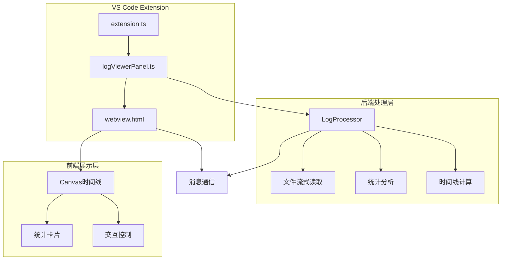
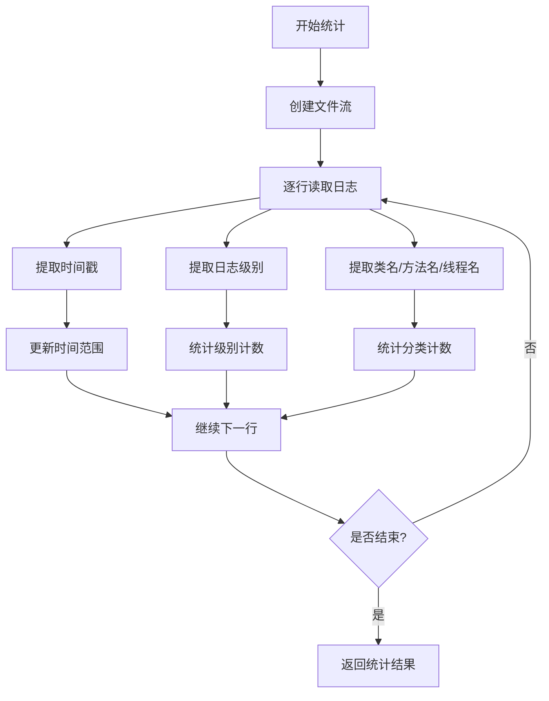
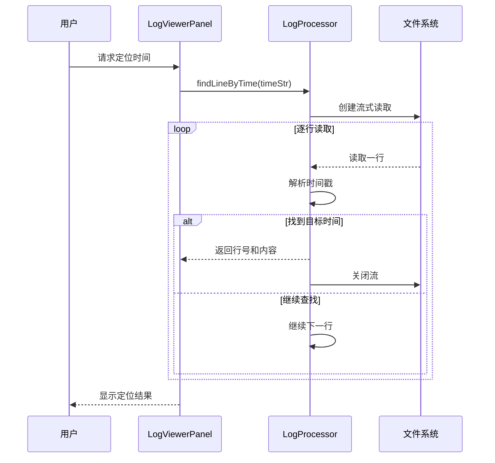
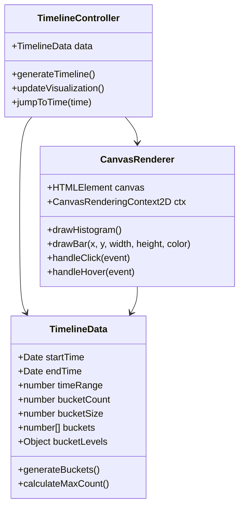
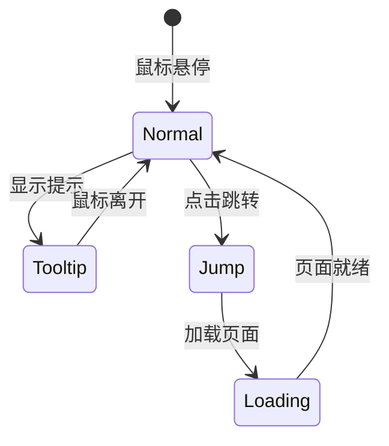
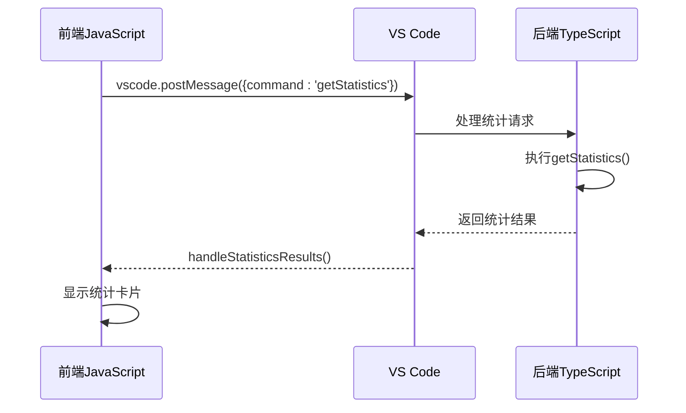
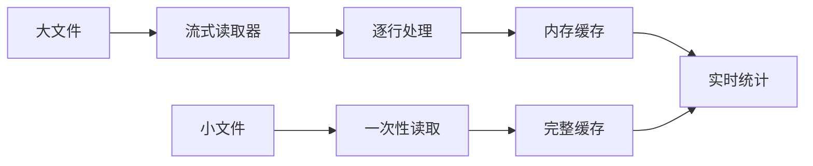
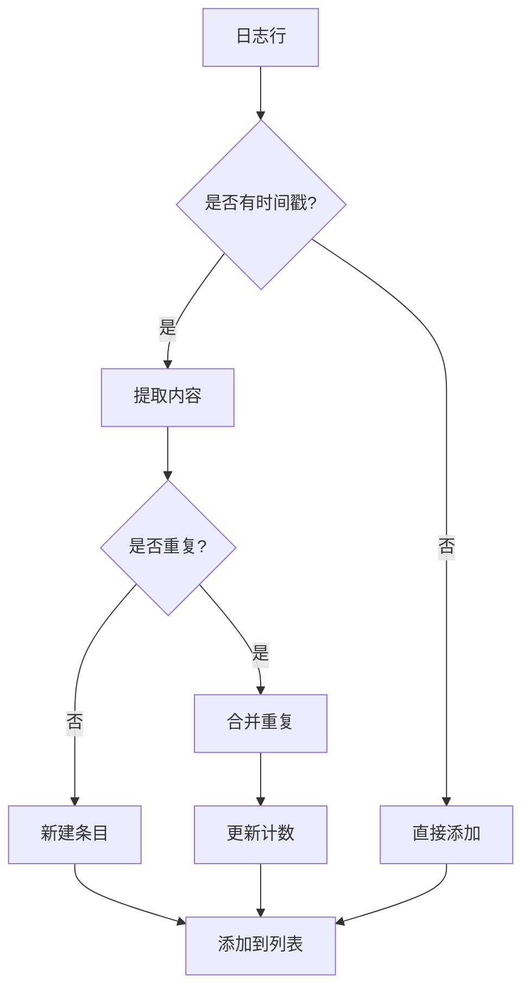

# 大日志文件查看器 - 数据分析功能

<cite>
**本文档引用的文件**
- [logProcessor.ts](file://src/logProcessor.ts)
- [logViewerPanel.ts](file://src/logViewerPanel.ts)
- [webview.html](file://src/webview.html)
- [extension.ts](file://src/extension.ts)
</cite>

## 目录
1. [简介](#简介)
2. [项目架构概览](#项目架构概览)
3. [统计信息分析](#统计信息分析)
4. [时间线导航功能](#时间线导航功能)
5. [前端可视化实现](#前端可视化实现)
6. [数据处理流程](#数据处理流程)
7. [性能优化策略](#性能优化策略)
8. [使用场景与最佳实践](#使用场景与最佳实践)
9. [总结](#总结)

## 简介

large_log_check是一个专为VS Code设计的大日志文件查看器扩展，提供了强大的数据分析功能。该工具能够高效处理大型日志文件，提供实时统计信息、时间线导航和可视化展示，帮助开发者快速定位问题和分析日志趋势。

核心功能包括：
- 流式读取和统计分析
- 多维度日志级别统计
- 时间线可视化导航
- 实时搜索和过滤
- 折叠重复日志模式

## 项目架构概览

该项目采用前后端分离的架构设计，主要由以下组件构成：

**图表来源**
- [extension.ts](file://src/extension.ts#L1-L116)
- [logViewerPanel.ts](file://src/logViewerPanel.ts#L1-L510)
- [webview.html](file://src/webview.html#L1-L4092)

**章节来源**
- [extension.ts](file://src/extension.ts#L1-L116)
- [logViewerPanel.ts](file://src/logViewerPanel.ts#L1-L510)

## 统计信息分析

### getStatistics方法实现

`getStatistics`方法是整个数据分析功能的核心，通过流式读取技术实现高效的统计计算：

**图表来源**
- [logProcessor.ts](file://src/logProcessor.ts#L566-L645)

统计信息包含以下维度：

| 统计指标 | 描述 | 数据类型 | 用途 |
|---------|------|----------|------|
| totalLines | 总行数 | number | 文件规模评估 |
| errorCount | 错误级别数量 | number | 故障检测 |
| warnCount | 警告级别数量 | number | 潜在问题识别 |
| infoCount | 信息级别数量 | number | 正常流程监控 |
| debugCount | 调试级别数量 | number | 详细诊断 |
| otherCount | 其他级别数量 | number | 未知级别处理 |
| timeRange | 时间范围 | {start, end} | 时间跨度分析 |
| classCounts | 类名统计 | Map<string, number> | 类别活跃度 |
| methodCounts | 方法名统计 | Map<string, number> | 方法调用频率 |
| threadCounts | 线程名统计 | Map<string, number> | 线程活跃度 |

**章节来源**
- [logProcessor.ts](file://src/logProcessor.ts#L566-L645)

### findLineByTime方法

该方法实现了快速定位指定时间的日志行功能：

**图表来源**
- [logViewerPanel.ts](file://src/logViewerPanel.ts#L320-L360)
- [logProcessor.ts](file://src/logProcessor.ts#L233-L285)

**章节来源**
- [logViewerPanel.ts](file://src/logViewerPanel.ts#L320-L360)
- [logProcessor.ts](file://src/logProcessor.ts#L233-L285)

## 时间线导航功能

### Canvas可视化实现

时间线功能通过HTML5 Canvas API实现，提供直观的时间分布可视化：

**图表来源**
- [webview.html](file://src/webview.html#L2669-L2820)

时间线的实现特点：

1. **分桶算法**：将时间范围分为20个桶，每个桶统计日志数量和级别分布
2. **分层柱状图**：按ERROR、WARN、INFO、DEBUG四个级别分别绘制颜色层次
3. **交互功能**：支持点击跳转和鼠标悬停提示
4. **自适应布局**：根据Canvas尺寸动态调整柱状图宽度

**章节来源**
- [webview.html](file://src/webview.html#L2669-L2820)

### 时间线数据处理

时间线生成过程包含以下关键步骤：

**图表来源**
- [webview.html](file://src/webview.html#L3390-L3500)

**章节来源**
- [webview.html](file://src/webview.html#L3390-L3500)

## 前端可视化实现

### 统计卡片展示

统计信息通过响应式网格布局展示，包含以下组件：

| 卡片类型 | 内容 | 样式 | 功能 |
|---------|------|------|------|
| 基础统计 | 总行数、各级别数量 | 简洁数字展示 | 快速概览 |
| 时间范围 | 开始时间、结束时间 | 时间轴样式 | 时间跨度分析 |
| 类名统计 | Top 10活跃类 | 可点击列表 | 类别筛选 |
| 方法名统计 | Top 10调用方法 | 可点击列表 | 方法筛选 |
| 线程名统计 | Top 10活跃线程 | 可点击列表 | 线程筛选 |

**章节来源**
- [webview.html](file://src/webview.html#L2016-L2130)

### 交互式时间线图例

时间线图例提供了丰富的视觉反馈：

**图表来源**
- [webview.html](file://src/webview.html#L2792-L2818)

**章节来源**
- [webview.html](file://src/webview.html#L2792-L2818)

## 数据处理流程

### 消息通信机制

前后端通过VS Code提供的Webview API实现双向通信：

**图表来源**
- [webview.html](file://src/webview.html#L1189-L1214)
- [logViewerPanel.ts](file://src/logViewerPanel.ts#L408-L448)

### 数据序列化传输

为了确保数据在前后端之间的可靠传输，系统采用了以下策略：

1. **Map转换**：将Map对象转换为普通对象
2. **日期序列化**：使用ISO格式存储时间戳
3. **错误处理**：完善的异常捕获和用户反馈

**章节来源**
- [logViewerPanel.ts](file://src/logViewerPanel.ts#L429-L448)

## 性能优化策略

### 流式读取优化

系统采用流式读取技术处理大文件：

**图表来源**
- [logProcessor.ts](file://src/logProcessor.ts#L60-L85)
- [logViewerPanel.ts](file://src/logViewerPanel.ts#L107-L147)

### 分页加载策略

对于大文件，系统实现了智能分页加载：

1. **阈值判断**：文件大于5万行时启用分页
2. **动态加载**：按需加载后续内容
3. **缓存机制**：已加载内容本地缓存

**章节来源**
- [logViewerPanel.ts](file://src/logViewerPanel.ts#L107-L147)

### 折叠重复日志

系统提供了高级的重复日志折叠功能：

**图表来源**
- [webview.html](file://src/webview.html#L1600-L1648)

**章节来源**
- [webview.html](file://src/webview.html#L1600-L1648)

## 使用场景与最佳实践

### 常见使用场景

1. **故障排查**
   - 使用统计功能快速了解错误分布
   - 通过时间线定位异常时间段
   - 利用搜索功能查找特定关键字

2. **性能分析**
   - 分析各类别日志的比例关系
   - 识别高频调用的方法和类
   - 监控线程活跃度变化

3. **容量规划**
   - 评估日志文件的增长趋势
   - 分析不同时间段的日志密度
   - 优化日志级别配置

### 最佳实践建议

1. **文件大小处理**
   - 对于小于5万行的文件，建议一次性加载
   - 大文件使用分页浏览，避免内存占用过高

2. **统计信息解读**
   - 关注ERROR/WARN比例，及时发现潜在问题
   - 利用时间范围分析，定位异常时间段
   - 结合类名和方法名统计，深入分析业务逻辑

3. **时间线导航技巧**
   - 使用时间线快速定位异常时间段
   - 结合搜索功能精确定位问题日志
   - 利用折叠模式提高大文件浏览效率

4. **性能优化**
   - 启用折叠重复日志功能减少视觉干扰
   - 合理设置分页大小平衡性能和体验
   - 定期清理不需要的书签和注释

## 总结

large_log_check提供了一套完整的大日志文件分析解决方案，通过以下核心特性实现了高效的日志分析：

1. **高效统计分析**：基于流式读取的getStatistics方法，支持多维度统计
2. **直观时间线**：Canvas实现的分层柱状图，提供清晰的时间分布视图
3. **智能交互**：支持点击跳转、搜索过滤、折叠重复等多种交互方式
4. **性能优化**：针对大文件的分页加载和智能缓存策略
5. **用户体验**：响应式的界面设计和丰富的视觉反馈

该工具特别适用于：
- 生产环境日志监控
- 性能瓶颈分析
- 故障根因分析
- 日志趋势研究

通过合理使用这些功能，开发者可以显著提高日志分析效率，更快地定位和解决问题。