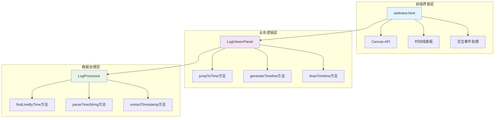
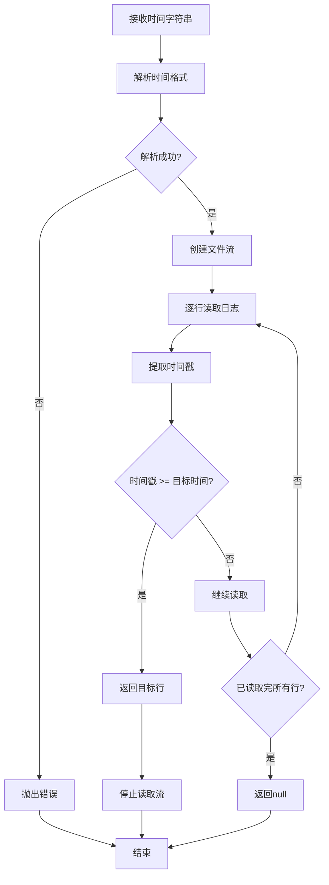
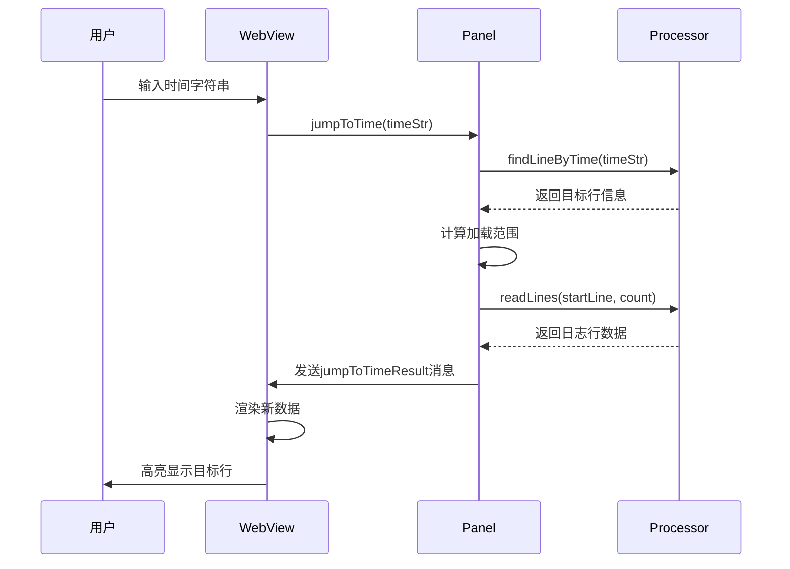
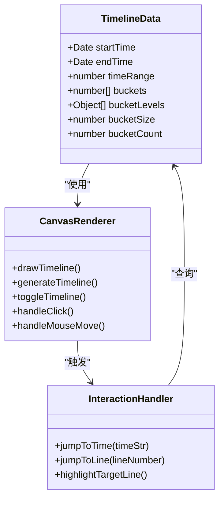
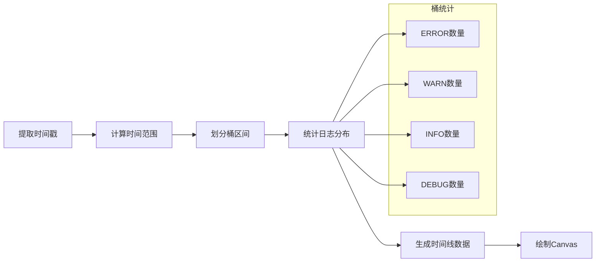
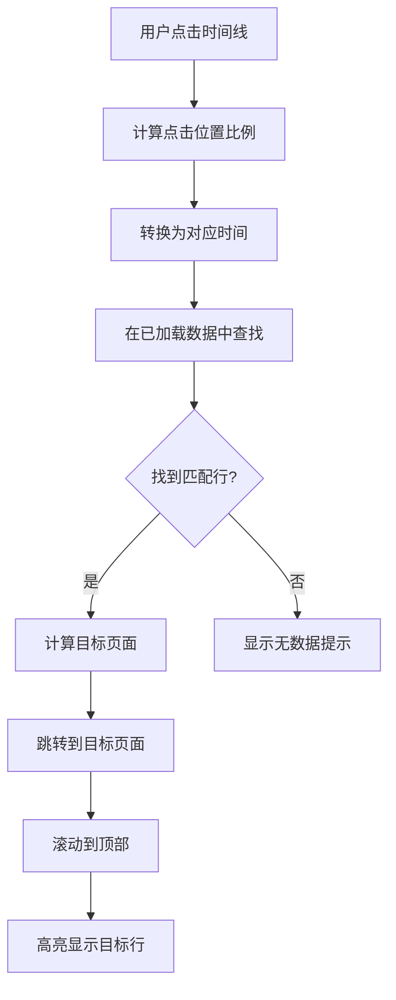
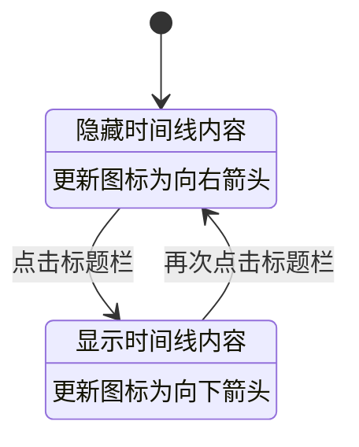
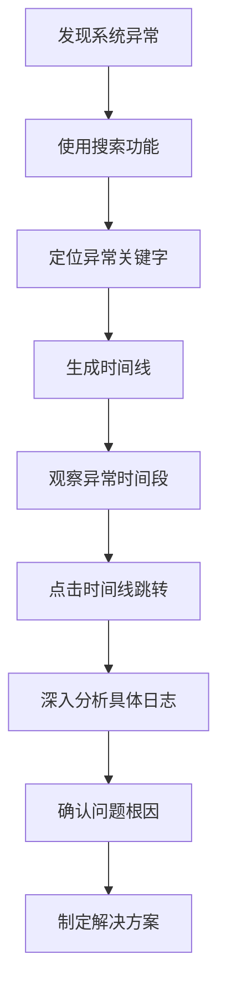

# 时间线导航

<cite>
**本文档引用的文件**
- [logProcessor.ts](file://src/logProcessor.ts)
- [logViewerPanel.ts](file://src/logViewerPanel.ts)
- [webview.html](file://src/webview.html)
- [extension.ts](file://src/extension.ts)
</cite>

## 目录
1. [简介](#简介)
2. [系统架构概览](#系统架构概览)
3. [核心组件分析](#核心组件分析)
4. [时间线导航功能详解](#时间线导航功能详解)
5. [性能优化策略](#性能优化策略)
6. [使用场景与最佳实践](#使用场景与最佳实践)
7. [总结](#总结)

## 简介

large_log_check扩展提供了一个强大的时间线导航功能，帮助用户快速定位到特定时间段的日志内容。该功能通过分析日志文件中的时间戳信息，生成可视化的时间分布图，并提供交互式的点击跳转能力，大大提升了大型日志文件的浏览效率。

## 系统架构概览

时间线导航功能采用前后端分离的架构设计，主要由以下三个层次组成：

**图表来源**
- [webview.html](file://src/webview.html#L731-L743)
- [logViewerPanel.ts](file://src/logViewerPanel.ts#L320-L360)
- [logProcessor.ts](file://src/logProcessor.ts#L237-L285)

## 核心组件分析

### LogProcessor.findLineByTime方法

这是时间线导航的核心算法，负责在日志文件中查找第一个大于或等于指定时间戳的日志行。

**图表来源**
- [logProcessor.ts](file://src/logProcessor.ts#L237-L285)

该方法的关键特性包括：
- **流式读取**：使用Node.js的readline模块进行流式读取，避免一次性加载整个文件
- **早期终止**：一旦找到符合条件的行就立即停止读取，显著提升性能
- **错误处理**：对时间格式解析失败的情况进行优雅处理
- **内存优化**：只在内存中保持当前处理的行，不会累积大量数据

**章节来源**
- [logProcessor.ts](file://src/logProcessor.ts#L237-L285)

### LogViewerPanel.jumpToTime方法

该方法协调前端界面和后端数据处理，实现时间定位功能的完整流程。

**图表来源**
- [logViewerPanel.ts](file://src/logViewerPanel.ts#L320-L360)
- [webview.html](file://src/webview.html#L3027-L3067)

**章节来源**
- [logViewerPanel.ts](file://src/logViewerPanel.ts#L320-L360)

### webview.html时间线绘制

前端使用Canvas API绘制时间分布图，提供直观的时间线可视化效果。

**图表来源**
- [webview.html](file://src/webview.html#L3391-L3474)
- [webview.html](file://src/webview.html#L3476-L3552)

**章节来源**
- [webview.html](file://src/webview.html#L3391-L3552)

## 时间线导航功能详解

### 时间线生成机制

时间线的生成过程包含以下关键步骤：

1. **时间戳提取**：从所有日志行中提取带有时间戳的行
2. **时间范围计算**：确定最早和最晚的时间戳，计算总时间跨度
3. **桶划分**：将时间范围划分为固定数量的桶（默认50个）
4. **统计分布**：统计每个桶中的日志数量和各级别分布
5. **数据存储**：将时间线数据保存到timelineData对象中

**图表来源**
- [webview.html](file://src/webview.html#L3428-L3448)

### Canvas绘图实现

时间线使用Canvas API绘制分层柱状图，每个桶的高度表示日志数量，颜色表示日志级别：

| 日志级别 | 颜色代码 | 用途 |
|---------|---------|------|
| ERROR | #f14c4c | 红色，表示严重错误 |
| WARN | #cca700 | 橙色，表示警告信息 |
| INFO | #4fc1ff | 蓝色，表示一般信息 |
| DEBUG | #b267e6 | 紫色，表示调试信息 |

**章节来源**
- [webview.html](file://src/webview.html#L3476-L3552)

### 交互式点击跳转

用户可以通过点击时间线上的任意位置来快速跳转到相应时间段的日志：

**图表来源**
- [webview.html](file://src/webview.html#L3554-L3596)

**章节来源**
- [webview.html](file://src/webview.html#L3554-L3596)

### 时间线面板展开/折叠

时间线面板支持展开/折叠功能，节省界面空间：

**图表来源**
- [webview.html](file://src/webview.html#L3377-L3388)

**章节来源**
- [webview.html](file://src/webview.html#L3377-L3388)

## 性能优化策略

### 流式读取优化

时间线导航采用了多种性能优化策略：

1. **单向流读取**：使用readline.createInterface()进行单向流读取
2. **早期终止**：找到目标行后立即停止读取，避免不必要的I/O操作
3. **内存控制**：只在内存中保持必要的数据，避免内存泄漏
4. **异步处理**：所有文件操作都采用异步方式，不阻塞主线程

### 时间线绘制优化

1. **延迟绘制**：在Canvas元素完全渲染后再执行绘制操作
2. **高分辨率适配**：根据设备像素比设置Canvas尺寸
3. **批量操作**：一次性计算所有柱状图的位置和尺寸
4. **事件委托**：使用事件委托减少事件监听器数量

### 数据缓存策略

1. **时间线数据缓存**：生成的时间线数据在页面生命周期内保持不变
2. **页面范围记忆**：折叠模式下记住每页的实际加载范围
3. **懒加载机制**：只有在需要时才生成和绘制时间线

**章节来源**
- [logProcessor.ts](file://src/logProcessor.ts#L237-L285)
- [webview.html](file://src/webview.html#L3476-L3552)

## 使用场景与最佳实践

### 快速定位故障时间段

时间线导航特别适用于以下场景：

1. **故障排查**：快速定位到系统异常发生的时间段
2. **性能分析**：识别高频日志事件的时间分布
3. **趋势分析**：观察系统运行过程中各类日志的变化趋势
4. **关联分析**：对比不同时间段的日志内容和级别分布

### 最佳实践建议

1. **合理使用时间范围**：确保日志文件中有足够的时间跨度才能生成有意义的时间线
2. **结合搜索功能**：先使用搜索功能缩小范围，再利用时间线精确定位
3. **注意内存使用**：对于超大文件，考虑使用分页加载策略
4. **定期刷新数据**：当日志文件发生变化时，及时刷新时间线数据

### 故障排查工作流

**图表来源**
- [webview.html](file://src/webview.html#L3027-L3067)

## 总结

large_log_check的时间线导航功能是一个精心设计的性能优化解决方案，通过以下关键技术实现了高效的大型日志文件浏览：

1. **算法优化**：findLineByTime方法采用流式读取和早期终止策略，确保在大型文件中也能快速定位
2. **可视化设计**：使用Canvas API绘制直观的时间分布图，提供良好的用户体验
3. **交互体验**：支持点击跳转、鼠标悬停提示等交互功能，提升操作效率
4. **性能保障**：通过延迟绘制、事件委托等技术手段，确保界面响应流畅

该功能不仅解决了大型日志文件浏览的痛点，还为系统管理员和开发者提供了强大的故障排查工具，是现代日志分析工具的重要组成部分。