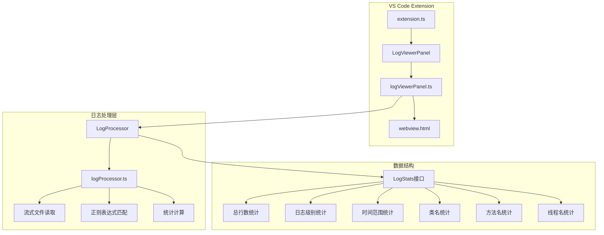
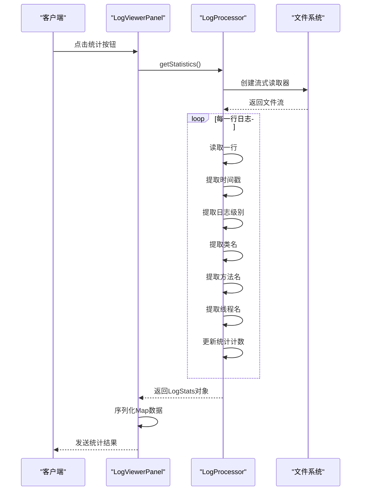
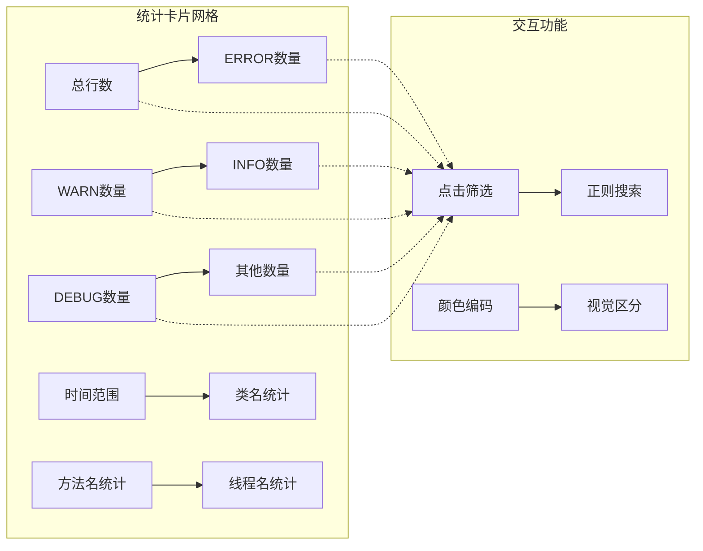
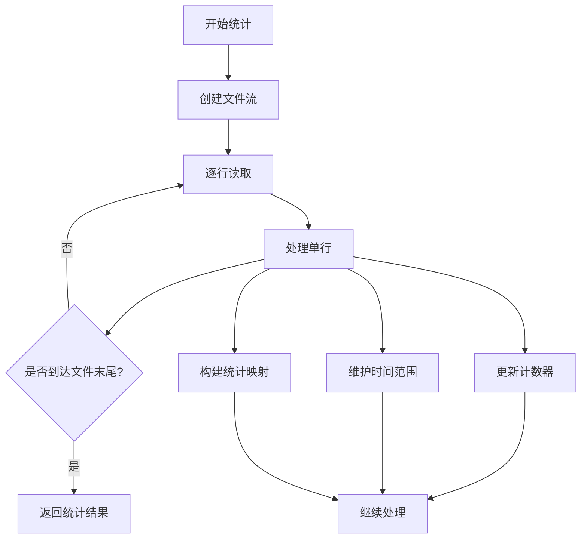

# 统计信息功能全面文档

<cite>
**本文档引用的文件**
- [logProcessor.ts](file://src/logProcessor.ts)
- [logViewerPanel.ts](file://src/logViewerPanel.ts)
- [webview.html](file://src/webview.html)
- [extension.ts](file://src/extension.ts)
</cite>

## 目录
1. [简介](#简介)
2. [项目架构概览](#项目架构概览)
3. [核心组件分析](#核心组件分析)
4. [统计功能实现细节](#统计功能实现细节)
5. [前端界面设计](#前端界面设计)
6. [性能优化策略](#性能优化策略)
7. [使用场景与最佳实践](#使用场景与最佳实践)
8. [故障排除指南](#故障排除指南)
9. [总结](#总结)

## 简介

large_log_check是一个强大的VS Code扩展，专门用于处理大型日志文件。其统计信息功能通过流式读取技术，能够高效地分析日志文件的结构和内容，提供全面的统计报告。该功能不仅统计日志级别分布，还能提取类名、方法名和线程名的出现频率，帮助开发者快速了解日志文件的整体情况。

## 项目架构概览

该扩展采用模块化架构设计，主要包含以下核心模块：



**图表来源**
- [extension.ts](file://src/extension.ts#L1-L116)
- [logViewerPanel.ts](file://src/logViewerPanel.ts#L1-L510)
- [logProcessor.ts](file://src/logProcessor.ts#L1-L807)

## 核心组件分析

### LogProcessor类

LogProcessor是统计功能的核心处理器，负责文件的流式读取和统计计算。

#### 主要特性

1. **流式文件读取**：使用Node.js的readline模块逐行处理大文件
2. **多格式时间戳解析**：支持多种时间戳格式的自动识别
3. **灵活的日志级别检测**：通过正则表达式匹配不同格式的日志级别
4. **智能统计聚合**：实时统计各类信息的出现频率

#### 关键方法

- `getStatistics()`：主统计入口，返回完整的LogStats对象
- `extractTimestamp()`：提取时间戳信息
- `extractLogLevel()`：提取日志级别
- `extractClassName()`：提取类名信息
- `extractMethodName()`：提取方法名信息
- `extractThreadName()`：提取线程名信息

**章节来源**
- [logProcessor.ts](file://src/logProcessor.ts#L566-L644)

### LogStats接口

LogStats定义了统计结果的数据结构：

```typescript
interface LogStats {
    totalLines: number;
    errorCount: number;
    warnCount: number;
    infoCount: number;
    debugCount: number;
    otherCount: number;
    timeRange?: {
        start?: Date;
        end?: Date;
    };
    classCounts?: Map<string, number>;
    methodCounts?: Map<string, number>;
    threadCounts?: Map<string, number>;
}
```

**章节来源**
- [logProcessor.ts](file://src/logProcessor.ts#L11-L28)

## 统计功能实现细节

### 流式处理机制

统计功能采用流式处理方式，避免一次性加载整个大文件到内存中：



**图表来源**
- [logViewerPanel.ts](file://src/logViewerPanel.ts#L429-L447)
- [logProcessor.ts](file://src/logProcessor.ts#L566-L644)

### 统计算法详解

#### 日志级别统计

系统通过预定义的正则表达式模式识别不同级别的日志：

```typescript
private logLevelPatterns = [
    { level: 'ERROR', pattern: /\[(ERROR|FATAL|SEVERE)\]|\b(ERROR|FATAL|SEVERE)\s/i },
    { level: 'WARN', pattern: /\[(WARN|WARNING)\]|\b(WARN|WARNING)\s/i },
    { level: 'INFO', pattern: /\[(INFO|INFORMATION)\]|\b(INFO|INFORMATION)\s/i },
    { level: 'DEBUG', pattern: /\[(DEBUG|TRACE|VERBOSE)\]|\b(DEBUG|TRACE|VERBOSE)\s/i }
];
```

#### 时间范围计算

通过遍历每一行日志，维护最早和最晚的时间戳：

```typescript
if (timestamp) {
    if (!stats.timeRange!.start || timestamp < stats.timeRange!.start) {
        stats.timeRange!.start = timestamp;
    }
    if (!stats.timeRange!.end || timestamp > stats.timeRange!.end) {
        stats.timeRange!.end = timestamp;
    }
}
```

#### 类名、方法名、线程名统计

使用专门的正则表达式提取特定信息：

- **类名提取**：匹配Java包名.类名格式
- **方法名提取**：支持多种格式如`<method>`、`method接口`
- **线程名提取**：匹配方括号内的内容

**章节来源**
- [logProcessor.ts](file://src/logProcessor.ts#L48-L560)

### 数据转换与序列化

由于Map对象无法直接通过postMessage传输，需要进行序列化：

```typescript
const serializedStats = {
    ...stats,
    classCounts: stats.classCounts ? Object.fromEntries(stats.classCounts) : {},
    methodCounts: stats.methodCounts ? Object.fromEntries(stats.methodCounts) : {},
    threadCounts: stats.threadCounts ? Object.fromEntries(stats.threadCounts) : {}
};
```

**章节来源**
- [logViewerPanel.ts](file://src/logViewerPanel.ts#L433-L438)

## 前端界面设计

### 统计弹窗布局

统计信息以网格布局展示在模态弹窗中：



**图表来源**
- [webview.html](file://src/webview.html#L2017-L2128)

### 动态统计展示

前端通过JavaScript动态生成统计卡片：

```javascript
function showStatsModal(stats) {
    const grid = document.getElementById('statsGrid');
    
    // 转换Map为数组并排序
    const classStats = stats.classCounts ? 
        Array.from(Object.entries(stats.classCounts))
            .sort((a, b) => b[1] - a[1]).slice(0, 10) : [];
    
    // 生成HTML内容
    grid.innerHTML = `
        <div class="stats-card">
            <h3>总行数</h3>
            <div class="value">${stats.totalLines}</div>
        </div>
        <!-- 更多统计卡片 -->
    `;
}
```

**章节来源**
- [webview.html](file://src/webview.html#L2017-L2052)

### 颜色编码系统

不同类型的统计数据使用不同的颜色标识：

- **ERROR**：红色 (#f14c4c)
- **WARN**：黄色 (#cca700)  
- **INFO**：蓝色 (#4fc1ff)
- **DEBUG**：紫色 (#b267e6)
- **其他**：默认颜色

**章节来源**
- [webview.html](file://src/webview.html#L2035-L2047)

## 性能优化策略

### 大文件处理优化

1. **流式读取**：避免一次性加载整个文件到内存
2. **智能分页**：根据内容动态调整加载数量
3. **延迟加载**：只在需要时才加载详细统计信息
4. **缓存机制**：对频繁访问的数据进行缓存

### 内存管理



**图表来源**
- [logProcessor.ts](file://src/logProcessor.ts#L566-L644)

### 并发处理优化

虽然当前实现是单线程的，但架构设计支持未来的并发优化：
- 异步处理避免阻塞UI
- 流式处理减少内存占用
- 模块化设计便于扩展

**章节来源**
- [logViewerPanel.ts](file://src/logViewerPanel.ts#L429-L447)

## 使用场景与最佳实践

### 典型使用场景

1. **日志分析**：快速了解日志文件的整体质量分布
2. **性能监控**：识别高频出现的类、方法和线程
3. **问题诊断**：通过时间范围统计定位问题时间段
4. **容量规划**：了解日志生成速率和级别分布

### 最佳实践建议

1. **定期统计**：对关键日志文件定期执行统计分析
2. **趋势跟踪**：记录历史统计结果，观察变化趋势
3. **阈值设置**：根据统计结果设置合理的告警阈值
4. **分类管理**：按应用、环境等维度组织统计结果

### 性能建议

1. **文件大小**：对于超大文件，考虑分段统计
2. **并发控制**：避免同时运行多个统计任务
3. **资源监控**：关注内存和CPU使用情况
4. **缓存策略**：对静态统计结果实施缓存

## 故障排除指南

### 常见问题及解决方案

#### 统计结果不准确

**可能原因**：
- 日志格式不规范
- 时间戳格式识别失败
- 正则表达式匹配错误

**解决方法**：
1. 检查日志文件格式一致性
2. 验证时间戳格式是否在支持范围内
3. 调整正则表达式匹配规则

#### 内存使用过高

**可能原因**：
- 文件过大导致内存压力
- 统计数据过多
- 缓存策略不当

**解决方法**：
1. 实施更严格的内存限制
2. 限制统计结果的数量
3. 优化数据结构存储

#### 统计速度慢

**可能原因**：
- 文件读取速度慢
- 正则表达式复杂度高
- 系统资源不足

**解决方法**：
1. 使用SSD存储提高I/O性能
2. 简化正则表达式
3. 增加系统资源分配

**章节来源**
- [logProcessor.ts](file://src/logProcessor.ts#L566-L644)
- [logViewerPanel.ts](file://src/logViewerPanel.ts#L429-L447)

## 总结

large_log_check的统计信息功能通过精心设计的架构，实现了对大型日志文件的高效分析。其核心优势包括：

1. **高性能**：流式处理确保大文件也能快速统计
2. **准确性**：多格式支持和智能匹配保证统计精度
3. **易用性**：直观的界面和丰富的交互功能
4. **扩展性**：模块化设计便于功能扩展

该功能为开发者提供了强大的日志分析工具，能够显著提升日志处理效率和问题诊断能力。随着功能的不断完善，它将成为处理大型日志文件不可或缺的助手。