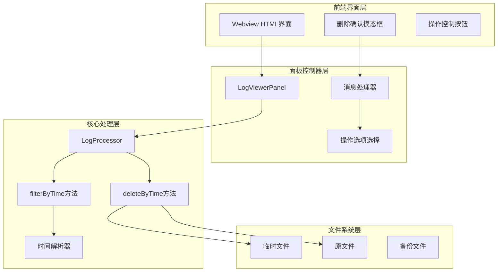
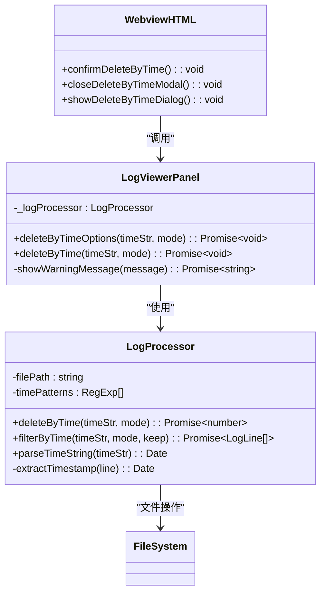
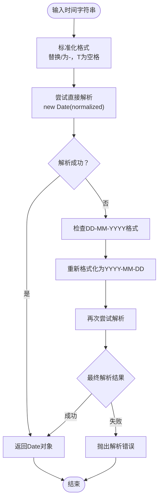
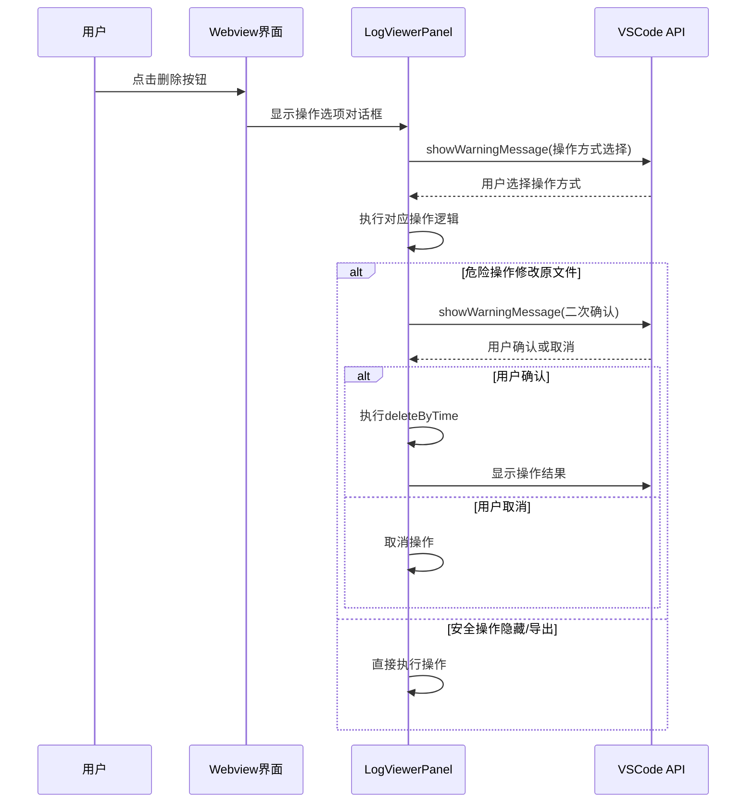
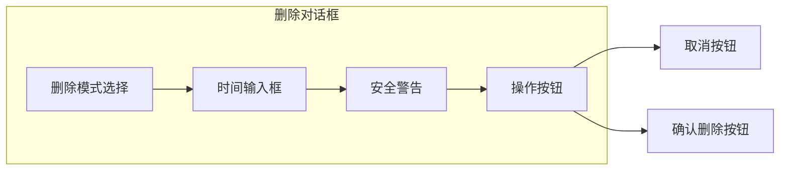
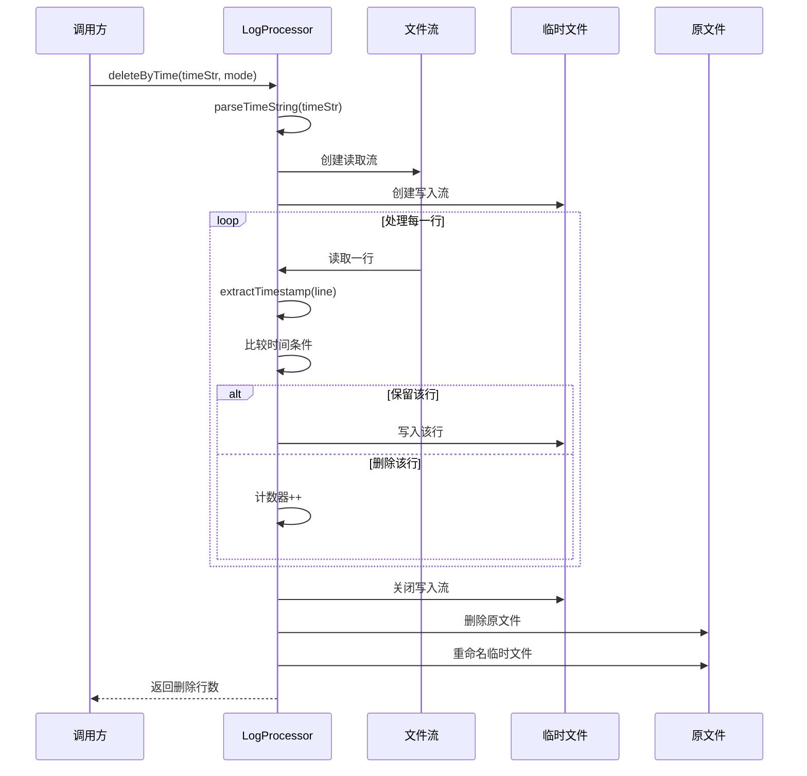
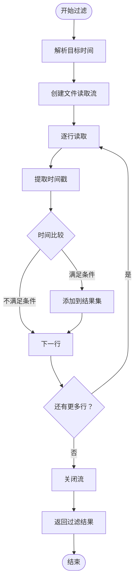

# 按时间删除日志功能详细文档

<cite>
**本文档引用的文件**
- [logProcessor.ts](file://src/logProcessor.ts)
- [logViewerPanel.ts](file://src/logViewerPanel.ts)
- [webview.html](file://src/webview.html)
- [extension.ts](file://src/extension.ts)
</cite>

## 目录
1. [功能概述](#功能概述)
2. [核心组件架构](#核心组件架构)
3. [时间格式解析与边界处理](#时间格式解析与边界处理)
4. [安全警告机制](#安全警告机制)
5. [UI设计与交互流程](#ui设计与交互流程)
6. [技术实现细节](#技术实现细节)
7. [风险提示与最佳实践](#风险提示与最佳实践)
8. [总结](#总结)

## 功能概述

large_log_check扩展提供了强大的按时间删除日志功能，允许用户根据指定的时间点安全地清理日志文件。该功能支持两种删除模式：删除指定时间之前或之后的日志，并提供多种操作方式以确保数据安全。

### 主要特性
- **双重删除模式**：支持删除"之前"和"之后"两个方向的日志
- **安全操作选项**：提供隐藏、导出、修改原文件三种操作方式
- **智能时间解析**：支持多种时间格式的自动识别和解析
- **二次确认机制**：危险操作需要用户二次确认
- **流式处理**：采用临时文件和流式读写确保大文件处理性能

## 核心组件架构

### 系统架构图



**图表来源**
- [logViewerPanel.ts](file://src/logViewerPanel.ts#L180-L228)
- [logProcessor.ts](file://src/logProcessor.ts#L339-L408)
- [webview.html](file://src/webview.html#L790-L816)

### 组件关系图



**图表来源**
- [logProcessor.ts](file://src/logProcessor.ts#L30-L807)
- [logViewerPanel.ts](file://src/logViewerPanel.ts#L6-L510)
- [webview.html](file://src/webview.html#L2876-L2926)

**章节来源**
- [logProcessor.ts](file://src/logProcessor.ts#L30-L408)
- [logViewerPanel.ts](file://src/logViewerPanel.ts#L6-L228)
- [webview.html](file://src/webview.html#L790-L816)

## 时间格式解析与边界处理

### 支持的时间格式

LogProcessor类内置了多种时间格式的正则表达式模式，能够智能识别不同格式的日志时间戳：

| 格式类型 | 正则表达式 | 示例 |
|---------|-----------|------|
| 标准日期时间 | `\d{4}-\d{2}-\d{2}\s+\d{2}:\d{2}:\d{2}` | `2024-01-01 12:00:00` |
| 斜杠分隔 | `\d{4}\/\d{2}\/\d{2}\s+\d{2}:\d{2}:\d{2}` | `2024/01/01 12:00:00` |
| 方括号包裹 | `\[ (\d{4}-\d{2}-\d{2}\s+\d{2}:\d{2}:\d{2}) \]` | `[2024-01-01 12:00:00]` |
| 反斜杠格式 | `\d{2}-\d{2}-\d{4}\s+\d{2}:\d{2}:\d{2}` | `01-01-2024 12:00:00` |
| ISO 8601 | `\d{4}-\d{2}-\d{2}T\d{2}:\d{2}:\d{2}` | `2024-01-01T12:00:00` |

### 时间解析算法



**图表来源**
- [logProcessor.ts](file://src/logProcessor.ts#L776-L807)

### 边界处理策略

系统实现了智能的边界处理逻辑，确保时间比较的准确性：

- **时间缺失处理**：无法提取时间戳的行默认保留
- **时间精度**：支持到秒级精度的时间比较
- **时区考虑**：基于本地时区进行时间比较
- **异常情况**：无效时间格式返回null而非抛出异常

**章节来源**
- [logProcessor.ts](file://src/logProcessor.ts#L35-L46)
- [logProcessor.ts](file://src/logProcessor.ts#L776-L807)

## 安全警告机制

### 二次确认流程

系统在执行危险操作前实施严格的二次确认机制：



**图表来源**
- [logViewerPanel.ts](file://src/logViewerPanel.ts#L180-L228)
- [logViewerPanel.ts](file://src/logViewerPanel.ts#L280-L298)

### 操作方式选择

用户在执行删除操作前必须选择以下三种操作方式之一：

| 操作方式 | 风险等级 | 描述 | 适用场景 |
|---------|---------|------|---------|
| 仅隐藏（不修改文件） | 低 | 在界面中隐藏指定时间范围的日志，不影响原文件 | 日志分析、临时过滤 |
| 导出到新文件 | 低 | 将指定时间范围的日志导出到新文件 | 归档、备份、分析 |
| 修改原文件（危险） | 高 | 直接修改原文件，删除指定时间范围的日志 | 日志清理、空间优化 |

### 文件备份建议

系统在执行危险操作前会显示醒目的警告信息：

```html
<div style="background-color: var(--vscode-editorWidget-background); 
           padding: 10px; 
           border-radius: 3px; 
           margin-bottom: 15px; 
           border-left: 3px solid #d97706;">
    <strong>⚠️ 警告：</strong>此操作会直接修改原文件，不可恢复！请务必备份重要日志！
</div>
```

**章节来源**
- [logViewerPanel.ts](file://src/logViewerPanel.ts#L180-L228)
- [webview.html](file://src/webview.html#L807-L809)

## UI设计与交互流程

### 删除按钮布局

删除功能在工具栏中以红色垃圾桶图标标识，位置醒目且易于访问：

```html
<button onclick="showDeleteModal()" style="background-color: #dc2626;">🗑️ 删除</button>
```

### 确认对话框设计

#### 按时间删除对话框



**图表来源**
- [webview.html](file://src/webview.html#L790-L816)

#### 对话框元素详解

| 元素 | 功能 | 设计特点 |
|------|------|---------|
| 删除模式选择 | 选择"之前"或"之后"删除 | 下拉菜单，清晰区分两种模式 |
| 时间输入框 | 输入目标时间 | 支持多种格式，带占位符提示 |
| 安全警告 | 显示危险操作警告 | 红色边框，醒目的警告图标 |
| 操作按钮 | 取消和确认删除 | 取消按钮蓝色，确认按钮红色 |

### JavaScript交互逻辑

#### 确认删除函数

```javascript
function confirmDeleteByTime() {
    const timeStr = document.getElementById('deleteTimeInput').value.trim();
    const mode = document.getElementById('deleteTimeMode').value;
    
    // 输入验证
    if (!timeStr) {
        alert('请输入时间！');
        return;
    }
    
    if (!/^\d{4}-\d{2}-\d{2}/.test(timeStr)) {
        alert('时间格式不正确！请使用格式：2024-01-01 12:00:00 或 2024-01-01');
        return;
    }
    
    // 发送消息到后端
    vscode.postMessage({
        command: 'deleteByTime',
        timeStr: timeStr,
        mode: mode
    });
    
    closeDeleteByTimeModal();
}
```

**图表来源**
- [webview.html](file://src/webview.html#L2904-L2926)

### 错误处理与用户体验

系统实现了完善的错误处理机制：

- **实时验证**：输入时即时检查时间格式
- **友好提示**：提供具体的错误信息和修正建议
- **状态反馈**：操作成功或失败时显示相应消息
- **操作回滚**：取消操作时保持界面状态不变

**章节来源**
- [webview.html](file://src/webview.html#L790-L816)
- [webview.html](file://src/webview.html#L2904-L2926)

## 技术实现细节

### deleteByTime方法实现

LogProcessor类的deleteByTime方法采用了流式处理和临时文件的安全机制：



**图表来源**
- [logProcessor.ts](file://src/logProcessor.ts#L339-L408)

### filterByTime方法实现

filterByTime方法提供非破坏性的过滤功能，不会修改原文件：



**图表来源**
- [logProcessor.ts](file://src/logProcessor.ts#L178-L230)

### 流式处理优势

1. **内存效率**：避免一次性加载整个大文件到内存
2. **响应性**：小文件可以立即处理，大文件分块处理
3. **可靠性**：单行处理失败不影响整体操作
4. **可中断性**：支持操作中断和恢复

### 异常处理机制

系统实现了多层次的异常处理：

- **文件操作异常**：临时文件创建失败、权限不足等
- **时间解析异常**：无效时间格式导致的解析错误
- **网络异常**：VSCode消息传递失败
- **用户取消**：用户主动取消操作

**章节来源**
- [logProcessor.ts](file://src/logProcessor.ts#L339-L408)
- [logProcessor.ts](file://src/logProcessor.ts#L178-L230)
- [logViewerPanel.ts](file://src/logViewerPanel.ts#L280-L298)

## 风险提示与最佳实践

### 风险评估矩阵

| 操作方式 | 风险等级 | 主要风险 | 缓解措施 |
|---------|---------|---------|---------|
| 仅隐藏 | 低 | 数据仍然存在，可能被误用 | 明确标注为"仅隐藏" |
| 导出到新文件 | 低 | 文件路径错误 | 提供默认路径建议 |
| 修改原文件 | 高 | 数据永久丢失 | 二次确认、安全警告 |

### 最佳实践建议

#### 1. 操作前准备
- **备份重要日志**：在执行危险操作前务必备份原文件
- **验证时间格式**：使用系统提供的格式提示确保时间格式正确
- **测试过滤效果**：先使用"仅隐藏"模式验证删除范围

#### 2. 操作过程监控
- **观察进度指示**：注意VSCode的状态栏和通知消息
- **检查操作结果**：确认删除行数与预期相符
- **验证文件完整性**：检查原文件大小变化

#### 3. 后续处理
- **定期备份**：建立定期备份机制
- **版本控制**：对重要日志文件启用版本控制
- **操作记录**：记录每次删除操作的时间和范围

### 常见问题解决

#### 时间格式错误
```javascript
// 错误示例
"2024/01/01 12:00:00" // 斜杠分隔符
"01-01-2024 12:00:00" // DD-MM-YYYY格式
"2024-01-01" // 缺少时间部分
```

#### 解决方案
- 使用标准的YYYY-MM-DD格式
- 确保包含完整的时间部分
- 遵循系统提供的格式提示

#### 大文件处理性能
对于超大日志文件，系统采用分页加载策略：
- 小于5万行：一次性加载所有数据
- 大于5万行：先加载前10000行，支持分页浏览

**章节来源**
- [logViewerPanel.ts](file://src/logViewerPanel.ts#L107-L144)
- [webview.html](file://src/webview.html#L807-L809)

## 总结

large_log_check扩展的按时间删除功能是一个设计精良、安全可靠的日志管理工具。通过以下关键特性确保了功能的有效性和安全性：

### 核心优势
1. **多重安全保障**：从UI设计到代码实现的全方位安全机制
2. **灵活的操作方式**：满足不同场景下的需求
3. **智能的时间处理**：支持多种时间格式和边界情况
4. **优秀的用户体验**：直观的界面设计和友好的错误提示

### 技术亮点
- **流式处理架构**：高效处理大文件而不影响性能
- **临时文件机制**：确保数据安全和操作可逆性
- **二次确认机制**：防止意外操作造成数据损失
- **智能时间解析**：自动识别和处理各种时间格式

### 应用价值
该功能特别适用于：
- **日志归档清理**：定期清理过期日志释放存储空间
- **故障排查**：快速定位特定时间段的问题日志
- **性能优化**：减少大文件对系统性能的影响
- **合规要求**：满足数据保留期限的合规要求

通过合理使用这些功能，用户可以更高效地管理和维护大型日志文件，同时确保数据安全和操作可追溯性。