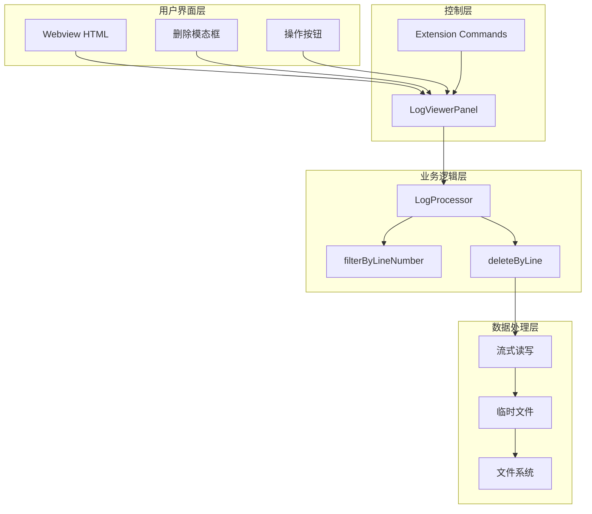
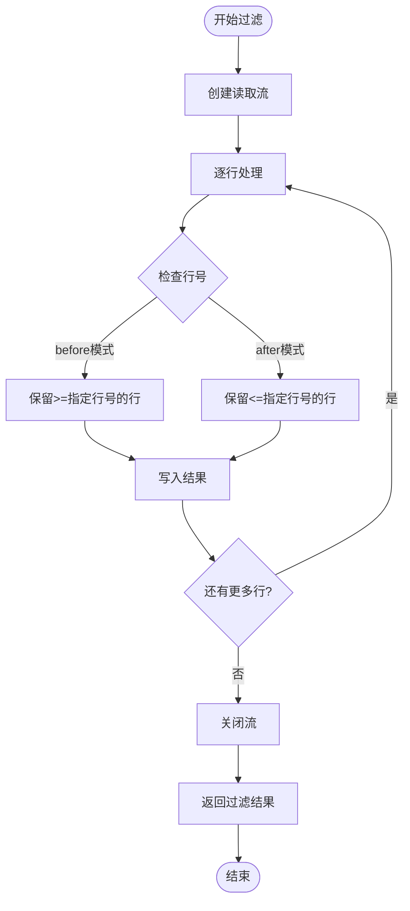
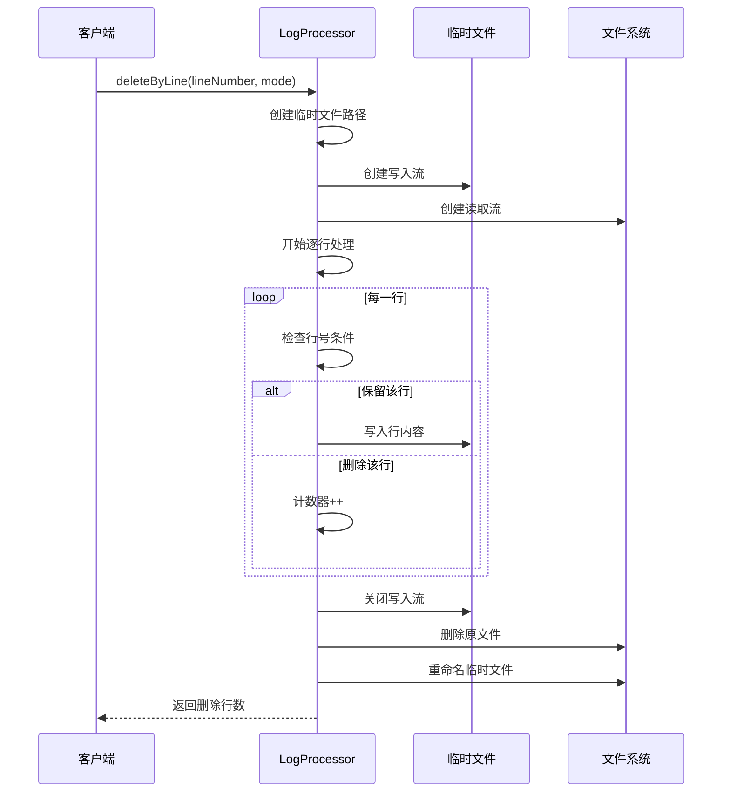
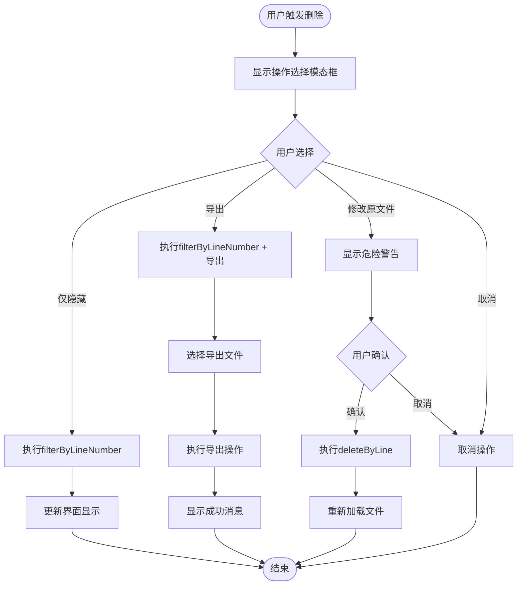
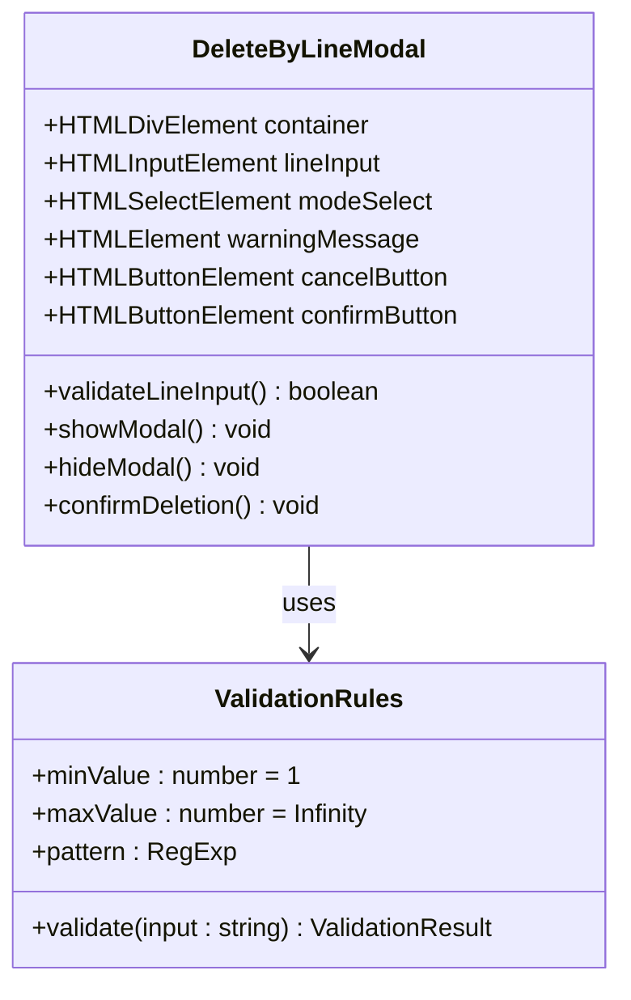
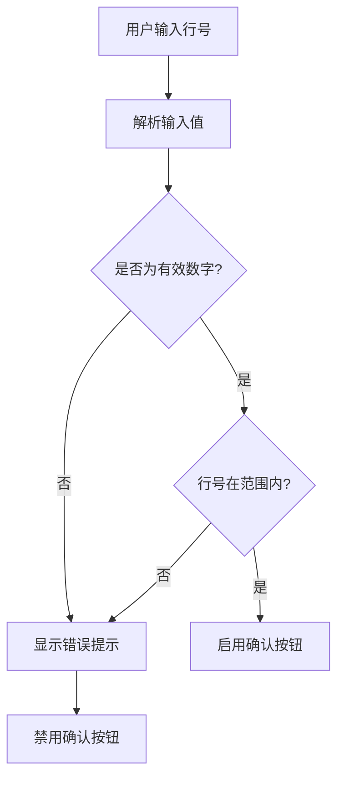
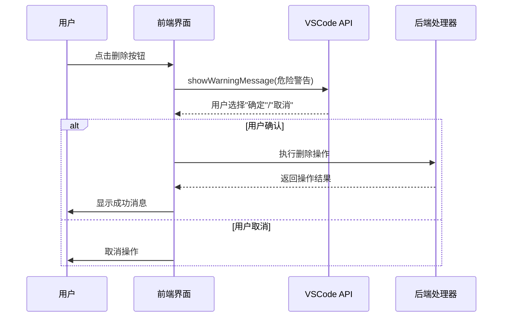
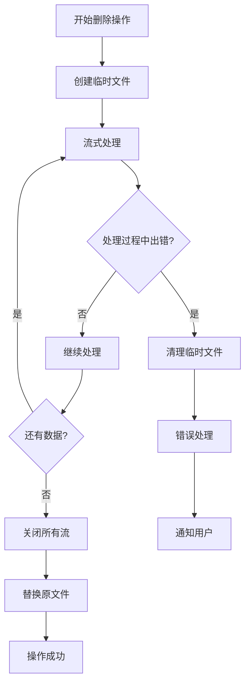
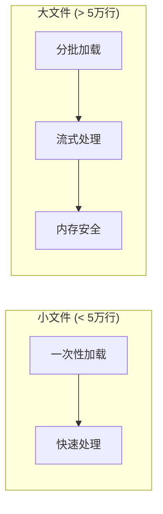
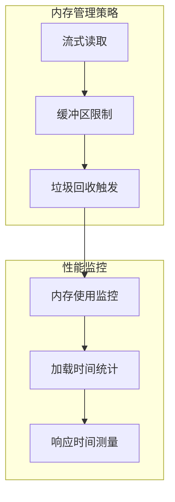

# 按行数删除功能详细文档

<cite>
**本文档引用的文件**
- [logProcessor.ts](file://src/logProcessor.ts)
- [logViewerPanel.ts](file://src/logViewerPanel.ts)
- [webview.html](file://src/webview.html)
- [extension.ts](file://src/extension.ts)
</cite>

## 目录
1. [功能概述](#功能概述)
2. [系统架构](#系统架构)
3. [核心组件分析](#核心组件分析)
4. [UI设计与交互](#ui设计与交互)
5. [安全机制](#安全机制)
6. [使用场景与边界情况](#使用场景与边界情况)
7. [性能考虑](#性能考虑)
8. [故障排除指南](#故障排除指南)
9. [总结](#总结)

## 功能概述

按行数删除功能是large_log_check扩展中的核心日志处理特性，允许用户基于行号对日志文件进行精确的删除操作。该功能提供了三种不同的操作模式：仅隐藏（不修改文件）、导出到新文件、修改原文件（危险操作），并通过多重安全验证确保用户数据的安全性。

### 主要特性
- **精确行号定位**：支持基于行号的精确删除操作
- **多种操作模式**：提供非破坏性过滤和破坏性修改两种方式
- **安全警告机制**：通过二次确认防止误操作
- **流式处理**：采用临时文件和流式读写技术保证大文件处理效率
- **实时预览**：删除前可预览操作结果

## 系统架构

**图表来源**
- [logViewerPanel.ts](file://src/logViewerPanel.ts#L230-L278)
- [logProcessor.ts](file://src/logProcessor.ts#L414-L474)

## 核心组件分析

### LogProcessor类 - 核心处理器

LogProcessor类是按行数删除功能的核心实现，提供了两个关键方法：

#### filterByLineNumber方法 - 非破坏性过滤

**图表来源**
- [logProcessor.ts](file://src/logProcessor.ts#L291-L333)

filterByLineNumber方法实现了非破坏性的行过滤功能：
- **参数控制**：接受行号、模式（before/after）和保留标志
- **流式处理**：使用readline接口逐行读取，避免内存溢出
- **条件判断**：根据模式参数决定保留哪些行
- **实时返回**：处理过程中实时返回符合条件的行

**节来源**
- [logProcessor.ts](file://src/logProcessor.ts#L291-L333)

#### deleteByLine方法 - 原文件修改

**图表来源**
- [logProcessor.ts](file://src/logProcessor.ts#L414-L474)

deleteByLine方法实现了安全的原文件修改：
- **临时文件策略**：使用`.tmp`扩展名创建临时文件
- **原子操作**：先写入临时文件，确认成功后再替换原文件
- **错误恢复**：发生错误时自动清理临时文件
- **状态更新**：修改完成后更新内部行数统计

**节来源**
- [logProcessor.ts](file://src/logProcessor.ts#L414-L474)

### LogViewerPanel类 - 控制器

LogViewerPanel类负责协调用户界面和底层处理逻辑：

#### deleteByLineOptions方法 - 操作选择

**图表来源**
- [logViewerPanel.ts](file://src/logViewerPanel.ts#L230-L278)

**节来源**
- [logViewerPanel.ts](file://src/logViewerPanel.ts#L230-L278)

## UI设计与交互

### Webview HTML - 用户界面

webview.html中的按行数删除模态框提供了直观的操作界面：

#### 行号输入框设计

**图表来源**
- [webview.html](file://src/webview.html#L859-L861)

#### 操作按钮布局

模态框包含以下关键元素：
- **删除模式选择**：下拉菜单提供before/after两种模式
- **行号输入框**：数字输入框，最小值为1
- **警告信息**：红色边框强调危险操作
- **操作按钮**：取消和确认删除按钮

**节来源**
- [webview.html](file://src/webview.html#L846-L872)

### JavaScript交互逻辑

前端JavaScript实现了完整的用户交互逻辑：

#### 输入验证机制

**图表来源**
- [webview.html](file://src/webview.html#L3094-L3107)

#### 消息传递机制

前端通过vscode.postMessage()与后端通信：
- **命令类型**：`deleteByLine`
- **参数传递**：行号、删除模式
- **异步处理**：等待后端处理完成后的回调

**节来源**
- [webview.html](file://src/webview.html#L3094-L3107)

## 安全机制

### 危险操作警告系统

系统实现了多层次的安全防护机制：

#### 二次确认流程

**图表来源**
- [logViewerPanel.ts](file://src/logViewerPanel.ts#L300-L317)

#### 用户确认对话框实现

deleteByLine方法中的安全检查：
- **模态对话框**：使用vscode.window.showWarningMessage创建确认窗口
- **明确标识**：对话框标题明确指出操作的危险性
- **强制确认**：只有用户点击"确定"才能继续执行
- **即时取消**：用户随时可以取消操作

**节来源**
- [logViewerPanel.ts](file://src/logViewerPanel.ts#L300-L317)

### 错误处理与回滚机制

#### 流式处理的错误恢复

**图表来源**
- [logProcessor.ts](file://src/logProcessor.ts#L469-L473)

#### 临时文件管理

系统确保在任何错误情况下都能正确清理临时文件：
- **自动清理**：发生错误时自动删除临时文件
- **原子性保证**：只有在临时文件完全写入后才删除原文件
- **资源释放**：及时关闭文件句柄和流对象

**节来源**
- [logProcessor.ts](file://src/logProcessor.ts#L469-L473)

## 使用场景与边界情况

### 常见使用场景

#### 日志文件维护
- **清理测试日志**：删除特定时间段前后的测试日志
- **归档旧日志**：保留最近的重要日志，删除历史记录
- **调试优化**：移除大量调试信息以提高文件可读性

#### 数据分析准备
- **样本提取**：从大型日志文件中提取特定部分进行分析
- **数据清洗**：去除重复或无用的日志条目
- **格式标准化**：统一日志格式以便后续处理

### 边界情况处理

#### 大文件处理

**图表来源**
- [logViewerPanel.ts](file://src/logViewerPanel.ts#L118-L128)

#### 行号边界检测

系统实现了严格的行号验证：
- **最小值检查**：行号必须大于0
- **最大值限制**：不超过文件实际行数
- **整数验证**：确保输入为有效整数
- **范围提示**：提供清晰的错误信息

**节来源**
- [extension.ts](file://src/extension.ts#L95-L104)

### 性能优化策略

#### 流式处理优势

- **内存效率**：避免将整个文件加载到内存
- **响应速度**：大文件也能快速响应用户操作
- **并发友好**：支持同时处理多个文件

#### 缓存机制

- **行号缓存**：缓存已处理的行号信息
- **统计缓存**：缓存文件统计信息减少重复计算
- **界面缓存**：缓存渲染结果提高切换速度

## 性能考虑

### 大文件处理性能

#### 分页加载策略

系统根据文件大小智能调整加载策略：
- **小文件**：一次性加载所有行，提供完整视图
- **大文件**：默认加载前10000行，支持动态加载更多
- **智能预加载**：接近页面末尾时自动加载后续数据

#### 内存使用优化

**图表来源**
- [logViewerPanel.ts](file://src/logViewerPanel.ts#L118-L128)

### 并发处理能力

#### 异步操作模型

系统采用完全异步的处理模型：
- **Promise链式调用**：避免回调地狱
- **async/await语法**：提高代码可读性
- **错误传播**：统一的错误处理机制

#### 资源竞争防护

- **文件锁机制**：防止多个操作同时修改同一文件
- **队列管理**：按顺序处理用户请求
- **超时控制**：长时间无响应时自动终止操作

## 故障排除指南

### 常见问题诊断

#### 删除操作失败

**症状**：删除操作提示失败，但文件未被修改

**可能原因**：
1. 文件权限不足
2. 磁盘空间不足
3. 文件被其他程序占用
4. 网络驱动器连接中断

**解决方案**：
- 检查文件权限设置
- 确保有足够的磁盘空间
- 关闭可能占用文件的程序
- 重新连接网络驱动器

#### 大文件处理缓慢

**症状**：删除大文件时响应缓慢或卡顿

**诊断步骤**：
1. 检查文件大小和行数
2. 监控系统内存使用情况
3. 查看CPU使用率
4. 检查磁盘I/O性能

**优化建议**：
- 使用SSD存储设备
- 增加系统内存容量
- 关闭不必要的后台程序
- 分批次处理大文件

#### 行号验证错误

**症状**：输入有效行号仍提示错误

**排查方法**：
- 验证文件实际行数
- 检查输入格式是否正确
- 确认文件编码格式
- 重新加载文件

### 数据恢复方案

#### 临时文件清理

如果系统意外终止，可能会留下临时文件：
- **自动清理**：系统启动时自动清理残留的`.tmp`文件
- **手动清理**：用户可以手动删除所有`.tmp`文件
- **备份检查**：确认备份文件的存在和完整性

#### 操作撤销机制

对于危险操作，系统提供有限的撤销能力：
- **立即撤销**：操作开始前可以随时取消
- **快速恢复**：通过备份文件快速恢复原状
- **版本控制**：支持多版本文件管理

## 总结

按行数删除功能是large_log_check扩展中的核心特性，通过精心设计的架构实现了高效、安全的日志文件处理能力。该功能的主要优势包括：

### 技术优势
- **安全性**：多重验证机制确保用户数据安全
- **效率性**：流式处理支持大文件高效处理
- **灵活性**：多种操作模式满足不同需求
- **可靠性**：完善的错误处理和恢复机制

### 用户体验
- **直观性**：清晰的界面设计和操作流程
- **可控性**：丰富的选项让用户完全掌控操作
- **反馈性**：及时的操作反馈和进度提示
- **恢复性**：完善的错误恢复和数据保护

### 应用价值
该功能在日志分析、系统维护、数据清理等场景中具有重要价值，为开发者和系统管理员提供了强大而可靠的日志处理工具。通过合理的架构设计和严格的安全控制，确保了功能的实用性和可靠性。