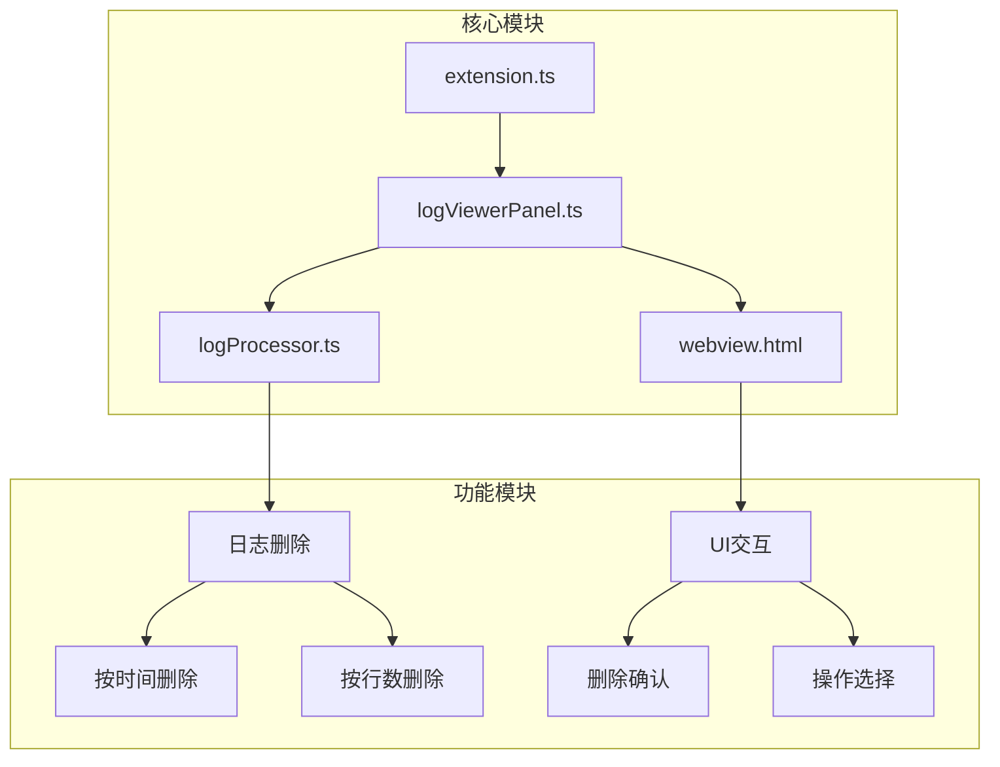
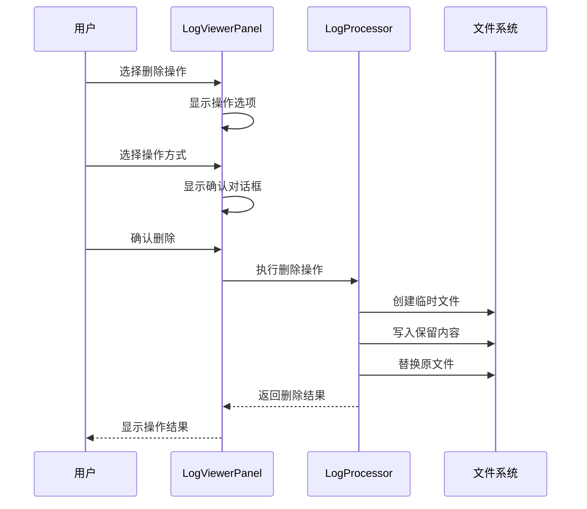
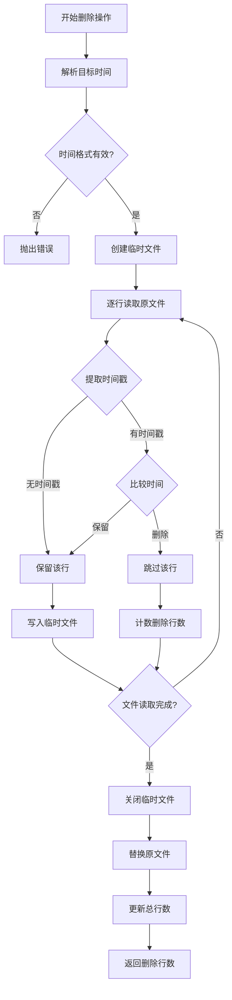
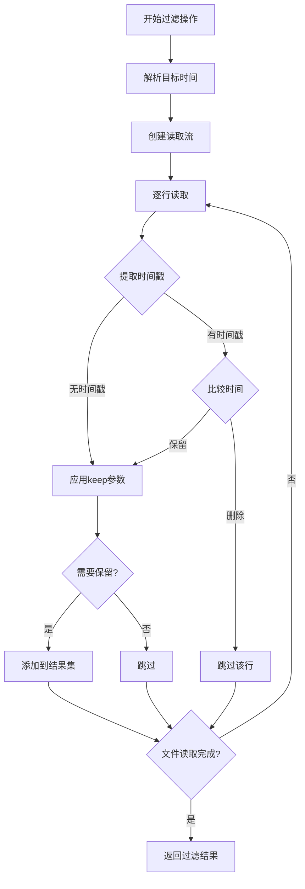
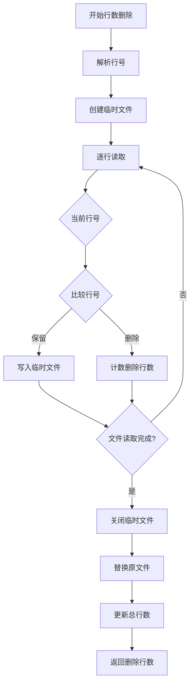
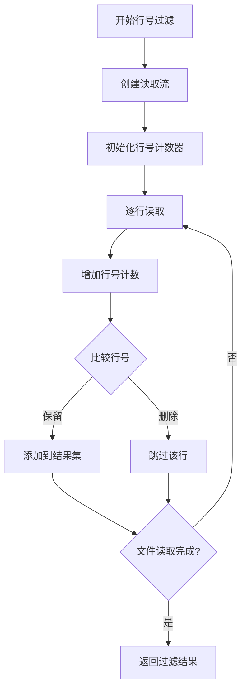
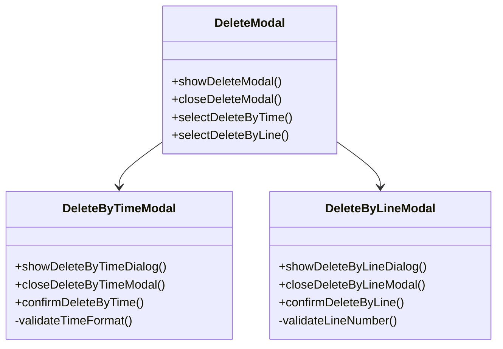
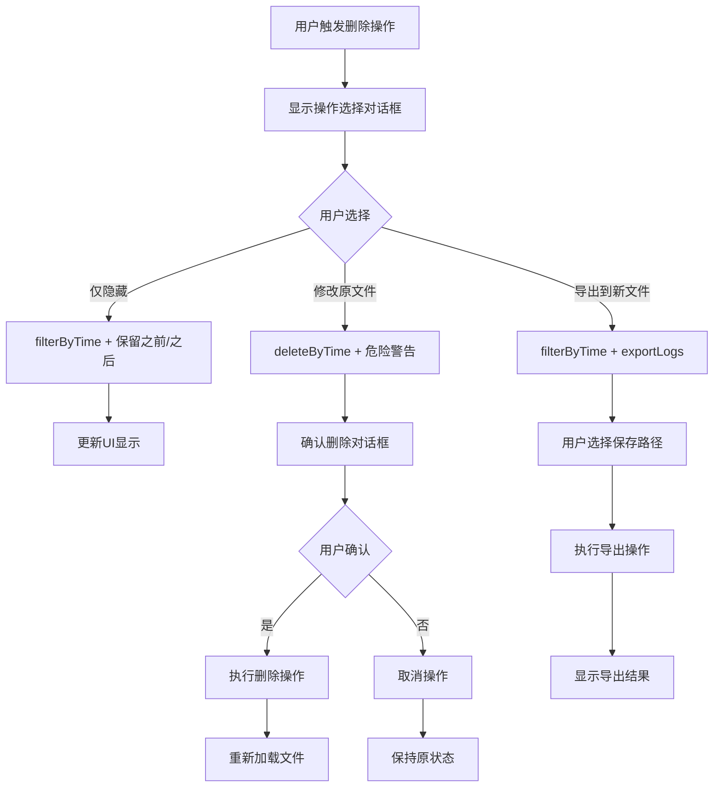
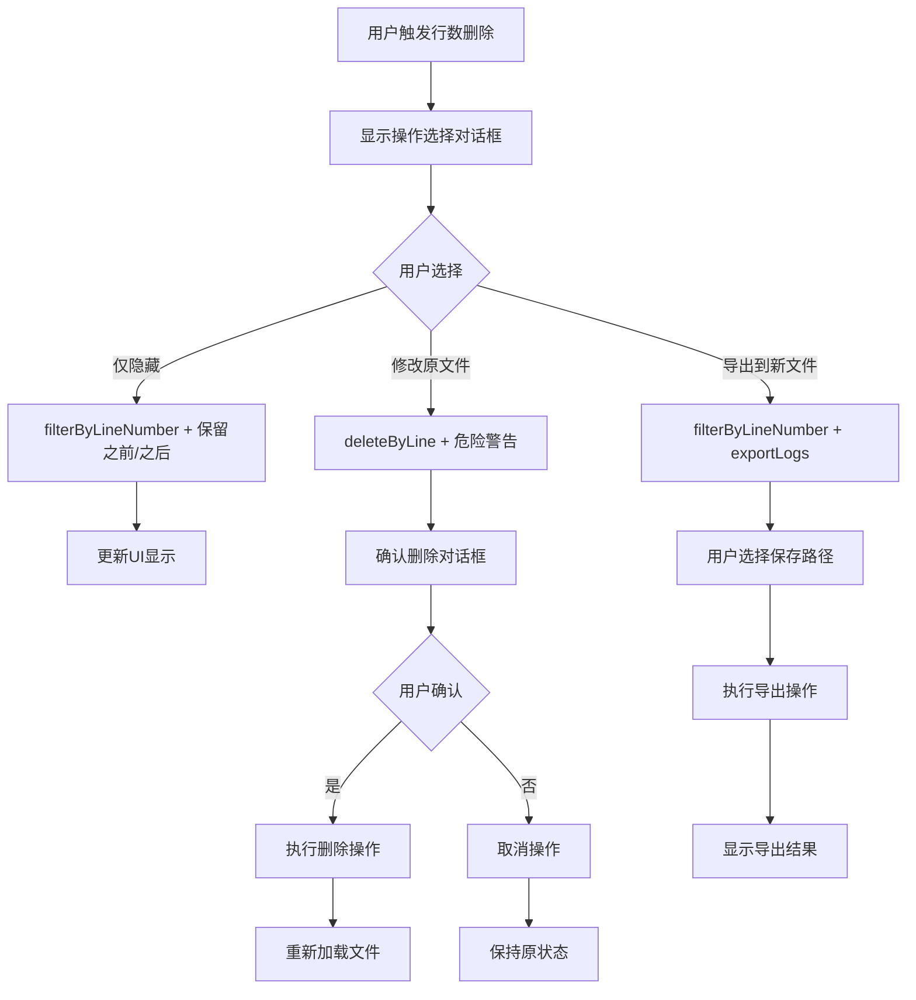
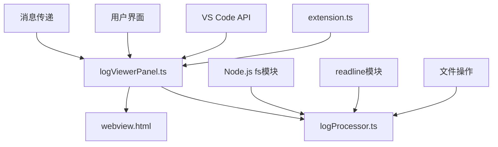

# 日志管理

<cite>
**本文档引用的文件**
- [logProcessor.ts](file://src/logProcessor.ts)
- [logViewerPanel.ts](file://src/logViewerPanel.ts)
- [webview.html](file://src/webview.html)
- [extension.ts](file://src/extension.ts)
</cite>

## 目录
1. [简介](#简介)
2. [项目结构](#项目结构)
3. [核心组件](#核心组件)
4. [架构概览](#架构概览)
5. [详细组件分析](#详细组件分析)
6. [依赖关系分析](#依赖关系分析)
7. [性能考虑](#性能考虑)
8. [故障排除指南](#故障排除指南)
9. [结论](#结论)

## 简介

large_log_check是一个Visual Studio Code扩展，专门用于高效管理和分析大型日志文件。该扩展提供了强大的日志删除功能，支持按时间和行数两种方式删除日志，同时确保数据安全性和用户体验。

## 项目结构

该项目采用模块化架构，主要包含以下核心文件：

**图表来源**
- [extension.ts](file://src/extension.ts#L1-L116)
- [logViewerPanel.ts](file://src/logViewerPanel.ts#L1-L510)
- [logProcessor.ts](file://src/logProcessor.ts#L1-L807)

**章节来源**
- [extension.ts](file://src/extension.ts#L1-L116)
- [logViewerPanel.ts](file://src/logViewerPanel.ts#L1-L510)
- [logProcessor.ts](file://src/logProcessor.ts#L1-L807)

## 核心组件

### LogProcessor类
LogProcessor是日志处理的核心类，负责：
- 文件读取和解析
- 时间戳提取和解析
- 日志级别识别
- 过滤和删除操作

### LogViewerPanel类  
LogViewerPanel管理VS Code面板的生命周期和用户交互：
- WebView内容更新
- 用户消息处理
- 删除操作协调

### Webview界面
提供直观的用户界面，包含：
- 删除操作选择模态框
- 时间和行数输入字段
- 安全警告提示

**章节来源**
- [logProcessor.ts](file://src/logProcessor.ts#L30-L807)
- [logViewerPanel.ts](file://src/logViewerPanel.ts#L6-L510)
- [webview.html](file://src/webview.html#L660-L1200)

## 架构概览

系统采用分层架构，确保职责分离和可维护性：

**图表来源**
- [logViewerPanel.ts](file://src/logViewerPanel.ts#L180-L312)
- [logProcessor.ts](file://src/logProcessor.ts#L336-L474)

## 详细组件分析

### 按时间删除功能

#### deleteByTime方法实现

deleteByTime方法实现了安全的时间删除功能：

**图表来源**
- [logProcessor.ts](file://src/logProcessor.ts#L336-L408)

#### filterByTime方法实现

filterByTime方法提供非破坏性的时间过滤功能：

**图表来源**
- [logProcessor.ts](file://src/logProcessor.ts#L175-L230)

**章节来源**
- [logProcessor.ts](file://src/logProcessor.ts#L336-L408)
- [logProcessor.ts](file://src/logProcessor.ts#L175-L230)

### 按行数删除功能

#### deleteByLine方法实现

deleteByLine方法与deleteByTime类似，但基于行号进行操作：

**图表来源**
- [logProcessor.ts](file://src/logProcessor.ts#L411-L474)

#### filterByLineNumber方法实现

filterByLineNumber提供基于行号的非破坏性过滤：

**图表来源**
- [logProcessor.ts](file://src/logProcessor.ts#L289-L333)

**章节来源**
- [logProcessor.ts](file://src/logProcessor.ts#L411-L474)
- [logProcessor.ts](file://src/logProcessor.ts#L289-L333)

### UI交互设计

#### 删除操作选择界面

webview.html提供了直观的操作选择界面：

**图表来源**
- [webview.html](file://src/webview.html#L818-L844)
- [webview.html](file://src/webview.html#L846-L872)

#### 安全警告机制

系统实现了多层次的安全警告机制：

| 警告层级 | 触发条件 | 显示内容 | 操作影响 |
|---------|---------|---------|---------|
| VS Code警告 | 用户选择删除方式 | "如何处理之前的/之后的日志？" | 用户选择操作类型 |
| 确认对话框 | 用户确认删除 | "确定要删除之前/之后的日志吗？" | 二次确认删除操作 |
| 文件警告 | 执行危险操作 | "此操作会直接修改原文件，不可恢复！" | 强调操作风险 |
| 备份提醒 | 操作前提示 | "请务必备份重要日志！" | 建议用户备份 |

**章节来源**
- [webview.html](file://src/webview.html#L818-L872)
- [logViewerPanel.ts](file://src/logViewerPanel.ts#L180-L312)

### 操作方式选择

#### deleteByTimeOptions方法

deleteByTimeOptions提供了三种操作方式的选择：

**图表来源**
- [logViewerPanel.ts](file://src/logViewerPanel.ts#L180-L228)

#### deleteByLineOptions方法

deleteByLineOptions提供类似的三重选择机制：

**图表来源**
- [logViewerPanel.ts](file://src/logViewerPanel.ts#L230-L278)

**章节来源**
- [logViewerPanel.ts](file://src/logViewerPanel.ts#L180-L228)
- [logViewerPanel.ts](file://src/logViewerPanel.ts#L230-L278)

## 依赖关系分析

系统各组件之间的依赖关系如下：

**图表来源**
- [extension.ts](file://src/extension.ts#L1-L116)
- [logViewerPanel.ts](file://src/logViewerPanel.ts#L1-L510)
- [logProcessor.ts](file://src/logProcessor.ts#L1-L807)

**章节来源**
- [extension.ts](file://src/extension.ts#L1-L116)
- [logViewerPanel.ts](file://src/logViewerPanel.ts#L1-L510)
- [logProcessor.ts](file://src/logProcessor.ts#L1-L807)

## 性能考虑

### 流式处理优化

系统采用流式处理技术来处理大型日志文件：

- **内存效率**：使用readline模块逐行读取，避免一次性加载整个文件
- **并发控制**：异步处理确保UI不阻塞
- **资源释放**：及时关闭文件流和清理临时文件

### 时间复杂度分析

| 操作 | 时间复杂度 | 空间复杂度 | 说明 |
|------|-----------|-----------|------|
| deleteByTime | O(n) | O(1) | n为文件行数，只保留符合条件的行 |
| deleteByLine | O(n) | O(1) | n为文件行数，只保留符合条件的行 |
| filterByTime | O(n) | O(m) | n为文件行数，m为保留的行数 |
| filterByLineNumber | O(n) | O(m) | n为文件行数，m为保留的行数 |

### 大文件处理策略

对于超过5万行的大文件，系统采用分页加载策略：
- 首次加载：前10,000行
- 动态加载：按需加载更多数据
- 内存管理：及时释放不需要的数据

## 故障排除指南

### 常见问题及解决方案

#### 时间格式错误
**问题**：输入的时间格式不被识别
**解决方案**：支持多种时间格式，包括ISO 8601、斜杠分隔等

#### 文件权限问题
**问题**：无法修改原文件
**解决方案**：检查文件权限，确保具有写入权限

#### 内存不足
**问题**：处理超大文件时内存溢出
**解决方案**：系统自动采用流式处理，避免一次性加载

#### 时间戳解析失败
**问题**：某些日志行无法提取时间戳
**解决方案**：系统会保留无法解析时间戳的行

**章节来源**
- [logProcessor.ts](file://src/logProcessor.ts#L336-L408)
- [logProcessor.ts](file://src/logProcessor.ts#L411-L474)

## 结论

large_log_check的日志管理功能提供了强大而安全的日志删除能力。通过采用临时文件机制和流式处理技术，系统确保了数据安全性和性能优化。多层次的安全警告机制和灵活的操作选择使得用户能够根据需求选择最适合的处理方式。

该系统的设计充分考虑了生产环境的需求，提供了可靠的文件操作保障，同时保持了良好的用户体验。无论是简单的日志清理还是复杂的批量处理，都能通过该扩展高效完成。