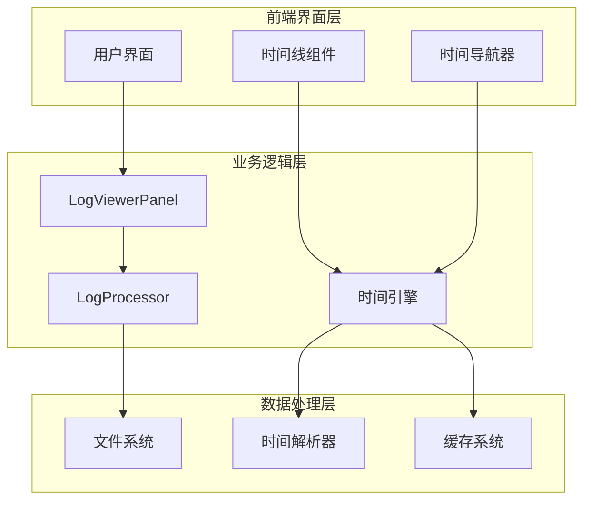
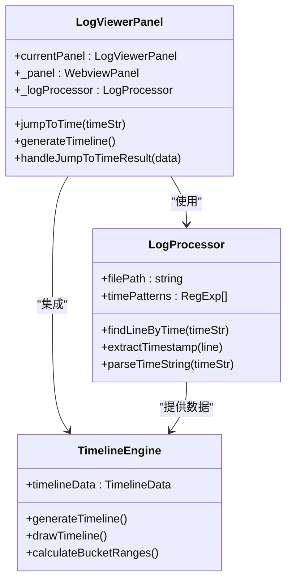
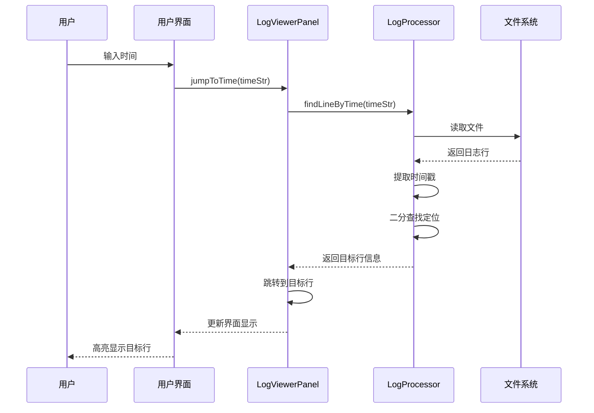
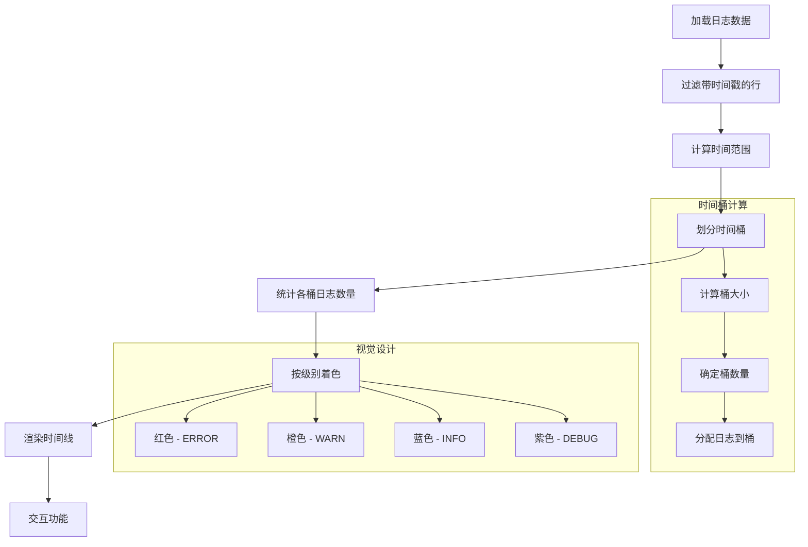
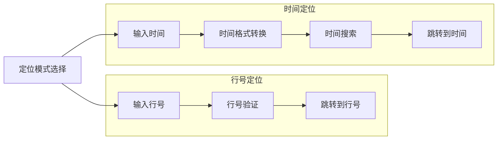
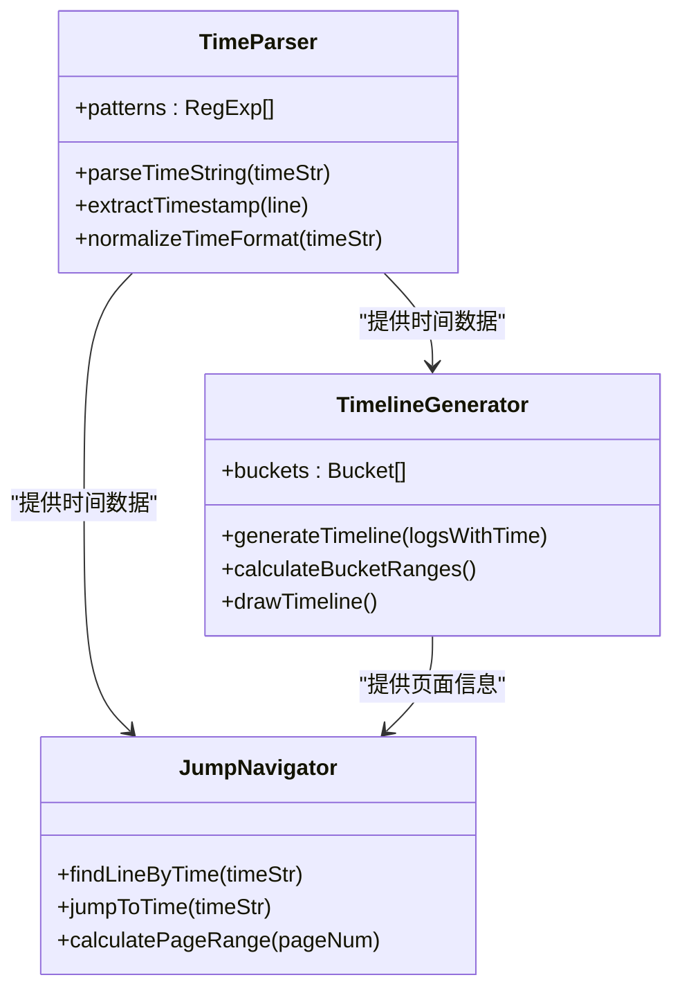
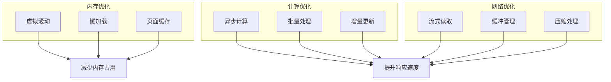
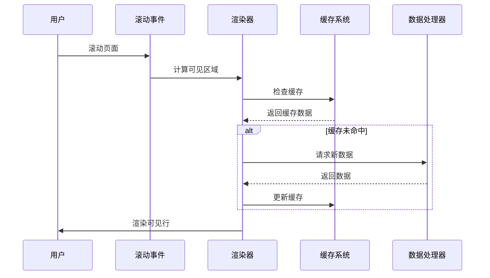

# 时间导航增强

<cite>
**本文档引用的文件**
- [package.json](file://package.json)
- [README.md](file://README.md)
- [extension.ts](file://src/extension.ts)
- [logProcessor.ts](file://src/logProcessor.ts)
- [logViewerPanel.ts](file://src/logViewerPanel.ts)
- [webview.html](file://src/webview.html)
</cite>

## 目录
1. [项目概述](#项目概述)
2. [核心功能架构](#核心功能架构)
3. [时间导航系统详解](#时间导航系统详解)
4. [时间线可视化](#时间线可视化)
5. [时间定位功能](#时间定位功能)
6. [技术实现细节](#技术实现细节)
7. [性能优化策略](#性能优化策略)
8. [使用指南](#使用指南)
9. [故障排除](#故障排除)
10. [总结](#总结)

## 项目概述

大日志文件查看器是一个专为VSCode设计的专业日志分析工具，支持处理GB级别的日志文件。该项目的核心优势在于其强大的时间导航增强功能，为用户提供了直观、高效的时间维度日志浏览体验。

### 主要特性

- **秒开大文件**：使用虚拟滚动技术，即使GB级别的日志文件也能秒开
- **智能分页**：支持自定义每页显示行数（50-1000行）
- **懒加载**：滚动时动态加载内容，内存占用低
- **时间线导航**：可视化时间分布图，快速跳转到指定时间段
- **时间定位**：支持按时间精确跳转到日志行
- **多种时间格式**：自动识别多种常见日志时间格式

**章节来源**
- [README.md](file://README.md#L1-L50)
- [package.json](file://package.json#L1-L30)

## 核心功能架构

### 系统架构概览



**图表来源**
- [logViewerPanel.ts](file://src/logViewerPanel.ts#L1-L50)
- [logProcessor.ts](file://src/logProcessor.ts#L1-L50)

### 核心组件关系



**图表来源**
- [logViewerPanel.ts](file://src/logViewerPanel.ts#L6-L50)
- [logProcessor.ts](file://src/logProcessor.ts#L30-L80)

**章节来源**
- [logViewerPanel.ts](file://src/logViewerPanel.ts#L1-L100)
- [logProcessor.ts](file://src/logProcessor.ts#L1-L100)

## 时间导航系统详解

### 时间识别与解析

系统支持多种常见日志时间格式的自动识别：

```mermaid
flowchart TD
Start([日志行输入]) --> Extract[提取时间戳]
Extract --> Pattern1{匹配格式1<br/>2024-01-01 12:00:00}
Pattern1 --> |匹配| Parse1[解析为Date对象]
Pattern1 --> |不匹配| Pattern2{匹配格式2<br/>2024/01/01 12:00:00}
Pattern2 --> |匹配| Parse1
Pattern2 --> |不匹配| Pattern3{匹配格式3<br/>[2024-01-01 12:00:00]}
Pattern3 --> |匹配| Parse1
Pattern3 --> |不匹配| Pattern4{匹配格式4<br/>01-01-2024 12:00:00}
Pattern4 --> |匹配| Parse1
Pattern4 --> |不匹配| Pattern5{匹配格式5<br/>ISO 8601}
Pattern5 --> |匹配| Parse1
Pattern5 --> |不匹配| NoTime[无时间戳]
Parse1 --> Success[时间解析成功]
NoTime --> End([结束])
Success --> End
```

**图表来源**
- [logProcessor.ts](file://src/logProcessor.ts#L35-L46)
- [logProcessor.ts](file://src/logProcessor.ts#L477-L800)

### 时间导航核心算法

时间导航功能的核心实现在于高效的查找算法：



**图表来源**
- [logViewerPanel.ts](file://src/logViewerPanel.ts#L319-L360)
- [logProcessor.ts](file://src/logProcessor.ts#L236-L286)

**章节来源**
- [logProcessor.ts](file://src/logProcessor.ts#L236-L300)
- [logViewerPanel.ts](file://src/logViewerPanel.ts#L319-L380)

## 时间线可视化

### 时间线生成流程

时间线功能通过将时间分布可视化，帮助用户快速理解日志的时间特征：



**图表来源**
- [webview.html](file://src/webview.html#L2900-L3000)
- [webview.html](file://src/webview.html#L3788-L3870)

### 时间线交互功能

时间线提供了丰富的交互功能：

| 功能 | 描述 | 实现方式 |
|------|------|----------|
| 点击跳转 | 点击时间线任意位置跳转到对应时间段 | Canvas事件监听 + 时间计算 |
| 鼠标悬停 | 显示详细的时间和日志统计信息 | Canvas mousemove事件 |
| 展开/折叠 | 控制时间线面板的显示状态 | DOM切换显示状态 |
| 滚动同步 | 滚动到时间线对应位置时自动跳转 | 滚动事件 + 时间映射 |

**章节来源**
- [webview.html](file://src/webview.html#L2900-L3100)
- [webview.html](file://src/webview.html#L3950-L4020)

## 时间定位功能

### 行号定位 vs 时间定位

系统提供两种定位方式，满足不同场景的需求：



**图表来源**
- [webview.html](file://src/webview.html#L3264-L3340)

### 时间格式支持

系统支持多种时间格式的自动识别和转换：

| 格式类型 | 示例 | 正则表达式 | 处理方式 |
|----------|------|------------|----------|
| 标准日期 | `2024-01-01 12:00:00` | `\d{4}-\d{2}-\d{2}\s+\d{2}:\d{2}:\d{2}` | 直接解析 |
| 斜杠分隔 | `2024/01/01 12:00:00` | `\d{4}\/\d{2}\/\d{2}\s+\d{2}:\d{2}:\d{2}` | 替换斜杠后解析 |
| 方括号格式 | `[2024-01-01 12:00:00]` | `\[\d{4}-\d{2}-\d{2}\s+\d{2}:\d{2}:\d{2}\]` | 去除方括号后解析 |
| 简化格式 | `2024-01-01T12:00:00` | `\d{4}-\d{2}-\d{2}T\d{2}:\d{2}:\d{2}` | 替换T为空格后解析 |

**章节来源**
- [logProcessor.ts](file://src/logProcessor.ts#L35-L46)
- [webview.html](file://src/webview.html#L3320-L3340)

## 技术实现细节

### 时间解析引擎

时间解析引擎是整个时间导航系统的核心，负责准确识别和处理各种时间格式：



**图表来源**
- [logProcessor.ts](file://src/logProcessor.ts#L477-L800)
- [logViewerPanel.ts](file://src/logViewerPanel.ts#L319-L380)

### 性能优化策略

为了处理大文件和提高响应速度，系统采用了多种性能优化策略：



**图表来源**
- [logViewerPanel.ts](file://src/logViewerPanel.ts#L150-L200)
- [logProcessor.ts](file://src/logProcessor.ts#L60-L140)

**章节来源**
- [logProcessor.ts](file://src/logProcessor.ts#L60-L200)
- [logViewerPanel.ts](file://src/logViewerPanel.ts#L150-L250)

## 性能优化策略

### 虚拟滚动技术

虚拟滚动是处理大文件的关键技术，只渲染可见区域的内容：



**图表来源**
- [logViewerPanel.ts](file://src/logViewerPanel.ts#L150-L200)

### 异步计算机制

对于大量数据的处理，系统采用异步计算避免阻塞UI：

| 优化策略 | 实现方式 | 效果 |
|----------|----------|------|
| 分批处理 | 每次处理5页数据，间隔10ms | 保持UI响应 |
| 进度反馈 | 实时更新计算进度 | 用户体验提升 |
| 中断机制 | 支持取消计算任务 | 资源利用率提高 |
| 增量更新 | 只重新计算变化的部分 | 减少计算量 |

**章节来源**
- [logViewerPanel.ts](file://src/logViewerPanel.ts#L1628-L1700)

## 使用指南

### 基本时间导航操作

1. **打开时间线面板**
   - 点击"📈 时间线导航"标题
   - 时间线面板会展开显示可视化图表

2. **通过时间线跳转**
   - 点击时间线上的任意位置
   - 系统会自动跳转到该时间段的第一条日志

3. **时间线交互功能**
   - 鼠标悬停显示详细信息
   - 点击展开/折叠按钮控制面板显示

### 高级时间定位功能

1. **按时间定位**
   - 打开"🎯 定位"对话框
   - 选择"⏰ 按时间定位"模式
   - 输入或选择目标时间
   - 系统会跳转到最接近该时间的日志行

2. **时间格式说明**
   - 支持格式：`YYYY-MM-DD HH:mm:ss` 或 `YYYY-MM-DD`
   - 自动识别多种时间格式
   - 支持ISO 8601格式

**章节来源**
- [webview.html](file://src/webview.html#L894-L907)
- [webview.html](file://src/webview.html#L3264-L3340)

## 故障排除

### 常见问题及解决方案

| 问题描述 | 可能原因 | 解决方案 |
|----------|----------|----------|
| 时间线不显示 | 日志文件无时间戳 | 检查日志格式，确保包含时间信息 |
| 定位功能失效 | 时间格式不匹配 | 使用支持的时间格式，检查时间输入 |
| 性能缓慢 | 文件过大 | 启用虚拟滚动，调整页面大小 |
| 时间线点击无响应 | Canvas尺寸异常 | 刷新页面或重启VSCode |

### 调试技巧

1. **检查时间解析**
   - 查看控制台输出的时间解析日志
   - 验证时间格式是否被正确识别

2. **监控性能指标**
   - 观察计算进度条
   - 检查内存使用情况

3. **验证数据完整性**
   - 确认时间戳提取正确
   - 检查时间线数据生成过程

**章节来源**
- [logProcessor.ts](file://src/logProcessor.ts#L477-L500)
- [logViewerPanel.ts](file://src/logViewerPanel.ts#L319-L350)

## 总结

大日志文件查看器的时间导航增强功能通过以下核心特性为用户提供了卓越的时间维度日志分析体验：

### 核心优势

1. **高性能处理**：采用虚拟滚动和异步计算，支持GB级别文件秒开
2. **直观可视化**：时间线图表清晰展示日志时间分布特征
3. **精准定位**：支持行号和时间双重定位方式
4. **智能识别**：自动识别多种时间格式，无需手动配置
5. **实时交互**：丰富的交互功能，提升用户体验

### 技术创新

- **智能时间解析**：支持多种时间格式的自动识别和转换
- **虚拟滚动优化**：内存占用低，响应速度快
- **异步计算机制**：避免阻塞UI，保持流畅体验
- **可视化增强**：时间线图表提供直观的时间分布视图

### 应用价值

该时间导航增强功能特别适用于：
- 大规模系统日志分析
- 性能瓶颈定位
- 故障排查和根因分析
- 日志趋势观察和预测

通过这些先进的技术实现和精心设计的功能，大日志文件查看器为开发者和运维人员提供了一个强大而易用的日志分析工具，显著提升了日志处理的效率和准确性。