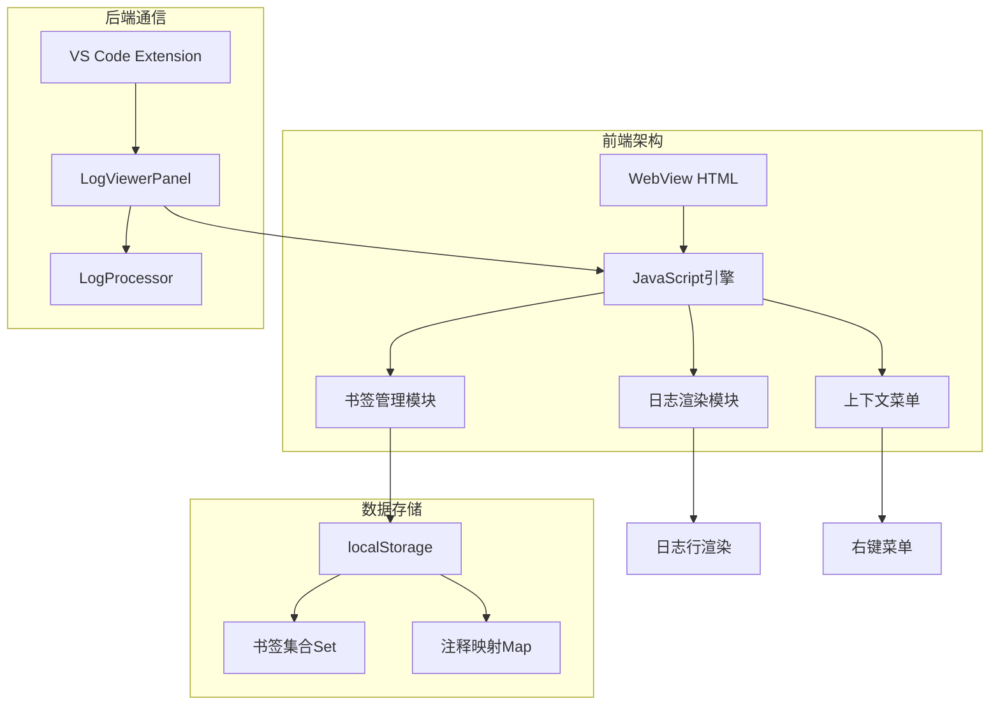
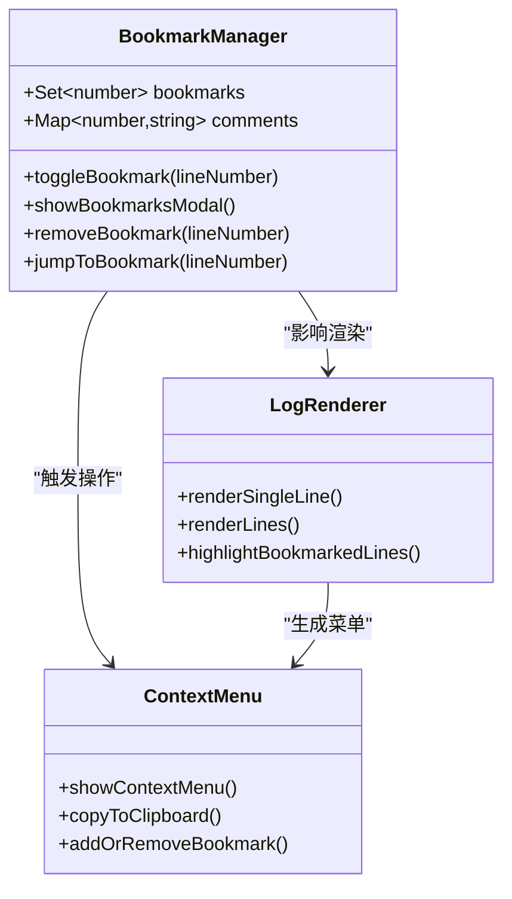
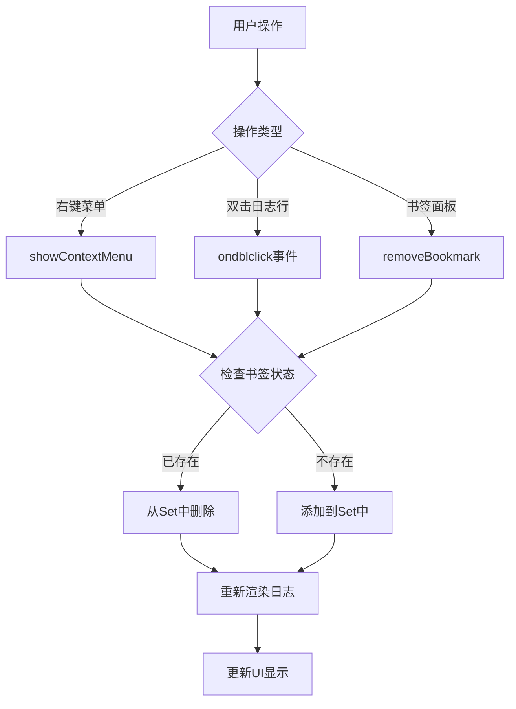
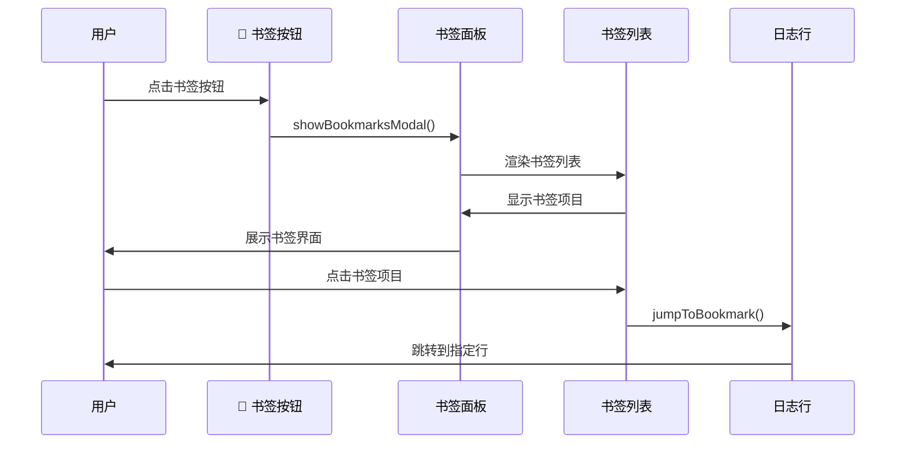
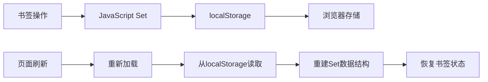
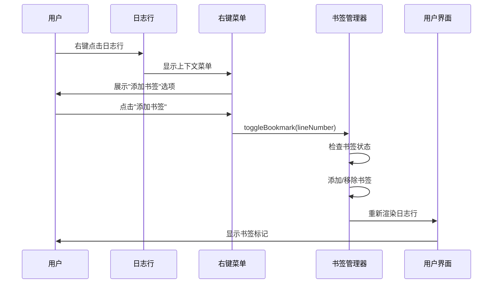
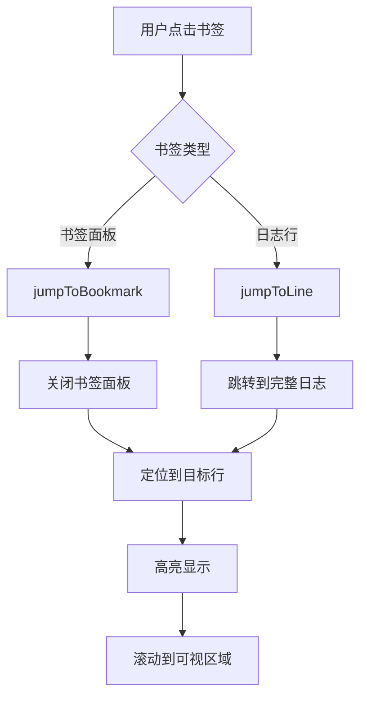
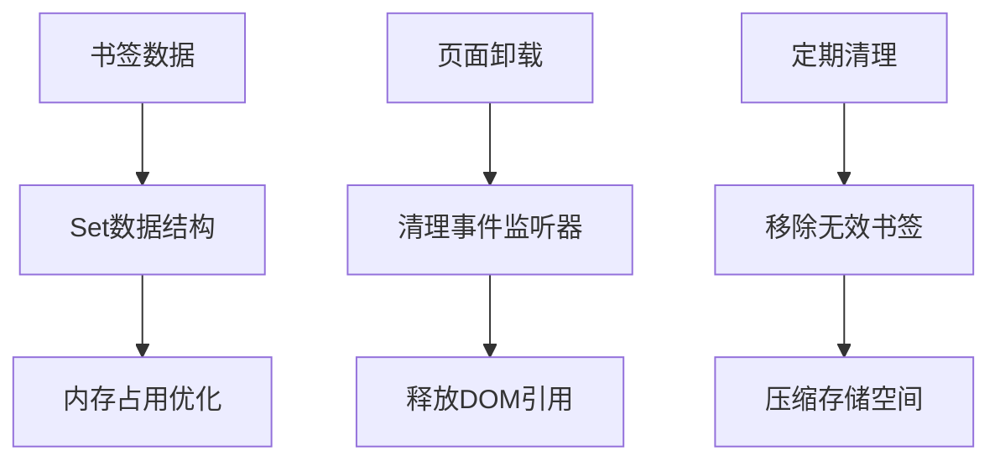

# 书签管理

<cite>
**本文档引用的文件**
- [webview.html](file://src/webview.html)
- [extension.ts](file://src/extension.ts)
- [logViewerPanel.ts](file://src/logViewerPanel.ts)
</cite>

## 目录
1. [简介](#简介)
2. [书签系统架构](#书签系统架构)
3. [核心功能实现](#核心功能实现)
4. [用户界面设计](#用户界面设计)
5. [数据存储机制](#数据存储机制)
6. [用户交互流程](#用户交互流程)
7. [实际使用场景](#实际使用场景)
8. [技术细节分析](#技术细节分析)
9. [故障排除指南](#故障排除指南)
10. [总结](#总结)

## 简介

large_log_check扩展提供了一个强大的书签管理系统，允许用户在大型日志文件中标记关键位置，便于快速定位和回溯重要信息。该系统基于浏览器的localStorage机制实现本地持久化存储，支持通过多种方式添加、管理和导航书签。

## 书签系统架构

书签管理系统采用前后端分离的架构设计，前端负责用户界面和交互逻辑，后端负责日志数据处理和通信。



**图表来源**
- [webview.html](file://src/webview.html#L1164-L1180)
- [logViewerPanel.ts](file://src/logViewerPanel.ts#L40-L100)

**章节来源**
- [webview.html](file://src/webview.html#L1164-L1180)
- [logViewerPanel.ts](file://src/logViewerPanel.ts#L40-L100)

## 核心功能实现

### 书签数据结构

书签系统使用JavaScript的Set数据结构来存储行号，确保唯一性并提供高效的查找性能：



**图表来源**
- [webview.html](file://src/webview.html#L1170-L1171)
- [webview.html](file://src/webview.html#L2146-L2204)

### 书签添加与删除

书签的添加和删除通过`toggleBookmark()`函数实现，该函数根据行号判断是否已存在书签并执行相应操作：



**图表来源**
- [webview.html](file://src/webview.html#L2147-L2156)
- [webview.html](file://src/webview.html#L1779-L1783)

**章节来源**
- [webview.html](file://src/webview.html#L2147-L2156)
- [webview.html](file://src/webview.html#L1779-L1783)

## 用户界面设计

### 书签面板

书签面板提供了直观的界面来管理和浏览所有已保存的书签：



**图表来源**
- [webview.html](file://src/webview.html#L2158-L2189)
- [webview.html](file://src/webview.html#L2195-L2198)

### 日志行视觉标识

在日志行中，书签通过以下方式可视化：

| 特征 | 描述 | 实现位置 |
|------|------|----------|
| **背景色** | 书签行显示浅黄色背景 | `lineDiv.style.backgroundColor = 'rgba(255, 193, 7, 0.1)'` |
| **边框** | 右侧显示橙色竖线 | `lineDiv.style.borderRight = '3px solid #ffc107'` |
| **图标** | 行号前显示📌图标 | `lineNumber.textContent = '📌 ' + lineNumber.textContent` |
| **交互** | 点击跳转到完整日志 | `onclick = jumpToLineInFullLog()` |

**章节来源**
- [webview.html](file://src/webview.html#L1740-L1753)
- [webview.html](file://src/webview.html#L1735-L1744)

## 数据存储机制

### localStorage持久化

书签数据通过浏览器的localStorage API实现本地持久化存储：



**图表来源**
- [webview.html](file://src/webview.html#L1170-L1171)

### 数据结构说明

| 数据类型 | 存储内容 | 实现方式 |
|----------|----------|----------|
| **书签集合** | 行号集合 | `Set<number>` |
| **注释映射** | 行号→注释内容 | `Map<number, string>` |
| **持久化** | 序列化存储 | `localStorage.setItem()` |

**章节来源**
- [webview.html](file://src/webview.html#L1170-L1171)

## 用户交互流程

### 添加书签的完整流程



**图表来源**
- [webview.html](file://src/webview.html#L2461-L2472)
- [webview.html](file://src/webview.html#L2147-L2156)

### 快速定位流程



**图表来源**
- [webview.html](file://src/webview.html#L2195-L2198)
- [webview.html](file://src/webview.html#L2994-L3007)

**章节来源**
- [webview.html](file://src/webview.html#L2461-L2472)
- [webview.html](file://src/webview.html#L2195-L2198)

## 实际使用场景

### 场景一：排查复杂问题

在排查复杂的系统问题时，用户可以通过书签标记关键日志位置：

**使用步骤：**
1. 在问题发生的关键时刻双击日志行添加书签
2. 继续浏览日志，标记后续的重要事件
3. 使用书签面板快速跳转到各个关键位置
4. 结合注释功能添加问题分析说明

**优势：**
- 避免手动记录行号
- 支持跨页面快速导航
- 可添加详细的问题说明

### 场景二：性能分析

在进行性能分析时，书签系统可以帮助追踪特定操作的完整生命周期：

**使用步骤：**
1. 标记请求开始的起始日志
2. 标记中间处理过程的关键节点
3. 标记响应结束的结束日志
4. 通过书签面板分析整个流程

**优势：**
- 支持长流程的完整性追踪
- 可结合时间线功能分析性能瓶颈
- 支持导出分析结果

### 场景三：版本对比

在对比不同版本的日志时，书签系统提供了一致的参考点：

**使用步骤：**
1. 在基准版本中标记关键位置
2. 在对比版本中跳转到相同位置
3. 对比两个版本的行为差异

**优势：**
- 提供一致的比较基准
- 支持跨版本的问题定位
- 可记录版本间的差异说明

## 技术细节分析

### 性能优化策略

书签系统采用了多种性能优化策略：

| 优化策略 | 实现方式 | 效果 |
|----------|----------|------|
| **懒加载** | 仅在需要时加载书签数据 | 减少初始化时间 |
| **虚拟滚动** | 大文件时只渲染可见行 | 提升大数据集性能 |
| **缓存机制** | 缓存书签状态到localStorage | 避免重复计算 |
| **批量操作** | 批量更新UI而非逐行更新 | 提升渲染效率 |

### 内存管理



**图表来源**
- [webview.html](file://src/webview.html#L1170-L1171)

**章节来源**
- [webview.html](file://src/webview.html#L1170-L1171)

## 故障排除指南

### 常见问题及解决方案

| 问题类型 | 症状 | 解决方案 |
|----------|------|----------|
| **书签丢失** | 页面刷新后书签消失 | 检查浏览器localStorage设置 |
| **无法添加书签** | 右键菜单无反应 | 检查浏览器JavaScript执行权限 |
| **书签跳转失败** | 点击书签无响应 | 确认日志文件未被修改或删除 |
| **性能问题** | 大文件书签显示缓慢 | 启用折叠模式减少渲染行数 |

### 调试技巧

1. **开发者工具检查**：
   - 打开浏览器开发者工具
   - 检查Console标签页查看JavaScript错误
   - 检查Application标签页查看localStorage内容

2. **书签状态验证**：
   ```javascript
   // 在浏览器控制台运行
   console.log('书签数量:', bookmarks.size);
   console.log('书签列表:', Array.from(bookmarks));
   ```

3. **性能监控**：
   - 使用Performance标签页监控渲染性能
   - 检查是否有内存泄漏

**章节来源**
- [webview.html](file://src/webview.html#L2410-L2543)

## 总结

large_log_check扩展的书签管理系统提供了一个功能完善、性能优异的书签解决方案。通过浏览器localStorage的持久化存储、直观的用户界面设计和高效的算法实现，该系统能够满足各种复杂的日志分析需求。

**主要特性总结：**
- **持久化存储**：基于localStorage的可靠数据存储
- **直观界面**：清晰的视觉标识和友好的用户交互
- **高效性能**：优化的渲染算法和内存管理
- **灵活功能**：支持多种添加方式和管理操作
- **扩展性强**：可与其他功能（如注释、搜索）无缝集成

该书签系统不仅提升了日志分析的效率，还为复杂的系统问题排查提供了强有力的支持，是large_log_check扩展中不可或缺的核心功能之一。