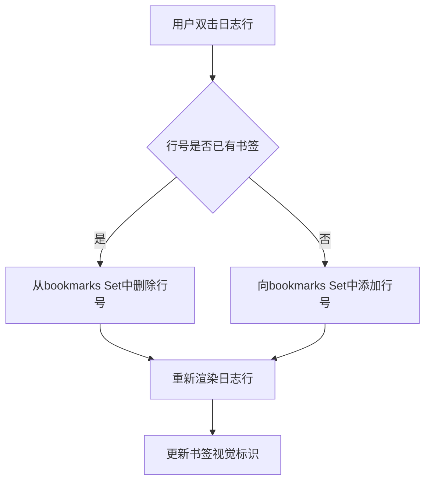
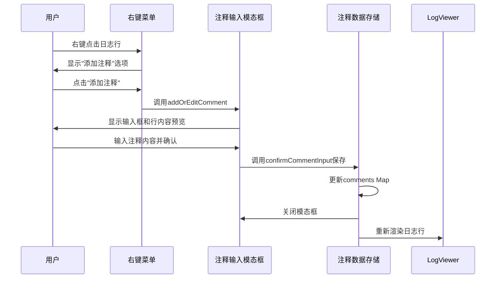
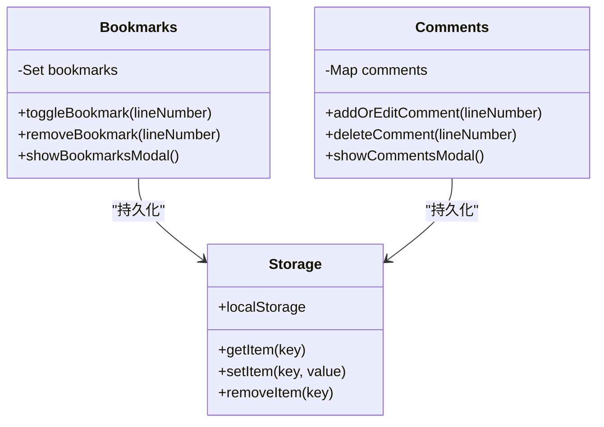
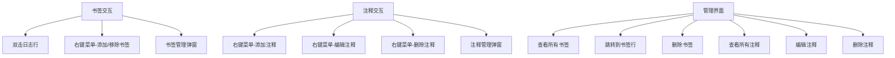
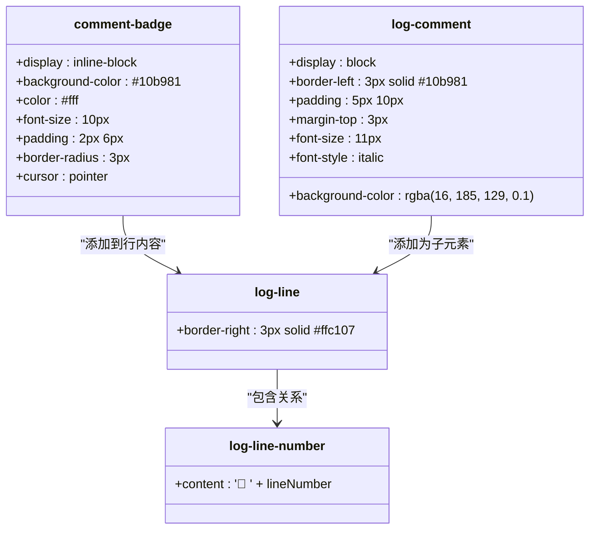

# 标注功能

<cite>
**本文档引用文件**   
- [webview.html](file://src/webview.html)
- [extension.ts](file://src/extension.ts)
- [logViewerPanel.ts](file://src/logViewerPanel.ts)
- [README.md](file://README.md)
</cite>

## 目录
1. [简介](#简介)
2. [书签功能实现](#书签功能实现)
3. [注释功能实现](#注释功能实现)
4. [数据存储与持久化](#数据存储与持久化)
5. [用户交互设计](#用户交互设计)
6. [视觉样式与UI展示](#视觉样式与ui展示)
7. [使用场景分析](#使用场景分析)

## 简介

large_log_check扩展提供了强大的日志文件标注功能，包括书签和注释两大核心特性。这些功能帮助开发者在处理大型日志文件时，能够高效地标记重要信息、添加说明性内容，并在团队协作中共享分析结果。通过双击日志行添加书签、右键菜单操作以及专门的管理弹窗，用户可以轻松管理标注内容。

**Section sources**
- [README.md](file://README.md#L35-L39)

## 书签功能实现

书签功能通过JavaScript在webview.html中实现，使用Set数据结构存储书签行号。用户可以通过双击日志行或右键菜单来添加/移除书签。书签数据与日志行号关联，当渲染日志行时，会检查该行是否被标记为书签，并相应地添加视觉标识。

书签的添加和管理通过toggleBookmark函数实现，该函数会检查当前行号是否已存在书签，如果存在则删除，否则添加。书签列表通过showBookmarksModal函数显示，用户可以在弹窗中查看所有书签并点击跳转到相应行。

**Diagram sources **
- [webview.html](file://src/webview.html#L2146-L2156)
- [webview.html](file://src/webview.html#L1780-L1783)

**Section sources**
- [webview.html](file://src/webview.html#L1169)
- [webview.html](file://src/webview.html#L2146-L2156)

## 注释功能实现

注释功能使用Map数据结构存储，键为行号，值为注释内容。用户可以通过右键菜单添加或编辑注释。当渲染日志行时，如果该行有注释，会在行内容后添加comment-badge元素显示"有注释"标识。

注释的添加和编辑通过addOrEditComment函数实现，该函数会显示一个包含行号预览和文本输入框的模态对话框。用户输入注释内容后，通过confirmCommentInput函数保存，注释内容会被存储在comments Map中。删除注释则通过deleteComment函数实现，需要用户确认操作。

**Diagram sources **
- [webview.html](file://src/webview.html#L2257-L2315)
- [webview.html](file://src/webview.html#L1766-L1768)

**Section sources**
- [webview.html](file://src/webview.html#L1170)
- [webview.html](file://src/webview.html#L2257-L2315)

## 数据存储与持久化

书签和注释数据通过浏览器的localStorage机制进行持久化存储。虽然当前代码中主要使用内存中的Set和Map存储书签和注释，但系统设计了localStorage的接口用于数据持久化。customHighlightRules（自定义高亮规则）已经实现了完整的localStorage持久化机制，为书签和注释的持久化提供了参考实现。

数据存储机制确保了用户在关闭和重新打开日志文件后，仍然能够保留之前的标注信息。书签和注释与具体的日志文件关联，当切换文件时，相关标注数据会相应更新。

**Diagram sources **
- [webview.html](file://src/webview.html#L2228-L2252)
- [webview.html](file://src/webview.html#L1169-L1170)

**Section sources**
- [webview.html](file://src/webview.html#L2228-L2252)

## 用户交互设计

标注功能提供了多种用户交互方式，确保操作便捷高效。书签功能支持双击日志行快速添加/移除，同时也提供右键菜单选项和专门的书签管理弹窗。注释功能主要通过右键菜单访问，提供"添加注释"、"编辑注释"和"删除注释"选项。

用户流程设计考虑了各种操作场景：添加书签只需双击目标行；添加注释需要右键选择并输入内容；管理所有标注可通过顶部工具栏的"书签"和"注释"按钮打开相应管理界面。删除操作均需要二次确认，防止误操作。

**Diagram sources **
- [webview.html](file://src/webview.html#L2461-L2473)
- [webview.html](file://src/webview.html#L2476-L2506)

**Section sources**
- [webview.html](file://src/webview.html#L683-L684)
- [webview.html](file://src/webview.html#L2461-L2506)

## 视觉样式与UI展示

书签和注释的视觉样式设计清晰醒目，便于用户识别。书签行在右侧显示黄色边框，并在行号前添加书签图标📌。注释通过comment-badge元素展示，显示为绿色背景的"📝 有注释"标签，悬停时颜色变深。

在书签和注释管理弹窗中，相关条目使用对应的边框颜色（书签为黄色，注释为绿色）进行区分。操作按钮如"删除"、"编辑"等采用标准样式，确保界面一致性。所有UI元素都适配VSCode的暗色主题，保证视觉协调性。

**Diagram sources **
- [webview.html](file://src/webview.html#L502-L517)
- [webview.html](file://src/webview.html#L519-L528)
- [webview.html](file://src/webview.html#L1740-L1753)

**Section sources**
- [webview.html](file://src/webview.html#L502-L528)
- [webview.html](file://src/webview.html#L1740-L1753)

## 使用场景分析

标注功能在多种实际场景中发挥重要作用。在问题排查场景中，开发者可以为关键错误日志添加书签，快速定位问题发生的位置。通过添加注释，可以记录对错误原因的分析、可能的解决方案或需要进一步调查的事项。

在团队协作分析场景中，多个开发者可以共同查看同一日志文件，各自添加书签和注释。这些标注成为沟通的桥梁，帮助团队成员理解彼此的分析思路和发现。新加入的成员可以通过查看现有标注快速了解问题背景和分析进展。

性能分析场景中，书签可用于标记性能瓶颈出现的时间点，而注释可以记录当时的系统状态、资源使用情况等信息，为后续优化提供参考。

**Section sources**
- [README.md](file://README.md#L35-L39)
- [webview.html](file://src/webview.html#L1000-L1010)
- [webview.html](file://src/webview.html#L1011-L1022)