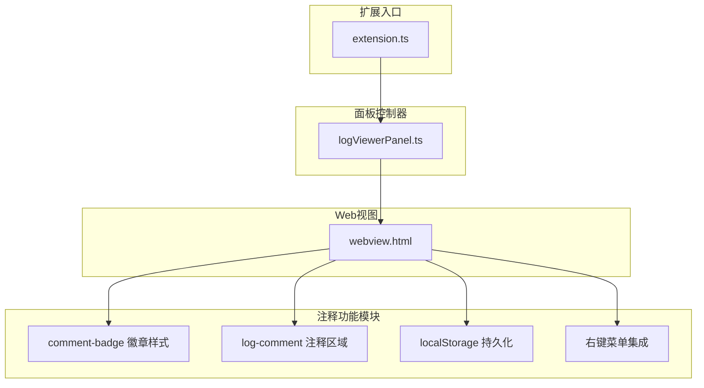
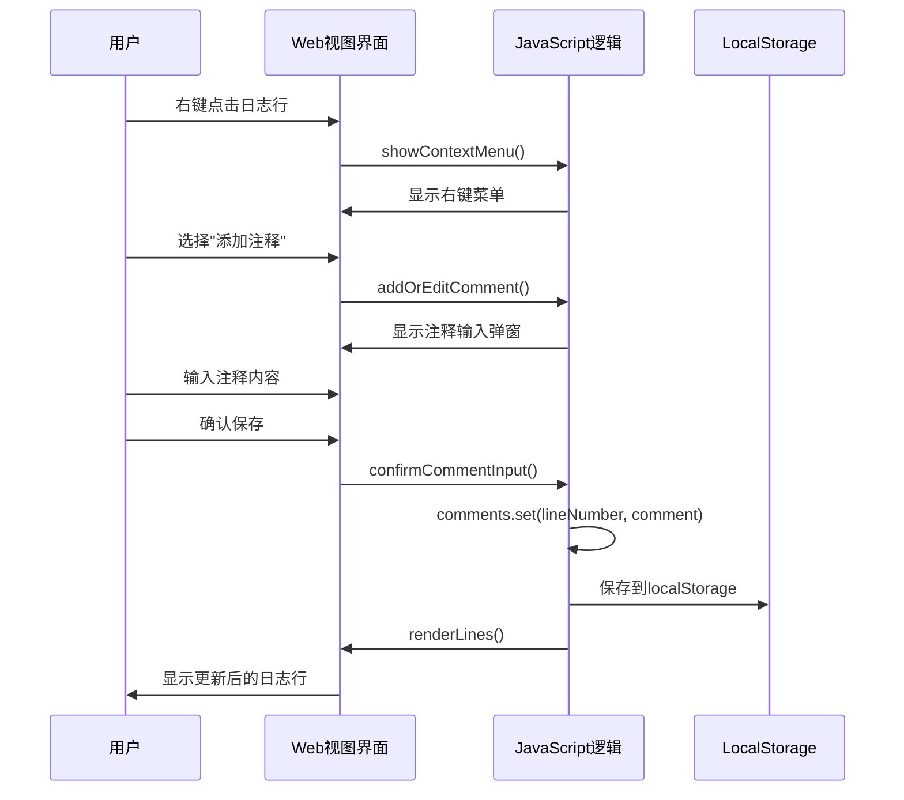
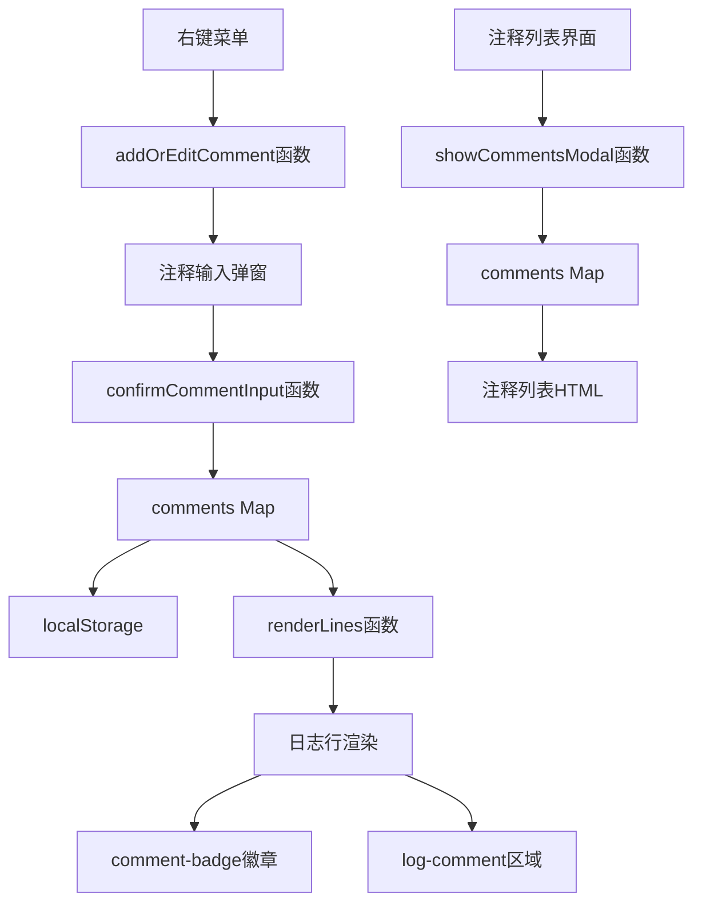

# 注释功能

<cite>
**本文档引用的文件**
- [src/webview.html](file://src/webview.html)
- [src/extension.ts](file://src/extension.ts)
- [src/logViewerPanel.ts](file://src/logViewerPanel.ts)
- [package.json](file://package.json)
</cite>

## 目录
1. [简介](#简介)
2. [项目结构概览](#项目结构概览)
3. [核心组件分析](#核心组件分析)
4. [架构概览](#架构概览)
5. [详细功能分析](#详细功能分析)
6. [依赖关系分析](#依赖关系分析)
7. [性能考虑](#性能考虑)
8. [故障排除指南](#故障排除指南)
9. [结论](#结论)

## 简介

large_log_check是一个专业的大型日志文件查看器扩展，提供了强大的注释功能，允许用户为特定日志行添加、编辑和删除注释。该功能通过webview.html中的UI组件和JavaScript逻辑实现，支持本地持久化存储，并提供了丰富的交互体验。

注释功能的核心特性包括：
- **可视化徽章**：在日志行右侧显示"📝 有注释"徽章
- **弹窗编辑**：通过模态对话框进行注释的添加和编辑
- **本地存储**：使用localStorage实现注释的持久化
- **右键菜单集成**：通过右键菜单快速添加或编辑注释
- **列表管理**：提供专门的注释列表界面进行批量管理

## 项目结构概览

该项目采用典型的VS Code扩展架构，主要包含以下核心文件：



**图表来源**
- [src/extension.ts](file://src/extension.ts#L1-L116)
- [src/logViewerPanel.ts](file://src/logViewerPanel.ts#L1-L510)
- [src/webview.html](file://src/webview.html#L1-L4153)

**章节来源**
- [src/extension.ts](file://src/extension.ts#L1-L116)
- [src/logViewerPanel.ts](file://src/logViewerPanel.ts#L1-L510)
- [src/webview.html](file://src/webview.html#L1-L4153)

## 核心组件分析

### 注释数据结构

注释功能使用JavaScript Map数据结构来管理注释数据：

```javascript
// 注释集合，key为行号，value为注释内容
let comments = new Map();
```

这种数据结构提供了高效的查找、插入和删除操作，特别适合按行号快速访问注释。

### 视觉样式设计

注释功能采用了两种主要的视觉元素：

#### comment-badge 小徽章样式
```css
.comment-badge {
    display: inline-block;
    background-color: #10b981;
    color: #fff;
    font-size: 10px;
    padding: 2px 6px;
    border-radius: 3px;
    margin-left: 5px;
    cursor: pointer;
    user-select: none;
}

.comment-badge:hover {
    background-color: #059669;
}
```

#### log-comment 块级注释区域
```css
.log-comment {
    display: block;
    background-color: rgba(16, 185, 129, 0.1);
    border-left: 3px solid #10b981;
    padding: 5px 10px;
    margin-top: 3px;
    font-size: 11px;
    font-style: italic;
    color: var(--vscode-descriptionForeground);
}
```

**章节来源**
- [src/webview.html](file://src/webview.html#L502-L530)

## 架构概览

注释功能的整体架构遵循MVVM模式，通过事件驱动的方式实现用户交互：



**图表来源**
- [src/webview.html](file://src/webview.html#L2256-L2315)
- [src/webview.html](file://src/webview.html#L2475-L2506)

## 详细功能分析

### 注释添加与编辑流程

#### 1. 右键菜单触发
用户可以通过右键点击日志行来触发注释添加流程：

```javascript
// 右键菜单中的注释选项
const commentItem = document.createElement('div');
commentItem.className = 'context-menu-item';
const hasComment = comments.has(lineNumber);
commentItem.innerHTML = hasComment
    ? '<span>✏️</span><span>编辑注释</span>'
    : '<span>📝</span><span>添加注释</span>';
commentItem.onclick = (e) => {
    e.stopPropagation();
    e.preventDefault();
    closeContextMenu();
    setTimeout(() => {
        addOrEditComment(lineNumber);
    }, 100);
};
```

#### 2. 注释输入弹窗
当用户选择添加或编辑注释时，系统会显示一个模态对话框：

```javascript
function addOrEditComment(lineNumber) {
    currentCommentLineNumber = lineNumber;
    const existingComment = comments.get(lineNumber) || '';
    const line = allLines.find(l => l.lineNumber === lineNumber);
    const content = line ? (line.content || line) : '';
    const preview = content.substring(0, 100) + (content.length > 100 ? '...' : '');
    
    // 设置弹窗内容
    document.getElementById('commentInputTitle').textContent = existingComment ? '✏️ 编辑注释' : '📝 添加注释';
    document.getElementById('commentInputLineNumber').textContent = lineNumber;
    document.getElementById('commentInputPreview').textContent = content;
    document.getElementById('commentInputText').value = existingComment;
    
    // 显示弹窗
    document.getElementById('commentInputModal').style.display = 'block';
}
```

#### 3. 注释确认与保存
用户输入注释内容后，系统会进行验证并保存：

```javascript
function confirmCommentInput() {
    if (currentCommentLineNumber === null) {
        return;
    }
    
    const lineNumber = currentCommentLineNumber;
    const commentText = document.getElementById('commentInputText').value;
    const existingComment = comments.get(lineNumber) || '';
    
    if (commentText.trim()) {
        comments.set(lineNumber, commentText.trim());
        showToast(`✅ 注释已${existingComment ? '更新' : '添加'}`);
    } else if (existingComment) {
        comments.delete(lineNumber);
        showToast('❌ 注释已删除');
    }
    
    renderLines();
    closeCommentInputModal();
}
```

### 注释显示策略

#### 1. 日志行内显示
在日志行右侧显示注释徽章，当鼠标悬停时提供编辑功能：

```javascript
// 如果有注释，添加注释徽章
if (comments.has(actualLineNumber)) {
    highlightedContent += `<span class="comment-badge" onclick="event.stopPropagation(); editComment(${actualLineNumber})" title="点击编辑注释">📝 有注释</span>`;
}
```

#### 2. 日志行下方显示
在日志行下方显示完整的注释内容：

```javascript
// 如果有注释，在下方显示注释内容
if (comments.has(actualLineNumber)) {
    const commentDiv = document.createElement('div');
    commentDiv.className = 'log-comment';
    commentDiv.textContent = '📝 ' + comments.get(actualLineNumber);
    lineDiv.appendChild(commentDiv);
}
```

### 注释列表管理

#### 注释列表界面
系统提供了专门的注释列表界面，允许用户查看和管理所有注释：

```javascript
function showCommentsModal() {
    const modal = document.getElementById('commentsModal');
    const list = document.getElementById('commentsList');
    
    if (comments.size === 0) {
        list.innerHTML = '<div style="text-align: center; padding: 40px; color: var(--vscode-descriptionForeground);">暂无注释<br>右键点击日志行可添加注释</div>';
    } else {
        // 将Map转为数组并按行号排序
        const commentArray = Array.from(comments.entries()).sort((a, b) => a[0] - b[0]);
        list.innerHTML = commentArray.map(([lineNum, comment]) => {
            const line = allLines.find(l => l.lineNumber === lineNum);
            const content = line ? (line.content || line) : '（已不存在）';
            const preview = content.substring(0, 80) + (content.length > 80 ? '...' : '');
            
            return `
                <div style="padding: 12px; margin-bottom: 10px; background-color: var(--vscode-editorWidget-background); border-radius: 5px; border-left: 3px solid #10b981;">
                    <div style="display: flex; justify-content: space-between; align-items: center; margin-bottom: 8px;">
                        <span style="font-weight: bold; color: var(--vscode-textLink-foreground); cursor: pointer;" onclick="jumpToComment(${lineNum})">📝 行 ${lineNum}</span>
                        <div style="display: flex; gap: 5px;">
                            <button onclick="editComment(${lineNum})" style="padding: 2px 8px; font-size: 11px; background-color: #0e7490;">编辑</button>
                            <button onclick="deleteCommentFromList(${lineNum})" style="padding: 2px 8px; font-size: 11px; background-color: #dc2626;">删除</button>
                        </div>
                    </div>
                    <div style="font-size: 11px; color: var(--vscode-descriptionForeground); font-family: 'Consolas', monospace; margin-bottom: 5px; white-space: nowrap; overflow: hidden; text-overflow: ellipsis;">
                        ${escapeHtml(preview)}
                    </div>
                    <div style="background-color: rgba(16, 185, 129, 0.1); padding: 8px; border-radius: 3px; font-size: 12px; font-style: italic; color: var(--vscode-editor-foreground);">
                        ${escapeHtml(comment)}
                    </div>
                </div>
            `;
        }).join('');
    }
    
    modal.style.display = 'block';
}
```

### 本地持久化机制

#### 存储策略
注释数据使用JavaScript Map结构在内存中管理，同时通过localStorage实现持久化：

```javascript
// 注释集合，key为行号，value为注释内容
let comments = new Map();

// 保存注释到localStorage
function saveCommentsToStorage() {
    try {
        localStorage.setItem('comments', JSON.stringify(Array.from(comments.entries())));
    } catch (e) {
        console.error('保存注释失败:', e);
    }
}

// 从localStorage加载注释
function loadCommentsFromStorage() {
    try {
        const saved = localStorage.getItem('comments');
        if (saved) {
            comments = new Map(JSON.parse(saved));
        }
    } catch (e) {
        console.error('加载注释失败:', e);
    }
}
```

#### 数据格式
注释数据以JSON格式存储，结构如下：
```json
[
    [123, "这是一个重要的错误日志"],
    [456, "需要进一步分析的异常情况"],
    [789, "配置相关的重要信息"]
]
```

**章节来源**
- [src/webview.html](file://src/webview.html#L2256-L2365)
- [src/webview.html](file://src/webview.html#L1767-L1814)

## 依赖关系分析

### 组件间依赖关系



**图表来源**
- [src/webview.html](file://src/webview.html#L2475-L2506)
- [src/webview.html](file://src/webview.html#L2256-L2315)
- [src/webview.html](file://src/webview.html#L1767-L1814)

### 外部依赖

注释功能依赖以下外部资源：
- **VS Code API**：通过`acquireVsCodeApi()`获取VS Code通信接口
- **localStorage**：浏览器提供的本地存储机制
- **DOM API**：用于动态创建和操作HTML元素

**章节来源**
- [src/webview.html](file://src/webview.html#L1164-L1166)
- [src/webview.html](file://src/webview.html#L1171)

## 性能考虑

### 内存管理
- **Map数据结构**：使用Map而非Object来存储注释，提高查找效率
- **延迟渲染**：注释只在需要时才渲染到DOM中
- **垃圾回收**：及时清理不再使用的注释数据

### 渲染优化
- **条件渲染**：只有存在注释的日志行才会显示注释区域
- **事件委托**：使用事件冒泡减少事件监听器数量
- **防抖处理**：对频繁的DOM操作进行节流处理

### 存储优化
- **增量保存**：只保存变更的注释数据
- **数据压缩**：使用JSON序列化减少存储空间
- **错误处理**：完善的异常捕获机制防止存储失败影响应用

## 故障排除指南

### 常见问题及解决方案

#### 1. 注释无法保存
**症状**：添加注释后刷新页面丢失
**原因**：localStorage存储失败或权限问题
**解决方法**：
- 检查浏览器隐私设置
- 确保网站有写入localStorage的权限
- 清理浏览器缓存

#### 2. 注释徽章不显示
**症状**：日志行右侧没有"📝 有注释"徽章
**原因**：
- 注释数据未正确加载
- CSS样式被覆盖
- JavaScript执行错误

**解决方法**：
- 检查浏览器控制台错误信息
- 验证comments Map中是否有对应行号的注释
- 确认CSS样式是否正确加载

#### 3. 注释列表为空
**症状**：点击"📝 注释"按钮显示"暂无注释"
**原因**：
- 注释数据丢失
- 数据格式错误
- 页面未正确加载

**解决方法**：
- 检查localStorage中的comments数据
- 验证数据格式是否正确
- 重新加载页面

**章节来源**
- [src/webview.html](file://src/webview.html#L2290-L2315)

## 结论

large_log_check的注释功能是一个设计精良、功能完备的日志分析辅助工具。它通过以下特点实现了优秀的用户体验：

### 主要优势
1. **直观的视觉反馈**：通过comment-badge徽章和log-comment区域提供清晰的注释标识
2. **便捷的操作流程**：右键菜单集成使得添加和编辑注释变得简单快捷
3. **可靠的持久化**：基于localStorage的本地存储确保注释数据的安全性
4. **灵活的管理界面**：注释列表提供了批量管理和快速跳转功能
5. **良好的性能表现**：优化的数据结构和渲染策略保证了流畅的用户体验

### 应用场景
- **团队协作分析**：多个开发者可以在同一份日志文件上添加各自的分析注释
- **问题排查**：为关键日志行添加上下文说明，便于后续跟进
- **知识积累**：长期维护的项目中，注释可以作为经验总结的载体
- **文档补充**：为复杂的日志模式添加解释性说明

该注释功能不仅提升了日志分析的效率，还为团队协作和知识管理提供了有力支持，是large_log_check扩展的重要特色功能之一。