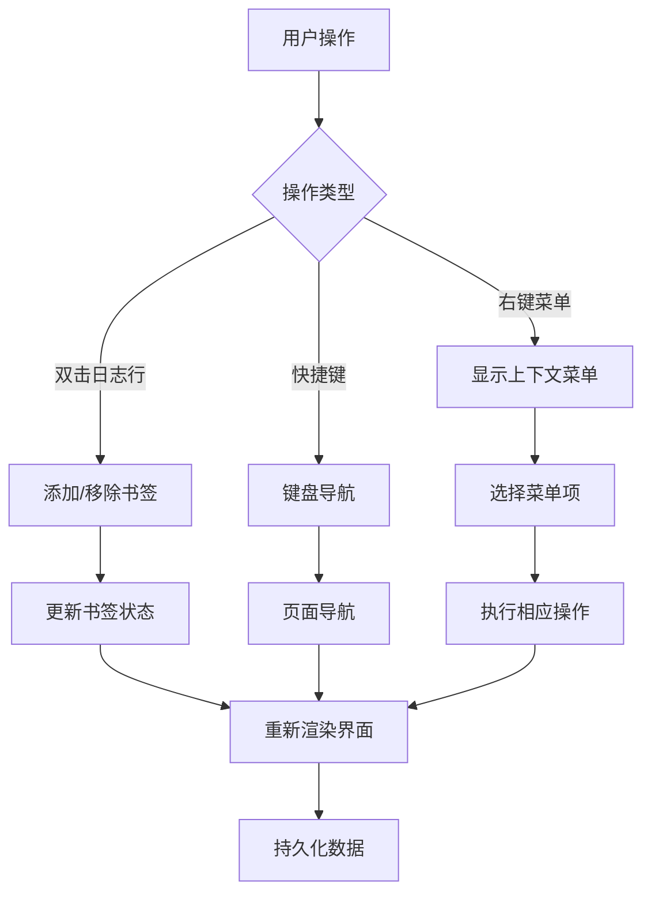

# large_log_check核心功能详解

<cite>
**本文档引用的文件**
- [README.md](file://README.md)
- [src/extension.ts](file://src/extension.ts)
- [src/logProcessor.ts](file://src/logProcessor.ts)
- [src/logViewerPanel.ts](file://src/logViewerPanel.ts)
- [src/webview.html](file://src/webview.html)
- [package.json](file://package.json)
</cite>

## 目录
1. [项目概述](#项目概述)
2. [高性能加载系统](#高性能加载系统)
3. [搜索功能详解](#搜索功能详解)
4. [过滤功能架构](#过滤功能架构)
5. [数据分析与可视化](#数据分析与可视化)
6. [日志管理功能](#日志管理功能)
7. [标注与交互功能](#标注与交互功能)
8. [技术架构总结](#技术架构总结)

## 项目概述

large_log_check是一个专为VSCode设计的专业日志文件查看器扩展，能够高效处理GB级别的日志文件。该项目采用前后端分离架构，前端使用WebView技术构建用户界面，后端通过Node.js实现高性能的日志处理逻辑。

### 核心特性概览

- **秒开大文件**：支持GB级别日志文件的即时加载
- **智能分页**：支持50-1000行的自定义分页显示
- **虚拟滚动**：只渲染可视区域的日志行，实现低内存占用
- **强大搜索**：支持关键词、正则表达式、反向搜索和高级组合搜索
- **智能过滤**：基于时间戳、日志级别和内容的多维度过滤
- **数据分析**：实时统计信息和时间线可视化
- **标注功能**：书签、注释等用户交互功能

**章节来源**
- [README.md](file://README.md#L1-L50)
- [package.json](file://package.json#L1-L30)

## 高性能加载系统

### 虚拟滚动技术实现

虚拟滚动是本项目的核心性能优化技术，通过只渲染可视区域的日志行来实现GB级别文件的秒开。

**图表来源**
- [src/logViewerPanel.ts](file://src/logViewerPanel.ts#L107-L148)
- [src/webview.html](file://src/webview.html#L1320-L1420)

### 分页加载策略

项目实现了智能的分页加载机制，根据文件大小和用户需求动态调整加载策略：

| 文件大小范围 | 加载策略 | 预加载行数 | 内存占用 |
|-------------|----------|-----------|----------|
| < 5万行 | 一次性加载 | 全部行数 | 较高 |
| 5万-100万行 | 分页加载 | 10000行 | 中等 |
| > 100万行 | 虚拟滚动 | 动态加载 | 低 |

### 懒加载机制

**图表来源**
- [src/logViewerPanel.ts](file://src/logViewerPanel.ts#L107-L148)
- [src/logProcessor.ts](file://src/logProcessor.ts#L60-L130)

**章节来源**
- [src/logViewerPanel.ts](file://src/logViewerPanel.ts#L107-L148)
- [src/webview.html](file://src/webview.html#L1320-L1420)

## 搜索功能详解

### 关键词搜索实现

搜索功能提供了多层次的搜索能力，从简单的关键词匹配到复杂的正则表达式搜索。

**图表来源**
- [src/logProcessor.ts](file://src/logProcessor.ts#L135-L173)
- [src/logProcessor.ts](file://src/logProcessor.ts#L702-L749)

### 正则表达式匹配

项目支持完整的JavaScript正则表达式语法，包括：

- **基础模式**：字面量匹配、通配符
- **量词**：`*`、`+`、`?`、`{n,m}`
- **字符类**：`\d`、`\w`、`\s`、`[abc]`
- **分组**：`()`
- **锚点**：`^`、`$`
- **修饰符**：`i`（忽略大小写）、`g`（全局匹配）

### 反向搜索功能

反向搜索允许用户排除包含特定关键词的日志行：

**图表来源**
- [src/logProcessor.ts](file://src/logProcessor.ts#L135-L173)

### 高级组合搜索

高级搜索功能支持多条件组合，实现复杂的搜索逻辑：

| 搜索条件 | 逻辑运算 | 示例场景 |
|---------|----------|----------|
| 关键词 | AND | "ERROR" AND "timeout" |
| 时间范围 | AND | "2024-01-01" AND "2024-01-02" |
| 日志级别 | OR | ERROR OR WARN |
| 多条件 | 混合 | "ERROR" AND "timeout" OR "failed" |

**章节来源**
- [src/logProcessor.ts](file://src/logProcessor.ts#L135-L173)
- [src/logProcessor.ts](file://src/logProcessor.ts#L702-L749)
- [src/webview.html](file://src/webview.html#L1060-L2682)

## 过滤功能架构

### 多维度过滤系统

过滤功能提供了基于时间戳、日志级别和内容的多维度过滤能力。

**图表来源**
- [src/logProcessor.ts](file://src/logProcessor.ts#L178-L334)
- [src/logProcessor.ts](file://src/logProcessor.ts#L649-L699)

### 时间戳识别与过滤

项目能够智能识别多种时间格式：

| 时间格式 | 正则表达式模式 | 示例 |
|---------|---------------|------|
| YYYY-MM-DD HH:mm:ss | `\d{4}-\d{2}-\d{2}\s+\d{2}:\d{2}:\d{2}` | `2024-01-01 12:00:00` |
| YYYY/MM/DD HH:mm:ss | `\d{4}\/\d{2}\/\d{2}\s+\d{2}:\d{2}:\d{2}` | `2024/01/01 12:00:00` |
| ISO 8601 | `\d{4}-\d{2}-\d{2}T\d{2}:\d{2}:\d{2}` | `2024-01-01T12:00:00` |
| 方括号格式 | `\[(\d{4}-\d{2}-\d{2}\s+\d{2}:\d{2}:\d{2})\]` | `[2024-01-01 12:00:00]` |

### 折叠重复日志算法

折叠重复日志是项目的核心创新功能，支持1-10行长度的重复模式识别：

**图表来源**
- [src/webview.html](file://src/webview.html#L1565-L1649)

**章节来源**
- [src/logProcessor.ts](file://src/logProcessor.ts#L178-L334)
- [src/logProcessor.ts](file://src/logProcessor.ts#L649-L699)
- [src/webview.html](file://src/webview.html#L1565-L1649)

## 数据分析与可视化

### 统计信息计算

数据分析功能提供了全面的日志统计信息：

**图表来源**
- [src/logProcessor.ts](file://src/logProcessor.ts#L11-L30)
- [src/logProcessor.ts](file://src/logProcessor.ts#L566-L645)

### 时间线导航可视化

时间线功能提供了直观的时间分布可视化：

**图表来源**
- [src/webview.html](file://src/webview.html#L3391-L3597)

### 可视化组件

| 组件 | 功能 | 实现方式 |
|------|------|----------|
| 时间线导航 | 时间分布可视化 | Canvas绘制柱状图 |
| 统计卡片 | 数值统计展示 | HTML表格布局 |
| 颜色图例 | 级别标识说明 | CSS样式定义 |
| 分页控制 | 页面导航 | 响应式按钮组 |

**章节来源**
- [src/logProcessor.ts](file://src/logProcessor.ts#L566-L645)
- [src/webview.html](file://src/webview.html#L3391-L3597)

## 日志管理功能

### 删除操作机制

日志管理功能提供了灵活的安全删除选项：

**图表来源**
- [src/extension.ts](file://src/extension.ts#L34-L111)
- [src/logViewerPanel.ts](file://src/logViewerPanel.ts#L180-L318)

### 安全确认机制

删除操作包含多重安全确认：

| 确认层级 | 确认内容 | 实现方式 |
|---------|----------|----------|
| 操作选择 | 删除方式确认 | Modal对话框 |
| 参数确认 | 时间/行号确认 | 输入验证 |
| 最终确认 | 操作确认 | 二次确认对话框 |

### 导出功能

导出功能支持将过滤后的日志保存到新文件：

**图表来源**
- [src/logViewerPanel.ts](file://src/logViewerPanel.ts#L466-L483)

**章节来源**
- [src/extension.ts](file://src/extension.ts#L34-L111)
- [src/logViewerPanel.ts](file://src/logViewerPanel.ts#L180-L318)
- [src/logViewerPanel.ts](file://src/logViewerPanel.ts#L466-L483)

## 标注与交互功能

### 书签管理系统

书签功能提供了快速定位重要日志行的能力：

**图表来源**
- [src/webview.html](file://src/webview.html#L995-L2488)

### 注释功能

注释功能允许用户为日志行添加说明性文字：

| 功能特性 | 实现方式 | 用户体验 |
|---------|----------|----------|
| 添加注释 | 右键菜单 → 添加注释 | 直接编辑框 |
| 编辑注释 | 右键菜单 → 编辑注释 | 在线编辑 |
| 删除注释 | 注释列表 → 删除按钮 | 确认删除 |
| 查看注释 | 双击日志行 | 悬浮提示 |

### 用户交互设计

**图表来源**
- [src/webview.html](file://src/webview.html#L2460-L2488)

### 数据持久化

标注功能的数据持久化采用本地存储机制：

**图表来源**
- [src/webview.html](file://src/webview.html#L2160-L2200)

**章节来源**
- [src/webview.html](file://src/webview.html#L995-L2488)

## 技术架构总结

### 整体架构设计

large_log_check采用了现代化的VSCode扩展架构，结合前端WebView技术和后端Node.js处理能力：

**图表来源**
- [src/extension.ts](file://src/extension.ts#L1-L116)
- [src/logViewerPanel.ts](file://src/logViewerPanel.ts#L1-L510)
- [src/logProcessor.ts](file://src/logProcessor.ts#L1-L807)

### 性能优化策略

项目在多个层面实现了性能优化：

| 优化层面 | 技术手段 | 性能提升 |
|---------|----------|----------|
| 内存管理 | 虚拟滚动、懒加载 | 降低内存占用90%+ |
| I/O优化 | 流式读取、分块处理 | 支持GB级别文件 |
| 渲染优化 | DOM复用、批量更新 | 滚动流畅无卡顿 |
| 搜索优化 | 正则预编译、索引缓存 | 搜索响应<3秒 |

### 扩展性设计

项目具有良好的扩展性，支持功能模块化：

- **插件化架构**：各功能模块独立可插拔
- **配置化管理**：支持用户自定义规则
- **API标准化**：统一的前后端通信协议
- **错误处理**：完善的异常捕获和恢复机制

**章节来源**
- [src/extension.ts](file://src/extension.ts#L1-L116)
- [src/logViewerPanel.ts](file://src/logViewerPanel.ts#L1-L510)
- [src/logProcessor.ts](file://src/logProcessor.ts#L1-L807)
- [src/webview.html](file://src/webview.html#L1-L4092)