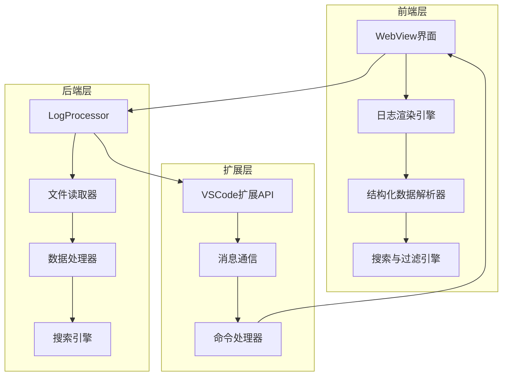
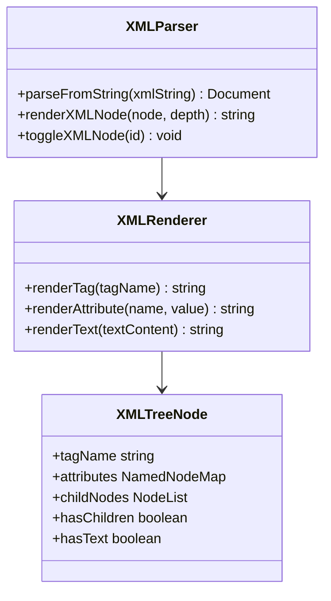
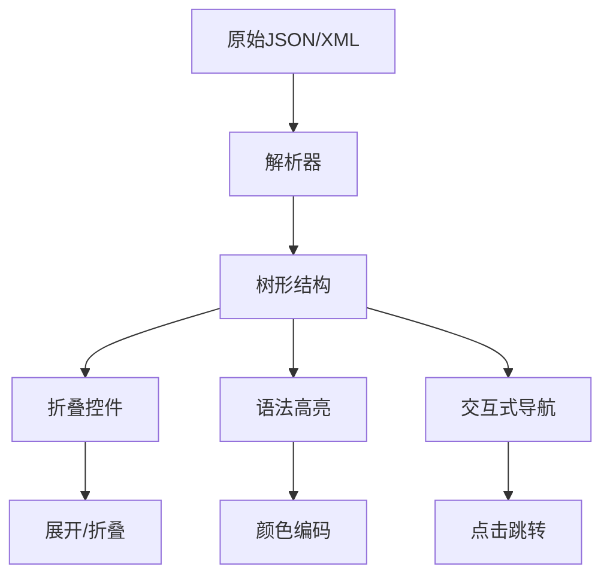
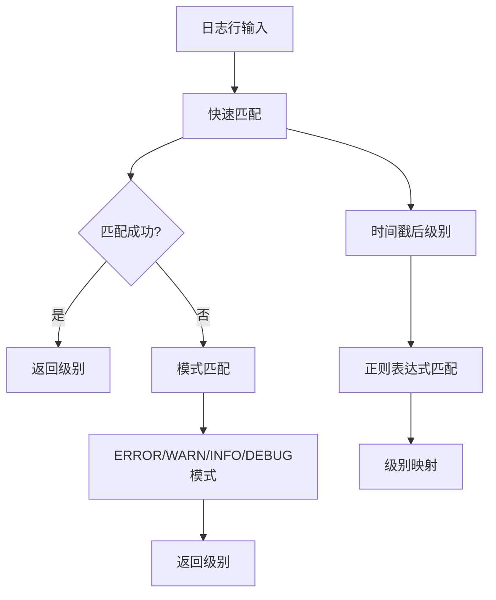
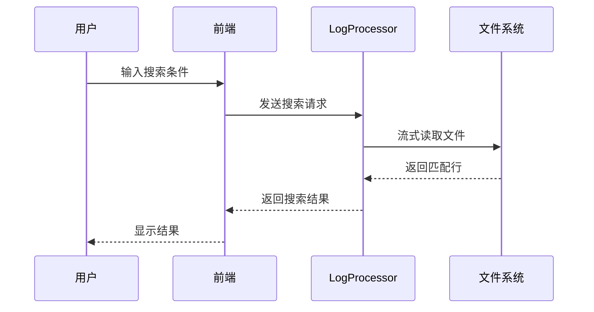
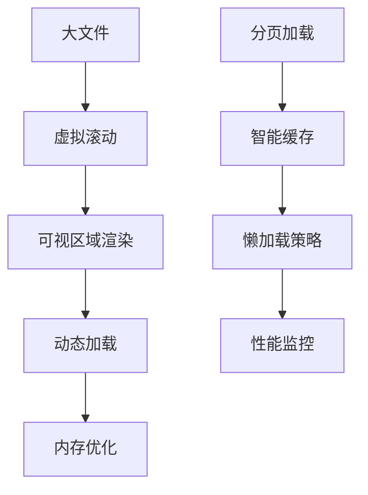
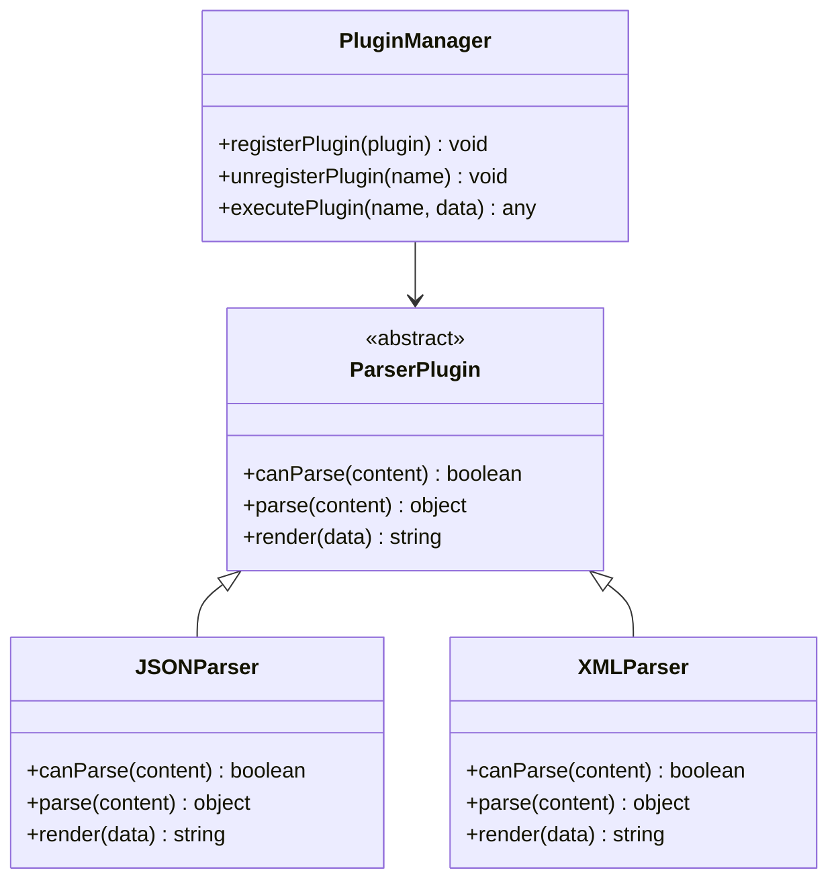

# 结构化数据解析

<cite>
**本文档引用的文件**
- [README.md](file://README.md)
- [package.json](file://package.json)
- [src/extension.ts](file://src/extension.ts)
- [src/logProcessor.ts](file://src/logProcessor.ts)
- [src/logViewerPanel.ts](file://src/logViewerPanel.ts)
- [src/webview.html](file://src/webview.html)
</cite>

## 目录
1. [项目概述](#项目概述)
2. [核心架构](#核心架构)
3. [结构化数据解析功能](#结构化数据解析功能)
4. [JSON/XML自动解析](#jsonxml自动解析)
5. [日志级别识别](#日志级别识别)
6. [时间戳提取](#时间戳提取)
7. [高级搜索与过滤](#高级搜索与过滤)
8. [性能优化策略](#性能优化策略)
9. [扩展性设计](#扩展性设计)
10. [总结](#总结)

## 项目概述

大日志文件查看器是一个专业的VSCode扩展，专门用于处理大型日志文件（支持几十MB甚至GB级别的文件）。该项目的核心优势在于其强大的结构化数据解析能力，能够智能识别和解析JSON、XML等结构化格式，同时提供丰富的日志分析功能。

### 主要特性

- **高性能加载**：使用虚拟滚动技术，即使GB级别的日志文件也能秒开
- **智能解析**：自动识别并解析JSON、XML结构化数据
- **多格式支持**：支持多种时间戳格式和日志级别识别
- **实时搜索**：提供关键词搜索、正则表达式搜索和高级组合搜索
- **可视化分析**：时间线导航、统计信息展示

**章节来源**
- [README.md](file://README.md#L1-L50)
- [package.json](file://package.json#L1-L30)

## 核心架构

项目采用前后端分离的架构设计，前端使用TypeScript和HTML/CSS构建WebView界面，后端通过Node.js处理文件读取和数据处理。



**图表来源**
- [src/logViewerPanel.ts](file://src/logViewerPanel.ts#L1-L50)
- [src/logProcessor.ts](file://src/logProcessor.ts#L1-L50)

### 核心组件说明

1. **LogViewerPanel**：负责WebView界面管理和用户交互
2. **LogProcessor**：处理日志文件读取、解析和搜索
3. **消息通信**：前后端通过VSCode的postMessage机制通信

**章节来源**
- [src/logViewerPanel.ts](file://src/logViewerPanel.ts#L6-L50)
- [src/logProcessor.ts](file://src/logProcessor.ts#L30-L80)

## 结构化数据解析功能

### JSON解析算法

项目实现了智能的JSON解析算法，能够从复杂的日志文本中提取完整的JSON对象和数组。

```mermaid
flowchart TD
A[输入日志文本] --> B[检测JSON开头]
B --> C{找到{或[?}
C --> |否| D[返回null]
C --> |是| E[括号匹配算法]
E --> F[处理字符串内引号]
F --> G[跟踪嵌套深度]
G --> H{深度=0?}
H --> |否| I[继续扫描]
H --> |是| J[提取完整JSON]
I --> E
J --> K[JSON.parse验证]
K --> L{解析成功?}
L --> |是| M[渲染JSON树]
L --> |否| N[返回null]
```

**图表来源**
- [src/webview.html](file://src/webview.html#L4025-L4137)

#### 关键算法特点

1. **括号匹配算法**：使用栈结构跟踪JSON对象的嵌套深度
2. **字符串处理**：正确处理转义字符和字符串内的特殊字符
3. **性能优化**：只扫描必要的字符，避免不必要的解析

**章节来源**
- [src/webview.html](file://src/webview.html#L4089-L4137)

### XML解析功能

XML解析功能提供了完整的XML树形结构展示，支持标签、属性和文本内容的高亮显示。



**图表来源**
- [src/webview.html](file://src/webview.html#L4288-L4359)

**章节来源**
- [src/webview.html](file://src/webview.html#L4288-L4359)

## JSON/XML自动解析

### 自动检测机制

系统通过多种策略自动检测和解析结构化数据：

1. **JSON检测**：
   - 检测 `{` 和 `[` 开头的模式
   - 使用括号匹配算法提取完整结构
   - 验证JSON格式的有效性

2. **XML检测**：
   - 检测 `<` 开头的标签模式
   - 使用DOMParser解析XML结构
   - 验证XML格式的合法性

### 渲染引擎

解析后的结构化数据会转换为交互式的树形结构：



**图表来源**
- [src/webview.html](file://src/webview.html#L4139-L4249)

**章节来源**
- [src/webview.html](file://src/webview.html#L4024-L4137)

## 日志级别识别

### 多层次识别系统

项目实现了多层次的日志级别识别机制：



**图表来源**
- [src/logProcessor.ts](file://src/logProcessor.ts#L48-L56)
- [src/logProcessor.ts](file://src/logProcessor.ts#L543-L562)

### 支持的日志级别

| 级别 | 正则模式 | 颜色标识 |
|------|----------|----------|
| ERROR | \[(ERROR\|FATAL\|SEVERE)\] \| \b(ERROR\|FATAL\|SEVERE)\s | #f14c4c |
| WARN | \[(WARN\|WARNING)\] \| \b(WARN\|WARNING)\s | #cca700 |
| INFO | \[(INFO\|INFORMATION)\] \| \b(INFO\|INFORMATION)\s | #4fc1ff |
| DEBUG | \[(DEBUG\|TRACE\|VERBOSE)\] \| \b(DEBUG\|TRACE\|VERBOSE)\s | #b267e6 |

**章节来源**
- [src/logProcessor.ts](file://src/logProcessor.ts#L48-L56)
- [src/logProcessor.ts](file://src/logProcessor.ts#L543-L562)

## 时间戳提取

### 多格式时间戳支持

系统支持多种常见的时间戳格式：

```mermaid
graph LR
A[时间戳检测] --> B[格式1: YYYY-MM-DD HH:MM:SS]
A --> C[格式2: YYYY/MM/DD HH:MM:SS]
A --> D[格式3: [YYYY-MM-DD HH:MM:SS]]
A --> E[格式4: DD-MM-YYYY HH:MM:SS]
A --> F[格式5: ISO 8601]
B --> G[标准化处理]
C --> G
D --> G
E --> G
F --> G
G --> H[Date对象创建]
```

**图表来源**
- [src/logProcessor.ts](file://src/logProcessor.ts#L35-L46)

### 时间戳解析流程

1. **正则匹配**：使用预定义的正则表达式匹配各种时间格式
2. **格式标准化**：统一转换为标准格式
3. **日期对象创建**：使用JavaScript Date对象处理时间

**章节来源**
- [src/logProcessor.ts](file://src/logProcessor.ts#L35-L46)
- [src/logProcessor.ts](file://src/logProcessor.ts#L478-L492)

## 高级搜索与过滤

### 智能搜索算法

项目提供了多种搜索和过滤功能：



**图表来源**
- [src/logProcessor.ts](file://src/logProcessor.ts#L135-L173)
- [src/logViewerPanel.ts](file://src/logViewerPanel.ts#L165-L178)

### 过滤功能

1. **日志级别过滤**：按ERROR、WARN、INFO、DEBUG级别过滤
2. **时间范围过滤**：按时间段筛选日志
3. **关键词过滤**：支持正则表达式和反向搜索
4. **高级组合过滤**：多条件组合搜索

**章节来源**
- [src/logProcessor.ts](file://src/logProcessor.ts#L651-L699)
- [src/logProcessor.ts](file://src/logProcessor.ts#L178-L231)

## 性能优化策略

### 虚拟滚动技术

为了处理大文件，项目采用了虚拟滚动技术：



**图表来源**
- [src/logViewerPanel.ts](file://src/logViewerPanel.ts#L150-L163)

### 流式处理

1. **流式读取**：使用readline模块逐行读取文件
2. **增量处理**：只处理当前需要的数据
3. **内存管理**：及时释放不需要的内存

**章节来源**
- [src/logProcessor.ts](file://src/logProcessor.ts#L90-L130)
- [src/logViewerPanel.ts](file://src/logViewerPanel.ts#L107-L148)

## 扩展性设计

### 插件化架构

系统采用插件化设计，支持功能扩展：



**图表来源**
- [src/webview.html](file://src/webview.html#L4024-L4137)

### 自定义高亮规则

用户可以创建自定义高亮规则：

| 规则类型 | 描述 | 示例 |
|----------|------|------|
| 文本匹配 | 简单字符串匹配 | "ERROR" |
| 正则表达式 | 复杂模式匹配 | `\bERROR\b` |
| 颜色定制 | 自定义背景和文字颜色 | #f14c4c/#ffffff |
| 启用状态 | 控制规则是否生效 | true/false |

**章节来源**
- [src/webview.html](file://src/webview.html#L2372-L2414)

## 总结

大日志文件查看器通过精心设计的结构化数据解析功能，为用户提供了强大而高效的日志分析工具。其主要优势包括：

1. **智能解析**：自动识别和解析JSON、XML等结构化数据
2. **高性能**：采用虚拟滚动和流式处理技术，支持大文件处理
3. **灵活过滤**：提供多种搜索和过滤方式
4. **可视化展示**：直观的树形结构展示解析结果
5. **扩展性强**：支持自定义规则和插件扩展

该系统不仅解决了传统日志查看工具在处理大型日志文件时的性能瓶颈，还通过智能化的数据解析功能大大提升了日志分析的效率和准确性。对于需要处理大量日志数据的开发人员和运维人员来说，这是一个非常有价值的工具。