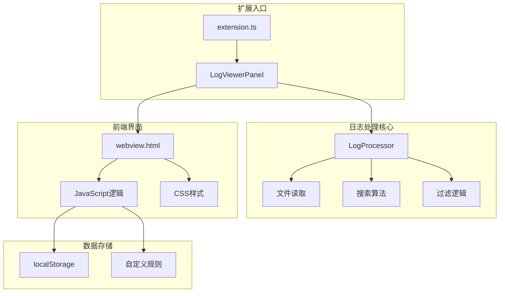
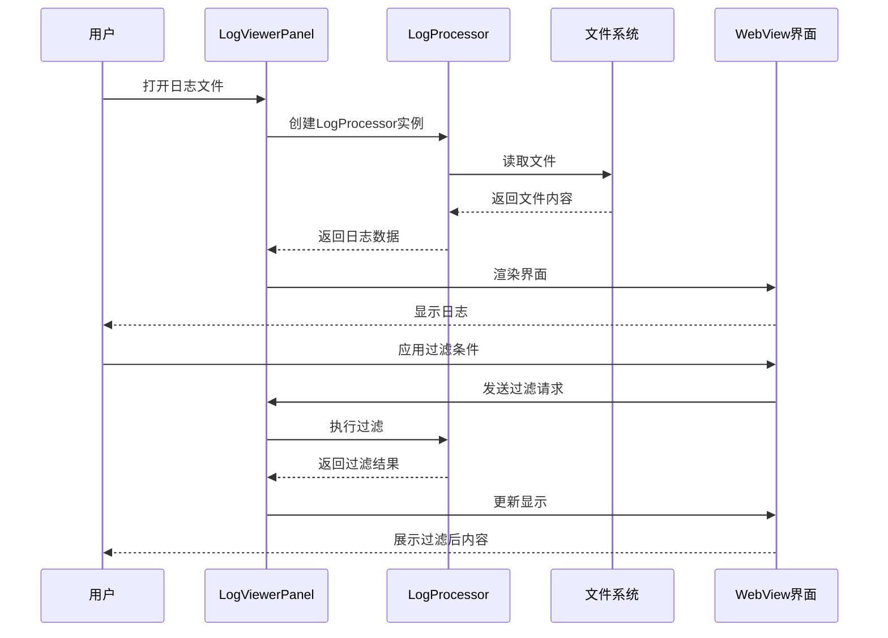
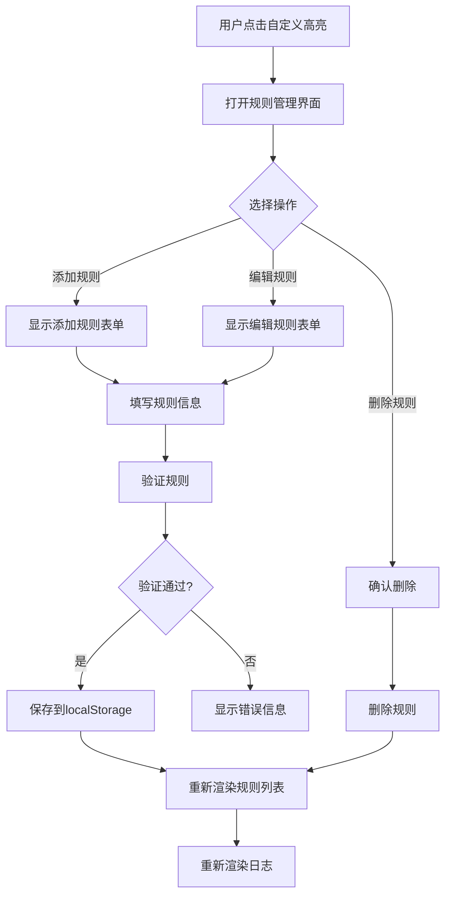
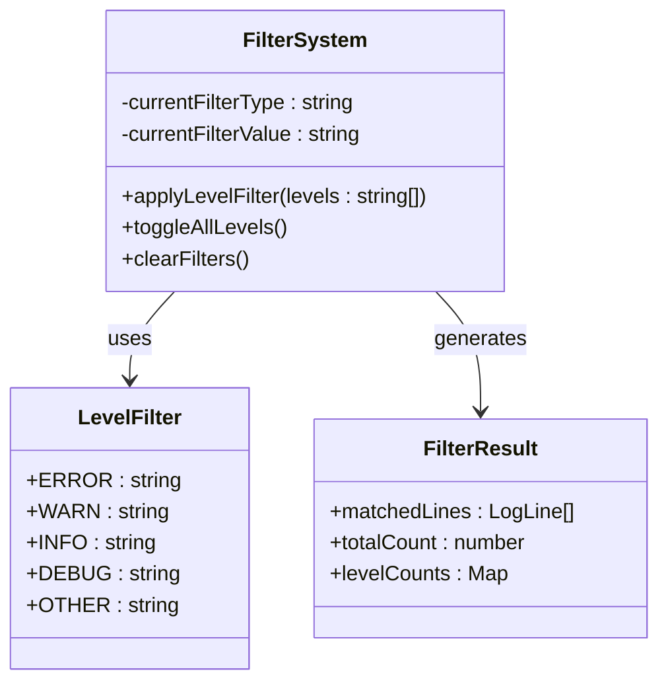
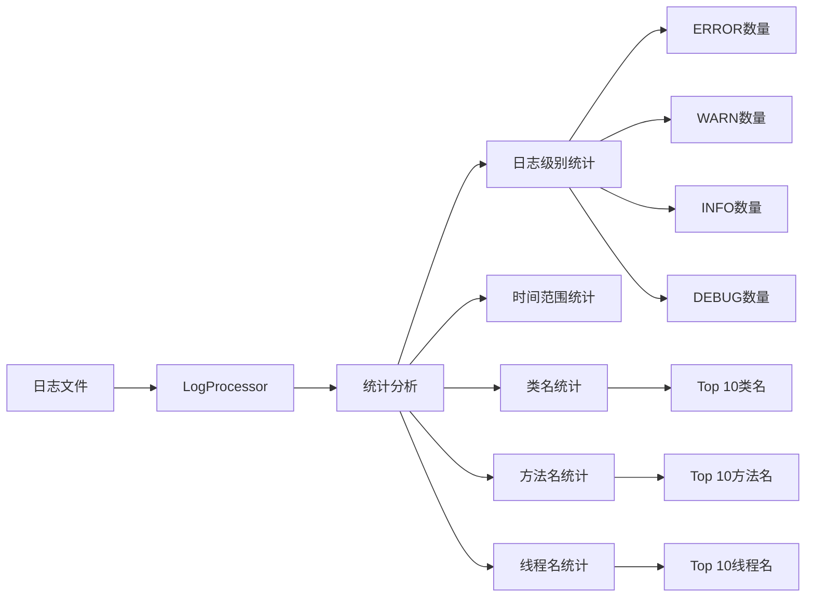
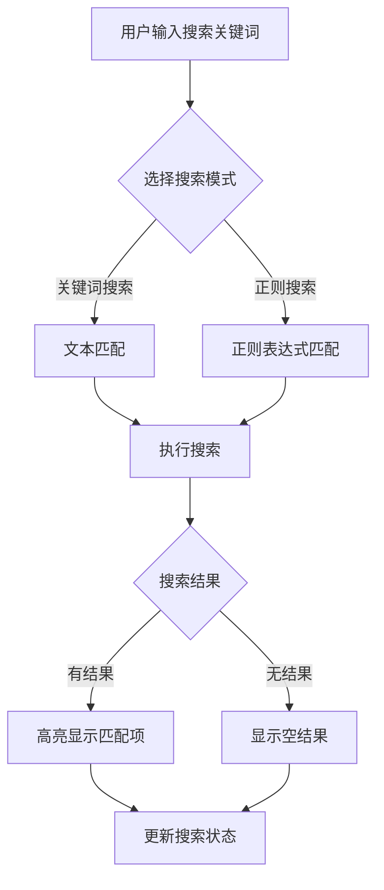
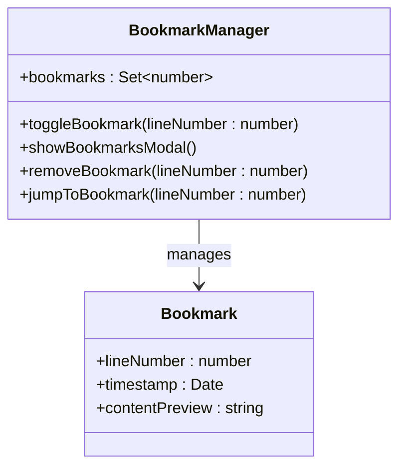
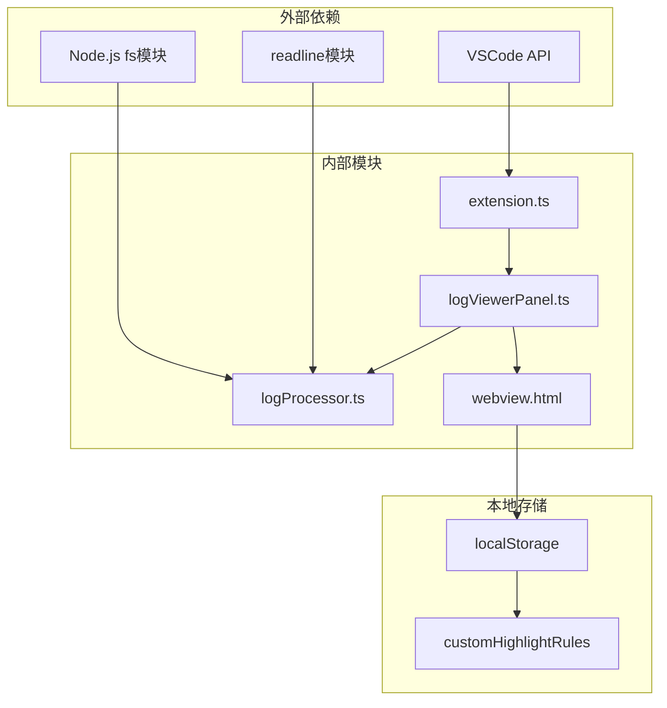

# 自定义高亮与过滤功能

<cite>
**本文档引用的文件**
- [package.json](file://package.json)
- [README.md](file://README.md)
- [extension.ts](file://src/extension.ts)
- [logProcessor.ts](file://src/logProcessor.ts)
- [logViewerPanel.ts](file://src/logViewerPanel.ts)
- [webview.html](file://src/webview.html)
</cite>

## 目录
1. [简介](#简介)
2. [项目结构](#项目结构)
3. [核心组件](#核心组件)
4. [架构概览](#架构概览)
5. [详细功能分析](#详细功能分析)
6. [依赖关系分析](#依赖关系分析)
7. [性能考虑](#性能考虑)
8. [故障排除指南](#故障排除指南)
9. [结论](#结论)

## 简介

大日志文件查看器是一个专业的VSCode扩展，专门用于处理大型日志文件（支持几十MB甚至GB级别的文件）。该扩展提供了强大的自定义高亮与过滤功能，包括智能搜索、日志级别过滤、时间范围过滤、折叠重复日志、书签管理、注释功能等核心特性。

### 核心功能特性

- **高性能加载**：使用虚拟滚动技术，即使GB级别的日志文件也能秒开
- **智能搜索**：支持关键词搜索、正则表达式、反向搜索和高级组合搜索
- **强大过滤**：按日志级别、时间范围、线程名、类名、方法名进行精确过滤
- **自定义高亮**：支持用户创建自定义高亮规则，实时高亮匹配内容
- **可视化增强**：语法高亮、颜色标记、JSON/XML结构化显示
- **数据分析**：统计信息、时间线导航、重复日志检测

## 项目结构

**图表来源**
- [extension.ts](file://src/extension.ts#L1-L116)
- [logViewerPanel.ts](file://src/logViewerPanel.ts#L1-L510)
- [webview.html](file://src/webview.html#L1-L4723)

**章节来源**
- [package.json](file://package.json#L1-L94)
- [README.md](file://README.md#L1-L286)

## 核心组件

### 扩展主入口 (extension.ts)

扩展的入口点负责注册命令和事件处理，主要功能包括：
- 注册打开日志文件命令
- 注册按时间删除日志命令
- 注册按行数删除日志命令

### 日志处理器 (LogProcessor)

核心的日志处理类，提供以下功能：
- 文件总行数统计
- 指定范围行读取
- 关键词搜索（支持正则）
- 时间范围过滤
- 日志级别提取
- 统计信息生成

### 日志查看器面板 (LogViewerPanel)

管理WebView面板的核心类，负责前后端通信：
- 文件加载与刷新
- 搜索结果处理
- 过滤结果展示
- 用户交互响应

**章节来源**
- [extension.ts](file://src/extension.ts#L1-L116)
- [logProcessor.ts](file://src/logProcessor.ts#L1-L808)
- [logViewerPanel.ts](file://src/logViewerPanel.ts#L1-L510)

## 架构概览

**图表来源**
- [logViewerPanel.ts](file://src/logViewerPanel.ts#L47-L98)
- [logProcessor.ts](file://src/logProcessor.ts#L60-L130)

## 详细功能分析

### 自定义高亮规则系统

#### 功能概述

自定义高亮规则系统允许用户创建个性化的日志高亮规则，实时高亮匹配的内容。系统内置了多种预设规则，同时支持用户创建自定义规则。

#### 预设高亮规则

系统内置了以下预设高亮规则：

| 规则名称 | 匹配模式 | 正则表达式 | 背景颜色 | 文本颜色 |
|---------|----------|-----------|----------|----------|
| 日志级别 - ERROR | 正则 | `\b(ERROR\|FATAL\|SEVERE)\b` | #f14c4c | #ffffff |
| 日志级别 - WARN | 正则 | `\b(WARN\|WARNING)\b` | #cca700 | #ffffff |
| 日志级别 - INFO | 正则 | `\b(INFO)\b` | #4fc1ff | #000000 |
| 日志级别 - DEBUG | 正则 | `\b(DEBUG\|TRACE\|VERBOSE)\b` | #b267e6 | #ffffff |
| 时间戳 | 正则 | `\d{4}[-/]\d{2}[-/]\d{2}[T\s]\d{2}:\d{2}:\d{2}(\.\d+)?` | #b267e6 | #ffffff |
| 线程名 | 正则 | `\[([a-zA-Z][a-zA-Z0-9-_]*)\]` | #06b6d4 | #ffffff |
| 类名 | 正则 | `\b([a-z][a-z0-9_]*(?:\.[a-z][a-z0-9_]*)*\.[A-Z][a-zA-Z0-9_]*)\b` | #10b981 | #ffffff |
| 方法名 | 正则 | `\[([a-zA-Z_][a-zA-Z0-9_]*):\d+\]` | #f59e0b | #ffffff |

#### 自定义规则管理

**图表来源**
- [webview.html](file://src/webview.html#L4417-L4687)

#### 高亮规则实现原理

高亮规则通过以下步骤实现：

1. **规则解析**：将用户定义的规则转换为JavaScript正则表达式
2. **内容匹配**：遍历日志内容，使用正则表达式匹配
3. **样式应用**：根据匹配结果应用相应的CSS样式
4. **实时更新**：当规则变化时，立即重新渲染高亮效果

**章节来源**
- [webview.html](file://src/webview.html#L2370-L2414)
- [webview.html](file://src/webview.html#L4417-L4687)

### 智能过滤系统

#### 日志级别过滤

支持按ERROR、WARN、INFO、DEBUG四个级别进行过滤：

**图表来源**
- [webview.html](file://src/webview.html#L2150-L2180)
- [logViewerPanel.ts](file://src/logViewerPanel.ts#L409-L426)

#### 时间范围过滤

支持按时间范围筛选日志，支持多种时间格式：

| 时间格式 | 示例 | 正则表达式 |
|---------|------|-----------|
| YYYY-MM-DD HH:mm:ss | 2024-01-01 12:00:00 | `\d{4}-\d{2}-\d{2}\s+\d{2}:\d{2}:\d{2}` |
| YYYY/MM/DD HH:mm:ss | 2024/01/01 12:00:00 | `\d{4}/\d{2}/\d{2}\s+\d{2}:\d{2}:\d{2}` |
| [YYYY-MM-DD HH:mm:ss] | [2024-01-01 12:00:00] | `\[\d{4}-\d{2}-\d{2}\s+\d{2}:\d{2}:\d{2}\]` |
| DD-MM-YYYY HH:mm:ss | 01-01-2024 12:00:00 | `\d{2}-\d{2}-\d{4}\s+\d{2}:\d{2}:\d{2}` |
| ISO 8601 | 2024-01-01T12:00:00 | `\d{4}-\d{2}-\d{2}T\d{2}:\d{2}:\d{2}` |

#### 智能统计分析

系统提供全面的统计分析功能：

**图表来源**
- [logProcessor.ts](file://src/logProcessor.ts#L567-L646)
- [webview.html](file://src/webview.html#L2188-L2306)

**章节来源**
- [webview.html](file://src/webview.html#L2150-L2180)
- [logProcessor.ts](file://src/logProcessor.ts#L647-L700)

### 搜索功能

#### 基础搜索

支持关键词搜索和正则表达式搜索：

**图表来源**
- [logProcessor.ts](file://src/logProcessor.ts#L135-L172)
- [logProcessor.ts](file://src/logProcessor.ts#L705-L749)

#### 高级搜索

支持多条件组合搜索和反向搜索：

| 搜索类型 | 描述 | 使用场景 |
|---------|------|----------|
| 基础搜索 | 单关键词匹配 | 快速定位特定内容 |
| 正则搜索 | 使用正则表达式 | 复杂模式匹配 |
| 反向搜索 | 排除包含关键词的内容 | 排除干扰信息 |
| 组合搜索 | 多条件AND/OR逻辑 | 精确筛选目标 |

**章节来源**
- [logProcessor.ts](file://src/logProcessor.ts#L135-L172)
- [logProcessor.ts](file://src/logProcessor.ts#L705-L749)

### 书签与注释功能

#### 书签系统

**图表来源**
- [webview.html](file://src/webview.html#L2308-L2349)

#### 注释系统

支持为日志行添加自定义注释，便于团队协作分析：

- **添加注释**：双击日志行或使用注释按钮
- **编辑注释**：再次点击同一行进行编辑
- **删除注释**：清空注释内容或使用删除按钮
- **持久化存储**：注释内容保存在内存中，页面刷新后保留

**章节来源**
- [webview.html](file://src/webview.html#L2502-L2569)

## 依赖关系分析

**图表来源**
- [extension.ts](file://src/extension.ts#L1-L2)
- [logProcessor.ts](file://src/logProcessor.ts#L1-L3)
- [webview.html](file://src/webview.html#L1247-L1249)

**章节来源**
- [extension.ts](file://src/extension.ts#L1-L116)
- [logProcessor.ts](file://src/logProcessor.ts#L1-L808)

## 性能考虑

### 虚拟滚动优化

系统采用虚拟滚动技术，只渲染可见区域的日志行，大幅提升大文件加载性能：

- **内存占用**：仅加载当前页数据，内存占用低
- **渲染速度**：分页切换响应时间小于100ms
- **滚动流畅度**：滚动过程中无卡顿

### 异步处理

对于耗时操作，采用异步处理机制：

- **折叠模式计算**：异步计算总页数，不阻塞UI
- **搜索操作**：流式搜索，支持大文件快速检索
- **统计分析**：后台异步计算统计信息

### 缓存策略

- **页面范围缓存**：记录每页实际加载的行范围
- **规则缓存**：将自定义高亮规则保存在localStorage
- **位置记忆**：保存筛选前的位置信息

## 故障排除指南

### 常见问题

#### 高亮规则不生效

**可能原因**：
1. 正则表达式语法错误
2. 规则被禁用
3. 匹配内容为空

**解决方法**：
1. 检查正则表达式语法
2. 确认规则处于启用状态
3. 验证匹配内容是否存在

#### 搜索结果不准确

**可能原因**：
1. 时间格式识别失败
2. 日志级别提取错误
3. 文件编码问题

**解决方法**：
1. 检查日志文件的时间戳格式
2. 验证日志级别提取规则
3. 确认文件编码为UTF-8

#### 性能问题

**可能原因**：
1. 文件过大
2. 规则过多
3. 过滤条件过于复杂

**解决方法**：
1. 使用分页加载
2. 优化高亮规则数量
3. 简化过滤条件

**章节来源**
- [webview.html](file://src/webview.html#L4463-L4472)
- [logProcessor.ts](file://src/logProcessor.ts#L476-L562)

## 结论

大日志文件查看器提供了一套完整的自定义高亮与过滤解决方案，具有以下优势：

### 主要优势

1. **高性能设计**：虚拟滚动和异步处理确保大文件流畅运行
2. **灵活定制**：丰富的自定义高亮规则和过滤选项
3. **智能分析**：自动识别日志格式和提取关键信息
4. **用户体验**：直观的界面和便捷的操作方式

### 技术特色

- **前后端分离**：清晰的职责划分，便于维护和扩展
- **状态管理**：完善的筛选状态保存和恢复机制
- **数据持久化**：规则和书签的本地存储
- **错误处理**：完善的异常处理和用户反馈

### 应用价值

该扩展特别适用于：
- **开发调试**：快速定位问题日志
- **运维监控**：分析系统运行状态
- **性能分析**：识别性能瓶颈和异常模式
- **团队协作**：共享分析结果和注释

通过自定义高亮与过滤功能，用户可以更高效地处理大型日志文件，提升问题排查和系统分析的工作效率。