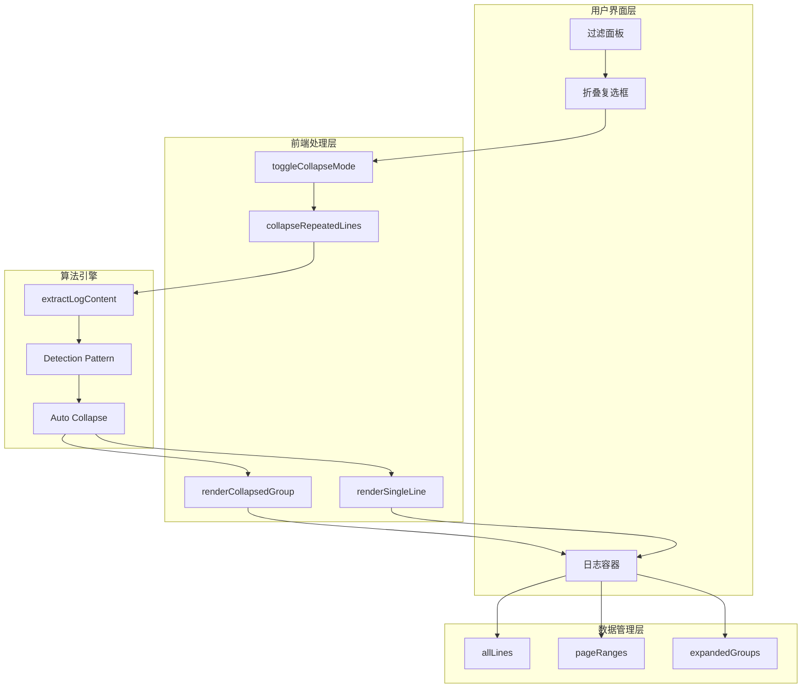
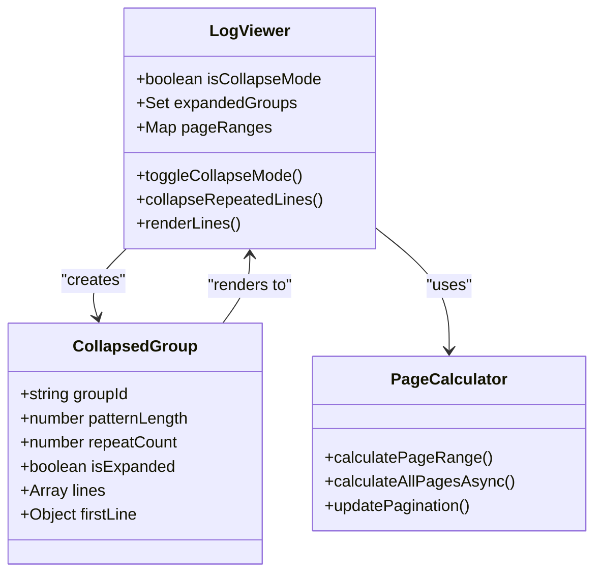
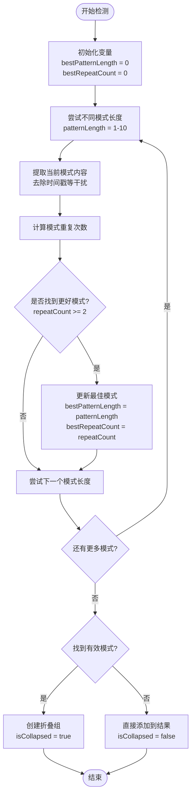
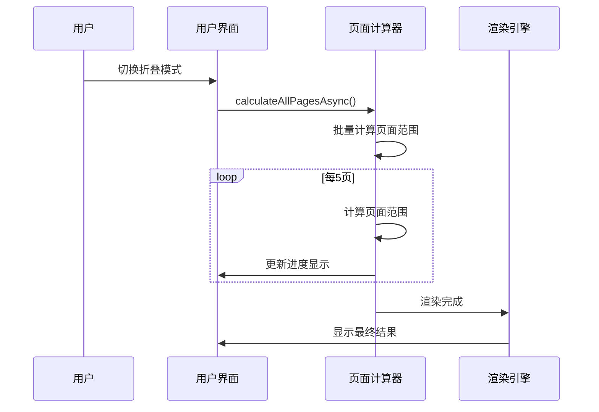
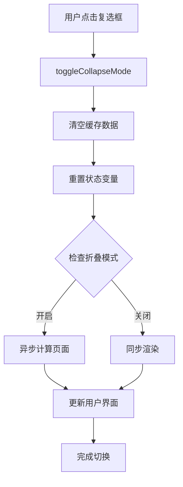
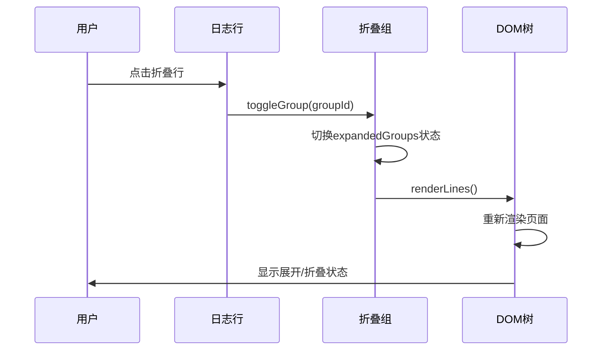

# 折叠重复日志功能详细文档

<cite>
**本文档引用的文件**
- [webview.html](file://src/webview.html)
- [logViewerPanel.ts](file://src/logViewerPanel.ts)
- [extension.ts](file://src/extension.ts)
- [package.json](file://package.json)
</cite>

## 目录
1. [功能概述](#功能概述)
2. [技术架构](#技术架构)
3. [核心算法实现](#核心算法实现)
4. [前端实现细节](#前端实现细节)
5. [用户界面设计](#用户界面设计)
6. [性能优化策略](#性能优化策略)
7. [交互机制](#交互机制)
8. [扩展性考虑](#扩展性考虑)
9. [故障排除指南](#故障排除指南)
10. [总结](#总结)

## 功能概述

折叠重复日志功能是large_log_check扩展中的一个重要特性，旨在通过智能识别和合并连续重复的日志行来显著提升大文件日志的可读性和浏览效率。该功能采用轻量级的前端处理方式，在用户界面层面实现重复内容的智能折叠，无需增加后端处理负担。

### 主要特性

- **智能重复检测**：支持单行和多行模式的重复检测
- **动态折叠算法**：根据页面显示需求动态调整加载策略
- **用户可控切换**：通过过滤面板的复选框实现一键开启/关闭
- **视觉反馈**：提供清晰的折叠状态指示和交互反馈
- **性能优化**：采用异步计算和智能加载策略

## 技术架构

### 整体架构图



**图表来源**
- [webview.html](file://src/webview.html#L1830-L1852)
- [webview.html](file://src/webview.html#L1566-L1649)

### 核心组件关系



**图表来源**
- [webview.html](file://src/webview.html#L1174-L1177)
- [webview.html](file://src/webview.html#L1629-L1637)

## 核心算法实现

### 重复检测算法

折叠功能的核心在于智能识别重复模式的算法，该算法能够检测单行或多行的重复模式：

#### 算法流程图



**图表来源**
- [webview.html](file://src/webview.html#L1577-L1644)

#### 关键算法实现

算法的核心逻辑包含以下步骤：

1. **模式提取**：使用`extractLogContent()`函数去除时间戳等干扰因素
2. **重复计数**：通过嵌套循环检测模式重复次数
3. **最佳匹配**：选择重复次数最多的模式作为折叠依据
4. **智能判断**：要求重复次数至少为2次才进行折叠

**章节来源**
- [webview.html](file://src/webview.html#L1566-L1649)

### 时间戳清理算法

为了准确识别重复模式，系统实现了智能的时间戳清理功能：


**图表来源**
- [webview.html](file://src/webview.html#L1542-L1562)

**章节来源**
- [webview.html](file://src/webview.html#L1542-L1562)

## 前端实现细节

### HTML结构设计

折叠功能的HTML结构采用了语义化的设计原则，确保良好的可访问性和可维护性：

#### 折叠组HTML结构

```html
<div class="log-line collapsed" data-group-id="group_123">
    <span class="log-line-number">123</span>
    <span class="log-line-content">
        日志内容...
        <span class="repeat-count" title="点击展开详情">
            重复 15 次
        </span>
    </span>
</div>
```

#### 单行日志HTML结构

```html
<div class="log-line info">
    <span class="log-line-number">123</span>
    <span class="log-line-content">
        INFO 日志内容...
    </span>
</div>
```

**章节来源**
- [webview.html](file://src/webview.html#L1652-L1693)
- [webview.html](file://src/webview.html#L1728-L1817)

### CSS样式系统

#### 折叠样式定义

```css
/* 折叠日志行样式 */
.log-line.collapsed {
    background-color: rgba(139, 92, 246, 0.1);
    border-left: 3px solid #8b5cf6;
    cursor: pointer;
}

.log-line.collapsed:hover {
    background-color: rgba(139, 92, 246, 0.2);
}

/* 重复次数徽章样式 */
.repeat-count {
    display: inline-block;
    background-color: #8b5cf6;
    color: white;
    padding: 2px 8px;
    border-radius: 10px;
    font-size: 11px;
    font-weight: bold;
    margin-left: 10px;
    cursor: pointer;
}
```

#### 展开后的样式

```css
/* 展开后的子行样式 */
.log-line {
    margin-left: 20px;
    opacity: 0.8;
    border-top: 1px dashed rgba(139, 92, 246, 0.3);
    margin-top: 3px;
    padding-top: 3px;
}
```

**章节来源**
- [webview.html](file://src/webview.html#L213-L234)
- [webview.html](file://src/webview.html#L1700-L1708)

### JavaScript核心逻辑

#### toggleCollapseMode函数

该函数是折叠功能的入口点，负责处理用户界面的状态切换：

```javascript
function toggleCollapseMode() {
    isCollapseMode = document.getElementById('collapseRepeated').checked;
    console.log('🔍 切换折叠模式:', isCollapseMode);
    
    // 清空页面范围记录，重新计算
    pageRanges.clear();
    currentPage = 1;
    expandedGroups.clear(); // 清空展开状态
    
    // 如果取消折叠模式，重置计算状态
    if (!isCollapseMode) {
        isCalculatingPages = false;
        calculationProgress = 0;
    }
    
    renderLines();
    updatePagination(); // 手动再次调用以确保状态正确
    
    // 如果开启折叠模式，异步计算所有页面
    if (isCollapseMode) {
        calculateAllPagesAsync();
    }
}
```

**章节来源**
- [webview.html](file://src/webview.html#L1829-L1852)

#### collapseRepeatedLines算法

这是整个折叠功能的核心算法，实现了智能的重复检测：

```javascript
function collapseRepeatedLines(lines, startIndex) {
    const result = [];
    let i = 0;
    let totalCollapsed = 0;
    
    while (i < lines.length) {
        // 尝试不同的模式长度（1行、2行、3行...最多10行）
        let bestPatternLength = 0;
        let bestRepeatCount = 0;
        
        for (let patternLength = 1; patternLength <= Math.min(10, Math.floor((lines.length - i) / 2)); patternLength++) {
            // 获取当前模式（去除时间戳）
            const pattern = [];
            for (let k = 0; k < patternLength; k++) {
                if (i + k >= lines.length) break;
                const content = extractLogContent(lines[i + k]);
                pattern.push(content);
            }
            
            // 检测这个模式重复了多少次
            let repeatCount = 1;
            let j = i + patternLength;
            
            while (j + patternLength <= lines.length) {
                let matches = true;
                for (let k = 0; k < patternLength; k++) {
                    const currentContent = extractLogContent(lines[j + k]);
                    if (currentContent !== pattern[k]) {
                        matches = false;
                        break;
                    }
                }
                
                if (matches) {
                    repeatCount++;
                    j += patternLength;
                } else {
                    break;
                }
            }
            
            // 如果这个模式至少重复2次，且比之前找到的更好
            if (repeatCount >= 2 && repeatCount > bestRepeatCount) {
                bestPatternLength = patternLength;
                bestRepeatCount = repeatCount;
            }
        }
        
        if (bestPatternLength > 0 && bestRepeatCount >= 2) {
            // 找到了重复模式
            const firstLineNumber = lines[i].lineNumber || (startIndex + i + 1);
            const groupId = `group_${firstLineNumber}`;
            const totalLines = bestPatternLength * bestRepeatCount;
            
            result.push({
                isCollapsed: true,
                groupId: groupId,
                patternLength: bestPatternLength,
                repeatCount: bestRepeatCount,
                lines: lines.slice(i, i + totalLines),
                firstLine: lines[i],
                isExpanded: expandedGroups.has(groupId)
            });
            
            i += totalLines;
        } else {
            // 没有重复，直接添加
            result.push(lines[i]);
            i++;
        }
    }
    
    return result;
}
```

**章节来源**
- [webview.html](file://src/webview.html#L1566-L1649)

## 用户界面设计

### 过滤面板集成

折叠功能通过过滤面板中的复选框与用户界面无缝集成：

```html
<label style="font-size: 12px; display: flex; align-items: center; gap: 5px; cursor: pointer;">
    <input type="checkbox" id="collapseRepeated" onchange="toggleCollapseMode()">
    <span>📎 折叠重复日志</span>
</label>
```

### 交互反馈设计

#### 折叠状态指示

- **视觉标识**：使用紫色边框和背景色区分折叠行
- **状态提示**：鼠标悬停时显示展开/折叠提示
- **重复计数**：显示具体的重复次数信息

#### 用户操作反馈

- **点击展开**：点击折叠行可展开查看详细内容
- **展开状态记忆**：记住用户的展开/折叠偏好
- **实时更新**：切换折叠模式时立即更新显示

**章节来源**
- [webview.html](file://src/webview.html#L720-L723)

## 性能优化策略

### 智能加载机制

#### 分页计算优化



**图表来源**
- [webview.html](file://src/webview.html#L1486-L1541)

#### 异步计算策略

系统采用异步计算策略来避免阻塞用户界面：

1. **分批处理**：每次计算5页，然后让出CPU时间
2. **进度反馈**：实时显示计算进度
3. **中断机制**：用户切换模式时可立即停止计算

**章节来源**
- [webview.html](file://src/webview.html#L1486-L1541)

### 内存管理优化

#### 数据结构优化

- **Set集合**：使用Set存储展开状态，提高查找效率
- **Map缓存**：使用Map缓存页面范围，避免重复计算
- **懒加载**：只在需要时才计算页面范围

#### 渲染优化

- **虚拟滚动**：只渲染可见区域的内容
- **DOM复用**：重用DOM元素，减少创建销毁开销
- **批量更新**：合并多个DOM更新操作

**章节来源**
- [webview.html](file://src/webview.html#L1174-L1177)

## 交互机制

### 用户操作流程

#### 折叠模式切换流程



**图表来源**
- [webview.html](file://src/webview.html#L1829-L1852)

#### 折叠/展开交互



**图表来源**
- [webview.html](file://src/webview.html#L1819-L1827)

### 状态持久化

#### 展开状态记忆

系统通过`expandedGroups` Set来记忆用户的展开偏好：

```javascript
// 切换折叠组状态
function toggleGroup(groupId) {
    if (expandedGroups.has(groupId)) {
        expandedGroups.delete(groupId);
    } else {
        expandedGroups.add(groupId);
    }
    renderLines();
}
```

#### 页面范围缓存

使用`pageRanges` Map缓存页面范围信息，避免重复计算：

```javascript
// 记录页面范围
pageRanges.set(currentPage, { start: startIndex, end: endIndex });

// 检查是否存在缓存
if (pageRanges.has(currentPage)) {
    const range = pageRanges.get(currentPage);
    startIndex = range.start;
    endIndex = range.end;
}
```

**章节来源**
- [webview.html](file://src/webview.html#L1819-L1827)
- [webview.html](file://src/webview.html#L1330-L1336)

## 扩展性考虑

### 算法可扩展性

#### 模式检测增强

当前算法支持1-10行的模式检测，可根据需要扩展：

- **动态调整窗口大小**：根据日志特征自动调整检测窗口
- **多级检测**：同时检测单行和多行模式
- **权重评分**：为不同模式分配权重，选择最优方案

#### 性能扩展

- **并行计算**：利用Web Workers进行并行计算
- **增量更新**：只重新计算变化的部分
- **智能预测**：基于历史数据预测最佳设置

### 功能扩展

#### 高级折叠选项

- **自定义阈值**：允许用户设置最小重复次数
- **模式优先级**：支持多种折叠模式的优先级设置
- **条件折叠**：基于日志级别或其他条件的折叠

#### 用户体验增强

- **动画效果**：添加展开/折叠的平滑动画
- **键盘快捷键**：支持键盘操作折叠功能
- **拖拽调整**：允许用户拖拽调整折叠范围

## 故障排除指南

### 常见问题及解决方案

#### 折叠功能不生效

**问题症状**：启用折叠模式后仍然显示原始日志行

**可能原因**：
1. 日志内容过于复杂，无法识别重复模式
2. 系统资源不足导致计算超时
3. 浏览器兼容性问题

**解决方案**：
1. 检查日志格式是否过于复杂
2. 增加系统内存或优化浏览器设置
3. 更新浏览器版本

#### 性能问题

**问题症状**：启用折叠模式后页面响应缓慢

**诊断步骤**：
1. 检查日志文件大小
2. 监控浏览器性能指标
3. 查看控制台错误信息

**优化建议**：
1. 减少同时加载的日志行数
2. 使用更高效的算法变体
3. 实施更严格的计算超时机制

#### 状态丢失

**问题症状**：切换折叠模式后展开状态被重置

**解决方法**：
1. 检查expandedGroups数据结构
2. 验证状态保存机制
3. 确认DOM更新逻辑

**章节来源**
- [webview.html](file://src/webview.html#L1829-L1852)

## 总结

large_log_check的折叠重复日志功能是一个精心设计的前端优化解决方案，通过智能算法和优雅的用户界面实现了大文件日志的有效管理。该功能的主要优势包括：

### 技术亮点

1. **智能算法**：能够识别单行和多行的重复模式，适应各种日志格式
2. **性能优化**：采用异步计算和智能加载策略，确保良好的用户体验
3. **用户友好**：提供直观的视觉反馈和灵活的交互方式
4. **可扩展性**：模块化设计便于功能扩展和性能优化

### 应用价值

- **提升可读性**：显著减少重复内容，突出重要信息
- **改善性能**：通过前端处理减轻服务器负担
- **增强体验**：提供流畅的交互和状态记忆功能
- **适应场景**：适用于各种规模的日志文件处理

该功能展示了现代Web应用中前端算法优化的最佳实践，为处理大规模数据提供了有价值的参考实现。随着算法的不断优化和功能的持续扩展，这一特性将继续为用户提供更加高效和愉悦的日志分析体验。