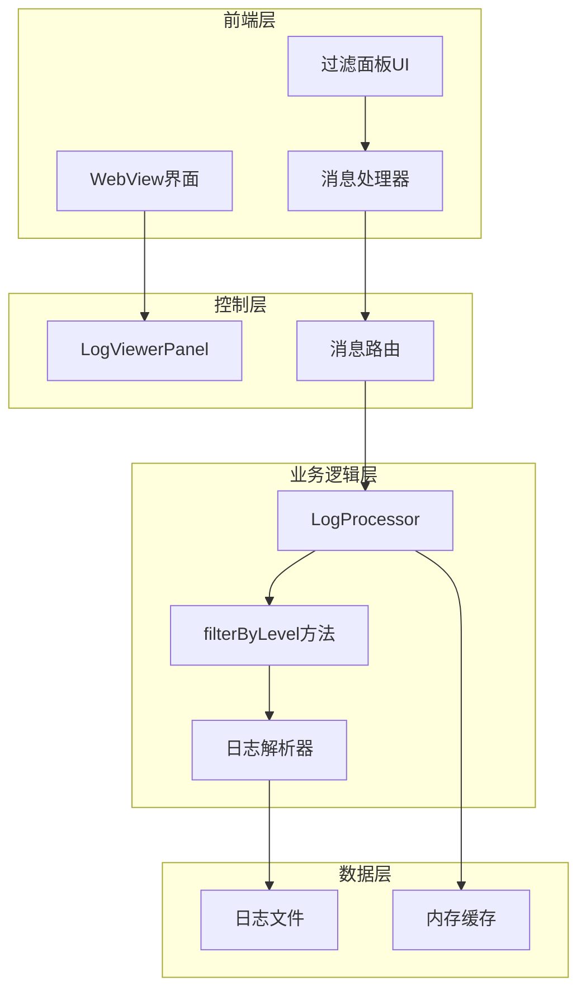
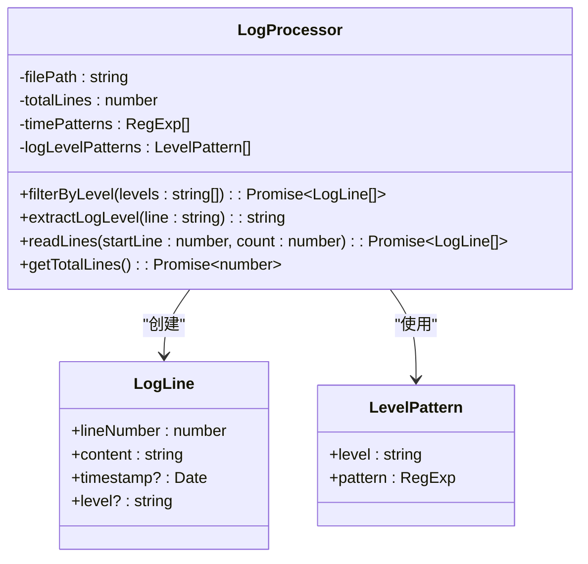
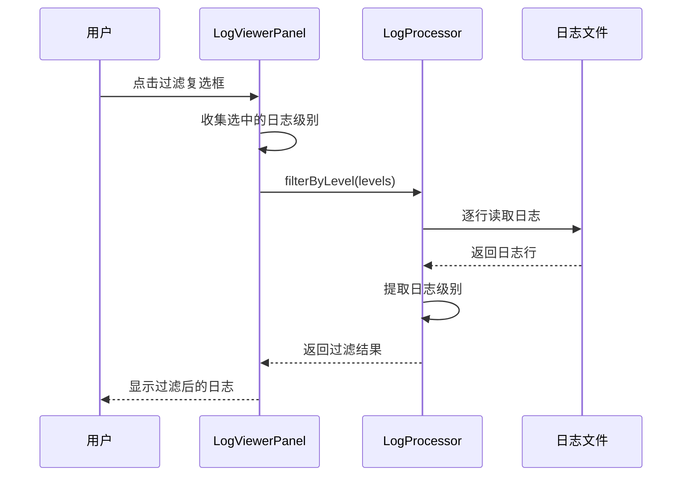
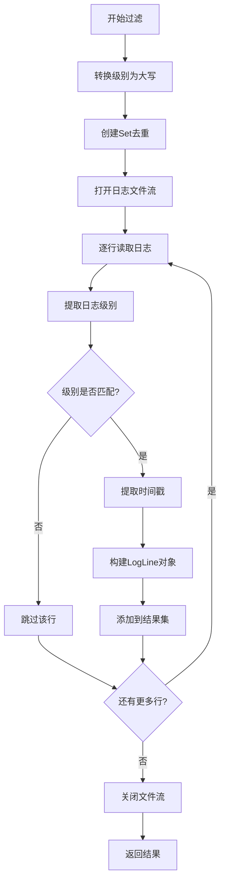
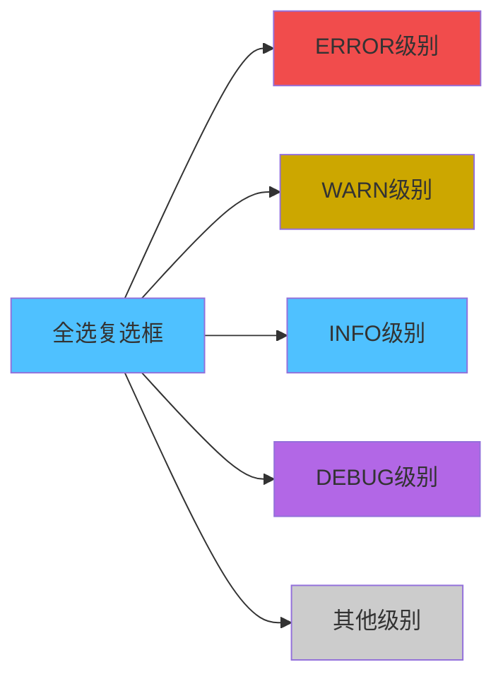
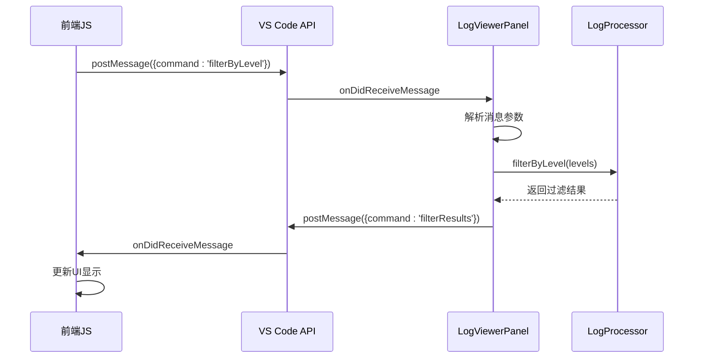
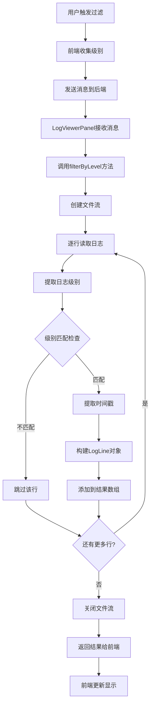

# 日志级别过滤功能详细文档

<cite>
**本文档引用的文件**
- [logProcessor.ts](file://src/logProcessor.ts)
- [logViewerPanel.ts](file://src/logViewerPanel.ts)
- [webview.html](file://src/webview.html)
- [extension.ts](file://src/extension.ts)
</cite>

## 目录
1. [简介](#简介)
2. [系统架构概览](#系统架构概览)
3. [核心组件分析](#核心组件分析)
4. [filterByLevel方法实现机制](#filterbylevel方法实现机制)
5. [前端过滤面板设计](#前端过滤面板设计)
6. [WebView消息通信机制](#webview消息通信机制)
7. [过滤逻辑执行流程](#过滤逻辑执行流程)
8. [性能特点与优化](#性能特点与优化)
9. [常见使用场景](#常见使用场景)
10. [故障排除指南](#故障排除指南)

## 简介

large_log_check是一个Visual Studio Code扩展，专门用于高效查看和分析大型日志文件。其核心功能之一是强大的日志级别过滤系统，允许用户根据ERROR、WARN、INFO、DEBUG等不同级别快速筛选日志内容。该功能通过LogProcessor类中的filterByLevel方法实现，并结合前端的交互式过滤面板，为用户提供直观的日志分析体验。

## 系统架构概览

该系统采用分层架构设计，主要包含以下层次：



**图表来源**
- [logViewerPanel.ts](file://src/logViewerPanel.ts#L1-L50)
- [logProcessor.ts](file://src/logProcessor.ts#L30-L80)

## 核心组件分析

### LogProcessor类

LogProcessor是系统的核心业务逻辑类，负责处理所有日志相关的操作。其中filterByLevel方法是日志级别过滤功能的主要实现。



**图表来源**
- [logProcessor.ts](file://src/logProcessor.ts#L4-L28)
- [logProcessor.ts](file://src/logProcessor.ts#L48-L54)

### LogViewerPanel类

LogViewerPanel负责管理WebView面板的生命周期和消息通信，是前后端交互的桥梁。



**图表来源**
- [logViewerPanel.ts](file://src/logViewerPanel.ts#L410-L427)
- [logProcessor.ts](file://src/logProcessor.ts#L650-L699)

**章节来源**
- [logProcessor.ts](file://src/logProcessor.ts#L30-L807)
- [logViewerPanel.ts](file://src/logViewerPanel.ts#L6-L510)

## filterByLevel方法实现机制

### 方法签名与参数

filterByLevel方法接收一个字符串数组作为参数，每个元素代表要过滤的日志级别：

```typescript
async filterByLevel(levels: string[]): Promise<LogLine[]>
```

### 日志级别映射表

系统定义了四个标准日志级别，每个级别都有对应的正则表达式模式：

| 日志级别 | 匹配模式 | 描述 |
|---------|---------|------|
| ERROR | ERROR, FATAL, SEVERE | 系统严重错误级别 |
| WARN | WARN, WARNING | 警告级别，需要关注 |
| INFO | INFO, INFORMATION | 一般信息级别 |
| DEBUG | DEBUG, TRACE, VERBOSE | 调试级别，详细信息 |

### 实现算法流程



**图表来源**
- [logProcessor.ts](file://src/logProcessor.ts#L650-L699)

### 关键实现细节

1. **级别标准化处理**：将输入的级别名称统一转换为大写，确保匹配准确性
2. **内存优化**：使用Set数据结构避免重复级别，提高匹配效率
3. **流式处理**：采用readline模块逐行读取，避免一次性加载大文件到内存
4. **错误处理**：完善的异常捕获和错误反馈机制

**章节来源**
- [logProcessor.ts](file://src/logProcessor.ts#L650-L699)

## 前端过滤面板设计

### 复选框组UI设计

前端过滤面板采用简洁直观的复选框组设计，包含以下元素：



**图表来源**
- [webview.html](file://src/webview.html#L693-L718)

### 颜色标识系统

每个日志级别都对应特定的颜色标识：

| 级别 | 颜色代码 | CSS类名 | 视觉效果 |
|------|---------|---------|----------|
| ERROR | #f14c4c | .log-line.error | 红色边框 |
| WARN | #cca700 | .log-line.warn | 黄色边框 |
| INFO | #4fc1ff | .log-line.info | 蓝色边框 |
| DEBUG | #b267e6 | .log-line.debug | 紫色边框 |

### 全选功能实现

全选功能具有智能状态管理：

```javascript
function toggleAll() {
    const filterAll = document.getElementById('filterAll');
    const checked = filterAll.checked;
    
    // 同步所有子复选框状态
    document.getElementById('filterError').checked = checked;
    document.getElementById('filterWarn').checked = checked;
    document.getElementById('filterInfo').checked = checked;
    document.getElementById('filterDebug').checked = checked;
    document.getElementById('filterOther').checked = checked;
    
    // 设置全选框的indeterminate状态
    filterAll.indeterminate = false;
    applyFilter();
}
```

**章节来源**
- [webview.html](file://src/webview.html#L693-L718)
- [webview.html](file://src/webview.html#L1996-L2009)

## WebView消息通信机制

### 消息类型定义

系统通过VS Code提供的WebView API实现前后端通信，主要消息类型包括：

| 消息命令 | 参数 | 功能描述 |
|---------|------|----------|
| filterByLevel | levels: string[] | 发送过滤请求 |
| filterResults | levels: string[], results: LogLine[] | 接收过滤结果 |
| refresh | - | 刷新显示所有数据 |
| search | keyword: string, reverse: boolean | 执行搜索操作 |

### 消息处理流程



**图表来源**
- [logViewerPanel.ts](file://src/logViewerPanel.ts#L54-L98)
- [webview.html](file://src/webview.html#L1990-L1995)

### 应用过滤函数

前端的applyFilter函数负责收集用户选择并发送过滤请求：

```javascript
function applyFilter() {
    const levels = [];
    if (document.getElementById('filterError').checked) { levels.push('ERROR'); }
    if (document.getElementById('filterWarn').checked) { levels.push('WARN'); }
    if (document.getElementById('filterInfo').checked) { levels.push('INFO'); }
    if (document.getElementById('filterDebug').checked) { levels.push('DEBUG'); }
    
    // 发送过滤请求
    vscode.postMessage({
        command: 'filterByLevel',
        levels: levels
    });
}
```

**章节来源**
- [logViewerPanel.ts](file://src/logViewerPanel.ts#L54-L98)
- [webview.html](file://src/webview.html#L1939-L2009)

## 过滤逻辑执行流程

### 完整执行序列

以下是filterByLevel方法的完整执行流程：



**图表来源**
- [logViewerPanel.ts](file://src/logViewerPanel.ts#L409-L427)
- [logProcessor.ts](file://src/logProcessor.ts#L650-L699)

### 实时日志级别提取

系统采用双重匹配策略确保准确识别日志级别：

1. **快速匹配**：首先尝试在时间戳后直接匹配级别关键字
2. **模式匹配**：如果快速匹配失败，则使用预定义的正则表达式模式进行匹配

### 结果处理与优化

过滤完成后，系统会：
- 对结果进行排序（按行号顺序）
- 移除重复的级别设置
- 提供详细的日志输出便于调试
- 在前端显示匹配统计信息

**章节来源**
- [logViewerPanel.ts](file://src/logViewerPanel.ts#L409-L427)
- [logProcessor.ts](file://src/logProcessor.ts#L650-L699)

## 性能特点与优化

### 流式处理优势

1. **内存效率**：采用readline模块逐行读取，避免大文件占用过多内存
2. **响应速度**：实时处理，用户无需等待整个文件加载
3. **资源控制**：自动关闭不再需要的文件流，释放系统资源

### 缓存策略

- **级别缓存**：提取的日志级别信息会被临时缓存
- **结果缓存**：过滤结果会在一定时间内保持有效
- **配置缓存**：用户偏好设置会被持久化存储

### 并发处理能力

系统支持同时处理多个过滤请求，通过Promise链式调用确保操作的原子性。

### 性能监控指标

系统内置了详细的性能监控：

```javascript
// 过滤过程中的性能指标
console.log('🔍 正在查找的级别:', Array.from(levelsSet));
console.log('✅ 匹配数量:', matchCount);
console.log('📊 过滤完成 - 总共匹配:', results.length);
```

## 常见使用场景

### 场景一：错误排查

当系统出现异常时，用户可以通过以下步骤快速定位问题：

1. 勾选ERROR级别复选框
2. 系统立即显示所有错误级别的日志
3. 结合时间线导航快速定位问题发生的时间点

### 场景二：性能分析

开发人员可以使用该功能分析系统性能瓶颈：

1. 同时勾选INFO和DEBUG级别
2. 分析系统运行过程中的详细信息
3. 使用高级搜索功能查找特定的性能指标

### 场景三：功能测试

测试工程师可以针对特定功能模块进行日志分析：

1. 使用全选功能查看所有日志
2. 应用高级搜索过滤特定的功能模块
3. 导出关键时间段的日志进行离线分析

### 场景四：安全审计

安全团队可以利用该功能进行安全事件追踪：

1. 仅显示ERROR和WARN级别日志
2. 结合时间范围过滤特定时间段
3. 导出日志进行深入的安全分析

## 故障排除指南

### 常见问题及解决方案

#### 问题1：过滤结果为空

**症状**：选择某个级别后没有显示任何日志

**可能原因**：
- 日志文件中不存在该级别的日志
- 日志格式不被系统识别
- 文件权限问题导致无法读取

**解决方法**：
1. 检查日志文件是否存在且可读
2. 尝试选择其他级别或全选模式
3. 验证日志文件格式是否符合预期

#### 问题2：过滤速度过慢

**症状**：大文件过滤时响应时间过长

**可能原因**：
- 文件过大，系统资源不足
- 网络延迟（如果是远程文件）
- 正则表达式匹配复杂度高

**解决方法**：
1. 使用分页功能，只加载部分内容
2. 限制过滤的时间范围
3. 减少同时选择的日志级别数量

#### 问题3：级别识别错误

**症状**：某些日志行被错误地分类到其他级别

**可能原因**：
- 日志格式特殊，不在系统预设模式中
- 正则表达式匹配不够精确

**解决方法**：
1. 检查日志文件的实际格式
2. 联系开发者报告特殊格式
3. 使用高级搜索功能进行精确匹配

### 调试技巧

1. **启用详细日志**：观察浏览器开发者工具中的控制台输出
2. **检查网络连接**：确保WebView消息通信正常
3. **验证文件完整性**：确认日志文件没有损坏

**章节来源**
- [logViewerPanel.ts](file://src/logViewerPanel.ts#L409-L427)
- [logProcessor.ts](file://src/logProcessor.ts#L650-L699)

## 总结

large_log_check的日志级别过滤功能通过精心设计的分层架构，实现了高效、直观的日志分析体验。filterByLevel方法的流式处理机制确保了对大文件的良好支持，而前端的交互式过滤面板则提供了用户友好的操作界面。该功能不仅满足了日常的日志分析需求，还为复杂的系统调试和性能优化提供了强有力的支持。

通过合理使用该功能，用户可以显著提高日志分析的效率，快速定位问题根源，从而提升整体的工作效率和系统稳定性。