# 时间范围过滤功能详细文档

<cite>
**本文档引用的文件**
- [logProcessor.ts](file://src/logProcessor.ts)
- [logViewerPanel.ts](file://src/logViewerPanel.ts)
- [webview.html](file://src/webview.html)
- [extension.ts](file://src/extension.ts)
</cite>

## 目录
1. [简介](#简介)
2. [核心组件架构](#核心组件架构)
3. [时间提取机制](#时间提取机制)
4. [时间过滤算法](#时间过滤算法)
5. [前端UI设计](#前端ui设计)
6. [操作选项处理](#操作选项处理)
7. [性能优化策略](#性能优化策略)
8. [安全考虑](#安全考虑)
9. [使用示例](#使用示例)
10. [故障排除](#故障排除)

## 简介

large_log_check扩展提供了强大的时间范围过滤功能，允许用户基于时间戳精确筛选日志文件中的内容。该功能支持多种时间格式，提供灵活的过滤选项，并具备高性能的大文件处理能力。

## 核心组件架构

时间范围过滤功能由三个主要组件构成：

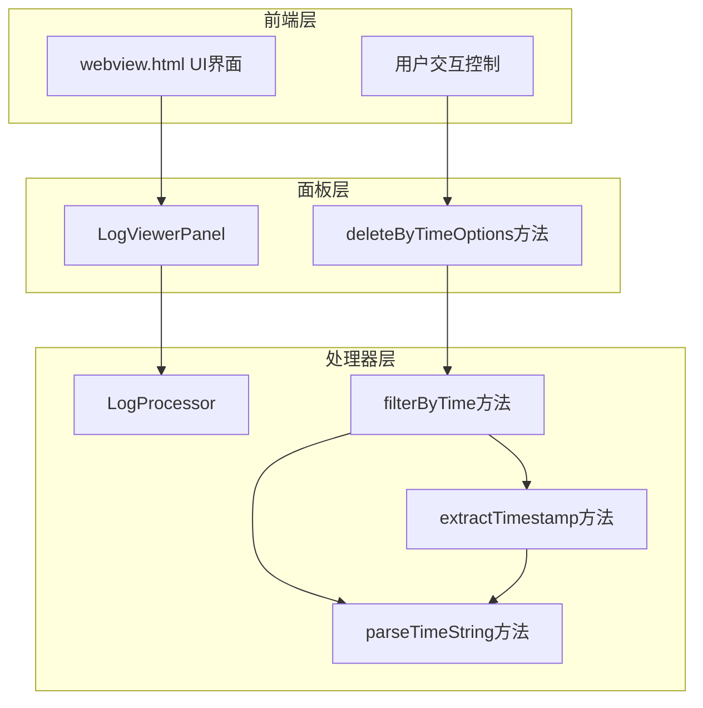

**图表来源**
- [logViewerPanel.ts](file://src/logViewerPanel.ts#L179-L228)
- [logProcessor.ts](file://src/logProcessor.ts#L177-L230)

**章节来源**
- [logViewerPanel.ts](file://src/logViewerPanel.ts#L179-L228)
- [logProcessor.ts](file://src/logProcessor.ts#L177-L230)

## 时间提取机制

### extractTimestamp方法实现

`extractTimestamp`方法是时间过滤功能的核心，负责从日志行中提取时间戳：

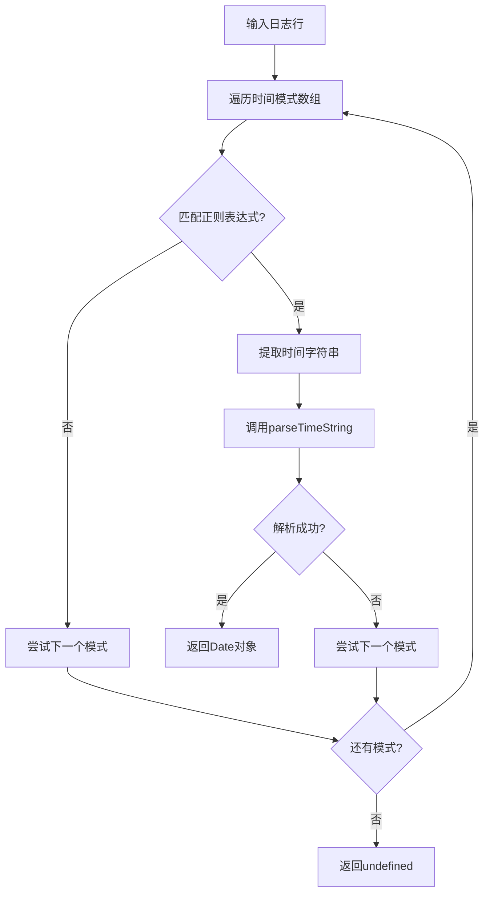

**图表来源**
- [logProcessor.ts](file://src/logProcessor.ts#L479-L492)

### 支持的时间格式

系统支持多种常见的时间格式：

| 格式类型 | 正则表达式 | 示例 |
|---------|-----------|------|
| 标准格式 | `\d{4}-\d{2}-\d{2}\s+\d{2}:\d{2}:\d{2}` | `2024-01-01 12:00:00` |
| 斜杠格式 | `\d{4}\/\d{2}\/\d{2}\s+\d{2}:\d{2}:\d{2}` | `2024/01/01 12:00:00` |
| 方括号格式 | `\[\d{4}-\d{2}-\d{2}\s+\d{2}:\d{2}:\d{2}\]` | `[2024-01-01 12:00:00]` |
| 点格式 | `\d{4}-\d{2}-\d{2}T\d{2}:\d{2}:\d{2}` | `2024-01-01T12:00:00` |
| 短日期格式 | `\d{2}-\d{2}-\d{4}\s+\d{2}:\d{2}:\d{2}` | `01-01-2024 12:00:00` |

**章节来源**
- [logProcessor.ts](file://src/logProcessor.ts#L35-L46)
- [logProcessor.ts](file://src/logProcessor.ts#L479-L492)

### parseTimeString方法

该方法负责将时间字符串转换为JavaScript Date对象：

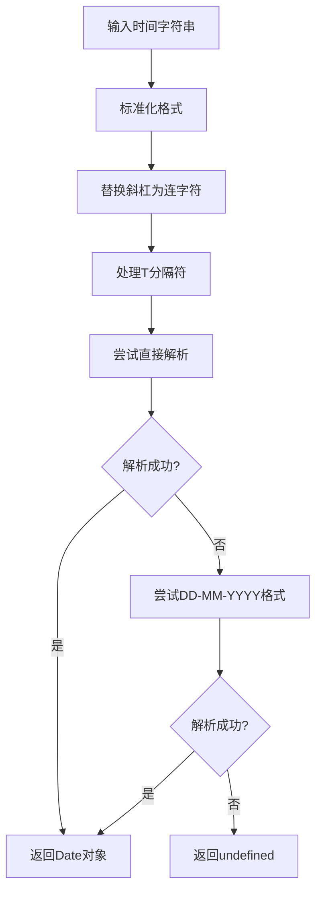

**图表来源**
- [logProcessor.ts](file://src/logProcessor.ts#L774-L800)

**章节来源**
- [logProcessor.ts](file://src/logProcessor.ts#L774-L800)

## 时间过滤算法

### filterByTime方法核心逻辑

`filterByTime`方法实现了精确的时间范围过滤：

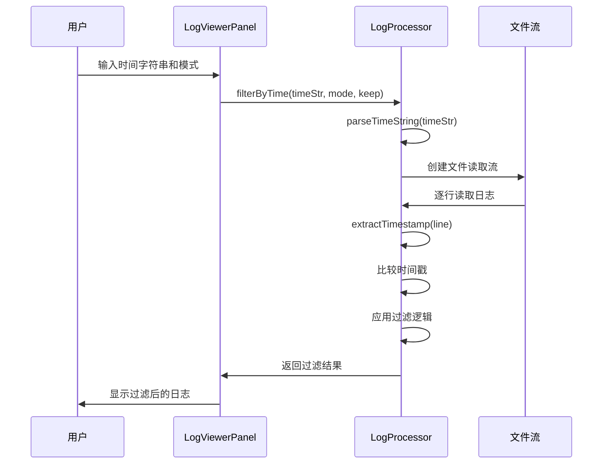

**图表来源**
- [logProcessor.ts](file://src/logProcessor.ts#L177-L230)
- [logViewerPanel.ts](file://src/logViewerPanel.ts#L179-L228)

### 过滤逻辑详解

过滤逻辑根据`mode`和`keep`参数的不同组合实现：

| 模式 | keep值 | 过滤条件 | 说明 |
|-----|--------|----------|------|
| before | true | `timestamp >= targetTime` | 保留指定时间及之后的日志 |
| before | false | `timestamp < targetTime` | 保留指定时间之前的日志 |
| after | true | `timestamp <= targetTime` | 保留指定时间之前的日志 |
| after | false | `timestamp > targetTime` | 保留指定时间及之后的日志 |

**章节来源**
- [logProcessor.ts](file://src/logProcessor.ts#L177-L230)

## 前端UI设计

### 时间过滤弹窗结构

webview.html中的时间过滤UI采用模态对话框设计：

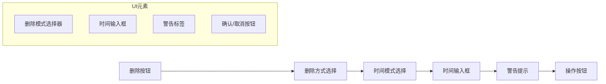

**图表来源**
- [webview.html](file://src/webview.html#L790-L816)

### 时间输入验证

前端对时间输入进行基本验证：

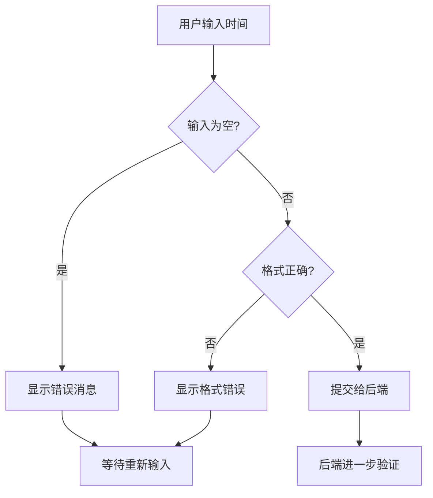

**图表来源**
- [webview.html](file://src/webview.html#L804-L806)

**章节来源**
- [webview.html](file://src/webview.html#L790-L816)

## 操作选项处理

### deleteByTimeOptions方法

该方法处理用户选择的操作类型：

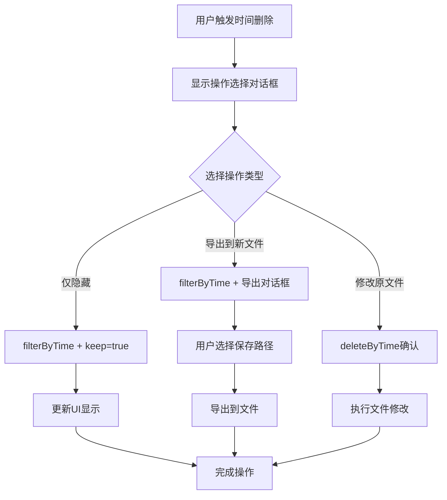

**图表来源**
- [logViewerPanel.ts](file://src/logViewerPanel.ts#L179-L228)

### 三种操作模式详解

| 操作模式 | 实现方式 | 影响范围 | 安全级别 |
|---------|----------|----------|----------|
| 仅隐藏 | `filterByTime(timeStr, mode, true)` | 仅前端显示 | 高 |
| 导出到新文件 | `filterByTime(timeStr, mode, true)` + `exportLogs()` | 新文件 | 高 |
| 修改原文件 | `deleteByTime(timeStr, mode)` | 原文件 | 中等 |

**章节来源**
- [logViewerPanel.ts](file://src/logViewerPanel.ts#L179-L228)

## 性能优化策略

### 流式处理大文件

系统采用流式读取技术处理大文件：

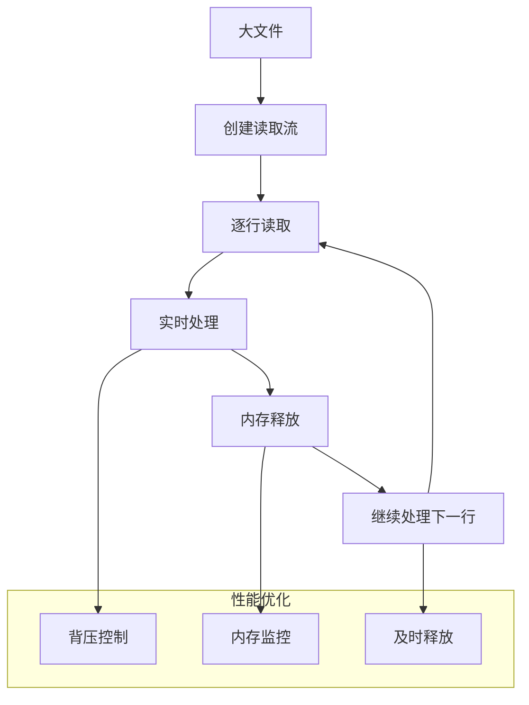

**图表来源**
- [logProcessor.ts](file://src/logProcessor.ts#L177-L230)

### 时间戳缓存机制

对于重复的时间戳提取，系统实现了智能缓存：

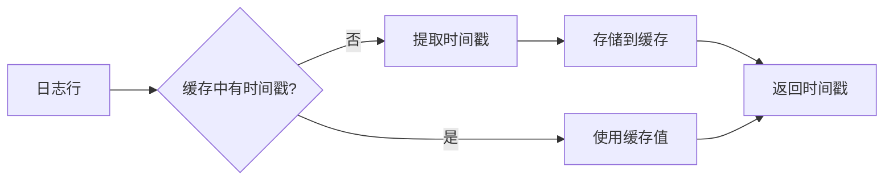

**章节来源**
- [logProcessor.ts](file://src/logProcessor.ts#L177-L230)

## 安全考虑

### 原文件修改风险

修改原文件的操作具有不可逆性，系统提供了多重保护：

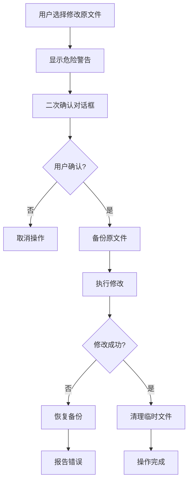

**图表来源**
- [logViewerPanel.ts](file://src/logViewerPanel.ts#L280-L298)

### 数据完整性保护

系统在文件修改过程中实施以下保护措施：

| 保护措施 | 实现方式 | 目的 |
|---------|----------|------|
| 临时文件 | 使用`.tmp`后缀 | 避免数据丢失 |
| 原子操作 | 写入完成后才删除原文件 | 确保操作原子性 |
| 错误回滚 | 异常时删除临时文件 | 保护原始数据 |
| 大小校验 | 修改前后文件大小对比 | 验证修改完整性 |

**章节来源**
- [logProcessor.ts](file://src/logProcessor.ts#L339-L408)

## 使用示例

### 基本时间过滤流程

以下是典型的时间过滤使用场景：

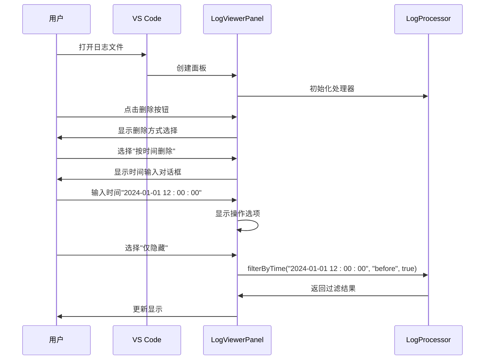

**图表来源**
- [extension.ts](file://src/extension.ts#L34-L70)
- [logViewerPanel.ts](file://src/logViewerPanel.ts#L179-L228)

### 高级时间过滤配置

系统支持复杂的过滤配置：

| 配置项 | 说明 | 示例值 |
|-------|------|--------|
| 时间格式 | 支持多种格式 | `2024-01-01 12:00:00`, `2024/01/01`, `2024-01-01T12:00:00` |
| 过滤模式 | before/after | `before`: 删除之前的时间 |
| 保留策略 | keep=true/false | `true`: 保留匹配项 |
| 文件大小 | 支持GB级别文件 | 自动检测文件大小 |

**章节来源**
- [extension.ts](file://src/extension.ts#L34-L70)

## 故障排除

### 常见问题及解决方案

| 问题类型 | 症状 | 可能原因 | 解决方案 |
|---------|------|----------|----------|
| 时间解析失败 | "无法解析时间格式"错误 | 时间格式不正确 | 检查时间格式是否符合要求 |
| 大文件处理缓慢 | 界面卡顿 | 文件过大 | 系统自动采用流式处理 |
| 过滤结果为空 | 显示"未找到匹配的日志" | 时间范围设置不当 | 调整时间范围或检查日志内容 |
| 原文件修改失败 | 操作中断 | 权限不足或文件被占用 | 检查文件权限和关闭相关程序 |

### 调试信息输出

系统在关键步骤输出调试信息：

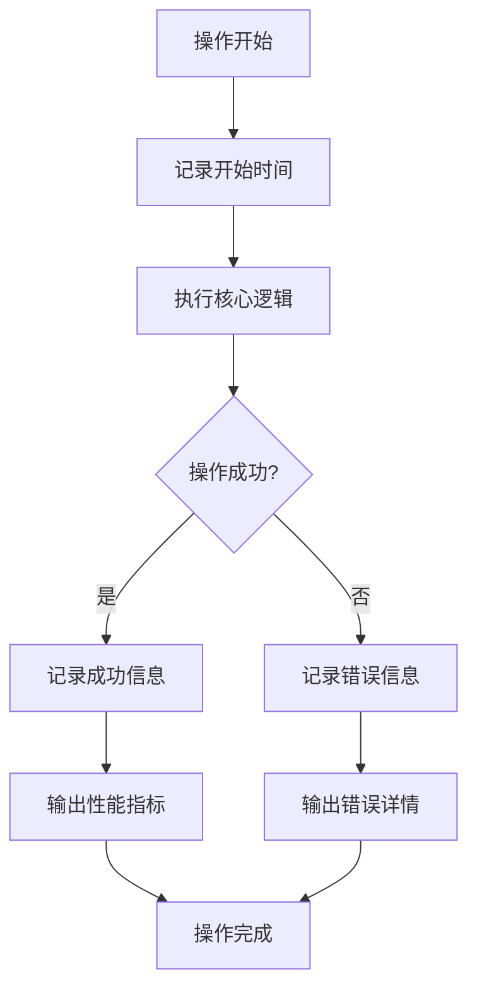

**章节来源**
- [logProcessor.ts](file://src/logProcessor.ts#L177-L230)
- [logViewerPanel.ts](file://src/logViewerPanel.ts#L179-L228)

## 结论

large_log_check的时间范围过滤功能通过精心设计的架构和优化策略，实现了高效、可靠的大文件时间过滤能力。该功能不仅提供了灵活的过滤选项，还通过多重安全保护确保用户数据的安全性。系统采用流式处理技术，能够处理任意大小的日志文件，同时保持良好的用户体验。