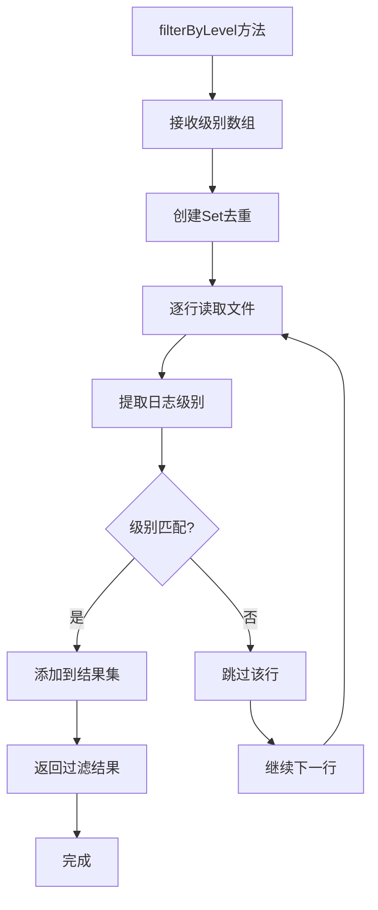
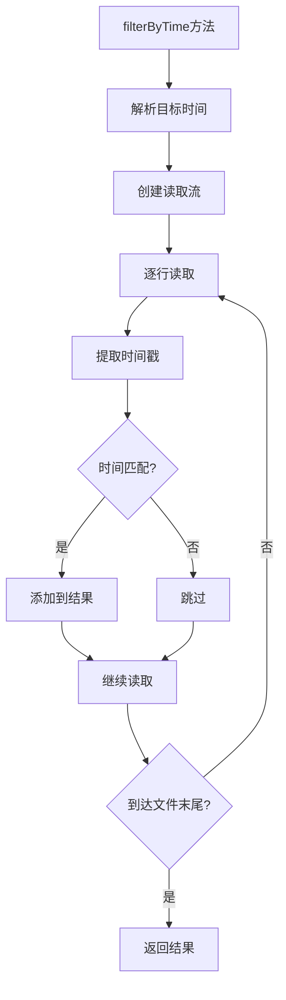
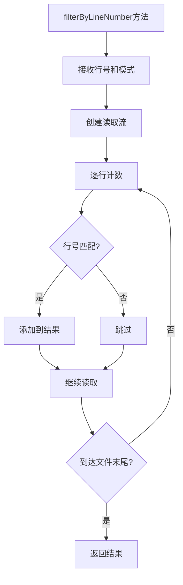
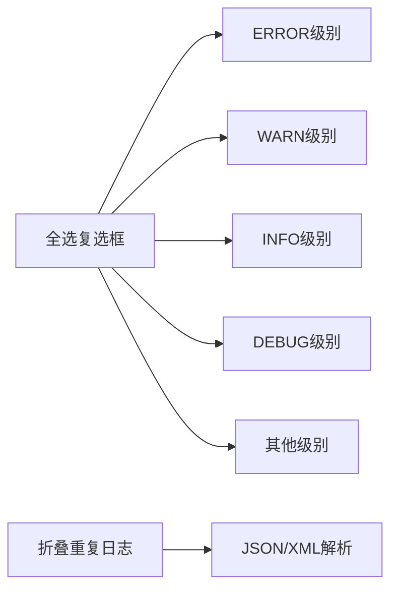
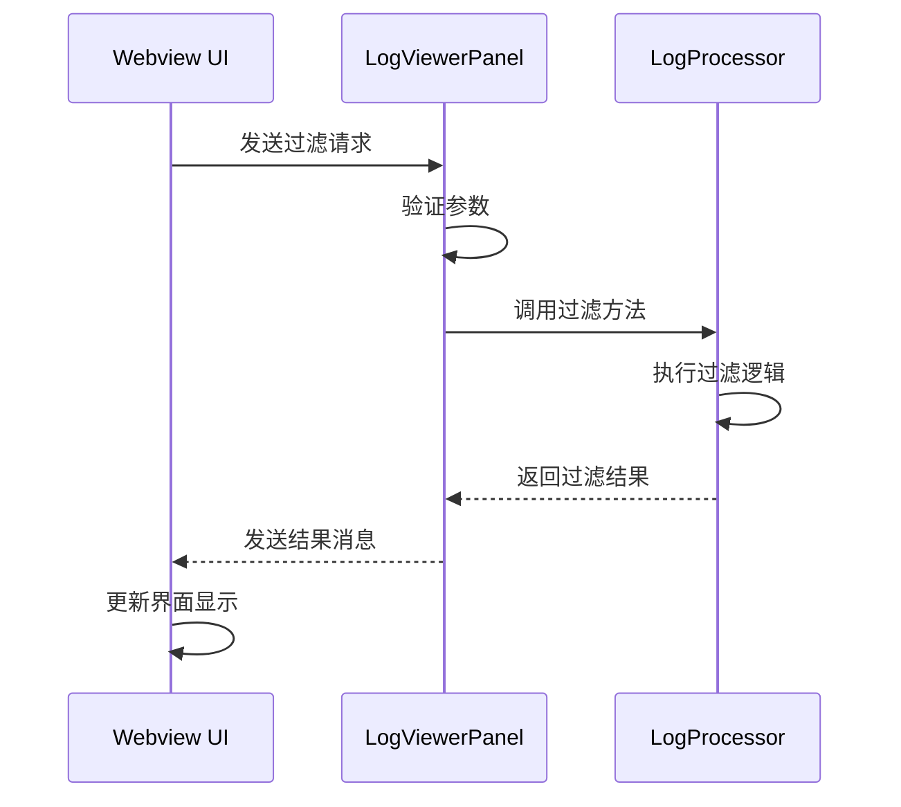
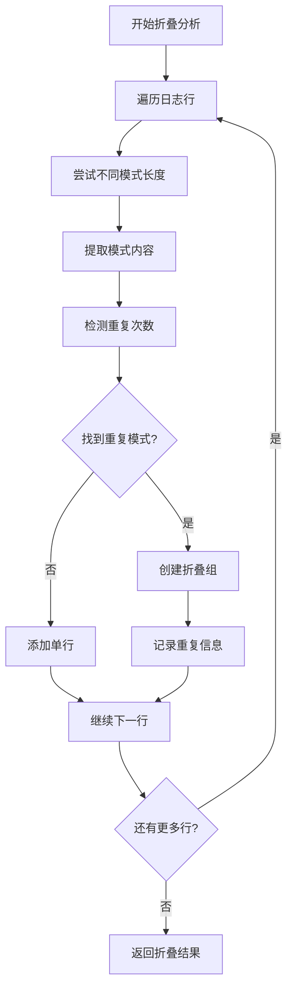
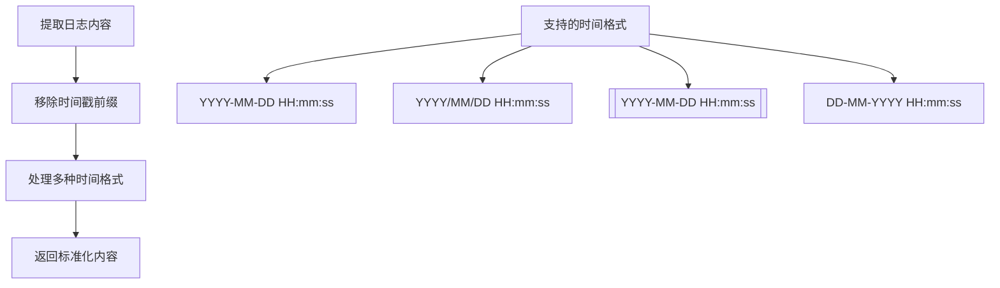
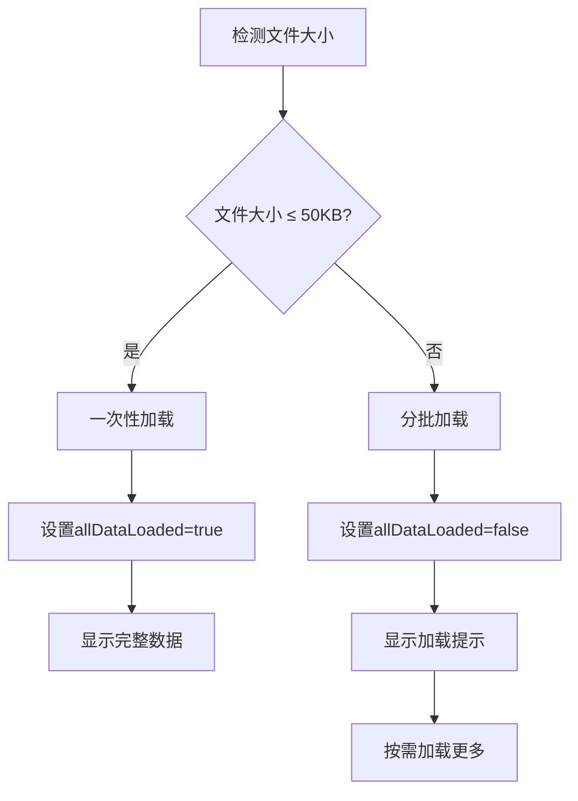

# 过滤功能

<cite>
**本文档引用的文件**
- [logProcessor.ts](file://src/logProcessor.ts)
- [logViewerPanel.ts](file://src/logViewerPanel.ts)
- [webview.html](file://src/webview.html)
- [extension.ts](file://src/extension.ts)
</cite>

## 目录
1. [简介](#简介)
2. [项目架构概览](#项目架构概览)
3. [核心过滤组件](#核心过滤组件)
4. [多维度过滤能力](#多维度过滤能力)
5. [UI过滤面板设计](#ui过滤面板设计)
6. [消息通信机制](#消息通信机制)
7. [折叠重复日志算法](#折叠重复日志算法)
8. [性能优化考虑](#性能优化考虑)
9. [总结](#总结)

## 简介

large_log_check是一个强大的VS Code扩展，专门用于处理大型日志文件。其过滤功能提供了多维度的筛选能力，支持按日志级别、时间范围、行号范围等多种方式进行精确过滤，同时具备智能的重复日志折叠功能，显著提升大文件的浏览效率。

## 项目架构概览

该扩展采用分层架构设计，主要包含以下核心模块：

```mermaid
graph TB
subgraph "前端界面层"
A[webview.html - UI界面]
B[logViewerPanel.ts - WebView面板管理]
end
subgraph "业务逻辑层"
C[LogProcessor.ts - 日志处理器]
end
subgraph "数据层"
D[日志文件 - 原始数据源]
end
A --> B
B --> C
C --> D
B < --> C
```

**图表来源**
- [logViewerPanel.ts](file://src/logViewerPanel.ts#L1-L50)
- [logProcessor.ts](file://src/logProcessor.ts#L1-L50)

**章节来源**
- [logViewerPanel.ts](file://src/logViewerPanel.ts#L1-L100)
- [logProcessor.ts](file://src/logProcessor.ts#L1-L100)

## 核心过滤组件

### LogProcessor类的核心过滤方法

LogProcessor类是过滤功能的核心实现，提供了多种过滤方法：

#### 日志级别过滤器


**图表来源**
- [logProcessor.ts](file://src/logProcessor.ts#L649-L699)

#### 时间范围过滤器


**图表来源**
- [logProcessor.ts](file://src/logProcessor.ts#L177-L230)

#### 行号范围过滤器


**图表来源**
- [logProcessor.ts](file://src/logProcessor.ts#L289-L334)

**章节来源**
- [logProcessor.ts](file://src/logProcessor.ts#L649-L807)

## 多维度过滤能力

### 日志级别过滤

系统支持四种主要的日志级别过滤：

| 日志级别 | 颜色标识 | 匹配模式 | 用途 |
|---------|---------|---------|------|
| ERROR | 🔴红色 | ERROR, FATAL, SEVERE | 系统严重错误 |
| WARN | 🟠黄色 | WARN, WARNING | 警告信息 |
| INFO | 🔵蓝色 | INFO, INFORMATION | 一般信息 |
| DEBUG | 🟣紫色 | DEBUG, TRACE, VERBOSE | 调试信息 |

### 时间范围过滤

支持灵活的时间范围过滤：
- **before模式**：保留指定时间及之后的日志
- **after模式**：保留指定时间之前的日志
- 支持多种时间格式：`YYYY-MM-DD HH:mm:ss`、`YYYY/MM/DD HH:mm:ss`等

### 行号范围过滤

提供精确的行号范围控制：
- **before模式**：保留指定行及之后的日志
- **after模式**：保留指定行之前的所有日志

**章节来源**
- [logProcessor.ts](file://src/logProcessor.ts#L48-L60)
- [logProcessor.ts](file://src/logProcessor.ts#L177-L334)

## UI过滤面板设计

### 过滤面板布局

webview.html中的过滤面板采用简洁直观的设计：



**图表来源**
- [webview.html](file://src/webview.html#L693-L729)

### 复选框组设计

过滤面板包含以下关键元素：

1. **全选控制**：智能的三态复选框，支持全选、全不选和部分选中状态
2. **级别选择**：独立的日志级别复选框
3. **高级选项**：折叠重复日志和JSON/XML解析开关

### 折叠重复日志开关

该功能位于过滤面板右侧，当启用时：
- 自动检测连续重复的日志行
- 智能识别重复模式（支持1-10行的重复模式）
- 提供展开/折叠交互体验

**章节来源**
- [webview.html](file://src/webview.html#L693-L729)

## 消息通信机制

### WebView与Extension的消息传递



**图表来源**
- [logViewerPanel.ts](file://src/logViewerPanel.ts#L54-L98)
- [webview.html](file://src/webview.html#L1189-L1215)

### 关键消息处理

LogViewerPanel负责处理以下关键消息：

| 消息类型 | 功能 | 参数 |
|---------|------|------|
| filterByLevel | 按级别过滤 | levels: string[] |
| filterResults | 处理过滤结果 | results: LogLine[] |
| refresh | 刷新显示 | 无 |
| showMessage | 显示消息 | type, message |

**章节来源**
- [logViewerPanel.ts](file://src/logViewerPanel.ts#L54-L98)
- [logViewerPanel.ts](file://src/logViewerPanel.ts#L409-L427)

## 折叠重复日志算法

### 核心算法流程

折叠重复日志功能实现了智能的重复检测算法：



**图表来源**
- [webview.html](file://src/webview.html#L1566-L1648)

### 智能重复检测

算法的核心特性：

1. **多模式长度检测**：支持1-10行的重复模式
2. **内容标准化**：通过`extractLogContent`方法去除时间戳干扰
3. **最佳模式选择**：选择重复次数最多的模式
4. **交互式展开**：支持点击展开/折叠重复组

### 内容提取算法



**图表来源**
- [webview.html](file://src/webview.html#L1542-L1563)

**章节来源**
- [webview.html](file://src/webview.html#L1566-L1648)

## 性能优化考虑

### 过滤操作的非破坏性

重要的设计原则是过滤操作不会修改原文件：

1. **纯读取操作**：所有过滤方法都采用流式读取，不修改源文件
2. **内存友好**：支持大文件的分块处理和懒加载
3. **状态隔离**：过滤状态与原始数据完全分离

### 大文件处理策略



**图表来源**
- [logViewerPanel.ts](file://src/logViewerPanel.ts#L118-L128)

### 折叠模式的性能优化

折叠重复日志功能采用了多项性能优化措施：

1. **智能加载**：根据显示需求动态调整加载数量
2. **缓存机制**：记录页面范围，避免重复计算
3. **异步计算**：使用`calculateAllPagesAsync`进行后台计算
4. **渐进式处理**：分批次处理大量数据，保持界面响应

### 内存管理

- **及时清理**：切换过滤模式时清空页面范围记录
- **状态同步**：维护折叠组展开状态的一致性
- **垃圾回收**：合理释放不再使用的数据结构

**章节来源**
- [logViewerPanel.ts](file://src/logViewerPanel.ts#L118-L147)
- [webview.html](file://src/webview.html#L1830-L1847)

## 总结

large_log_check的过滤功能展现了现代日志分析工具的设计精髓：

### 核心优势

1. **多维度过滤**：支持级别、时间、行号等多种过滤条件
2. **智能重复检测**：自动识别并折叠连续重复的日志行
3. **非破坏性操作**：所有过滤操作都不会修改原始日志文件
4. **高性能设计**：针对大文件优化，支持流式处理和智能加载
5. **用户友好**：直观的UI设计和丰富的交互功能

### 技术亮点

- **分层架构**：清晰的职责分离，便于维护和扩展
- **异步处理**：充分利用Promise和async/await提升用户体验
- **算法优化**：智能的重复检测算法，支持多种模式识别
- **状态管理**：完善的UI状态同步机制

该过滤功能不仅满足了日常日志分析的需求，更为处理超大文件场景提供了可靠的解决方案，是VS Code生态系统中日志分析工具的重要补充。