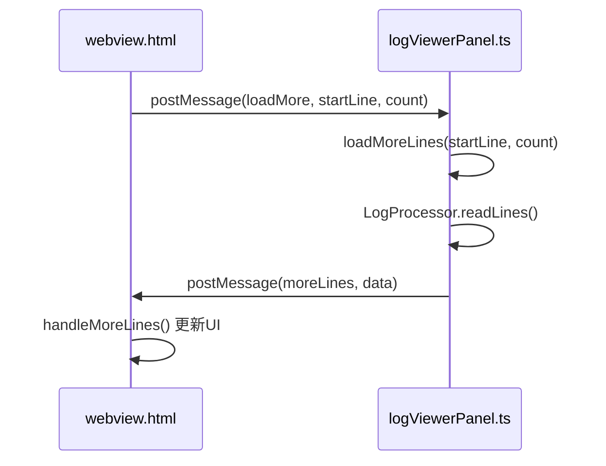

# 前端触发机制

<cite>
**本文档引用的文件**  
- [webview.html](file://src/webview.html)
- [logViewerPanel.ts](file://src/logViewerPanel.ts)
</cite>

## 目录
1. [简介](#简介)
2. [滚动事件监听与懒加载机制](#滚动事件监听与懒加载机制)
3. [滚动阈值计算方式](#滚动阈值计算方式)
4. [防抖节流与性能优化](#防抖节流与性能优化)
5. [loadMore消息结构与postMessage通信](#loadmore消息结构与postmessage通信)
6. [前端与后端协同工作流程](#前端与后端协同工作流程)
7. [总结](#总结)

## 简介

`large_log_check` 扩展通过高效的前端懒加载机制，实现了对大型日志文件的流畅浏览体验。当用户滚动至日志容器底部时，系统会自动检测滚动位置并触发 `loadMore` 消息，从而按需加载更多日志行。该机制结合了精确的滚动阈值计算、防抖节流策略以及前后端协同处理，确保在不阻塞UI的前提下实现高性能的数据加载。

本文档将深入分析 `webview.html` 中的滚动事件监听器实现逻辑，重点阐述 `loadMore` 消息的触发条件、数据结构及与后端 `logViewerPanel.ts` 的协同工作机制。

**Section sources**
- [webview.html](file://src/webview.html#L1188-L1215)
- [logViewerPanel.ts](file://src/logViewerPanel.ts#L54-L101)

## 滚动事件监听与懒加载机制

前端通过 `window.addEventListener('message', ...)` 监听来自后端的消息，并在每次页面渲染或状态更新时调用 `checkAndLoadMore()` 函数来判断是否需要加载更多数据。

当用户滚动操作导致当前页接近已加载数据末尾时（即当前页最大行号 ≥ 已加载行数 - 500），系统将调用 `loadMoreData()` 函数，通过 `vscode.postMessage()` 向后端发送 `loadMore` 命令。此机制避免了传统滚动监听可能带来的频繁请求问题，而是基于分页逻辑和数据加载状态进行智能判断。

**Section sources**
- [webview.html](file://src/webview.html#L3197-L3214)
- [webview.html](file://src/webview.html#L3216-L3228)

## 滚动阈值计算方式

系统并未直接监听 `scroll` 事件，而是通过分页机制间接实现“滚动到底部”的检测。其核心逻辑如下：

- **当前最大行号**：`currentMaxLine = currentPage * pageSize`
- **加载条件**：`currentMaxLine >= loadedLines - 500`

其中：
- `currentPage` 为当前显示页码
- `pageSize` 为每页显示行数（可配置）
- `loadedLines` 为当前已加载的总行数

当用户翻页至接近数据末尾的页面时，系统自动触发加载。这种基于分页状态的判断方式比实时监听滚动位置更稳定，且能有效减少不必要的计算开销。

此外，系统还提供了手动加载按钮（“加载更多数据”），允许用户一次性加载剩余所有数据，满足不同使用场景需求。

**Section sources**
- [webview.html](file://src/webview.html#L3208-L3212)
- [webview.html](file://src/webview.html#L3259-L3263)

## 防抖节流与性能优化

该机制天然具备防抖节流特性，原因在于：

1. **非实时监听**：不依赖 `scroll` 事件，避免了高频触发。
2. **分页驱动**：仅在调用 `updatePagination()` 或翻页时检查加载条件，降低了检查频率。
3. **批量加载**：每次请求加载 10,000 行，减少通信次数。
4. **加载锁机制**：通过 `allDataLoaded` 标志防止重复请求。

这些设计共同构成了一个高效的节流策略，确保即使用户快速翻页或滚动，也不会导致过多的后端请求，从而保障系统响应速度和用户体验。

**Section sources**
- [webview.html](file://src/webview.html#L3198-L3205)
- [webview.html](file://src/webview.html#L3217-L3222)

## loadMore消息结构与postMessage通信

前端通过 `vscode.postMessage()` 发送 `loadMore` 消息，其数据结构如下：

```json
{
  "command": "loadMore",
  "startLine": 当前已加载的行数,
  "count": 需要加载的行数
}
```

具体实现中：
- `startLine` 取值为 `allLines.length`，即从当前已加载数据的末尾开始
- `count` 取值为 `Math.min(remaining, 10000)`，即剩余行数与 10,000 的较小值，限制单次加载量

该消息通过 WebView 的消息通道传递给后端 `LogViewerPanel` 实例，触发相应的日志读取操作。

**Section sources**
- [webview.html](file://src/webview.html#L3223-L3227)
- [logViewerPanel.ts](file://src/logViewerPanel.ts#L57-L59)

## 前端与后端协同工作流程

前端 `loadMore` 触发机制与后端 `logViewerPanel.ts` 紧密协作，形成完整的懒加载闭环：

1. **前端触发**：`checkAndLoadMore()` 判断需加载更多数据，调用 `loadMoreData()` 发送 `loadMore` 消息。
2. **后端接收**：`logViewerPanel` 中的 `onDidReceiveMessage` 监听器捕获 `loadMore` 命令。
3. **后端处理**：调用 `loadMoreLines(startLine, count)` 方法，通过 `LogProcessor` 读取指定范围的日志行。
4. **后端响应**：使用 `postMessage` 发送 `moreLines` 消息，携带新加载的数据。
5. **前端更新**：前端接收到 `moreLines` 消息后，调用 `handleMoreLines()` 更新 `allLines` 数组并重新渲染视图。

此流程实现了前后端职责分离：前端负责 UI 交互与加载时机判断，后端负责文件 I/O 与数据处理，确保主线程不被阻塞。



**Diagram sources**
- [webview.html](file://src/webview.html#L3223-L3227)
- [logViewerPanel.ts](file://src/logViewerPanel.ts#L57-L59)

**Section sources**
- [webview.html](file://src/webview.html#L1196-L1197)
- [logViewerPanel.ts](file://src/logViewerPanel.ts#L150-L159)

## 总结

`large_log_check` 扩展的前端懒加载触发机制通过巧妙的设计实现了高性能与良好用户体验的平衡。它利用分页状态替代实时滚动监听，结合阈值判断与批量加载策略，有效减少了后端请求频率。通过 `postMessage` 机制与后端 `logViewerPanel` 协同工作，实现了数据的按需加载与动态更新。整个流程清晰、高效，是处理大型日志文件浏览场景的优秀实践。