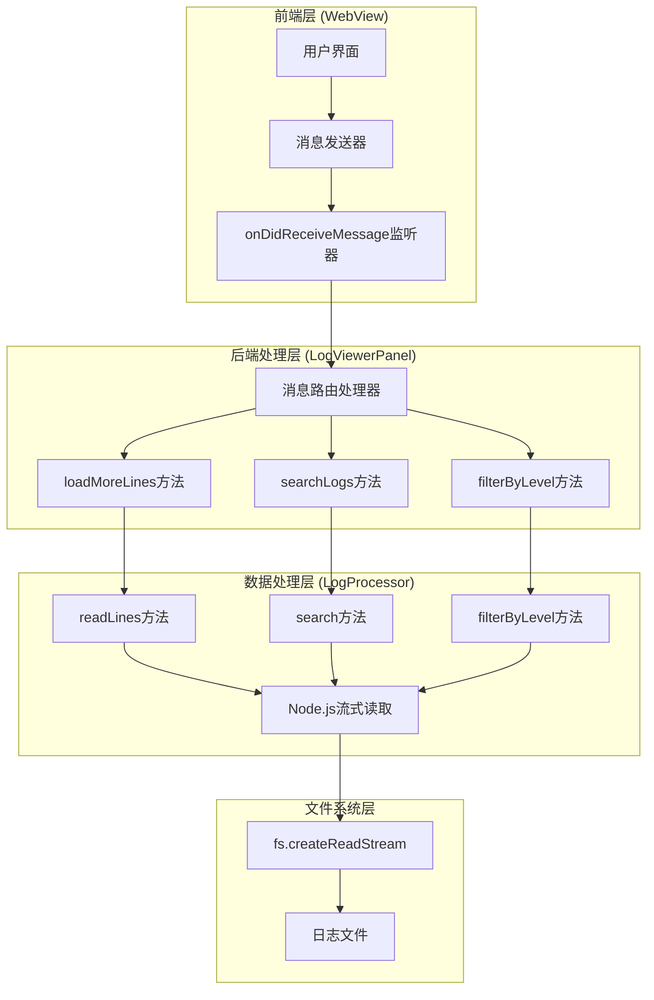
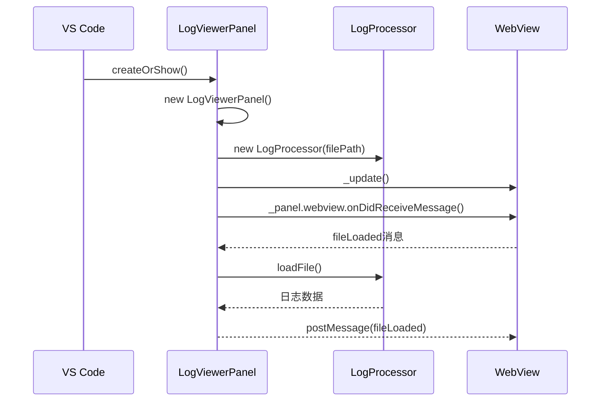
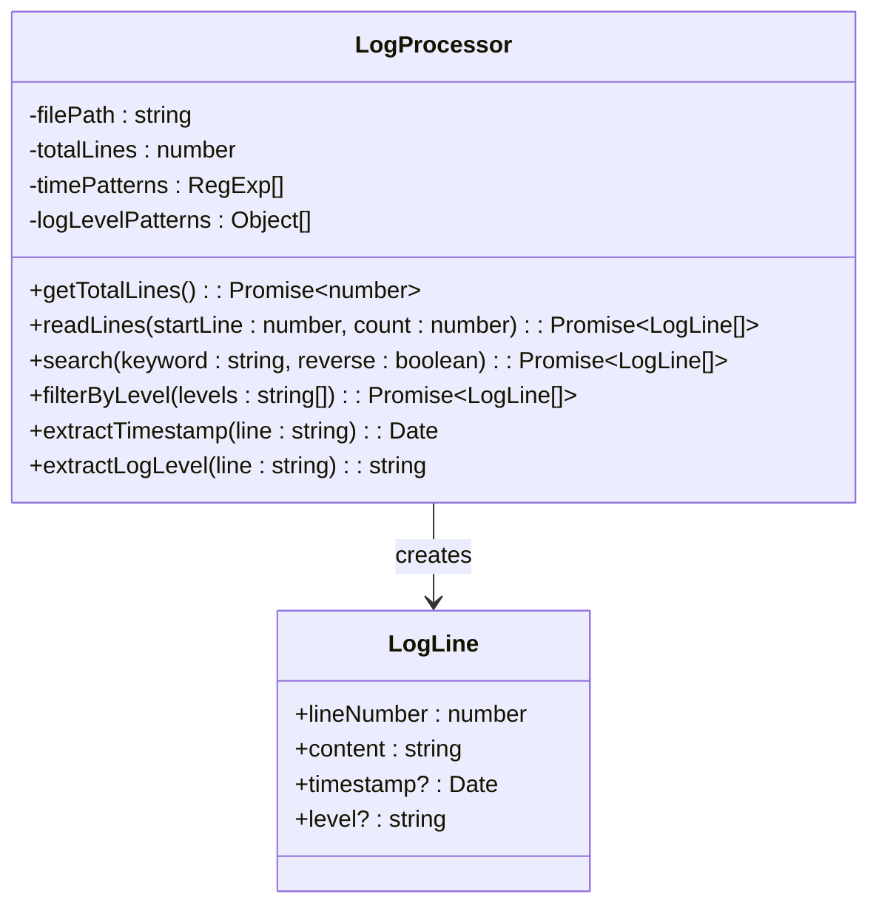
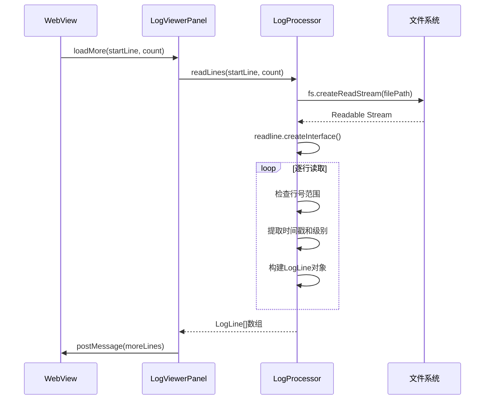
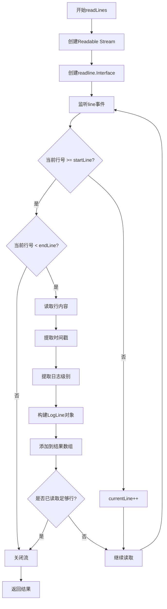
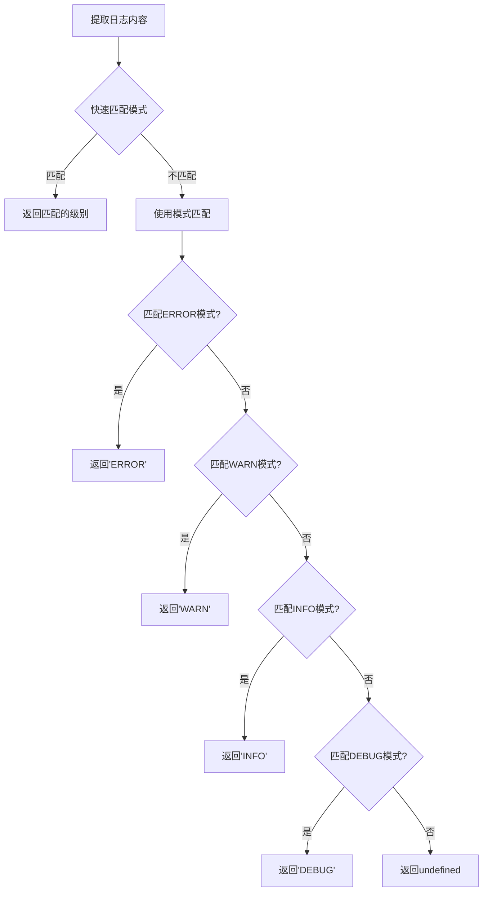
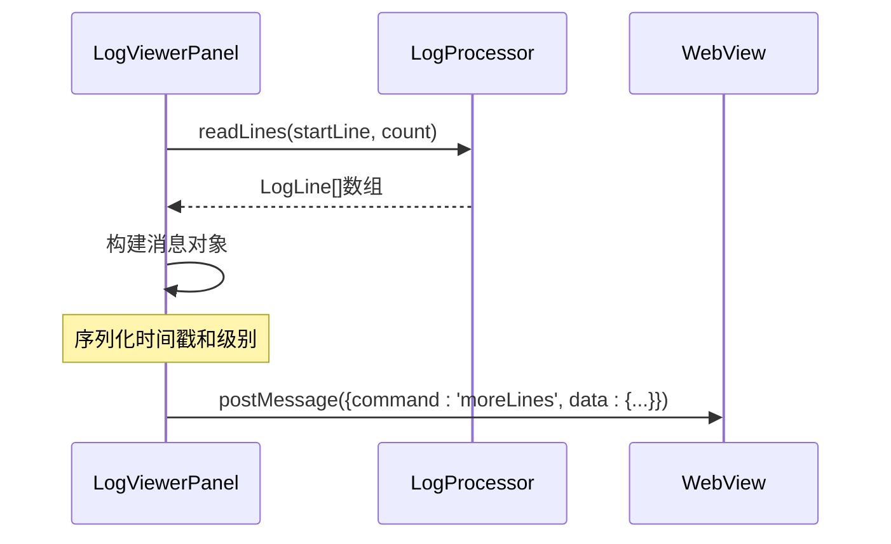
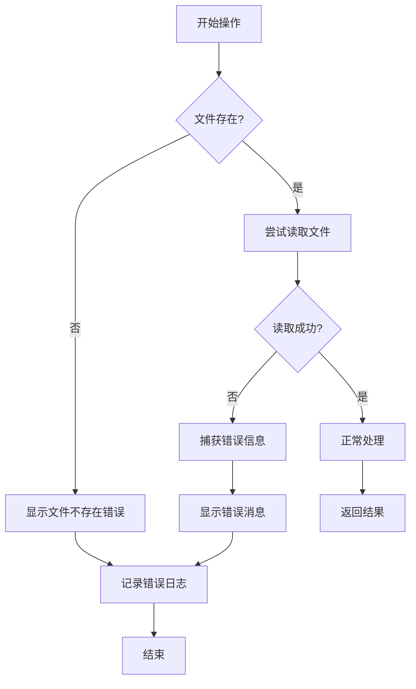
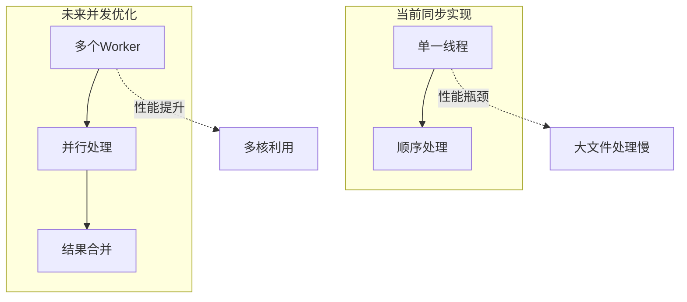

# 后端处理流程

<cite>
**本文档引用的文件**
- [logViewerPanel.ts](file://src/logViewerPanel.ts)
- [logProcessor.ts](file://src/logProcessor.ts)
- [extension.ts](file://src/extension.ts)
- [webview.html](file://src/webview.html)
</cite>

## 目录
1. [概述](#概述)
2. [架构概览](#架构概览)
3. [核心组件分析](#核心组件分析)
4. [懒加载机制详解](#懒加载机制详解)
5. [数据处理流程](#数据处理流程)
6. [错误处理机制](#错误处理机制)
7. [性能优化策略](#性能优化策略)
8. [总结](#总结)

## 概述

large_log_check扩展是一个专为VS Code设计的大日志文件查看器，采用前后端分离的架构，通过懒加载技术实现对超大日志文件的高效处理。后端处理流程主要由`LogViewerPanel`类负责，它通过监听来自WebView的消息，调用`LogProcessor`类执行具体的日志读取和处理操作。

## 架构概览



**图表来源**
- [logViewerPanel.ts](file://src/logViewerPanel.ts#L54-L98)
- [logProcessor.ts](file://src/logProcessor.ts#L90-L130)

## 核心组件分析

### LogViewerPanel类

`LogViewerPanel`是整个后端处理流程的核心控制器，负责协调前端与后端的数据交互。

#### 实例化与初始化



**图表来源**
- [logViewerPanel.ts](file://src/logViewerPanel.ts#L14-L45)
- [logViewerPanel.ts](file://src/logViewerPanel.ts#L107-L147)

#### _logProcessor实例管理

`LogViewerPanel`类维护着一个`_logProcessor`实例，该实例负责具体的日志处理操作：

- **创建时机**: 在面板初始化时创建，或在文件切换时重新创建
- **生命周期**: 随面板生命周期变化，面板销毁时自动清理
- **职责范围**: 负责所有与日志文件读取、解析和处理相关的操作

**章节来源**
- [logViewerPanel.ts](file://src/logViewerPanel.ts#L45-L109)

### LogProcessor类

`LogProcessor`是真正的数据处理引擎，实现了高效的日志文件读取和解析功能。

#### 主要数据结构



**图表来源**
- [logProcessor.ts](file://src/logProcessor.ts#L30-L110)
- [logProcessor.ts](file://src/logProcessor.ts#L4-L10)

**章节来源**
- [logProcessor.ts](file://src/logProcessor.ts#L30-L807)

## 懒加载机制详解

### loadMore消息处理流程

当用户滚动到日志容器底部时，WebView会发送`loadMore`消息，触发后端的懒加载处理：



**图表来源**
- [logViewerPanel.ts](file://src/logViewerPanel.ts#L150-L162)
- [logProcessor.ts](file://src/logProcessor.ts#L90-L130)

### readLines方法实现细节

`readLines`方法是懒加载机制的核心，其实现采用了Node.js流式读取技术：

#### 流式读取机制



**图表来源**
- [logProcessor.ts](file://src/logProcessor.ts#L90-L130)

#### 关键技术特性

1. **内存效率**: 使用流式读取，避免一次性加载整个文件到内存
2. **精确控制**: 通过`startLine`和`count`参数精确控制读取范围
3. **及时释放**: 读取到指定行数后立即关闭流，释放资源
4. **错误处理**: 完善的错误捕获和处理机制

**章节来源**
- [logProcessor.ts](file://src/logProcessor.ts#L90-L130)

### 文件大小检测与加载策略

系统根据文件大小自动选择最优的加载策略：

```mermaid
flowchart TD
A[检测文件大小] --> B{总行数 <= 50000?}
B --> |是| C[一次性加载所有行]
B --> |否| D[先加载前10000行]
C --> E[设置allLoaded=true]
D --> F[设置allLoaded=false]
E --> G[发送fileLoaded消息]
F --> H[显示"加载更多"提示]
H --> G
```

**图表来源**
- [logViewerPanel.ts](file://src/logViewerPanel.ts#L119-L128)

**章节来源**
- [logViewerPanel.ts](file://src/logViewerPanel.ts#L107-L147)

## 数据处理流程

### 时间戳解析机制

`LogProcessor`实现了强大的时间戳解析功能，支持多种时间格式：

#### 时间戳匹配模式

| 格式类型 | 正则表达式 | 示例 |
|---------|-----------|------|
| 标准日期时间 | `\d{4}-\d{2}-\d{2}\s+\d{2}:\d{2}:\d{2}` | `2024-01-01 12:00:00` |
| 斜杠分隔 | `\d{4}\/\d{2}\/\d{2}\s+\d{2}:\d{2}:\d{2}` | `2024/01/01 12:00:00` |
| 方括号包裹 | `\[\\d{4}-\\d{2}-\\d{2}\s+\\d{2}:\\d{2}:\\d{2}\]` | `[2024-01-01 12:00:00]` |
| DD-MM-YYYY | `\d{2}-\d{2}-\d{4}\s+\d{2}:\d{2}:\d{2}` | `01-01-2024 12:00:00` |
| ISO 8601 | `\d{4}-\d{2}-\d{2}T\d{2}:\d{2}:\d{2}` | `2024-01-01T12:00:00` |

**章节来源**
- [logProcessor.ts](file://src/logProcessor.ts#L34-L46)

### 日志级别提取

系统实现了多层次的日志级别识别机制：



**图表来源**
- [logProcessor.ts](file://src/logProcessor.ts#L542-L561)

**章节来源**
- [logProcessor.ts](file://src/logProcessor.ts#L542-L561)

### 数据转换与序列化

后端处理的数据需要通过`postMessage`传递给前端，因此需要进行适当的序列化：



**图表来源**
- [logViewerPanel.ts](file://src/logViewerPanel.ts#L150-L162)

**章节来源**
- [logViewerPanel.ts](file://src/logViewerPanel.ts#L150-L162)

## 错误处理机制

### 文件读取失败处理

系统实现了完善的错误处理机制，确保在各种异常情况下都能提供友好的用户体验：

#### 错误处理流程



**图表来源**
- [logViewerPanel.ts](file://src/logViewerPanel.ts#L145-L147)
- [logViewerPanel.ts](file://src/logViewerPanel.ts#L160-L162)

#### 错误类型与处理策略

| 错误类型 | 处理策略 | 用户反馈 |
|---------|---------|---------|
| 文件不存在 | 显示文件不存在提示 | `加载文件失败: 文件不存在` |
| 权限不足 | 显示权限错误 | `加载文件失败: 权限不足` |
| 读取超时 | 显示加载超时 | `加载日志行失败: 读取超时` |
| 格式错误 | 显示格式不支持 | `解析失败: 不支持的文件格式` |

**章节来源**
- [logViewerPanel.ts](file://src/logViewerPanel.ts#L145-L147)
- [logViewerPanel.ts](file://src/logViewerPanel.ts#L160-L162)

### 异常恢复机制

系统提供了多种异常恢复机制：

1. **自动重试**: 对于临时性错误，系统会自动重试
2. **降级处理**: 当高级功能失败时，自动降级到基础功能
3. **状态重置**: 发生严重错误时，重置相关状态
4. **用户引导**: 提供清晰的错误信息和解决建议

## 性能优化策略

### 内存管理优化

#### 流式读取的优势

```mermaid
graph LR
subgraph "传统方式"
A[读取整个文件] --> B[加载到内存] --> C[处理所有数据]
end
subgraph "流式读取"
D[按需读取] --> E[边读边处理] --> F[及时释放]
end
A -.->|内存占用| G[O(N)]
D -.->|内存占用| H[O(1)]
```

**图表来源**
- [logProcessor.ts](file://src/logProcessor.ts#L96-L118)

#### 资源释放策略

1. **及时关闭流**: 读取到指定行数后立即关闭Readable Stream
2. **手动释放**: 通过`stream.destroy()`主动释放资源
3. **垃圾回收**: 避免长时间持有大量数据引用
4. **内存监控**: 定期检查内存使用情况

**章节来源**
- [logProcessor.ts](file://src/logProcessor.ts#L116-L118)

### 并发处理优化

虽然当前实现是同步的，但系统架构支持未来的并发优化：



### 缓存机制

系统实现了多层缓存机制来提升性能：

1. **行范围缓存**: 记录已加载的行范围，避免重复读取
2. **解析结果缓存**: 缓存时间戳和日志级别的解析结果
3. **统计信息缓存**: 缓存文件统计信息，减少重复计算

**章节来源**
- [logViewerPanel.ts](file://src/logViewerPanel.ts#L129-L130)

## 总结

large_log_check扩展的后端处理流程展现了现代日志分析工具的最佳实践：

### 核心优势

1. **高效性**: 通过流式读取和懒加载技术，能够处理超大文件而不影响性能
2. **可靠性**: 完善的错误处理和异常恢复机制确保系统稳定运行
3. **可扩展性**: 模块化的架构设计便于功能扩展和维护
4. **用户体验**: 智能的加载策略和友好的错误提示提升了用户满意度

### 技术亮点

- **Node.js流式处理**: 充分利用Node.js的流式I/O特性
- **正则表达式解析**: 强大的日志格式解析能力
- **内存管理**: 精确的资源管理和及时释放
- **错误处理**: 全面的异常处理和用户反馈机制

### 应用价值

该后端处理流程不仅解决了大日志文件处理的技术难题，更为类似项目提供了可借鉴的架构设计和实现方案。其模块化的设计思路、完善的错误处理机制和高效的性能优化策略，都值得在其他大型数据处理项目中推广应用。