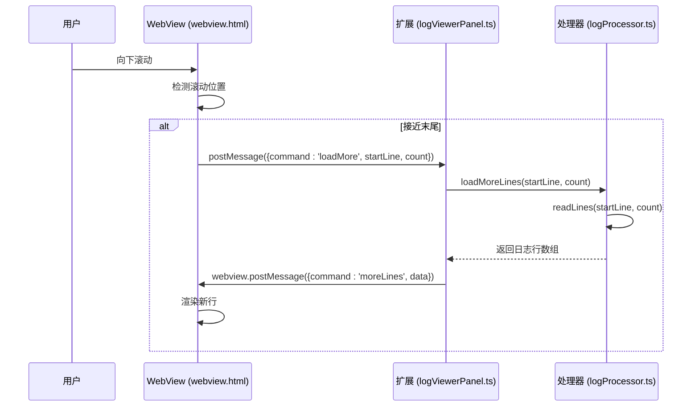

# 懒加载

<cite>
**本文档引用的文件**
- [webview.html](file://src/webview.html)
- [logViewerPanel.ts](file://src/logViewerPanel.ts)
- [logProcessor.ts](file://src/logProcessor.ts)
</cite>

## 目录
1. [简介](#简介)
2. [懒加载机制概述](#懒加载机制概述)
3. [数据流分析](#数据流分析)
4. [触发阈值与节流机制](#触发阈值与节流机制)
5. [错误处理机制](#错误处理机制)
6. [性能监控建议](#性能监控建议)

## 简介
本项目 `large_log_check` 是一个用于高效查看大日志文件的 Visual Studio Code 扩展。其核心功能之一是实现对大型日志文件的懒加载（Lazy Loading），以确保在浏览超大日志文件时仍能保持流畅的用户体验。本文档将详细解析该扩展中懒加载机制的工作原理，包括从用户滚动触发到数据返回渲染的完整流程，并阐述其性能优化策略。

## 懒加载机制概述
`large_log_check` 的懒加载机制旨在避免一次性加载整个大文件导致内存溢出或界面卡顿。当用户打开一个日志文件时，系统会根据文件大小决定初始加载策略：
- 若文件总行数不超过 50,000 行，则一次性加载全部内容。
- 若超过 50,000 行，则先加载前 10,000 行，后续内容按需加载。

这种策略确保了快速启动，同时为后续的按需加载奠定了基础。懒加载的核心思想是“按需加载”，即只有当用户滚动到接近已加载内容末尾时，才会触发新的数据请求。

**Section sources**
- [logViewerPanel.ts](file://src/logViewerPanel.ts#L119-L128)

## 数据流分析
懒加载的数据流涉及前端（WebView）与后端（VS Code 扩展）之间的双向通信，整个过程清晰且高效。

### 1. 前端触发：发送 `loadMore` 消息
当用户在日志查看器中向下滚动时，前端会持续监听滚动位置。一旦检测到当前可见的最后一行接近已加载数据的末尾（具体阈值为剩余不足 500 行时），便会自动触发 `loadMoreData()` 函数。该函数通过 `vscode.postMessage()` 向后端发送一条包含 `command: 'loadMore'` 的消息，同时附带两个关键参数：
- `startLine`: 下一批数据的起始行号（即当前已加载的总行数）。
- `count`: 请求加载的行数（默认为 10,000 行）。

此过程实现了用户无感知的自动加载，提升了交互的流畅性。



**Diagram sources**
- [webview.html](file://src/webview.html#L3211-L3227)
- [logViewerPanel.ts](file://src/logViewerPanel.ts#L57-L59)

### 2. 后端接收与处理：`logViewerPanel.ts` 与 `logProcessor.ts`
后端通过 `LogViewerPanel` 类中的 `onDidReceiveMessage` 事件监听器接收来自 WebView 的消息。当收到 `loadMore` 命令时，会调用 `loadMoreLines(startLine, count)` 方法。

该方法会进一步调用 `LogProcessor` 实例的 `readLines(startLine, count)` 方法。`LogProcessor` 是一个专门用于处理日志文件的核心类，它使用 Node.js 的 `fs.createReadStream` 和 `readline.createInterface` 来高效地逐行读取文件的指定范围，而无需将整个文件加载到内存中。这保证了即使处理 GB 级别的日志文件，内存占用也能保持在较低水平。

### 3. 数据返回与渲染
`readLines` 方法成功读取指定范围的行后，会将这些行封装成 `LogLine` 对象数组并返回。`LogViewerPanel` 随即通过 `webview.postMessage()` 将这些新数据发送回前端，消息命令为 `moreLines`。

前端接收到 `moreLines` 消息后，会将新数据追加到现有的日志列表中，并立即更新 DOM 进行渲染，用户便能看到新加载的日志内容。

**Section sources**
- [logViewerPanel.ts](file://src/logViewerPanel.ts#L150-L163)
- [logProcessor.ts](file://src/logProcessor.ts#L90-L129)

## 触发阈值与节流机制
### 触发阈值
懒加载的触发是基于滚动位置的智能判断。具体的触发条件是：
```javascript
if (currentMaxLine >= loadedLines - 500 && loadedLines < totalLinesInFile) {
    loadMoreData();
}
```
这意味着当用户滚动到距离已加载内容末尾还有 500 行以内时，系统就会预加载下一批数据。这个 500 行的缓冲区确保了用户在连续滚动时不会遇到空白，提供了无缝的浏览体验。

### 节流机制
虽然代码中没有显式实现节流（throttling）或防抖（debouncing）逻辑来限制 `loadMore` 消息的发送频率，但其设计本身具有天然的节流效果：
1. **按批加载**：每次请求固定加载 10,000 行，避免了因频繁小请求导致的性能开销。
2. **流式读取**：`readLines` 方法使用流式读取，一旦读取到足够的行数就会关闭流，减少了不必要的 I/O 操作。
3. **状态控制**：前端有 `allDataLoaded` 标志位，防止在所有数据都已加载完毕后继续发送请求。

这种设计在保证用户体验的同时，也有效地控制了资源消耗。

**Section sources**
- [webview.html](file://src/webview.html#L3211-L3212)
- [webview.html](file://src/webview.html#L3221-L3222)

## 错误处理机制
整个懒加载流程中包含了完善的错误处理，以确保系统的健壮性。

- **前端错误处理**：前端主要依赖后端返回的错误信息进行提示。例如，当后端因文件读取失败而发送错误消息时，前端会通过 `showToast` 或 `alert` 等方式通知用户。
- **后端错误处理**：后端在 `loadMoreLines` 和 `readLines` 方法中均使用了 `try-catch` 块。如果在读取文件过程中发生错误（如文件被删除、权限不足等），`readLines` 会通过 Promise 的 `reject` 将错误抛出，`loadMoreLines` 会捕获该错误，并通过 `vscode.window.showErrorMessage()` 向用户显示错误信息，同时不会中断整个应用的运行。

这种分层的错误处理机制确保了单个请求的失败不会影响整体功能。

**Section sources**
- [logViewerPanel.ts](file://src/logViewerPanel.ts#L151-L162)

## 性能监控建议
为了确保大文件浏览的流畅性，建议实施以下性能监控措施：

1. **监控懒加载响应时间**：在 `loadMoreLines` 方法中，可以添加时间戳来测量从接收到 `loadMore` 消息到成功返回数据的总耗时。可以将此指标记录到控制台或通过一个专门的命令暴露给用户，用于诊断性能瓶颈。
2. **监控磁盘 I/O 消耗**：由于 `readLines` 方法直接与文件系统交互，其性能受磁盘读取速度影响。建议在 `readLines` 方法中记录文件读取的起始和结束时间，并计算平均读取速度（MB/s）。这有助于判断是代码逻辑问题还是硬件瓶颈。
3. **内存使用监控**：定期检查 `allLines` 数组的大小和占用的内存。可以利用 Node.js 的 `process.memoryUsage()` 方法来监控扩展进程的内存使用情况，防止内存泄漏。
4. **网络 I/O 消耗**：虽然此扩展主要处理本地文件，但如果未来支持远程日志，需要监控网络请求的延迟和带宽消耗。目前可忽略此项。
5. **用户交互延迟**：监控从用户滚动到新内容渲染完成的时间，确保该延迟在可接受范围内（通常应小于 100ms）。

通过持续监控这些指标，可以及时发现并优化性能问题，为用户提供最佳的使用体验。

**Section sources**
- [logProcessor.ts](file://src/logProcessor.ts#L91-L129)
- [logViewerPanel.ts](file://src/logViewerPanel.ts#L150-L159)