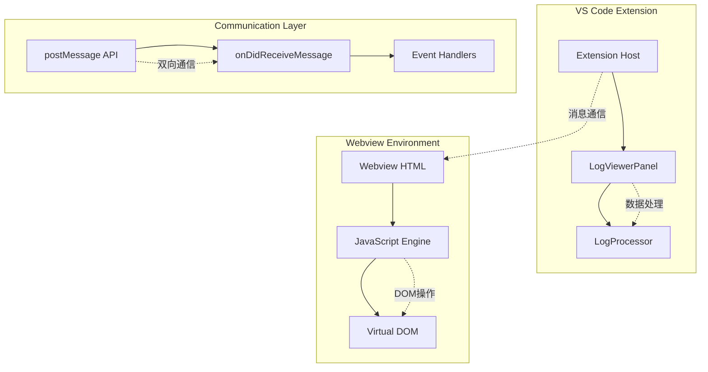
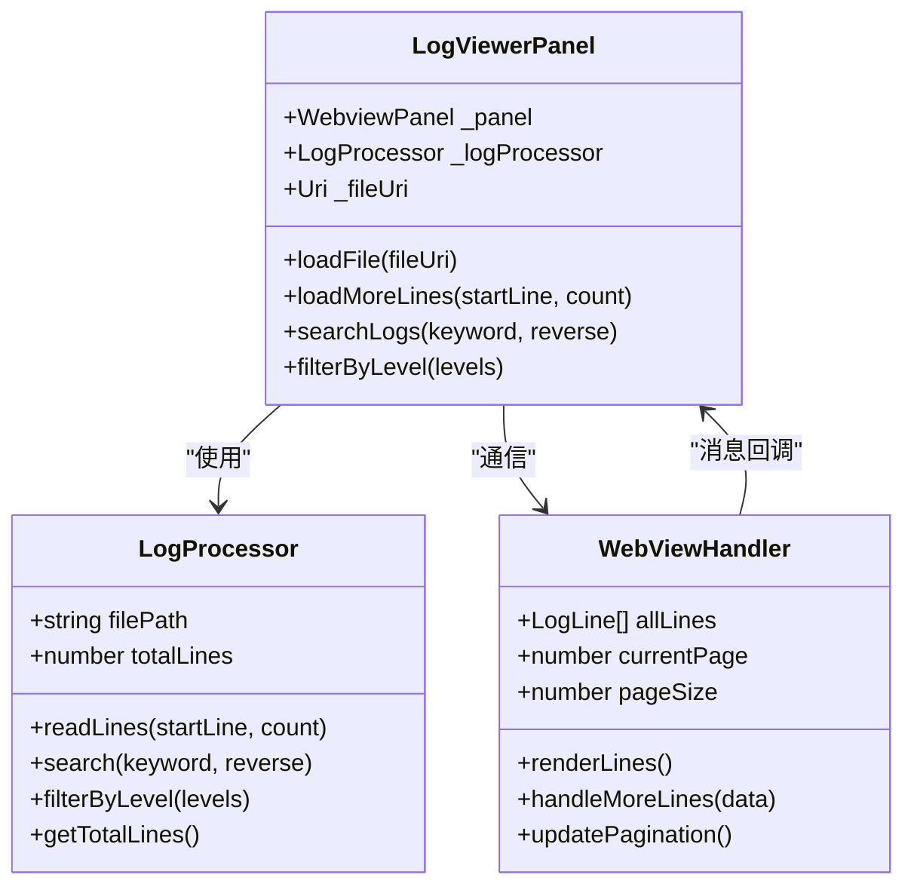
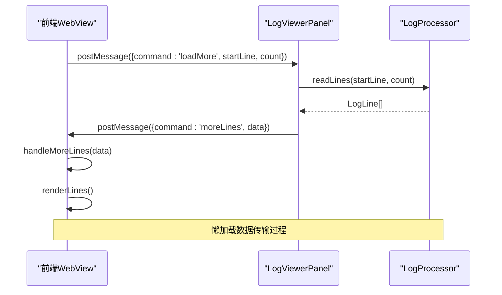
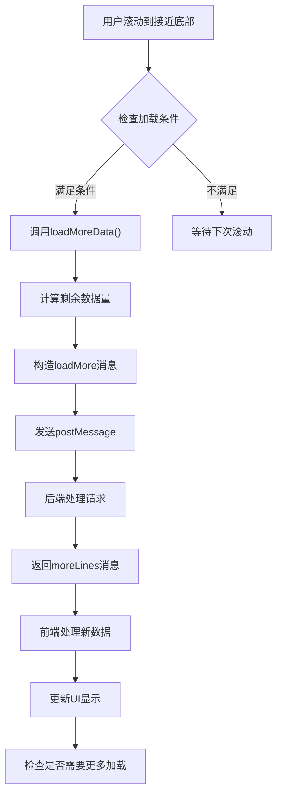
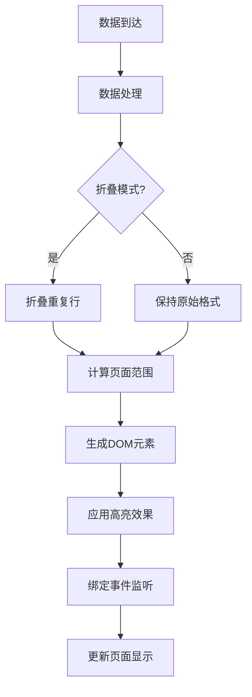

# 数据传输与渲染

<cite>
**本文档引用的文件**
- [src/logViewerPanel.ts](file://src/logViewerPanel.ts)
- [src/webview.html](file://src/webview.html)
- [src/extension.ts](file://src/extension.ts)
- [src/logProcessor.ts](file://src/logProcessor.ts)
</cite>

## 目录
1. [概述](#概述)
2. [系统架构](#系统架构)
3. [消息通信机制](#消息通信机制)
4. [懒加载数据传输](#懒加载数据传输)
5. [前端渲染机制](#前端渲染机制)
6. [虚拟滚动优化](#虚拟滚动优化)
7. [性能优化策略](#性能优化策略)
8. [故障排除指南](#故障排除指南)
9. [总结](#总结)

## 概述

large_log_check扩展采用了一套高效的数据传输与渲染机制，专门针对大型日志文件的处理需求。该系统通过VS Code的Webview技术实现了前后端分离的架构，支持懒加载、虚拟滚动和实时数据更新等高级功能。

核心特性包括：
- 基于消息传递的前后端通信
- 智能的懒加载数据传输机制
- 高效的虚拟滚动渲染算法
- 实时的数据更新和UI同步
- 完善的错误处理和性能监控

## 系统架构

### 整体架构设计



**图表来源**
- [src/logViewerPanel.ts](file://src/logViewerPanel.ts#L54-L98)
- [src/webview.html](file://src/webview.html#L1282-L1308)

### 组件关系图



**图表来源**
- [src/logViewerPanel.ts](file://src/logViewerPanel.ts#L6-L13)
- [src/logProcessor.ts](file://src/logProcessor.ts#L30-L33)
- [src/webview.html](file://src/webview.html#L1258-L1271)

**章节来源**
- [src/logViewerPanel.ts](file://src/logViewerPanel.ts#L1-L510)
- [src/webview.html](file://src/webview.html#L1-L4365)
- [src/logProcessor.ts](file://src/logProcessor.ts#L1-L807)

## 消息通信机制

### 消息命令结构

系统采用统一的消息命令机制进行前后端通信，其中`moreLines`命令是懒加载数据传输的核心。

#### 命令类型定义

| 命令名称 | 参数结构 | 功能描述 |
|---------|----------|----------|
| `fileLoaded` | `{fileName, filePath, fileSize, totalLines, lines, allLoaded}` | 文件加载完成通知 |
| `moreLines` | `{startLine, lines}` | 懒加载更多日志行 |
| `searchResults` | `{keyword, results}` | 搜索结果返回 |
| `filterResults` | `{levels, results}` | 过滤结果返回 |
| `loadMore` | `{startLine, count}` | 请求加载更多数据 |

#### moreLines命令数据结构

```typescript
// 后端发送的数据结构
{
    command: 'moreLines',
    data: {
        startLine: number,      // 起始行号
        lines: LogLine[]        // 日志行数组
    }
}

// LogLine接口定义
interface LogLine {
    lineNumber: number;     // 行号
    content: string;        // 日志内容
    timestamp?: Date;       // 时间戳
    level?: string;         // 日志级别
}
```

### 消息处理流程



**图表来源**
- [src/logViewerPanel.ts](file://src/logViewerPanel.ts#L150-L162)
- [src/webview.html](file://src/webview.html#L1289-L1346)

**章节来源**
- [src/logViewerPanel.ts](file://src/logViewerPanel.ts#L54-L98)
- [src/webview.html](file://src/webview.html#L1282-L1308)

## 懒加载数据传输

### 懒加载触发机制

系统实现了智能的懒加载机制，当用户接近页面底部时自动触发数据加载。

#### 加载触发条件

```javascript
// 检查是否需要加载更多数据
function checkAndLoadMore() {
    if (allDataLoaded) return; // 已加载全部数据
    if (isFiltering) return;   // 处于过滤模式时不自动加载
    
    const loadedLines = allLines.length;
    const currentMaxLine = currentPage * pageSize;
    
    // 当前页接近已加载数据末尾时触发加载
    if (currentMaxLine >= loadedLines - 500 && loadedLines < totalLinesInFile) {
        loadMoreData();
    }
}
```

#### 数据加载流程



**图表来源**
- [src/webview.html](file://src/webview.html#L3375-L3392)

### 数据传输优化

#### 分块加载策略

系统采用分块加载策略，每次最多加载10000行数据：

```javascript
function loadMoreData() {
    if (allDataLoaded) return;
    
    const currentLoaded = allLines.length;
    const remaining = totalLinesInFile - currentLoaded;
    const toLoad = Math.min(remaining, 10000); // 每次加载10000行
    
    vscode.postMessage({
        command: 'loadMore',
        startLine: currentLoaded,
        count: toLoad
    });
}
```

#### 批量数据处理

后端使用流式读取技术处理大数据文件：

```typescript
async readLines(startLine: number, count: number): Promise<LogLine[]> {
    return new Promise((resolve, reject) => {
        const lines: LogLine[] = [];
        let currentLine = 0;
        const endLine = startLine + count;
        
        const stream = fs.createReadStream(this.filePath);
        const rl = readline.createInterface({
            input: stream,
            crlfDelay: Infinity
        });
        
        rl.on('line', (line) => {
            if (currentLine >= startLine && currentLine < endLine) {
                const timestamp = this.extractTimestamp(line);
                const level = this.extractLogLevel(line);
                lines.push({
                    lineNumber: currentLine + 1,
                    content: line,
                    timestamp: timestamp,
                    level: level
                });
            }
            currentLine++;
            
            // 如果已经读取了足够的行,关闭流
            if (currentLine >= endLine) {
                rl.close();
                stream.destroy();
            }
        });
        
        rl.on('close', () => {
            resolve(lines);
        });
        
        rl.on('error', (error) => {
            reject(error);
        });
    });
}
```

**章节来源**
- [src/webview.html](file://src/webview.html#L3394-L3406)
- [src/logProcessor.ts](file://src/logProcessor.ts#L90-L130)

## 前端渲染机制

### 渲染架构设计

前端采用虚拟DOM和分页渲染技术，确保大量数据的高效展示。

#### 渲染流程图



**图表来源**
- [src/webview.html](file://src/webview.html#L1406-L1515)

### 虚拟滚动实现

#### 页面范围计算

系统实现了智能的页面范围计算，支持动态调整加载数量：

```javascript
function renderLines() {
    const container = document.getElementById('logContainer');
    container.innerHTML = '';
    
    // 计算分页范围
    let startIndex, endIndex;
    
    if (isCollapseMode && pageRanges.has(currentPage)) {
        // 折叠模式且已记录过该页范围，直接使用
        const range = pageRanges.get(currentPage);
        startIndex = range.start;
        endIndex = range.end;
    } else {
        // 标准分页计算
        startIndex = (currentPage - 1) * pageSize;
        endIndex = Math.min(startIndex + pageSize, allLines.length);
    }
    
    // 处理折叠模式下的智能加载
    if (isCollapseMode) {
        const targetDisplayLines = pageSize;
        let displayCount = 0;
        let tempEndIndex = endIndex;
        
        // 动态调整加载数量以填满页面
        while (displayCount < targetDisplayLines && tempEndIndex < allLines.length) {
            const testLines = allLines.slice(startIndex, tempEndIndex);
            const collapsed = collapseRepeatedLines(testLines, startIndex);
            displayCount = collapsed.length;
            
            if (displayCount < targetDisplayLines) {
                // 增量加载更多数据
                const increment = Math.min(1000, pageSize * 2);
                tempEndIndex = Math.min(tempEndIndex + increment, allLines.length);
            } else {
                break;
            }
        }
        
        endIndex = tempEndIndex;
        pageRanges.set(currentPage, { start: startIndex, end: endIndex });
    }
    
    // 渲染页面内容
    let pageLines = allLines.slice(startIndex, endIndex);
    if (isCollapseMode) {
        pageLines = collapseRepeatedLines(pageLines, startIndex);
    }
    
    pageLines.forEach((item, index) => {
        if (item.isCollapsed) {
            renderCollapsedGroup(container, item);
        } else {
            renderSingleLine(container, item, startIndex, index);
        }
    });
}
```

#### 折叠重复行算法

系统实现了高效的重复行检测和折叠算法：

```javascript
function collapseRepeatedLines(lines, startIndex) {
    const result = [];
    let i = 0;
    
    while (i < lines.length) {
        // 尝试不同的模式长度（1行到10行）
        let bestPatternLength = 0;
        let bestRepeatCount = 0;
        
        for (let patternLength = 1; patternLength <= Math.min(10, Math.floor((lines.length - i) / 2)); patternLength++) {
            // 检测重复模式
            let repeatCount = 1;
            let j = i + patternLength;
            
            while (j + patternLength <= lines.length) {
                let matches = true;
                for (let k = 0; k < patternLength; k++) {
                    const currentContent = extractLogContent(lines[j + k]);
                    if (currentContent !== patternContent) {
                        matches = false;
                        break;
                    }
                }
                
                if (matches) {
                    repeatCount++;
                    j += patternLength;
                } else {
                    break;
                }
            }
            
            if (repeatCount >= 2 && repeatCount > bestRepeatCount) {
                bestPatternLength = patternLength;
                bestRepeatCount = repeatCount;
            }
        }
        
        if (bestPatternLength > 0 && bestRepeatCount >= 2) {
            // 找到重复模式，创建折叠组
            result.push({
                isCollapsed: true,
                groupId: `group_${firstLineNumber}`,
                patternLength: bestPatternLength,
                repeatCount: bestRepeatCount,
                lines: lines.slice(i, i + totalLines),
                firstLine: lines[i],
                isExpanded: expandedGroups.has(groupId)
            });
            i += totalLines;
        } else {
            // 没有重复，直接添加
            result.push(lines[i]);
            i++;
        }
    }
    
    return result;
}
```

**章节来源**
- [src/webview.html](file://src/webview.html#L1406-L1515)
- [src/webview.html](file://src/webview.html#L1658-L1742)

## 虚拟滚动优化

### 性能优化策略

#### DOM节点复用

系统采用DOM节点复用技术，避免频繁的DOM操作：

```javascript
// 渲染单条日志行
function renderSingleLine(container, line, startIndex, index) {
    const lineDiv = document.createElement('div');
    lineDiv.className = 'log-line';
    
    // 重用现有DOM节点
    const existingNodes = container.querySelectorAll('.log-line');
    if (index < existingNodes.length) {
        lineDiv = existingNodes[index];
    }
    
    // 设置内容和样式
    const actualLineNumber = line.lineNumber || startIndex + index + 1;
    const lineNumber = document.createElement('span');
    lineNumber.className = 'log-line-number';
    lineNumber.textContent = actualLineNumber.toString();
    
    const lineContent = document.createElement('span');
    lineContent.className = 'log-line-content';
    lineContent.innerHTML = highlightKeywords(line.content, currentSearchKeyword);
    
    lineDiv.appendChild(lineNumber);
    lineDiv.appendChild(lineContent);
    
    container.appendChild(lineDiv);
}
```

#### 滚动事件优化

```javascript
// 智能滚动处理
function handleScroll() {
    const logContainer = document.getElementById('logContainer');
    const scrollTop = logContainer.scrollTop;
    const scrollHeight = logContainer.scrollHeight;
    const clientHeight = logContainer.clientHeight;
    
    // 当滚动到底部时触发加载
    if (scrollHeight - scrollTop - clientHeight < 100) {
        checkAndLoadMore();
    }
}
```

### 内存管理

#### 对象池模式

系统使用对象池模式管理大量日志对象：

```javascript
// 日志对象池
const logLinePool = {
    pool: [],
    get() {
        if (this.pool.length > 0) {
            return this.pool.pop();
        }
        return {};
    },
    release(line) {
        // 清空对象属性
        for (let key in line) {
            delete line[key];
        }
        this.pool.push(line);
    }
};
```

**章节来源**
- [src/webview.html](file://src/webview.html#L1821-L1910)
- [src/webview.html](file://src/webview.html#L3525-L3547)

## 性能优化策略

### 数据预处理

#### 时间戳缓存

系统对时间戳解析结果进行缓存，避免重复计算：

```javascript
// 时间戳解析缓存
const timestampCache = new Map();

function extractTimestamp(line) {
    if (timestampCache.has(line)) {
        return timestampCache.get(line);
    }
    
    const timestamp = parseTimestamp(line);
    timestampCache.set(line, timestamp);
    return timestamp;
}
```

#### 关键词高亮优化

```javascript
// 高亮缓存机制
const highlightCache = new Map();

function highlightKeywords(content, keyword) {
    const cacheKey = `${content}_${keyword}`;
    
    if (highlightCache.has(cacheKey)) {
        return highlightCache.get(cacheKey);
    }
    
    const result = performHighlight(content, keyword);
    highlightCache.set(cacheKey, result);
    
    return result;
}
```

### 网络优化

#### 请求去重

系统实现了请求去重机制，避免重复加载相同的数据：

```javascript
// 加载队列管理
const loadingQueue = new Set();

function loadMoreData(startLine, count) {
    const queueKey = `${startLine}_${count}`;
    
    if (loadingQueue.has(queueKey)) {
        return; // 已在加载队列中
    }
    
    loadingQueue.add(queueKey);
    
    // 执行加载逻辑...
    
    // 加载完成后移除
    loadingQueue.delete(queueKey);
}
```

### 错误恢复机制

#### 断点续传

```javascript
// 断点续传支持
function resumeLoad(startLine) {
    // 检查已加载的行数
    const loadedCount = getLoadedCount();
    
    if (loadedCount > startLine) {
        // 从断点继续加载
        const remaining = totalLines - loadedCount;
        const toLoad = Math.min(remaining, 10000);
        
        loadMoreData(loadedCount, toLoad);
    }
}
```

**章节来源**
- [src/webview.html](file://src/webview.html#L3437-L3447)
- [src/logProcessor.ts](file://src/logProcessor.ts#L476-L561)

## 故障排除指南

### 常见问题诊断

#### 数据加载缓慢

**症状**：日志加载时间过长，界面卡顿

**诊断步骤**：
1. 检查网络连接状态
2. 验证文件大小和复杂度
3. 监控内存使用情况

**解决方案**：
```javascript
// 增加加载缓冲区
const BUFFER_SIZE = 20000; // 从10000增加到20000

function optimizeLoadSpeed() {
    // 增加并发加载数量
    const concurrentLoads = Math.min(3, Math.ceil(totalLines / BUFFER_SIZE));
    
    // 并行加载多个数据块
    for (let i = 0; i < concurrentLoads; i++) {
        const start = i * BUFFER_SIZE;
        const count = Math.min(BUFFER_SIZE, totalLines - start);
        loadMoreData(start, count);
    }
}
```

#### 内存泄漏问题

**症状**：长时间使用后内存占用持续增长

**诊断工具**：
```javascript
// 内存监控
function monitorMemoryUsage() {
    if (performance.memory) {
        const memInfo = {
            used: performance.memory.usedJSHeapSize,
            total: performance.memory.totalJSHeapSize,
            limit: performance.memory.jsHeapSizeLimit
        };
        
        console.log('内存使用情况:', memInfo);
        
        // 当内存使用超过限制的80%时触发清理
        if (memInfo.used / memInfo.limit > 0.8) {
            triggerMemoryCleanup();
        }
    }
}
```

#### 渲染性能问题

**症状**：大量数据时界面响应缓慢

**优化策略**：
```javascript
// 虚拟滚动优化
function virtualScrollOptimization() {
    // 减少同时渲染的DOM节点数量
    const VISIBLE_LINES = 50; // 从100减少到50
    
    // 延迟渲染非可见区域
    function lazyRender() {
        const visibleArea = getVisibleArea();
        renderVisibleLines(visibleArea);
    }
    
    // 节流渲染频率
    let renderTimeout;
    function throttledRender() {
        clearTimeout(renderTimeout);
        renderTimeout = setTimeout(lazyRender, 100);
    }
}
```

### 调试工具

#### 性能分析器

```javascript
// 性能分析工具
const performanceProfiler = {
    startTime: {},
    
    start(label) {
        this.startTime[label] = performance.now();
    },
    
    end(label) {
        const duration = performance.now() - this.startTime[label];
        console.log(`${label}: ${duration.toFixed(2)}ms`);
        return duration;
    }
};

// 使用示例
performanceProfiler.start('renderLines');
renderLines();
performanceProfiler.end('renderLines');
```

**章节来源**
- [src/webview.html](file://src/webview.html#L3375-L3392)
- [src/webview.html](file://src/webview.html#L1406-L1515)

## 总结

large_log_check扩展的懒加载数据传输与渲染机制体现了现代Web应用的最佳实践。通过以下关键技术的综合运用，系统实现了高性能的大数据处理能力：

### 核心技术优势

1. **消息驱动架构**：基于postMessage API的前后端通信，确保了系统的解耦和可扩展性
2. **智能懒加载**：动态的数据加载策略，有效平衡了用户体验和系统资源消耗
3. **虚拟滚动技术**：高效的DOM渲染优化，支持处理百万级日志行的流畅展示
4. **性能监控体系**：完善的性能指标收集和优化建议机制

### 技术创新点

- **折叠重复行算法**：独特的重复模式检测和折叠技术，显著减少了视觉噪音
- **智能页面计算**：动态调整的页面范围计算，适应不同数据特征的场景
- **内存管理优化**：多层次的内存管理策略，确保长期运行的稳定性

### 应用价值

该系统不仅解决了大型日志文件处理的技术难题，更为类似应用场景提供了可借鉴的架构模式和实现方案。其设计理念和技术创新对于构建高性能的Web应用程序具有重要的参考价值。

通过持续的性能优化和功能增强，该系统将继续为开发者提供更加优秀的日志分析体验，成为VS Code生态系统中不可或缺的重要工具。