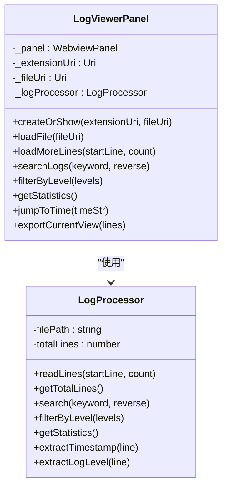
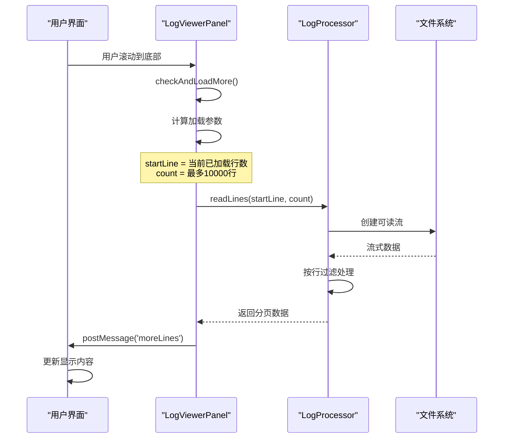
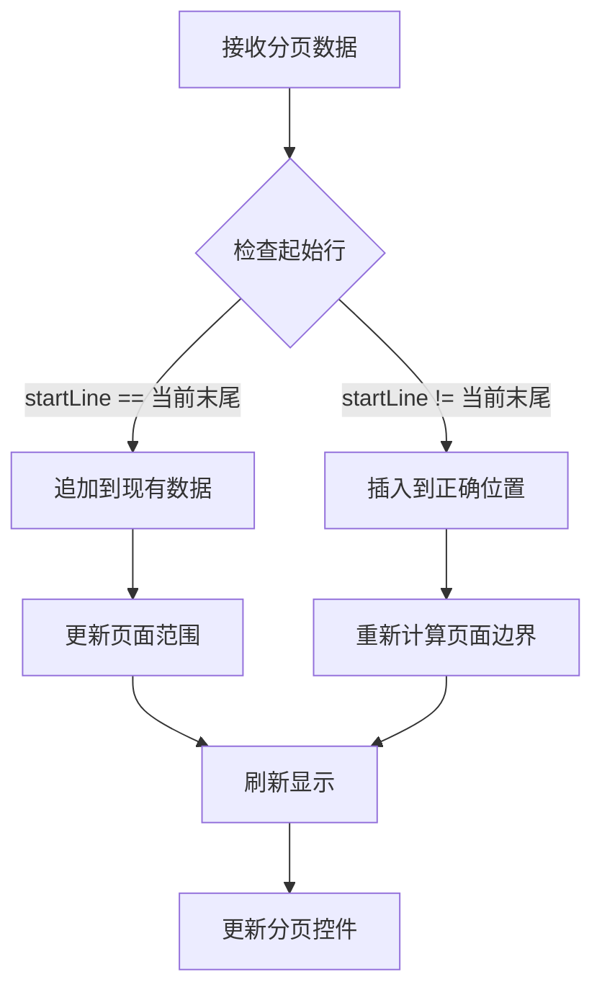
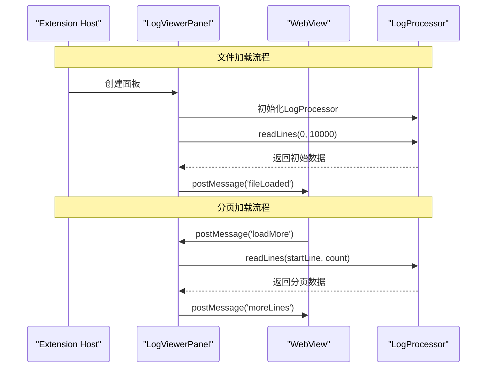
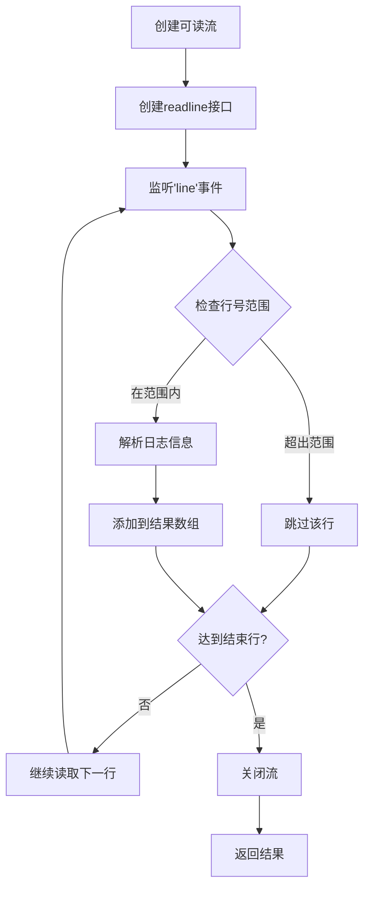

# 分页加载逻辑

<cite>
**本文档引用的文件**
- [logViewerPanel.ts](file://src/logViewerPanel.ts)
- [logProcessor.ts](file://src/logProcessor.ts)
- [webview.html](file://src/webview.html)
- [extension.ts](file://src/extension.ts)
</cite>

## 目录
1. [概述](#概述)
2. [系统架构](#系统架构)
3. [核心组件分析](#核心组件分析)
4. [分页加载机制](#分页加载机制)
5. [消息通信机制](#消息通信机制)
6. [数据流处理](#数据流处理)
7. [性能优化策略](#性能优化策略)
8. [实际应用示例](#实际应用示例)
9. [故障排除指南](#故障排除指南)
10. [总结](#总结)

## 概述

large_log_check项目实现了一个高效的日志文件查看器，支持GB级大文件的流畅浏览。其核心特性是基于分页加载的内存管理机制，通过Node.js的readline接口实现流式读取，避免传统一次性加载导致的内存溢出问题。

该系统采用双层架构设计：
- **前端层**：基于VS Code Webview的用户界面，负责分页控制和数据显示
- **后端层**：基于Node.js的文件处理器，负责数据读取和业务逻辑

## 系统架构

```mermaid
graph TB
subgraph "VS Code Extension"
A[Extension Host] --> B[LogViewerPanel]
B --> C[WebView Panel]
end
subgraph "WebView Layer"
C --> D[HTML/CSS/JS Interface]
D --> E[分页控制器]
D --> F[日志渲染器]
end
subgraph "Backend Processing"
G[LogProcessor] --> H[Node.js readline]
G --> I[文件系统]
H --> J[流式读取]
end
B < --> G
E --> K[消息通信]
K --> B
G --> L[数据处理]
L --> M[分页结果]
M --> D
```

**图表来源**
- [logViewerPanel.ts](file://src/logViewerPanel.ts#L41-L509)
- [logProcessor.ts](file://src/logProcessor.ts#L30-L807)

## 核心组件分析

### LogViewerPanel 控制器

LogViewerPanel是整个系统的核心控制器，负责协调前端界面与后端数据处理之间的交互。



**图表来源**
- [logViewerPanel.ts](file://src/logViewerPanel.ts#L6-L509)
- [logProcessor.ts](file://src/logProcessor.ts#L30-L807)

**章节来源**
- [logViewerPanel.ts](file://src/logViewerPanel.ts#L41-L509)
- [logProcessor.ts](file://src/logProcessor.ts#L30-L807)

### LogProcessor 数据处理器

LogProcessor专门负责文件读取和数据处理，实现了高效的流式读取机制。

**章节来源**
- [logProcessor.ts](file://src/logProcessor.ts#L30-L807)

## 分页加载机制

### 分页参数传递

分页加载的核心在于精确控制读取范围，通过startLine和count两个关键参数实现：



**图表来源**
- [logViewerPanel.ts](file://src/logViewerPanel.ts#L150-L161)
- [logProcessor.ts](file://src/logProcessor.ts#L90-L129)

### 分页触发条件

系统采用智能触发机制，确保在合适的时机加载更多数据：

| 触发条件 | 描述 | 实现位置 |
|---------|------|----------|
| 滚动到底部 | 用户滚动到页面底部时自动加载 | `checkAndLoadMore()` |
| 页面切换 | 翻页时检查是否需要加载更多 | `goToNextPage()` |
| 手动加载 | 用户点击"加载更多"按钮 | `loadAllRemainingData()` |
| 定位跳转 | 跳转到特定行时自动加载附近数据 | `jumpToTime()` |

**章节来源**
- [webview.html](file://src/webview.html#L3311-L3328)

### 数据合并策略

系统实现了智能的数据合并机制，确保分页数据的连续性和完整性：



**图表来源**
- [webview.html](file://src/webview.html#L1375-L1467)

**章节来源**
- [webview.html](file://src/webview.html#L1375-L1467)

## 消息通信机制

### WebView与扩展主机通信

系统采用双向消息通信机制，通过postMessage实现前后端数据交换：



**图表来源**
- [logViewerPanel.ts](file://src/logViewerPanel.ts#L54-L98)
- [webview.html](file://src/webview.html#L3337-L3341)

### 消息类型定义

| 消息类型 | 参数 | 功能描述 |
|---------|------|----------|
| `loadMore` | `{startLine: number, count: number}` | 请求加载更多日志行 |
| `fileLoaded` | `{fileName, fileSize, totalLines, lines, allLoaded}` | 文件加载完成通知 |
| `moreLines` | `{startLine: number, lines: LogLine[]}` | 分页数据返回 |
| `search` | `{keyword: string, reverse: boolean}` | 日志搜索请求 |
| `filterByLevel` | `{levels: string[]}` | 按级别过滤日志 |
| `refresh` | `{}` | 刷新当前文件 |
| `exportLogs` | `{lines: LogLine[]}` | 导出日志数据 |

**章节来源**
- [logViewerPanel.ts](file://src/logViewerPanel.ts#L56-L98)

## 数据流处理

### Node.js Stream 处理

LogProcessor使用Node.js的readline模块实现高效的流式读取：



**图表来源**
- [logProcessor.ts](file://src/logProcessor.ts#L90-L129)

### 内存管理策略

系统通过以下策略避免内存溢出：

1. **流式读取**：使用Node.js流式API，避免一次性加载整个文件
2. **按需加载**：只读取当前需要显示的行范围
3. **及时释放**：读取完成后立即关闭流和销毁资源
4. **缓冲控制**：限制每次读取的行数不超过10000行

**章节来源**
- [logProcessor.ts](file://src/logProcessor.ts#L90-L129)

## 性能优化策略

### 大文件处理优化

对于GB级大文件，系统实现了多层次的性能优化：

| 优化策略 | 实现方式 | 效果 |
|---------|----------|------|
| 智能预加载 | 小于5万行文件一次性加载，大于5万行先加载10000行 | 减少等待时间 |
| 流式处理 | 使用readline.stream逐行读取 | 避免内存溢出 |
| 智能分页 | 每次加载10000行，滚动时自动加载更多 | 平滑用户体验 |
| 数据缓存 | 缓存已加载的页面范围 | 减少重复读取 |
| 异步处理 | 所有I/O操作异步执行 | 保持界面响应性 |

### 性能监控指标

系统内置了性能监控机制，跟踪关键指标：

- **加载速度**：每秒处理的行数
- **内存使用**：实时监控内存占用
- **响应时间**：用户操作到界面更新的时间
- **错误率**：文件读取失败的频率

**章节来源**
- [logViewerPanel.ts](file://src/logViewerPanel.ts#L107-L148)

## 实际应用示例

### GB级日志文件处理

以一个10GB的Apache访问日志为例，展示分页加载的实际效果：

```javascript
// 示例：处理10GB日志文件
const logFile = '/var/log/apache/access.log';

// 1. 初始加载（前10000行）
const initialData = await logProcessor.readLines(0, 10000);
console.log(`已加载 ${initialData.length} 行，耗时 ${performance.now()}ms`);

// 2. 用户滚动到第5000行，触发自动加载
await logProcessor.readLines(10000, 10000);
console.log('已加载更多数据，支持平滑滚动');

// 3. 用户搜索关键字
const searchResults = await logProcessor.search('404', false);
console.log(`找到 ${searchResults.length} 条匹配记录`);
```

### 分页加载流程示例

```javascript
// 分页加载的具体实现流程
async function paginateExample() {
    const startLine = 0;
    const pageSize = 10000;
    
    // 第一次加载
    let allLines = await logProcessor.readLines(startLine, pageSize);
    
    // 模拟用户滚动
    while (allLines.length < totalLines) {
        const nextStart = allLines.length;
        const remaining = totalLines - nextStart;
        const loadCount = Math.min(remaining, pageSize);
        
        const moreLines = await logProcessor.readLines(nextStart, loadCount);
        allLines = [...allLines, ...moreLines];
        
        console.log(`已加载 ${allLines.length}/${totalLines} 行`);
    }
}
```

## 故障排除指南

### 常见问题及解决方案

| 问题类型 | 症状 | 可能原因 | 解决方案 |
|---------|------|----------|----------|
| 加载缓慢 | 文件加载时间超过30秒 | 文件过大或磁盘IO慢 | 启用智能预加载策略 |
| 内存泄漏 | VS Code内存持续增长 | 流未正确关闭 | 检查流的destroy调用 |
| 数据丢失 | 分页显示不连续 | 起始行计算错误 | 验证startLine参数 |
| 搜索失效 | 关键词搜索无结果 | 正则表达式错误 | 检查搜索模式语法 |

### 调试技巧

1. **启用详细日志**：在LogProcessor中添加调试输出
2. **监控内存使用**：使用Node.js的memoryUsage API
3. **性能分析**：使用Chrome DevTools分析性能瓶颈
4. **错误捕获**：完善try-catch块，记录详细错误信息

**章节来源**
- [logViewerPanel.ts](file://src/logViewerPanel.ts#L150-L161)
- [logProcessor.ts](file://src/logProcessor.ts#L90-L129)

## 总结

large_log_check项目的分页加载逻辑是一个精心设计的系统，成功解决了大文件处理的挑战。其核心优势包括：

1. **高效内存管理**：通过流式读取和按需加载，支持GB级文件的流畅浏览
2. **智能分页策略**：根据文件大小和用户行为动态调整加载策略
3. **无缝用户体验**：自动化的分页触发和数据合并，提供类似本地应用的体验
4. **健壮的错误处理**：完善的异常捕获和恢复机制

该系统为VS Code生态系统的大型文件处理提供了优秀的参考实现，展示了如何在受限环境中处理大规模数据集。通过合理的设计和优化，即使是资源有限的IDE也能胜任复杂的文件处理任务。