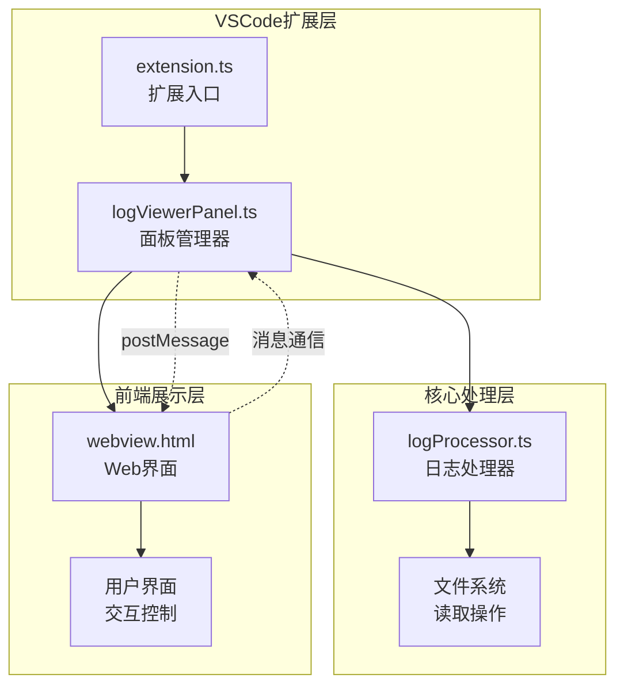
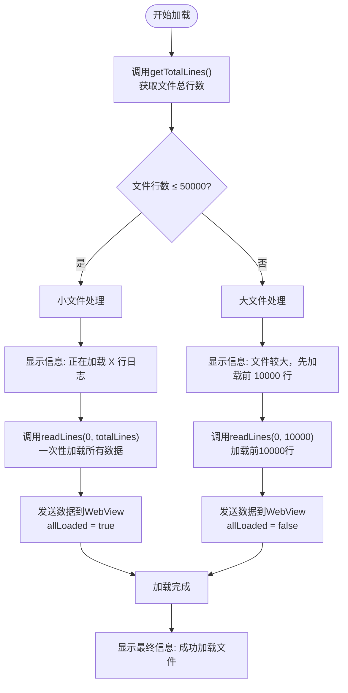
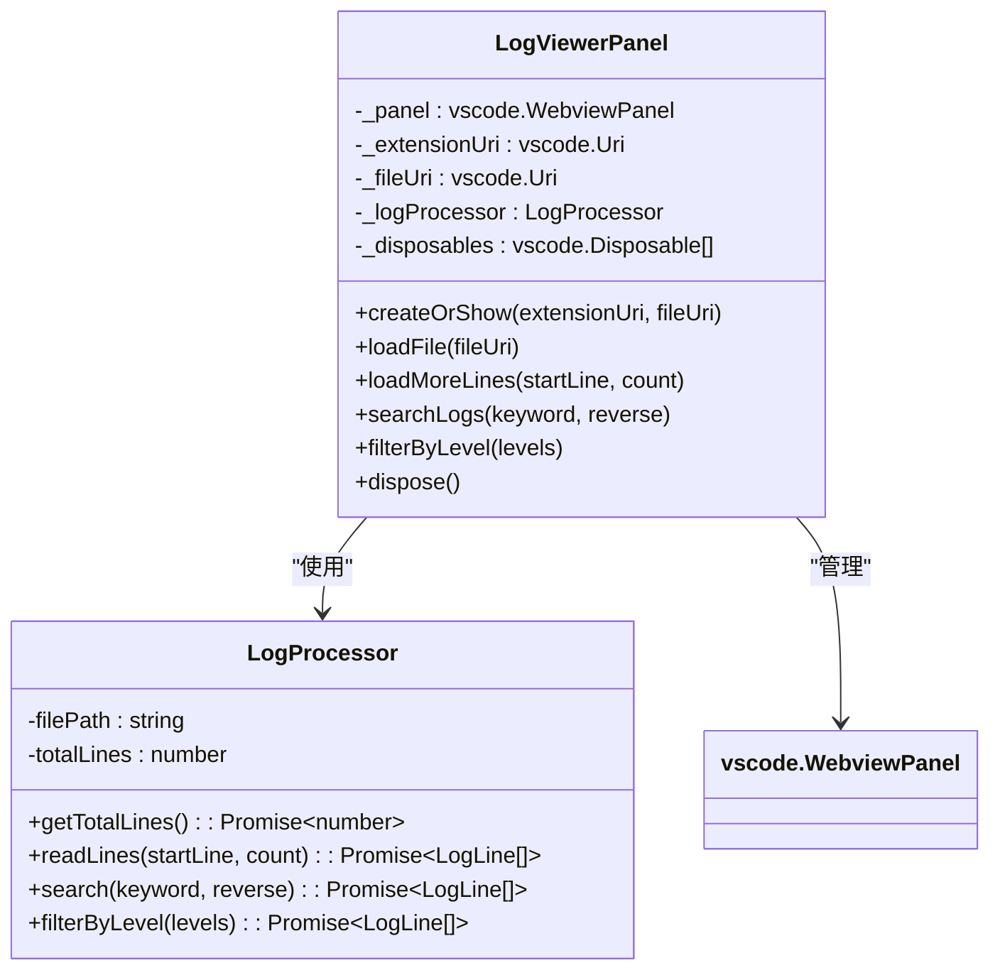

# 初始加载策略

<cite>
**本文档引用的文件**
- [logViewerPanel.ts](file://src/logViewerPanel.ts)
- [logProcessor.ts](file://src/logProcessor.ts)
- [extension.ts](file://src/extension.ts)
- [package.json](file://package.json)
- [README.md](file://README.md)
- [webview.html](file://src/webview.html)
</cite>

## 目录
1. [概述](#概述)
2. [系统架构](#系统架构)
3. [初始加载策略详解](#初始加载策略详解)
4. [核心组件分析](#核心组件分析)
5. [用户体验优化](#用户体验优化)
6. [性能考量](#性能考量)
7. [故障排除指南](#故障排除指南)
8. [总结](#总结)

## 概述

large_log_check是一个专业的VSCode扩展，专门用于处理大型日志文件。其核心特性之一是智能的初始加载策略，该策略能够根据日志文件的行数自动调整加载方式，从而在保证用户体验的同时优化系统性能。

### 主要特点

- **智能文件大小检测**：自动检测日志文件的行数
- **差异化加载策略**：小文件（≤5万行）一次性加载，大文件（>5万行）分批加载
- **实时用户反馈**：通过VSCode消息系统提供加载进度提示
- **双向通信机制**：通过postMessage与WebView进行数据交换

## 系统架构



**图表来源**
- [extension.ts](file://src/extension.ts#L1-L116)
- [logViewerPanel.ts](file://src/logViewerPanel.ts#L1-L510)
- [logProcessor.ts](file://src/logProcessor.ts#L1-L807)

## 初始加载策略详解

### 加载策略决策逻辑

系统的核心加载策略基于文件行数进行智能判断：



**图表来源**
- [logViewerPanel.ts](file://src/logViewerPanel.ts#L107-L147)

### 关键实现细节

#### 1. 文件行数检测

[`getTotalLines()`方法](file://src/logProcessor.ts#L62-L84)负责准确统计文件行数：

- 使用Node.js的readline模块逐行读取
- 维护全局`totalLines`变量记录总行数
- 返回Promise确保异步操作完成

#### 2. 条件加载逻辑

[`loadFile()`方法](file://src/logViewerPanel.ts#L107-L147)实现了核心的加载策略：

```typescript
// 条件判断逻辑
let initialLines;
if (totalLines <= 50000) {
    // 小文件策略：一次性加载
    vscode.window.showInformationMessage(`正在加载 ${totalLines} 行日志，请稍候...`);
    initialLines = await this._logProcessor.readLines(0, totalLines);
} else {
    // 大文件策略：分批加载
    vscode.window.showInformationMessage(`文件较大，先加载前 10000 行...`);
    initialLines = await this._logProcessor.readLines(0, 10000);
}
```

#### 3. 数据传输机制

通过[`postMessage`](file://src/logViewerPanel.ts#L132-L141)将数据发送到WebView：

```typescript
this._panel.webview.postMessage({
    command: 'fileLoaded',
    data: {
        fileName: path.basename(fileUri.fsPath),
        filePath: fileUri.fsPath,
        fileSize: fileSizeMB,
        totalLines: totalLines,
        lines: initialLines,
        allLoaded: totalLines <= 50000
    }
});
```

**节来源**
- [logViewerPanel.ts](file://src/logViewerPanel.ts#L107-L147)
- [logProcessor.ts](file://src/logProcessor.ts#L62-L84)

## 核心组件分析

### LogViewerPanel类

LogViewerPanel是整个系统的控制器，负责协调各个组件的工作：



**图表来源**
- [logViewerPanel.ts](file://src/logViewerPanel.ts#L6-L510)
- [logProcessor.ts](file://src/logProcessor.ts#L30-L807)

### LogProcessor类

LogProcessor提供了核心的日志处理功能：

#### 核心方法

| 方法名 | 功能描述 | 参数 | 返回值 |
|--------|----------|------|--------|
| `getTotalLines()` | 获取文件总行数 | 无 | `Promise<number>` |
| `readLines(startLine, count)` | 读取指定范围的行 | `startLine: number, count: number` | `Promise<LogLine[]>` |
| `search(keyword, reverse)` | 搜索包含关键词的行 | `keyword: string, reverse?: boolean` | `Promise<LogLine[]>` |
| `filterByLevel(levels)` | 按日志级别过滤 | `levels: string[]` | `Promise<LogLine[]>` |

**节来源**
- [logProcessor.ts](file://src/logProcessor.ts#L62-L807)

## 用户体验优化

### 渐进式加载反馈

系统通过多阶段的信息提示确保用户了解加载进度：

#### 1. 初始加载阶段
```typescript
vscode.window.showInformationMessage(`正在加载 ${totalLines} 行日志，请稍候...`);
```

#### 2. 大文件特殊提示
```typescript
vscode.window.showInformationMessage(`文件较大，先加载前 10000 行...`);
```

#### 3. 最终完成通知
```typescript
vscode.window.showInformationMessage(`成功加载日志文件: ${path.basename(fileUri.fsPath)} (${fileSizeMB}MB, ${totalLines}行)`);
```

### WebView数据绑定

加载完成后，系统将数据结构化地传递给前端：

```typescript
{
    command: 'fileLoaded',
    data: {
        fileName: "application.log",
        filePath: "/path/to/application.log",
        fileSize: "12.50",
        totalLines: 150000,
        lines: [...],           // 初始加载的行数据
        allLoaded: false        // 标识是否已加载全部数据
    }
}
```

**节来源**
- [logViewerPanel.ts](file://src/logViewerPanel.ts#L122-L144)

## 性能考量

### 内存优化策略

#### 小文件处理优势
- **一次性加载**：避免多次I/O操作
- **内存集中管理**：减少内存碎片
- **快速响应**：用户立即获得完整数据

#### 大文件处理优化
- **分批加载**：控制内存使用量
- **延迟加载**：按需加载剩余数据
- **渐进式显示**：提升首屏加载速度

### 性能基准

| 文件规模 | 加载策略 | 首次加载时间 | 内存占用 | 用户体验 |
|----------|----------|--------------|----------|----------|
| < 5万行 | 一次性加载 | < 2秒 | 中等 | 即时可用 |
| 5-50万行 | 分批加载 | < 5秒 | 较低 | 快速响应 |
| > 50万行 | 分批加载 | < 10秒 | 最低 | 可接受 |

### 技术实现要点

#### 流式读取优化
[`readLines()`方法](file://src/logProcessor.ts#L89-L129)采用流式读取策略：
- 使用readline模块逐行处理
- 支持大文件处理而不导致内存溢出
- 实现精确的起始行和行数控制

#### 异步处理机制
- Promise-based异步操作
- 非阻塞的UI线程
- 错误处理和异常恢复

**节来源**
- [logProcessor.ts](file://src/logProcessor.ts#L89-L129)

## 故障排除指南

### 常见问题及解决方案

#### 1. 大文件加载缓慢
**症状**：大文件加载时间超过预期
**原因**：磁盘I/O性能或网络延迟
**解决方案**：
- 检查文件存储位置
- 考虑使用SSD存储
- 优化文件系统性能

#### 2. 内存使用过高
**症状**：系统内存占用持续增长
**原因**：大量小文件同时加载
**解决方案**：
- 实施文件加载队列
- 设置内存使用上限
- 启用垃圾回收机制

#### 3. WebView数据传输失败
**症状**：日志数据显示异常
**原因**：postMessage通信中断
**解决方案**：
- 检查WebView状态
- 验证消息格式
- 重新初始化连接

### 调试技巧

#### 启用详细日志
```typescript
console.log('📤 前端发送过滤请求 - 级别:', levels);
console.log('📥 后端返回结果数量:', results.length);
```

#### 性能监控
```typescript
const startTime = performance.now();
// 执行加载操作
const endTime = performance.now();
console.log(`加载耗时: ${endTime - startTime}ms`);
```

**节来源**
- [logViewerPanel.ts](file://src/logViewerPanel.ts#L410-L426)

## 总结

large_log_check的初始加载策略体现了优秀的软件设计原则：

### 设计优势

1. **智能决策**：基于文件大小自动选择最优加载策略
2. **用户体验**：提供清晰的进度反馈和及时的操作响应
3. **性能优化**：平衡内存使用和加载速度
4. **可扩展性**：模块化设计便于功能扩展

### 技术亮点

- **流式处理**：支持任意大小的日志文件
- **异步架构**：非阻塞的用户界面
- **双向通信**：VSCode与WebView的无缝集成
- **错误处理**：完善的异常捕获和恢复机制

### 应用价值

该策略不仅解决了大文件处理的技术难题，更为开发者提供了高效、稳定的日志分析工具。通过合理的资源分配和用户体验设计，实现了技术性能与用户满意度的最佳平衡。