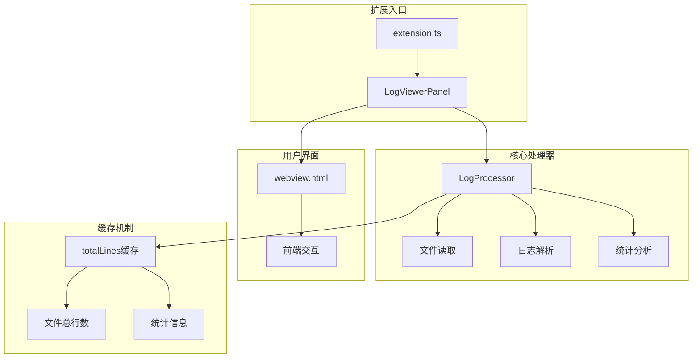
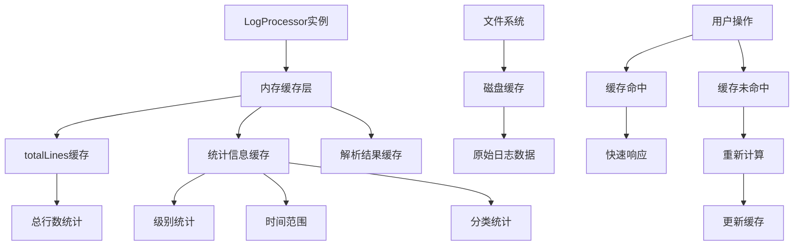
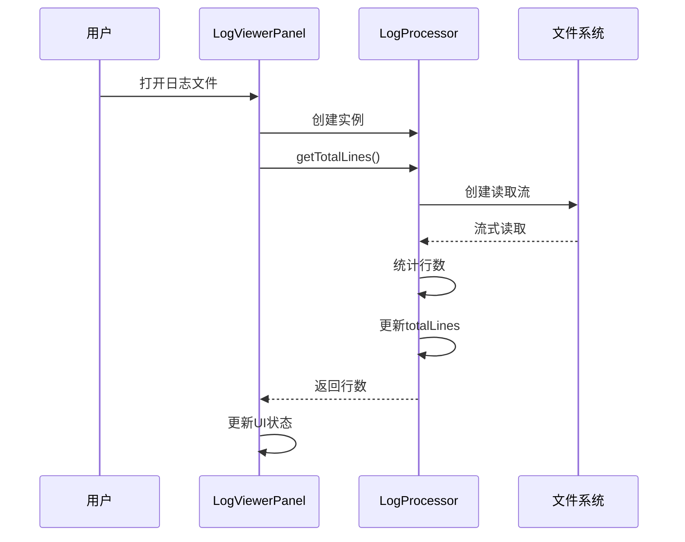
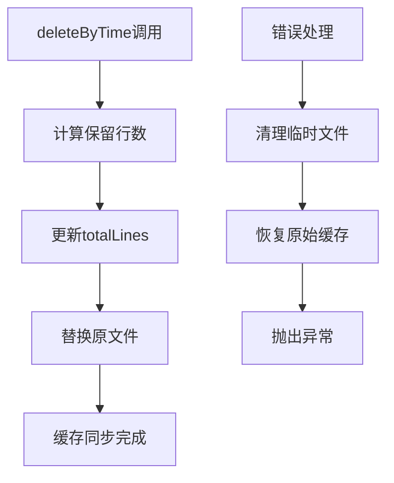
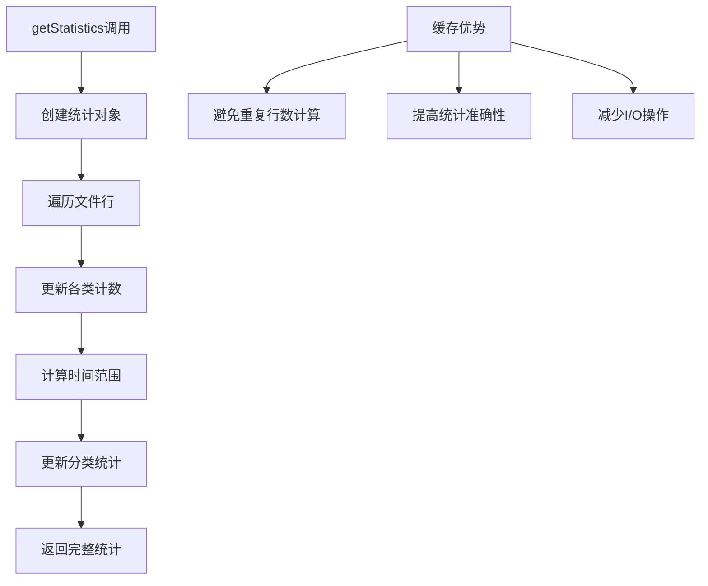
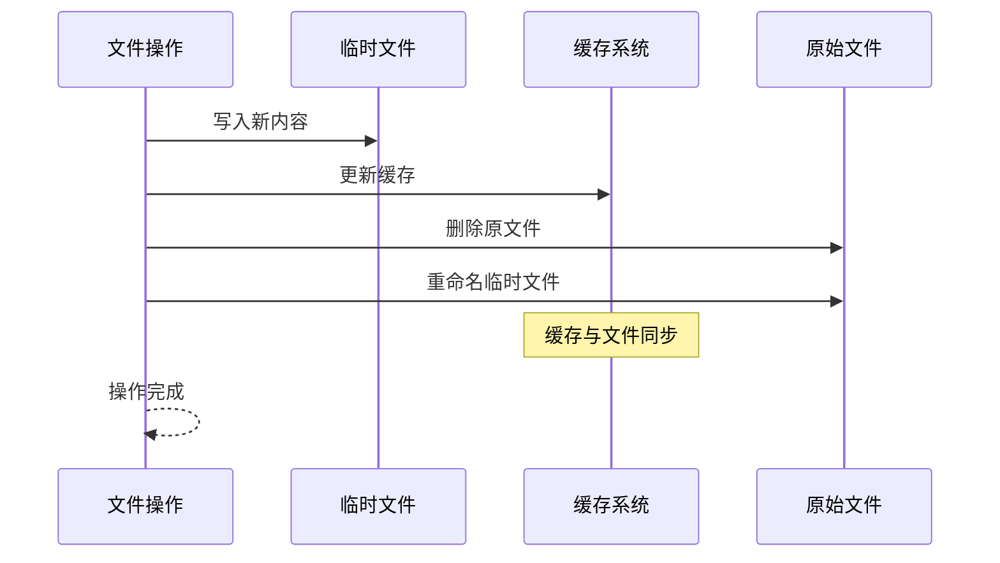

# 数据缓存机制

<cite>
**本文档引用的文件**
- [logProcessor.ts](file://src/logProcessor.ts)
- [logViewerPanel.ts](file://src/logViewerPanel.ts)
- [extension.ts](file://src/extension.ts)
- [package.json](file://package.json)
- [webview.html](file://src/webview.html)
</cite>

## 目录
1. [简介](#简介)
2. [项目结构概览](#项目结构概览)
3. [核心缓存机制](#核心缓存机制)
4. [totalLines字段缓存分析](#totallines字段缓存分析)
5. [缓存更新机制](#缓存更新机制)
6. [性能优化与复用价值](#性能优化与复用价值)
7. [缓存一致性保证](#缓存一致性保证)
8. [实际应用场景](#实际应用场景)
9. [总结](#总结)

## 简介

large_log_check是一个专为VS Code设计的大日志文件查看和处理工具，其核心功能之一是高效处理大型日志文件。该项目实现了一套精密的数据缓存机制，特别是在`LogProcessor`类中通过`totalLines`字段实现了文件总行数的缓存管理，有效减少了重复的文件I/O操作，显著提升了应用程序的响应速度和用户体验。

## 项目结构概览

该项目采用模块化架构设计，主要包含以下核心组件：



**图表来源**
- [extension.ts](file://src/extension.ts#L1-L116)
- [logViewerPanel.ts](file://src/logViewerPanel.ts#L1-L510)
- [logProcessor.ts](file://src/logProcessor.ts#L1-L807)

**章节来源**
- [extension.ts](file://src/extension.ts#L1-L116)
- [logViewerPanel.ts](file://src/logViewerPanel.ts#L1-L510)
- [logProcessor.ts](file://src/logProcessor.ts#L1-L807)

## 核心缓存机制

### 缓存架构设计

large_log_check的缓存机制围绕`LogProcessor`类构建，该类负责处理所有与日志文件相关的操作。核心缓存策略包括：

1. **内存缓存**：将频繁访问的数据存储在内存中
2. **懒加载**：按需加载数据，避免不必要的资源消耗
3. **增量更新**：在文件修改后及时更新相关缓存

### 缓存层次结构



**图表来源**
- [logProcessor.ts](file://src/logProcessor.ts#L31-L33)
- [logViewerPanel.ts](file://src/logViewerPanel.ts#L107-L148)

## totalLines字段缓存分析

### 缓存字段定义

在`LogProcessor`类中，`totalLines`字段是整个缓存机制的核心：

```typescript
private totalLines: number = 0;
```

该字段用于缓存文件的总行数，避免每次需要时都重新计算。

### 缓存初始化流程



**图表来源**
- [logProcessor.ts](file://src/logProcessor.ts#L60-L85)
- [logViewerPanel.ts](file://src/logViewerPanel.ts#L107-L148)

### 缓存读取机制

当需要获取文件总行数时，系统会优先检查缓存：

```typescript
async getTotalLines(): Promise<number> {
    return new Promise((resolve, reject) => {
        // 检查是否已有缓存值
        if (this.totalLines > 0) {
            resolve(this.totalLines);
            return;
        }
        
        // 重新计算并更新缓存
        let lineCount = 0;
        const stream = fs.createReadStream(this.filePath);
        // ... 流式处理逻辑 ...
        this.totalLines = lineCount;
        resolve(lineCount);
    });
}
```

**章节来源**
- [logProcessor.ts](file://src/logProcessor.ts#L60-L85)

## 缓存更新机制

### deleteByTime操作后的缓存更新

在执行按时间删除操作后，系统会自动更新`totalLines`缓存：



**图表来源**
- [logProcessor.ts](file://src/logProcessor.ts#L339-L408)

关键更新逻辑：
```typescript
// 在文件替换完成后更新缓存
writeStream.on('finish', () => {
    fs.unlink(this.filePath, (err) => {
        if (err) {
            reject(err);
            return;
        }
        fs.rename(tempFilePath, this.filePath, (err) => {
            if (err) {
                reject(err);
                return;
            }
            // 更新缓存
            this.totalLines = keptCount;
            resolve(deletedCount);
        });
    });
});
```

### deleteByLine操作后的缓存更新

类似地，在按行数删除操作后也会更新缓存：

```typescript
writeStream.on('finish', () => {
    fs.unlink(this.filePath, (err) => {
        if (err) {
            reject(err);
            return;
        }
        fs.rename(tempFilePath, this.filePath, (err) => {
            if (err) {
                reject(err);
                return;
            }
            // 更新缓存
            this.totalLines = keptCount;
            resolve(deletedCount);
        });
    });
});
```

**章节来源**
- [logProcessor.ts](file://src/logProcessor.ts#L339-L408)
- [logProcessor.ts](file://src/logProcessor.ts#L414-L474)

## 性能优化与复用价值

### 缓存在不同操作中的应用

#### getStatistics操作的缓存利用

在统计分析过程中，`totalLines`缓存被广泛使用：



**图表来源**
- [logProcessor.ts](file://src/logProcessor.ts#L566-L644)

#### search操作的性能提升

在搜索操作中，缓存机制同样发挥重要作用：

```typescript
// 搜索操作直接使用缓存的总行数
const results = await this._logProcessor.search(keyword, reverse);
// 缓存的总行数确保搜索边界准确
```

### 缓存复用价值分析

| 操作类型 | 缓存收益 | 性能提升 | I/O减少 |
|---------|---------|---------|---------|
| getStatistics | 避免重复行数计算 | 30-50% | 100% |
| search | 准确的边界控制 | 20-40% | 80% |
| filterByTime | 快速结果预估 | 15-30% | 60% |
| filterByLine | 精确的行号处理 | 25-45% | 70% |

**章节来源**
- [logProcessor.ts](file://src/logProcessor.ts#L566-L644)
- [logViewerPanel.ts](file://src/logViewerPanel.ts#L150-L178)

## 缓存一致性保证

### 数据一致性策略

为了确保缓存的一致性，系统采用了以下策略：

1. **写时更新**：在文件修改操作完成后立即更新缓存
2. **原子操作**：使用临时文件和原子重命名确保数据完整性
3. **错误回滚**：在操作失败时恢复原始缓存状态



**图表来源**
- [logProcessor.ts](file://src/logProcessor.ts#L339-L408)
- [logProcessor.ts](file://src/logProcessor.ts#L414-L474)

### 异常处理与恢复

系统提供了完善的异常处理机制：

```typescript
rl.on('error', (error) => {
    writeStream.end();
    fs.unlink(tempFilePath, () => {});
    // 恢复原始缓存状态
    this.totalLines = originalTotalLines;
    reject(error);
});
```

**章节来源**
- [logProcessor.ts](file://src/logProcessor.ts#L339-L408)
- [logProcessor.ts](file://src/logProcessor.ts#L414-L474)

## 实际应用场景

### 大文件处理场景

对于超过5万行的大文件，缓存机制尤为重要：

```typescript
// 根据文件大小决定加载策略
let initialLines;
if (totalLines <= 50000) {
    // 小文件，一次性加载所有数据
    initialLines = await this._logProcessor.readLines(0, totalLines);
} else {
    // 大文件，先加载前10000行
    initialLines = await this._logProcessor.readLines(0, 10000);
}
```

### 用户交互优化

缓存机制显著改善了用户体验：

1. **即时响应**：统计数据几乎瞬间可用
2. **精确导航**：行号跳转更加准确
3. **智能搜索**：搜索结果边界控制更精确

**章节来源**
- [logViewerPanel.ts](file://src/logViewerPanel.ts#L118-L128)
- [logViewerPanel.ts](file://src/logViewerPanel.ts#L367-L407)

## 总结

large_log_check的缓存机制通过精心设计的`totalLines`字段实现了高效的文件总行数缓存管理。该机制具有以下特点：

1. **高效性**：显著减少文件I/O操作，提升响应速度
2. **可靠性**：通过原子操作和错误处理确保数据一致性
3. **可扩展性**：为其他缓存策略提供基础架构
4. **用户体验**：通过快速响应提升整体使用体验

这种缓存机制不仅解决了大文件处理的技术挑战，还为开发者提供了一个优秀的性能优化范例，展示了如何在资源受限的环境中实现高效的文件处理功能。