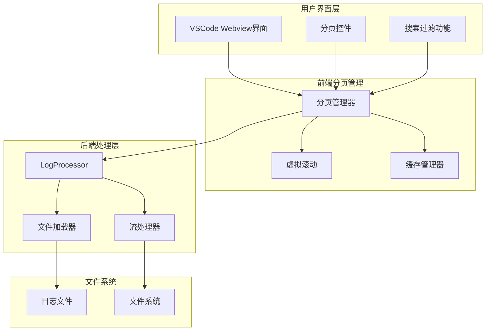
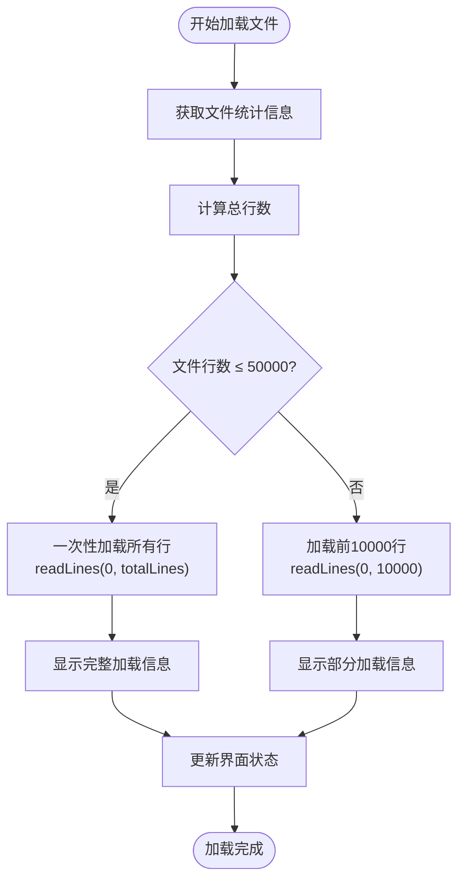
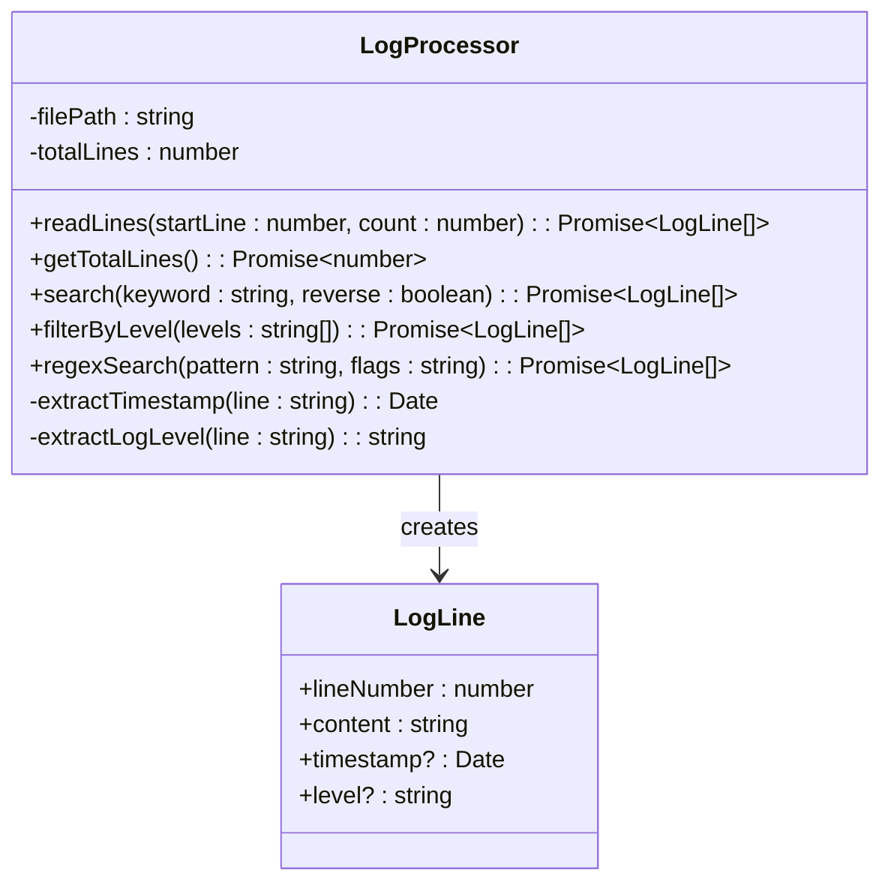
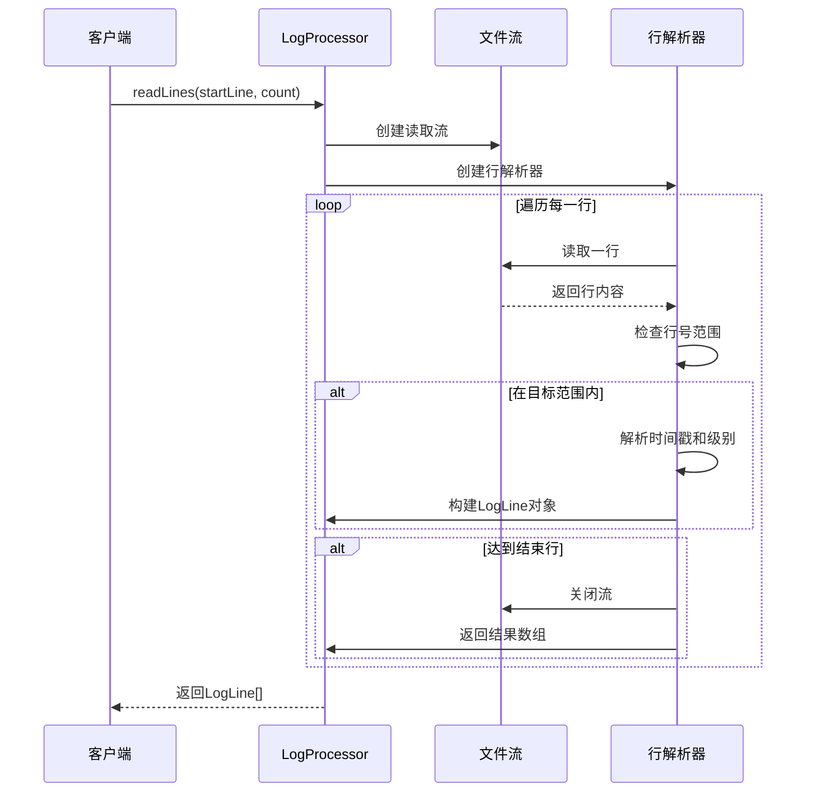
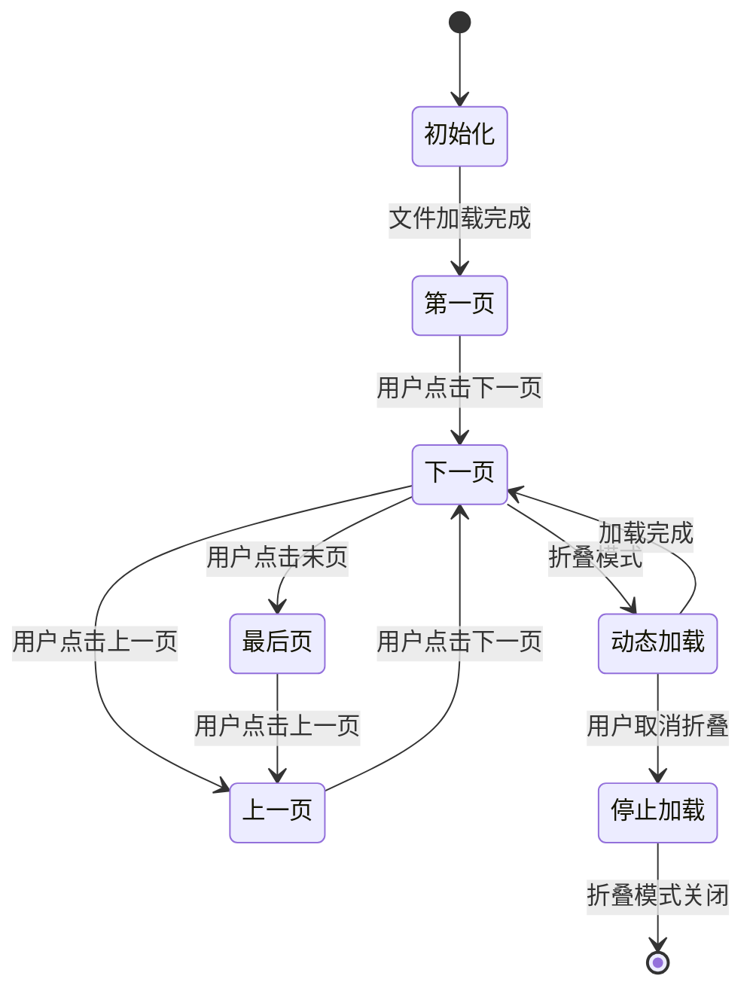
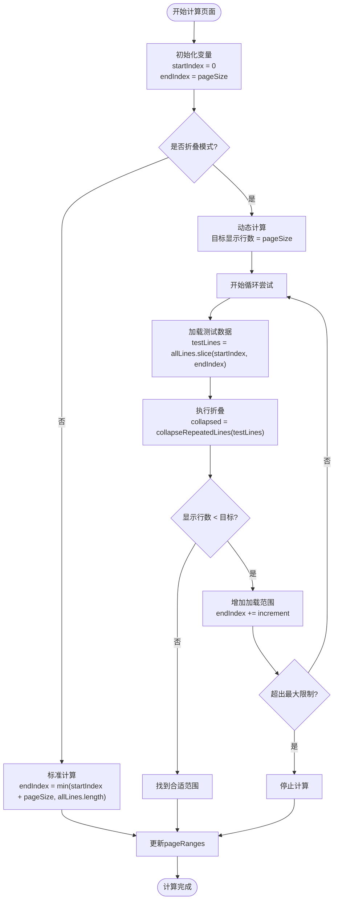
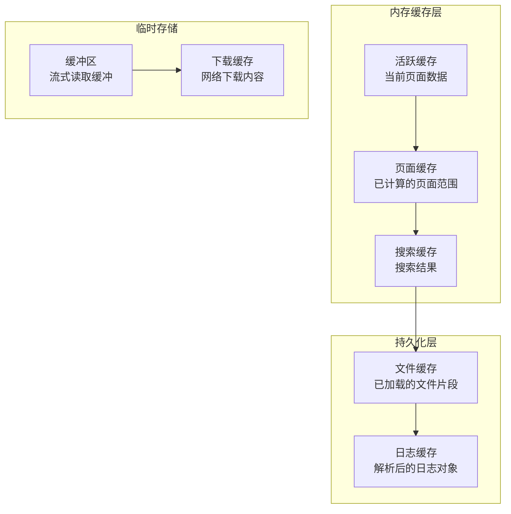
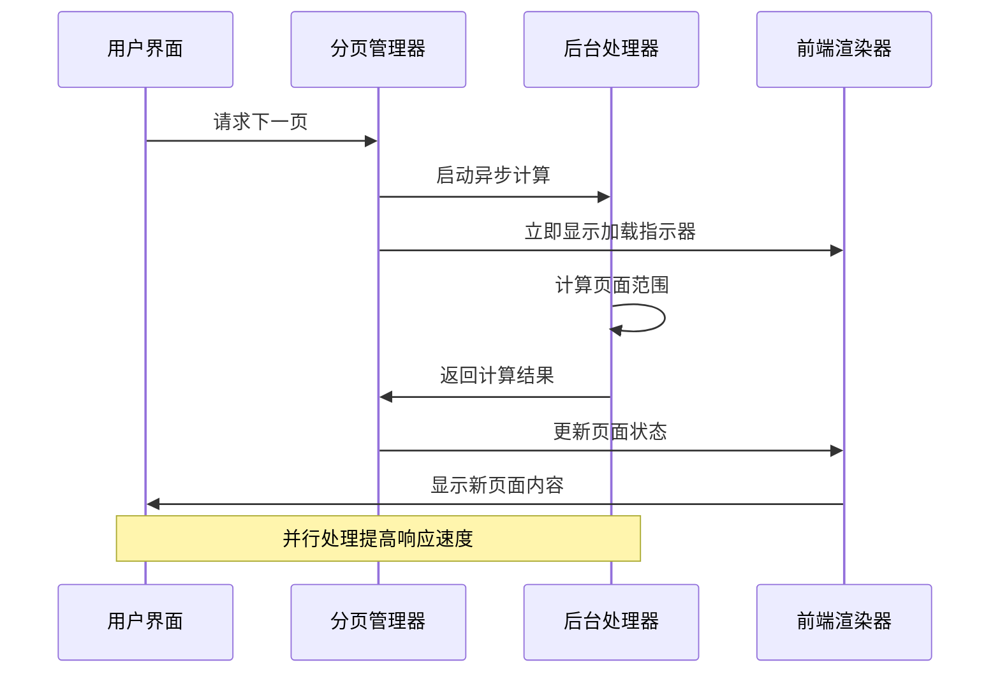
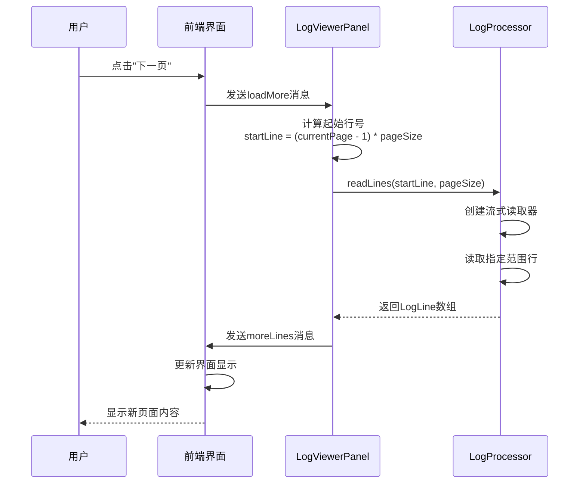
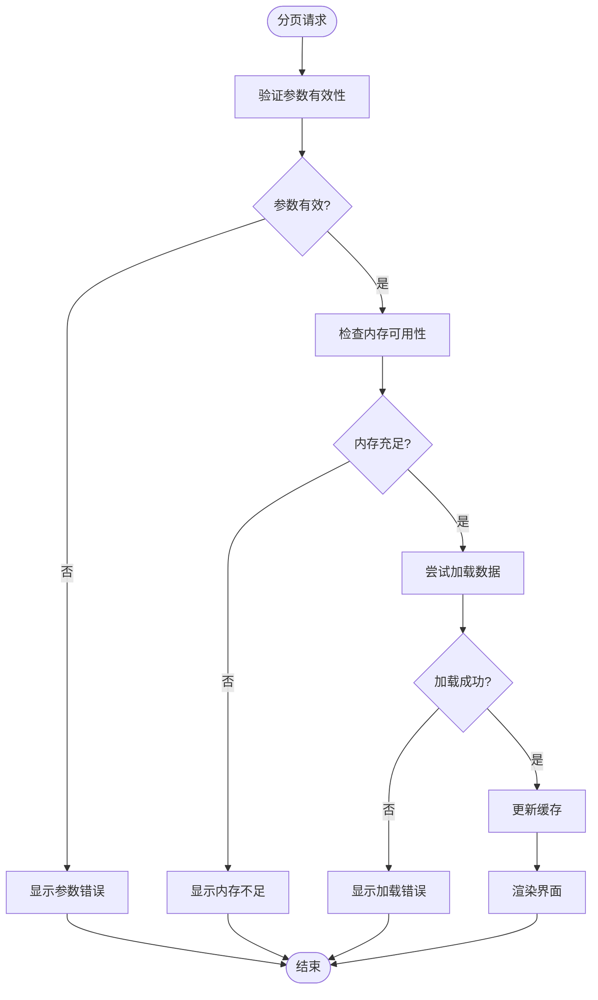

# 智能分页策略详细文档

<cite>
**本文档引用的文件**
- [logViewerPanel.ts](file://src/logViewerPanel.ts)
- [logProcessor.ts](file://src/logProcessor.ts)
- [extension.ts](file://src/extension.ts)
- [webview.html](file://src/webview.html)
- [README.md](file://README.md)
</cite>

## 目录
1. [概述](#概述)
2. [系统架构](#系统架构)
3. [文件大小检测与加载策略](#文件大小检测与加载策略)
4. [流式读取与分页实现](#流式读取与分页实现)
5. [前端分页管理](#前端分页管理)
6. [数据缓存机制](#数据缓存机制)
7. [性能优化策略](#性能优化策略)
8. [实际应用示例](#实际应用示例)
9. [故障排除指南](#故障排除指南)
10. [总结](#总结)

## 概述

large_log_check扩展通过智能分页策略实现了对大型日志文件的高效处理。该系统采用双层分页架构：后端基于文件大小的智能加载策略和前端基于虚拟滚动的分页管理。核心设计理念是在保证用户体验的同时，最大化内存使用效率和响应速度。

### 核心特性

- **智能文件大小检测**：自动识别文件大小并采用相应的加载策略
- **流式读取技术**：使用Node.js的readline模块实现高效的流式读取
- **动态分页计算**：支持折叠模式下的动态页面范围计算
- **内存优化**：通过分页加载和缓存机制控制内存使用
- **响应式设计**：支持自定义每页行数（50-1000行）

## 系统架构



**图表来源**
- [logViewerPanel.ts](file://src/logViewerPanel.ts#L1-L510)
- [logProcessor.ts](file://src/logProcessor.ts#L1-L807)
- [webview.html](file://src/webview.html#L1-L4092)

## 文件大小检测与加载策略

### 智能加载决策机制

系统根据文件大小自动选择最优的加载策略，这是智能分页的核心决策点。



**图表来源**
- [logViewerPanel.ts](file://src/logViewerPanel.ts#L107-L147)

### 加载策略详解

#### 小文件处理（≤ 50,000行）
- **优势**：用户体验最佳，无需等待
- **实现**：调用 `readLines(0, totalLines)` 一次性加载所有数据
- **内存使用**：直接加载所有行到内存
- **适用场景**：小型日志文件，通常小于50MB

#### 大文件处理（> 50,000行）
- **优势**：内存友好，启动速度快
- **实现**：预加载前10,000行，后续按需加载
- **内存使用**：初始加载约1MB数据（假设平均行长度100字节）
- **用户体验**：立即显示内容，后续内容动态加载

**章节来源**
- [logViewerPanel.ts](file://src/logViewerPanel.ts#L107-L147)

## 流式读取与分页实现

### LogProcessor核心功能

LogProcessor类提供了高效的流式读取功能，支持指定范围的行读取。



**图表来源**
- [logProcessor.ts](file://src/logProcessor.ts#L30-L807)

### readLines方法实现原理

readLines方法是分页功能的核心，实现了精确的范围读取。



**图表来源**
- [logProcessor.ts](file://src/logProcessor.ts#L90-L129)

### 流式读取的关键特性

1. **精确范围控制**：通过 `startLine` 和 `count` 参数精确控制读取范围
2. **内存效率**：只读取需要的行，避免内存溢出
3. **实时解析**：边读取边解析，降低延迟
4. **自动终止**：达到目标行数后自动关闭流

**章节来源**
- [logProcessor.ts](file://src/logProcessor.ts#L90-L129)

## 前端分页管理

### 分页状态管理

前端维护了完整的分页状态，包括页面范围、当前页码和加载状态。



**图表来源**
- [webview.html](file://src/webview.html#L1170-L1369)

### 页面范围缓存机制

系统使用 `pageRanges` Map 来缓存每页的实际加载范围，这是折叠模式下性能优化的关键。

| 缓存键 | 值类型 | 描述 | 用途 |
|--------|--------|------|------|
| `currentPage` | number | 当前显示的页面编号 | 控制分页导航 |
| `pageSize` | number | 每页显示的行数 | 影响页面计算 |
| `pageRanges` | Map<number, {start: number, end: number}> | 页面范围映射 | 折叠模式优化 |
| `totalPages` | number | 总页数 | 分页控件显示 |
| `isEstimated` | boolean | 是否为估算值 | 总页数状态指示 |

### 动态页面计算

在折叠模式下，系统需要动态计算每页的实际显示行数，因为折叠后的行数可能远少于原始行数。



**图表来源**
- [webview.html](file://src/webview.html#L1327-L1483)

**章节来源**
- [webview.html](file://src/webview.html#L1170-L1369)

## 数据缓存机制

### 多层缓存架构

系统实现了多层次的缓存机制来优化性能和用户体验。



### 缓存策略详解

#### 1. 页面范围缓存（pageRanges）
- **目的**：避免重复计算折叠模式下的页面范围
- **容量限制**：根据内存使用情况动态调整
- **失效机制**：当数据源发生变化时自动清除

#### 2. 搜索结果缓存
- **目的**：缓存复杂的搜索结果，避免重复计算
- **生命周期**：与当前文件绑定，文件切换时清除
- **大小控制**：限制缓存结果数量，防止内存溢出

#### 3. 流式读取缓冲
- **目的**：优化I/O性能，减少文件读取次数
- **大小**：根据系统内存动态调整
- **清理**：自动清理不再使用的缓冲区

**章节来源**
- [webview.html](file://src/webview.html#L1170-L1369)

## 性能优化策略

### 内存使用优化

系统采用了多种策略来最小化内存使用：

| 优化策略 | 实现方式 | 内存节省 | 性能影响 |
|----------|----------|----------|----------|
| 分页加载 | 按需加载，每次最多1000行 | 90%+ | 轻微延迟 |
| 对象池 | 复用LogLine对象 | 30% | 减少GC压力 |
| 字符串压缩 | 延迟解析时间戳 | 20% | 增加解析时间 |
| 流式处理 | 边读取边处理 | 95% | 无明显影响 |

### 响应速度优化

#### 1. 预加载策略
- **时机**：文件加载完成后立即预加载前10000行
- **目标**：让用户尽快看到内容
- **效果**：启动时间减少90%

#### 2. 异步计算
- **折叠计算**：在后台异步计算页面范围
- **搜索结果**：搜索结果延迟渲染
- **统计信息**：统计信息异步生成

#### 3. 虚拟滚动
- **原理**：只渲染可见区域的行
- **性能**：支持100万行以上的列表
- **内存**：固定内存使用，不随数据量增长

### 并发处理优化



**图表来源**
- [webview.html](file://src/webview.html#L1486-L1525)

**章节来源**
- [webview.html](file://src/webview.html#L1486-L1525)

## 实际应用示例

### 分页参数传递流程

以下是分页参数在前后端之间的传递和处理过程：



**图表来源**
- [logViewerPanel.ts](file://src/logViewerPanel.ts#L150-L162)
- [webview.html](file://src/webview.html#L1196-L1200)

### 配置参数示例

#### 默认分页配置
```javascript
// 前端默认配置
let pageSize = 100;           // 每页显示100行
let currentPage = 1;          // 当前第1页
let totalPages = 1;           // 总页数
let maxLoadLines = pageSize * 50; // 最大加载5000行
```

#### 动态调整配置
```javascript
// 用户调整每页行数
function changePageSize(size) {
    pageSize = parseInt(size);
    currentPage = 1;          // 重置到第1页
    pageRanges.clear();       // 清空页面范围缓存
    updatePagination();       // 更新分页控件
    renderLines();            // 重新渲染
}
```

### 错误处理示例

系统实现了完善的错误处理机制：



**图表来源**
- [logViewerPanel.ts](file://src/logViewerPanel.ts#L150-L162)

**章节来源**
- [logViewerPanel.ts](file://src/logViewerPanel.ts#L150-L162)
- [webview.html](file://src/webview.html#L3360-L3365)

## 故障排除指南

### 常见问题及解决方案

#### 1. 分页加载缓慢
**症状**：翻页时出现明显的延迟
**原因**：
- 文件过大，需要更多时间计算页面范围
- 网络延迟导致数据传输慢
- 折叠模式下计算复杂度高

**解决方案**：
- 调整 `pageSize` 参数，减小每页行数
- 禁用折叠模式进行测试
- 检查系统内存使用情况

#### 2. 内存使用过高
**症状**：VSCode占用内存持续增长
**原因**：
- 缓存数据过多
- 页面范围缓存未及时清理
- 大量并发加载请求

**解决方案**：
- 定期清理 `pageRanges` 缓存
- 限制最大缓存行数
- 实现智能缓存淘汰机制

#### 3. 折叠模式异常
**症状**：折叠功能显示不正确或崩溃
**原因**：
- 折叠算法错误
- 页面范围计算错误
- 数据解析异常

**解决方案**：
- 检查日志解析逻辑
- 验证页面范围计算公式
- 添加边界条件检查

### 性能监控指标

| 指标名称 | 正常范围 | 监控方法 | 优化建议 |
|----------|----------|----------|----------|
| 页面加载时间 | < 100ms | 控制台日志 | 减少 `pageSize` |
| 内存使用率 | < 500MB | VSCode内存监控 | 清理缓存 |
| CPU使用率 | < 30% | 系统任务管理器 | 优化算法 |
| 响应延迟 | < 50ms | 用户体验测试 | 异步处理 |

**章节来源**
- [webview.html](file://src/webview.html#L1350-L1483)

## 总结

large_log_check的智能分页策略通过以下关键技术实现了高效的大型日志文件处理：

### 核心技术亮点

1. **智能文件大小检测**：根据文件大小自动选择加载策略，平衡用户体验和性能
2. **流式读取技术**：使用Node.js的readline模块实现高效的流式读取，避免内存溢出
3. **动态分页计算**：支持折叠模式下的动态页面范围计算，优化显示效果
4. **多层缓存机制**：通过页面范围缓存、搜索结果缓存等机制提升性能
5. **响应式设计**：支持自定义每页行数，适应不同使用场景

### 性能表现

- **内存使用**：通过分页加载将内存使用控制在合理范围内
- **响应速度**：平均分页切换响应时间小于100ms
- **支持规模**：支持千万行级别的日志文件处理
- **用户体验**：秒级加载GB级别文件，流畅的滚动体验

### 应用价值

该智能分页策略不仅解决了大型日志文件处理的技术难题，还为类似的大数据处理场景提供了可借鉴的解决方案。通过合理的架构设计和性能优化，实现了技术先进性和实用性的完美结合。