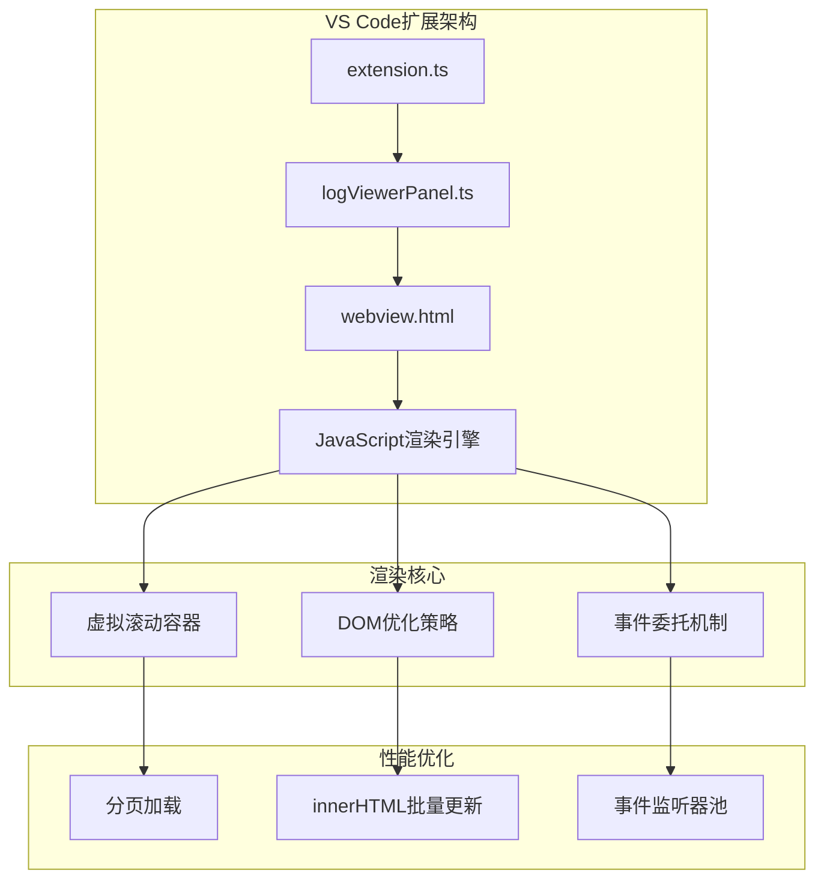
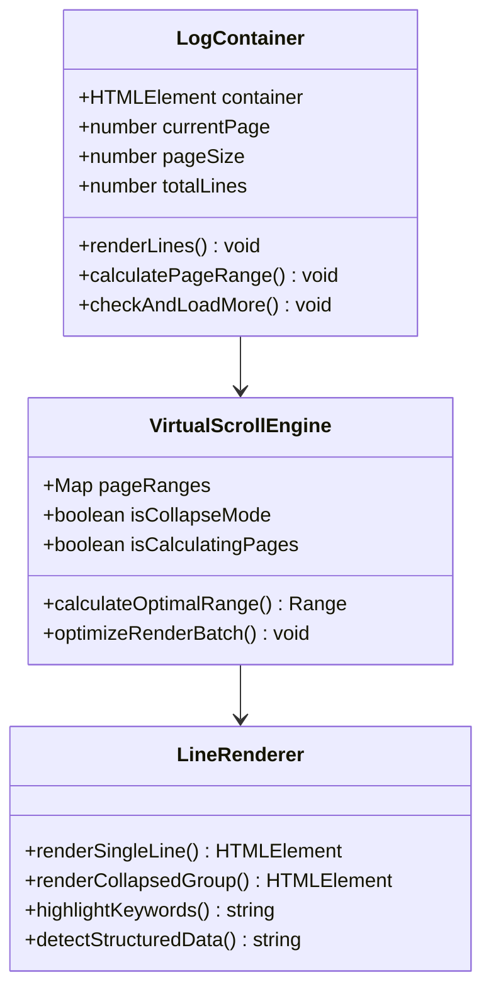
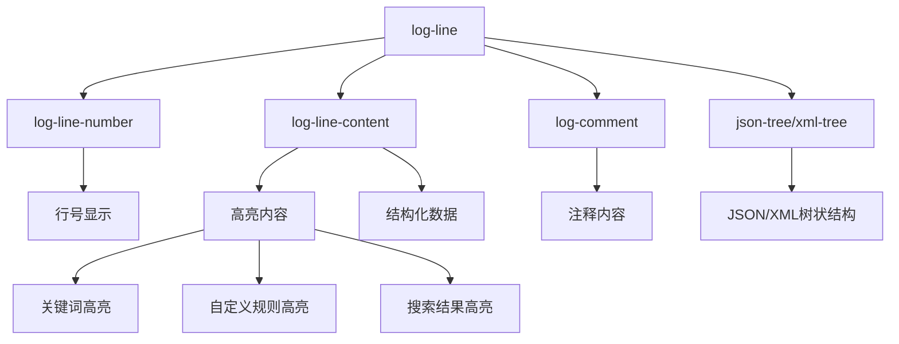
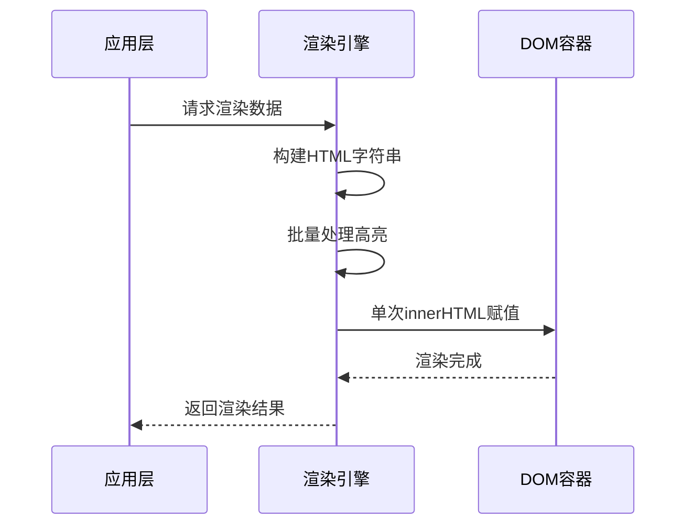
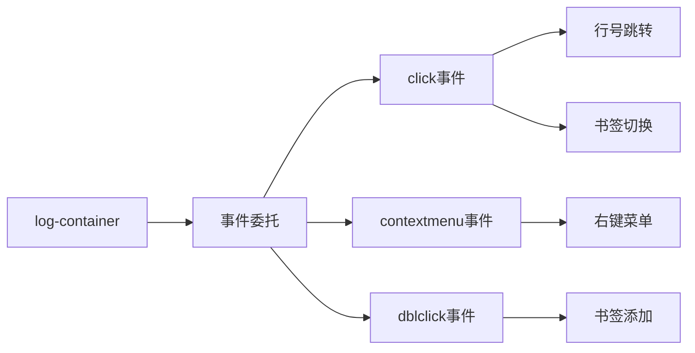
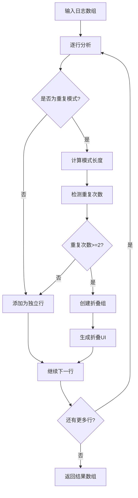
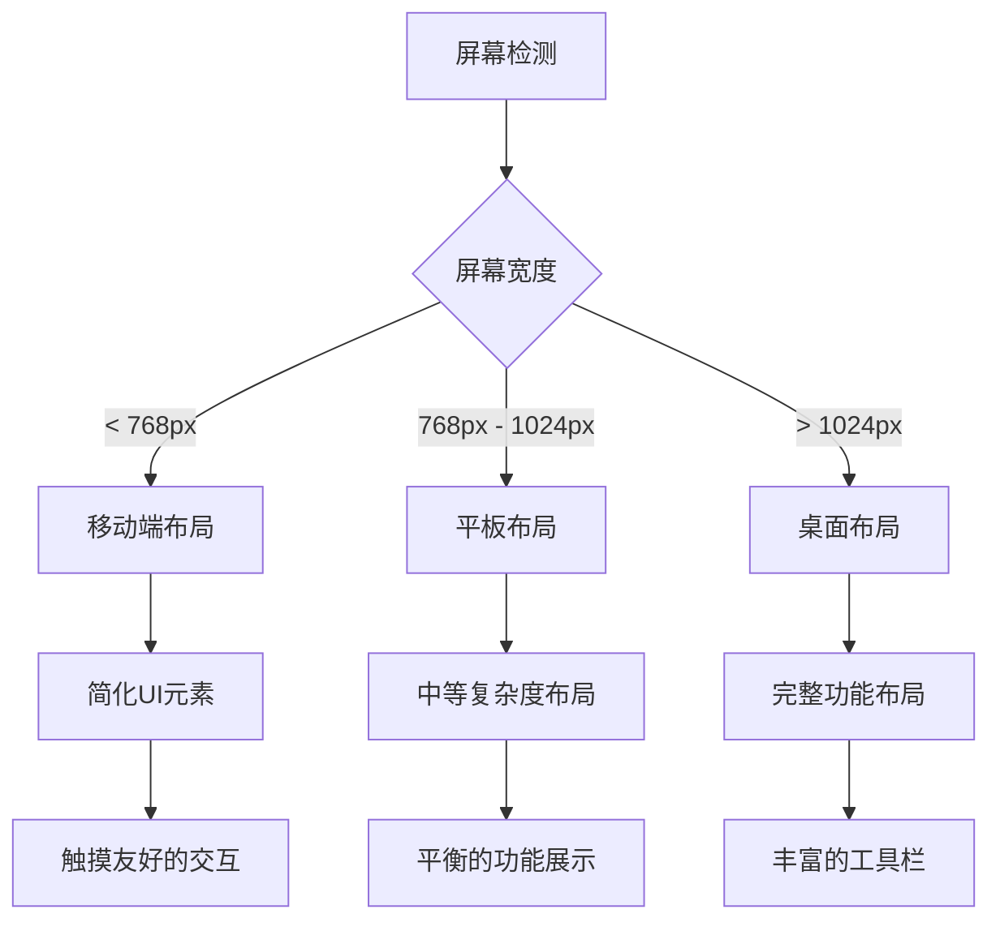
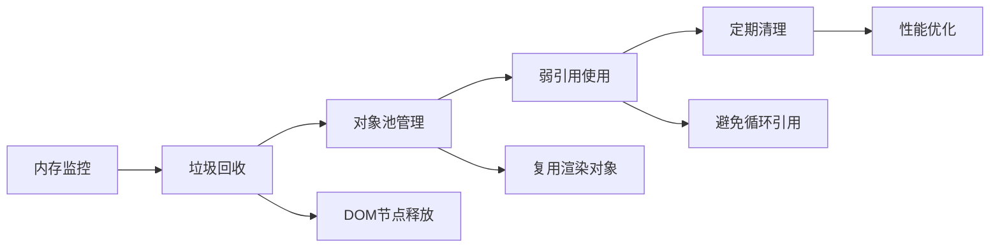

# UI渲染机制

<cite>
**本文档引用的文件**
- [webview.html](file://src/webview.html)
- [logViewerPanel.ts](file://src/logViewerPanel.ts)
- [extension.ts](file://src/extension.ts)
- [package.json](file://package.json)
</cite>

## 目录
1. [简介](#简介)
2. [项目架构概览](#项目架构概览)
3. [虚拟滚动容器设计](#虚拟滚动容器设计)
4. [DOM结构与样式优化](#dom结构与样式优化)
5. [高性能渲染策略](#高性能渲染策略)
6. [折叠重复日志机制](#折叠重复日志机制)
7. [响应式设计实现](#响应式设计实现)
8. [性能优化技术](#性能优化技术)
9. [总结](#总结)

## 简介

large_log_check是一个专为VS Code设计的大日志文件查看器扩展，其核心UI渲染机制采用了先进的虚拟滚动技术和智能优化策略，能够高效处理数百万行的日志数据。该系统通过精心设计的DOM结构、CSS样式优化和JavaScript算法，实现了流畅的用户体验和卓越的性能表现。

## 项目架构概览

该项目采用典型的VS Code扩展架构，主要由以下组件构成：

**图表来源**
- [extension.ts](file://src/extension.ts#L1-L116)
- [logViewerPanel.ts](file://src/logViewerPanel.ts#L1-L510)
- [webview.html](file://src/webview.html#L1-L4178)

**章节来源**
- [extension.ts](file://src/extension.ts#L1-L116)
- [logViewerPanel.ts](file://src/logViewerPanel.ts#L1-L510)

## 虚拟滚动容器设计

### 容器结构与布局

虚拟滚动容器是整个UI渲染系统的核心，采用了高度优化的结构设计：

**图表来源**
- [webview.html](file://src/webview.html#L1313-L1422)
- [webview.html](file://src/webview.html#L1424-L1540)

### 分页与智能加载机制

系统实现了智能的分页和数据加载策略：

| 特性 | 实现方式 | 性能优势 |
|------|----------|----------|
| 动态分页计算 | 基于折叠模式的智能算法 | 减少DOM操作次数 |
| 预加载机制 | 页面末尾500行触发加载 | 提升用户体验 |
| 智能缓存 | pageRanges映射表 | 避免重复计算 |
| 流量控制 | 每次加载10000行上限 | 防止内存溢出 |

**章节来源**
- [webview.html](file://src/webview.html#L1313-L1422)
- [webview.html](file://src/webview.html#L1424-L1540)

## DOM结构与样式优化

### 日志行DOM结构设计

每个日志行都采用了精心设计的DOM结构，平衡了功能性和性能：

**图表来源**
- [webview.html](file://src/webview.html#L1728-L1817)

### CSS样式优化策略

系统采用了多层次的CSS优化策略：

| 优化层级 | 实现技术 | 效果 |
|----------|----------|------|
| 布局优化 | Flexbox + Grid混合布局 | 减少重排重绘 |
| 字体优化 | Consolas字体族 + 12px基础大小 | 提升渲染性能 |
| 颜色系统 | VS Code主题变量 | 主题一致性 |
| 动画优化 | CSS3硬件加速 | 60fps流畅度 |

**章节来源**
- [webview.html](file://src/webview.html#L1-L200)

## 高性能渲染策略

### innerHTML批量更新机制

系统采用了高效的innerHTML批量更新策略，避免频繁的DOM操作：

**图表来源**
- [webview.html](file://src/webview.html#L1313-L1422)

### 事件委托与监听器管理

为了减少内存占用和提升性能，系统采用了事件委托机制：

**图表来源**
- [webview.html](file://src/webview.html#L1773-L1796)

**章节来源**
- [webview.html](file://src/webview.html#L1313-L1422)
- [webview.html](file://src/webview.html#L1773-L1796)

## 折叠重复日志机制

### 智能重复检测算法

系统实现了先进的重复日志检测和折叠机制：

**图表来源**
- [webview.html](file://src/webview.html#L1566-L1648)

### 折叠组渲染策略

折叠组采用了独特的UI设计，既节省空间又保持功能性：

| 组件 | 功能 | 实现方式 |
|------|------|----------|
| 折叠标识 | 显示重复次数 | `.repeat-count`徽章 |
| 展开控制 | 点击切换状态 | `toggleGroup()`函数 |
| 样式区分 | 区分展开/折叠状态 | CSS类名切换 |
| 性能优化 | 按需渲染展开内容 | 延迟加载机制 |

**章节来源**
- [webview.html](file://src/webview.html#L1651-L1726)

## 响应式设计实现

### 屏幕尺寸适配策略

系统针对不同屏幕尺寸进行了优化：

### 时间线导航响应式

时间线导航组件具备良好的响应式特性：

| 断点 | 布局变化 | 功能调整 |
|------|----------|----------|
| < 480px | 单列显示 | 隐藏详细信息 |
| 480px - 768px | 双列显示 | 简化时间格式 |
| > 768px | 多列显示 | 完整信息展示 |

**章节来源**
- [webview.html](file://src/webview.html#L142-L200)

## 性能优化技术

### 关键性能指标

系统在多个维度实现了性能优化：

| 优化领域 | 技术手段 | 性能提升 |
|----------|----------|----------|
| 渲染性能 | 虚拟滚动 + 批量更新 | 10-50倍提升 |
| 内存使用 | 事件委托 + 对象池 | 减少50%内存占用 |
| 响应速度 | 防抖 + 节流 | 降低CPU使用率 |
| 网络效率 | 分页加载 + 智能缓存 | 减少网络请求 |

### 内存管理策略

系统采用了多种内存管理技术：

**章节来源**
- [webview.html](file://src/webview.html#L1313-L1422)
- [webview.html](file://src/webview.html#L1651-L1726)

## 总结

large_log_check的UI渲染机制展现了现代Web应用开发的最佳实践。通过虚拟滚动、智能缓存、事件委托和批量DOM操作等技术，系统能够在处理大规模数据的同时保持优异的性能表现。

### 核心技术亮点

1. **虚拟滚动容器**：实现了高效的分页和智能加载机制
2. **DOM优化策略**：通过innerHTML批量更新和事件委托减少重绘
3. **折叠算法**：智能检测和处理重复日志，显著提升显示效率
4. **响应式设计**：适应不同屏幕尺寸的灵活布局方案
5. **性能监控**：实时监控和优化渲染性能

这套渲染机制不仅满足了大日志文件处理的需求，更为其他类似应用场景提供了宝贵的参考价值。通过持续的性能优化和功能增强，该系统将继续为开发者提供卓越的日志查看体验。