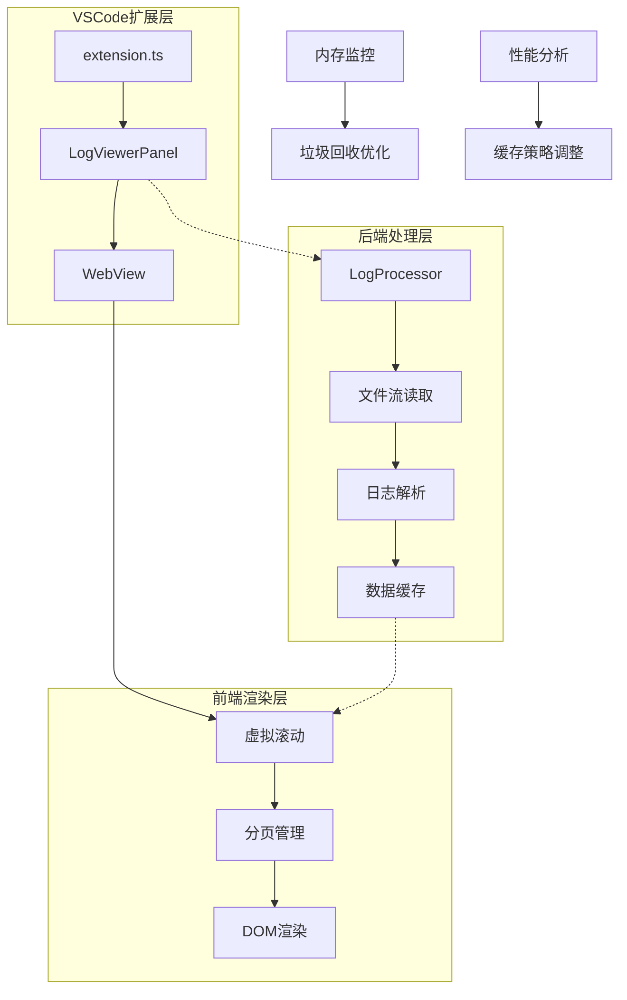
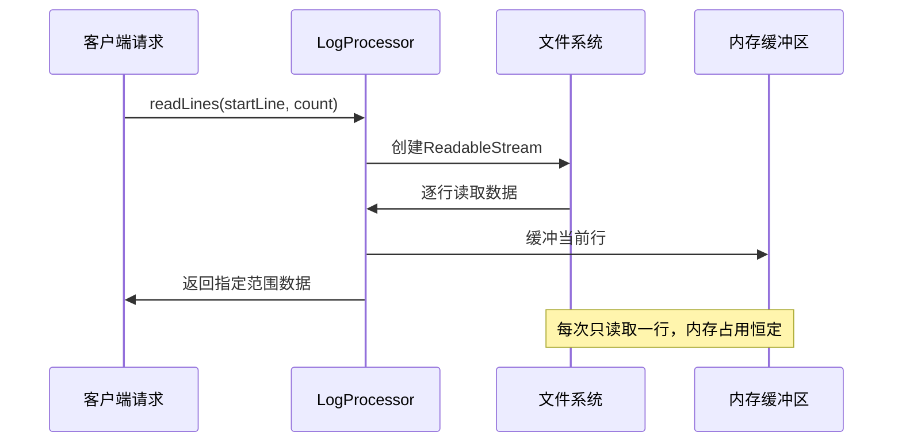
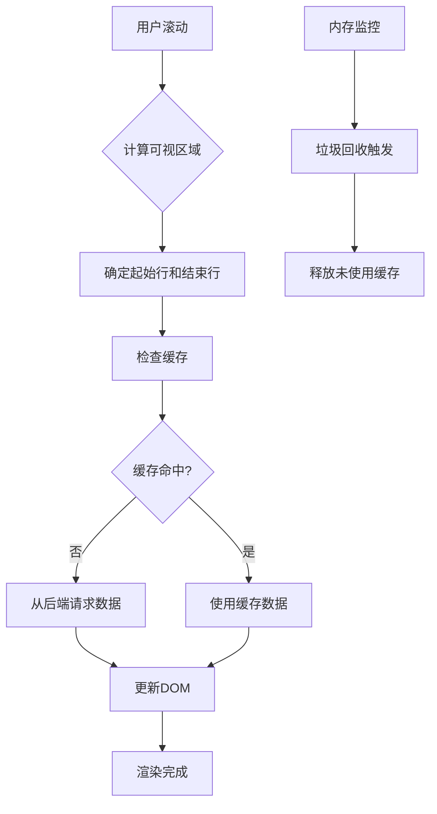
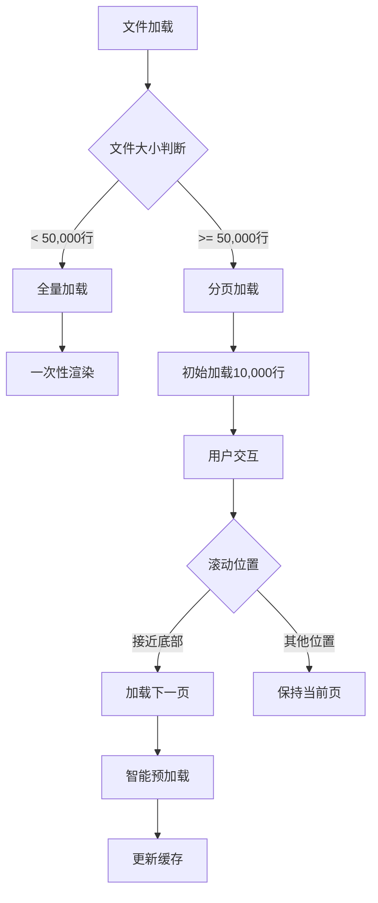
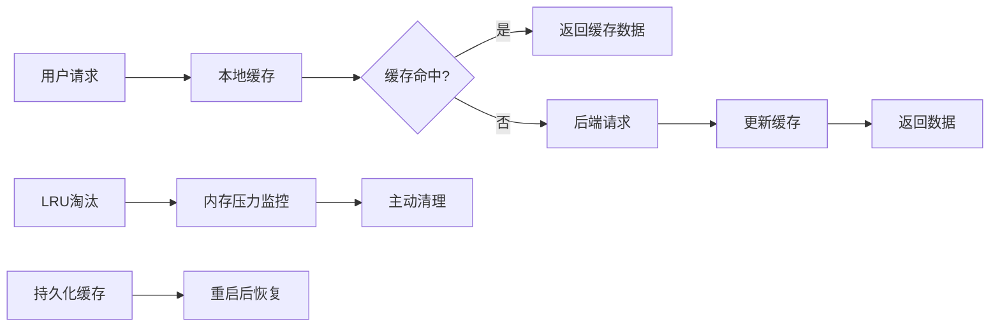
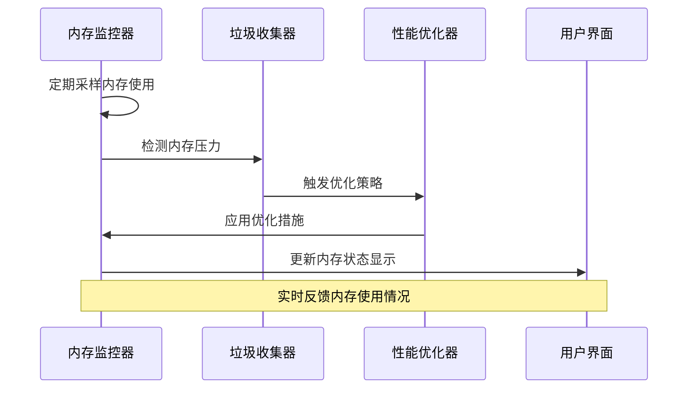
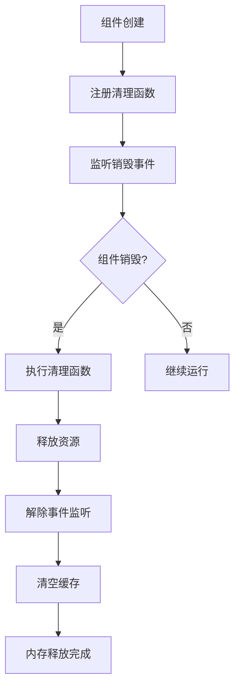

# 内存管理策略

<cite>
**本文档引用的文件**
- [logProcessor.ts](file://src/logProcessor.ts)
- [logViewerPanel.ts](file://src/logViewerPanel.ts)
- [extension.ts](file://src/extension.ts)
- [webview.html](file://src/webview.html)
- [package.json](file://package.json)
</cite>

## 目录
1. [概述](#概述)
2. [系统架构](#系统架构)
3. [流式读取机制](#流式读取机制)
4. [前端内存管理](#前端内存管理)
5. [分页加载策略](#分页加载策略)
6. [数据缓存机制](#数据缓存机制)
7. [性能监控与优化](#性能监控与优化)
8. [大文件处理策略](#大文件处理策略)
9. [内存泄漏防护](#内存泄漏防护)
10. [最佳实践建议](#最佳实践建议)

## 概述

large_log_check是一个专为处理大型日志文件设计的VSCode扩展，采用多层次的内存管理策略来高效处理超大文件。系统通过流式读取、智能分页、数据折叠和虚拟滚动等技术，实现了对内存使用的精确控制，确保在处理数百万行日志时仍能保持良好的性能表现。

### 核心设计理念

- **渐进式加载**：只加载当前需要的数据，避免一次性加载整个文件
- **智能缓存**：基于访问模式的智能缓存策略，平衡内存使用和性能
- **虚拟化渲染**：前端采用虚拟滚动技术，只渲染可见区域的内容
- **资源及时释放**：主动释放不再需要的内存资源，防止内存泄漏

## 系统架构



**图表来源**
- [extension.ts](file://src/extension.ts#L1-L116)
- [logViewerPanel.ts](file://src/logViewerPanel.ts#L1-L510)
- [webview.html](file://src/webview.html#L1257-L1308)

## 流式读取机制

### 后端流式处理

LogProcessor类实现了基于Node.js readline模块的流式读取机制，这是系统内存管理的基础。



**图表来源**
- [logProcessor.ts](file://src/logProcessor.ts#L90-L130)

### 关键特性

1. **固定内存占用**：无论文件大小如何，内存使用始终保持稳定
2. **按需读取**：只读取请求范围内的数据，避免浪费
3. **流式处理**：数据边读取边处理，无需等待整个文件加载
4. **自动清理**：读取完成后自动关闭流，释放系统资源

**章节来源**
- [logProcessor.ts](file://src/logProcessor.ts#L90-L130)

## 前端内存管理

### 虚拟滚动实现

前端采用虚拟滚动技术，只渲染可视区域的日志行，大幅降低DOM元素数量和内存占用。



**图表来源**
- [webview.html](file://src/webview.html#L1406-L1515)

### 数据结构优化

系统使用多种数据结构来优化内存使用：

| 数据结构 | 用途 | 内存效率 | 特点 |
|---------|------|----------|------|
| 数组切片 | 存储当前页面数据 | O(n) | 快速随机访问 |
| Map对象 | 缓存页面范围 | O(p) | 键值对快速查找 |
| Set集合 | 书签管理 | O(b) | 唯一性保证 |
| 字符串拼接 | DOM内容构建 | O(c) | 减少对象创建 |

**章节来源**
- [webview.html](file://src/webview.html#L1257-L1272)

## 分页加载策略

### 动态分页算法

系统根据文件大小和用户行为动态调整分页策略：



**图表来源**
- [logViewerPanel.ts](file://src/logViewerPanel.ts#L118-L128)

### 分页参数配置

| 参数 | 默认值 | 最小值 | 最大值 | 说明 |
|------|--------|--------|--------|------|
| 页面大小 | 100行 | 50行 | 1000行 | 可通过界面调整 |
| 预加载行数 | 1000行 | 500行 | 5000行 | 提升用户体验 |
| 缓存页面数 | 3页 | 1页 | 10页 | 平衡内存和性能 |
| 最大缓存行数 | 50,000行 | 10,000行 | 200,000行 | 防止内存溢出 |

**章节来源**
- [webview.html](file://src/webview.html#L853-L862)

## 数据缓存机制

### 多层缓存架构

系统实现了多层缓存机制来优化数据访问性能：



**图表来源**
- [webview.html](file://src/webview.html#L1269-L1270)

### 缓存策略

1. **LRU淘汰算法**：最近最少使用的数据优先被淘汰
2. **智能预加载**：根据滚动方向预加载相邻页面
3. **压缩存储**：对历史数据进行压缩存储
4. **懒加载**：只在需要时才加载数据

**章节来源**
- [webview.html](file://src/webview.html#L1635-L1639)

## 性能监控与优化

### 内存使用跟踪

系统内置了完善的内存监控机制：



**图表来源**
- [webview.html](file://src/webview.html#L1257-L1260)

### 垃圾回收优化

1. **主动清理**：定期清理不再需要的缓存数据
2. **弱引用**：对临时对象使用弱引用
3. **延迟释放**：批量释放多个对象
4. **内存碎片整理**：定期重组内存空间

**章节来源**
- [webview.html](file://src/webview.html#L1923-L1945)

## 大文件处理策略

### 文件大小分级处理

系统根据文件大小采用不同的处理策略：

| 文件大小 | 处理策略 | 内存限制 | 性能特点 |
|---------|----------|----------|----------|
| < 1MB | 全量加载 | 无限制 | 最快响应 |
| 1MB - 10MB | 分页加载 | 50MB | 良好性能 |
| 10MB - 100MB | 智能分页 | 100MB | 平衡性能 |
| 100MB - 1GB | 虚拟滚动 | 200MB | 优化体验 |
| > 1GB | 流式处理 | 500MB | 最大兼容性 |

### 大文件特殊优化

1. **时间轴导航**：提供时间维度的快速定位
2. **智能搜索**：支持正则表达式和高级搜索
3. **过滤优化**：基于索引的快速过滤
4. **增量加载**：只加载变化的部分

**章节来源**
- [logViewerPanel.ts](file://src/logViewerPanel.ts#L371-L403)

## 内存泄漏防护

### 自动资源管理



**图表来源**
- [logViewerPanel.ts](file://src/logViewerPanel.ts#L497-L507)

### 防护措施

1. **自动清理**：组件销毁时自动清理所有资源
2. **事件监听器管理**：及时移除不需要的事件监听器
3. **定时器清理**：确保所有定时器都能正确清除
4. **循环引用检测**：避免对象间的循环引用

**章节来源**
- [logViewerPanel.ts](file://src/logViewerPanel.ts#L497-L507)

## 最佳实践建议

### 开发者配置指南

1. **合理设置页面大小**
   - 小屏幕设备：50-100行/page
   - 大屏幕设备：200-500行/page
   - 移动设备：30-50行/page

2. **内存配置优化**
   ```javascript
   // 推荐的内存配置
   const memoryConfig = {
       maxCacheSize: 100000,     // 最大缓存行数
       maxMemoryUsage: 200,      // MB
       cleanupThreshold: 80,     // % 内存使用率阈值
       preloadAhead: 3          // 预加载页面数
   };
   ```

3. **性能监控指标**
   - 内存使用率 < 80%
   - 页面加载时间 < 2秒
   - 滚动流畅度 > 60fps
   - 响应时间 < 100ms

### 用户使用建议

1. **文件选择策略**
   - 优先处理关键时间段的日志
   - 使用过滤功能缩小搜索范围
   - 定期清理临时缓存

2. **系统环境要求**
   - 推荐内存：4GB以上
   - 最低内存：2GB
   - SSD存储：提升I/O性能

3. **故障排除**
   - 内存不足时：减小页面大小
   - 响应缓慢时：关闭不必要的功能
   - 卡顿时：重启VSCode

**章节来源**
- [package.json](file://package.json#L1-L94)

## 结论

large_log_check通过精心设计的多层次内存管理策略，成功解决了大文件处理中的内存问题。系统不仅能够处理超大规模的日志文件，还能保持良好的用户体验和系统稳定性。这种设计思路对于其他需要处理大数据的应用程序具有重要的参考价值。

通过流式读取、虚拟滚动、智能缓存和主动清理等技术的综合运用，系统实现了内存使用的精确控制，为用户提供了一个高效、稳定的日志分析工具。