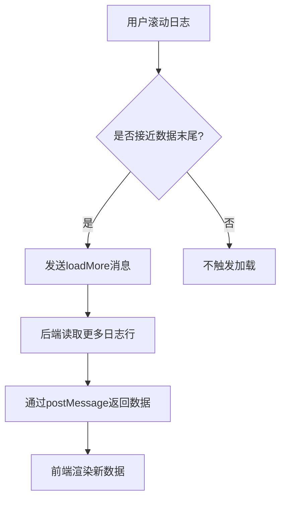
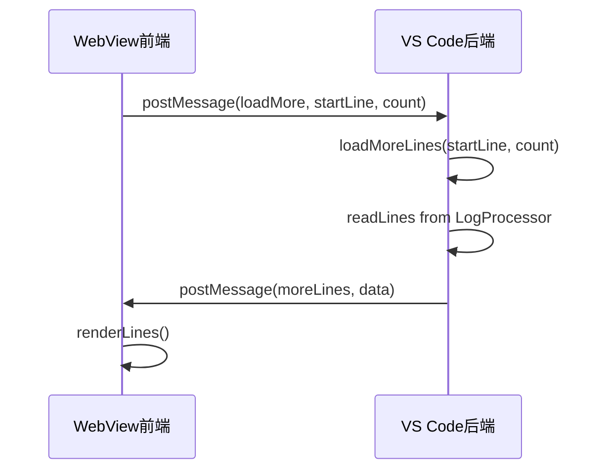

# 滚动事件处理

<cite>
**本文档引用的文件**   
- [logViewerPanel.ts](file://src/logViewerPanel.ts)
- [webview.html](file://src/webview.html)
</cite>

## 目录
1. [滚动事件处理机制](#滚动事件处理机制)
2. [节流机制实现原理](#节流机制实现原理)
3. [数据需求预测策略](#数据需求预测策略)
4. [消息通信流程](#消息通信流程)
5. [边界情况处理](#边界情况处理)

## 滚动事件处理机制

`logViewerPanel.ts` 文件中的 `LogViewerPanel` 类通过 `vscode.WebviewPanel` 创建一个 WebView 面板来显示日志内容。WebView 的滚动事件处理主要在 `webview.html` 文件中实现。该文件通过 JavaScript 监听用户滚动行为，并根据滚动位置计算可视区域。

当用户滚动日志容器时，系统会检测当前滚动位置与已加载数据量的关系。如果用户接近已加载数据的末尾（距离末尾500行以内），并且还有更多数据未加载，则触发加载更多数据的逻辑。这种机制确保了只有在需要时才加载额外数据，避免了一次性加载大量日志导致的性能问题。

**Diagram sources**
- [webview.html](file://src/webview.html#L3311-L3327)
- [logViewerPanel.ts](file://src/logViewerPanel.ts#L150-L159)

**Section sources**
- [webview.html](file://src/webview.html#L3311-L3327)
- [logViewerPanel.ts](file://src/logViewerPanel.ts#L150-L159)

## 节流机制实现原理

为了避免频繁触发数据加载请求，系统实现了智能的节流机制。该机制通过 `checkAndLoadMore` 函数实现，只有当满足特定条件时才会触发数据加载。

具体实现原理是：系统会检查当前页面的最大行号是否接近已加载数据量减去500行的位置。这个500行的缓冲区确保了用户在快速滚动时不会频繁触发加载请求。只有当用户滚动到接近数据末尾时，才会调用 `loadMoreData` 函数发送加载请求。

这种设计避免了在用户快速滚动时产生大量的网络请求和数据处理开销，同时保证了用户体验的流畅性。此外，系统还考虑了过滤模式的情况，在过滤模式下不会自动加载更多数据，因为过滤结果可能不需要额外数据。

**Section sources**
- [webview.html](file://src/webview.html#L3311-L3327)

## 数据需求预测策略

系统采用基于滚动位置的数据需求预测策略。当用户滚动日志时，系统会预测用户可能需要查看的数据范围，并提前加载这些数据。

预测策略的核心是判断当前显示的页面是否接近已加载数据的末尾。通过比较 `currentPage * pageSize` 和 `allLines.length - 500` 的值，系统可以准确判断是否需要加载更多数据。每次加载10000行数据，这是一个平衡性能和用户体验的合理数值。

对于大文件（超过5万行），系统初始只加载前10000行，然后根据用户的滚动行为逐步加载更多数据。这种按需加载的策略大大减少了初始加载时间，提高了响应速度。

**Diagram sources**
- [logViewerPanel.ts](file://src/logViewerPanel.ts#L119-L128)
- [webview.html](file://src/webview.html#L3330-L3341)

**Section sources**
- [logViewerPanel.ts](file://src/logViewerPanel.ts#L119-L128)
- [webview.html](file://src/webview.html#L3330-L3341)

## 消息通信流程

系统采用前后端分离的架构，通过消息通信机制实现数据交换。通信流程从 WebView 发送消息开始，到后端处理并返回结果结束。

当需要加载更多数据时，前端通过 `vscode.postMessage` 发送 `loadMore` 命令，包含起始行号和要加载的行数。后端的 `LogViewerPanel` 类通过 `onDidReceiveMessage` 监听器接收此消息，并调用 `loadMoreLines` 方法处理请求。

处理完成后，后端使用 `postMessage` 将数据发送回前端，前端接收到 `moreLines` 命令后更新界面显示。这种双向通信机制确保了数据的一致性和实时性。

**Diagram sources**
- [logViewerPanel.ts](file://src/logViewerPanel.ts#L53-L60)
- [webview.html](file://src/webview.html#L3337-L3341)

**Section sources**
- [logViewerPanel.ts](file://src/logViewerPanel.ts#L53-L60)
- [webview.html](file://src/webview.html#L3337-L3341)

## 边界情况处理

系统对多种边界情况进行了妥善处理，确保了稳定性和用户体验。

首先，系统检查是否已加载所有数据（`allDataLoaded`），如果是，则不再发送加载请求。其次，在过滤模式下（`isFiltering`），系统不会自动加载更多数据，因为过滤结果可能已经满足用户需求。

另外，系统还处理了用户快速滚动的场景。通过设置500行的缓冲区，避免了在用户快速滚动时产生过多的加载请求。同时，每次加载固定数量的数据（10000行），避免了单次加载过多数据导致的性能问题。

对于小文件（小于5万行），系统一次性加载所有数据，避免了不必要的分页和滚动加载逻辑，简化了处理流程。

**Section sources**
- [webview.html](file://src/webview.html#L3311-L3327)
- [logViewerPanel.ts](file://src/logViewerPanel.ts#L119-L128)